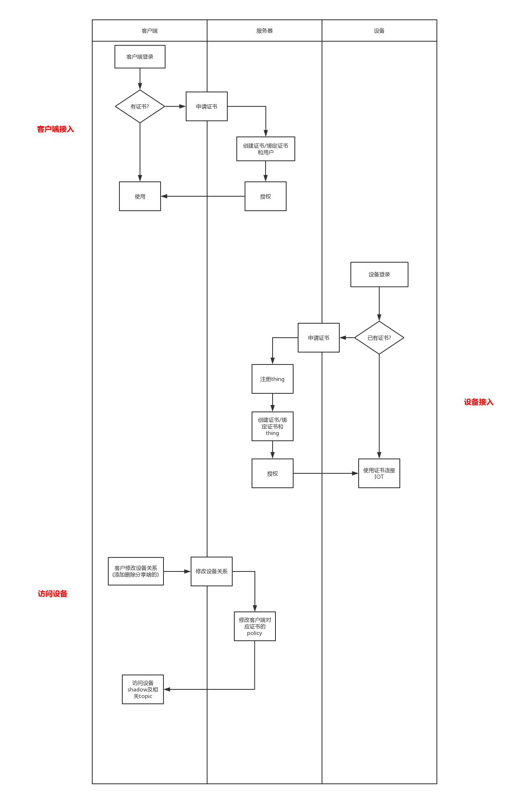

# APP server 被 IoT + lambda代替

# IoT shadow, 是客户端 获取设备状态和设置用的.

# 分享用户部分权限需要限制, 设置操作就走Topic,  读操作走IoT Shadow

# 所以thing是用来创建证书的.

# 接口定义
## 主要接入口
## 客户端主要接入口

web api:  登录注册, 设备关系, 服务购买, 事件列表等
device shadow : 设备设置及状态的读写
topic/server/fromclient*: 请求播放ticket
tran server: 音视频数据

# AWS IoT 的组件
## 1.设备网关
## 2. 消息代理
## 3. 规则引擎
## 4. 安全和身份服务
## 5. Thing Registry
## 6. Thing Shadow
## 7. Thing Shadows

## 2. 消息代理
进行发布和订阅时, 你可以===>直接使用MQTT协议, 也可以通过WebScoket使用MQTT协议, 
可以使用HTTP REST 接口进行发布

## 5. Thing Registry-----事务,事务,事务
Thing Registry 有时也称为Device Registry.  组织与每个事务相关的资源. 

## 6. Thing Shadow
Device Shadow , 一种json文档

用于存储和检索事物(设备,  应用程序等等)的当前状态信息.

## 7. Thing Shadows 服务

