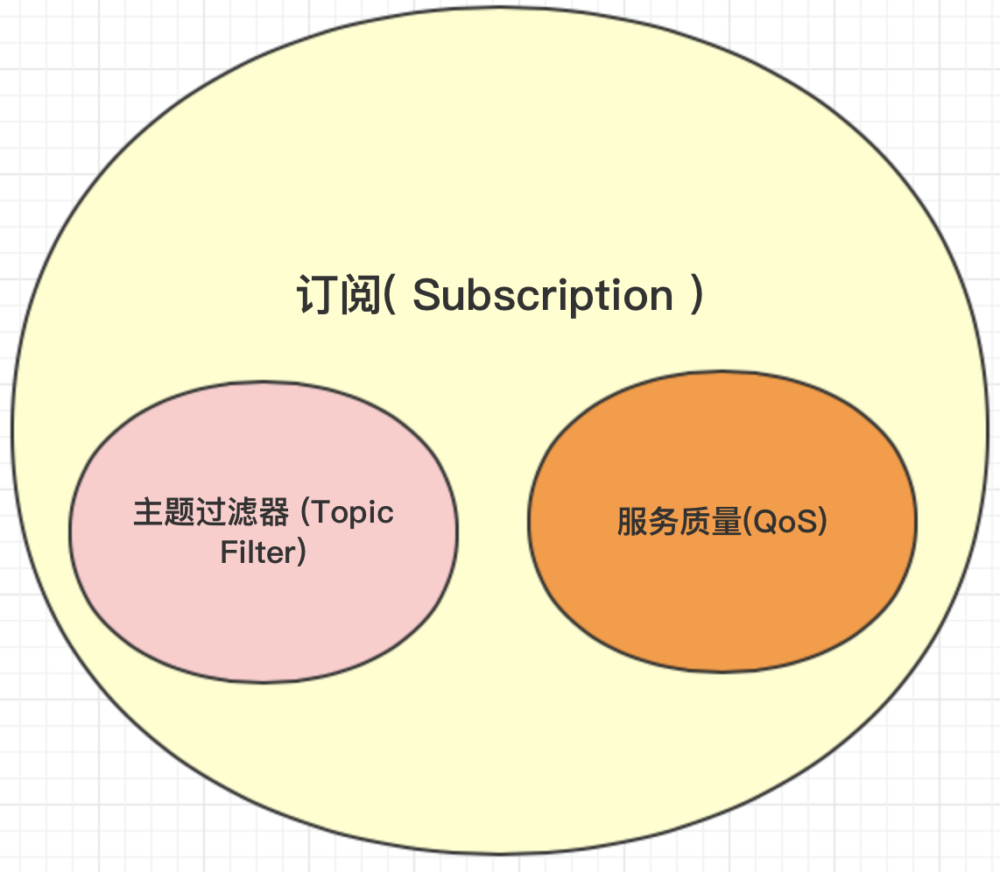
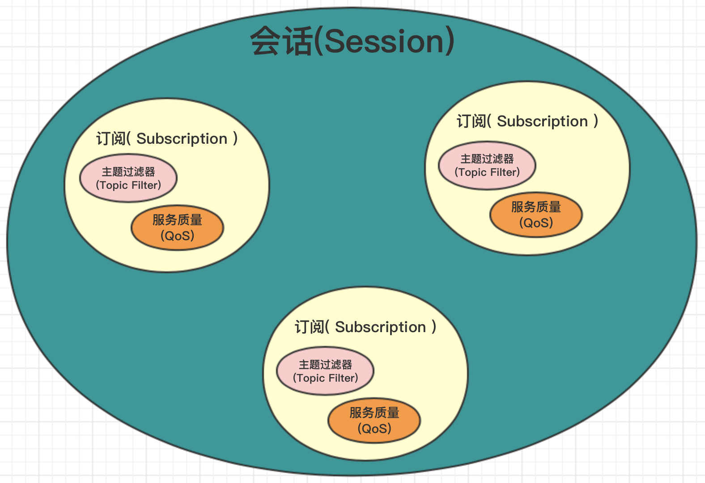
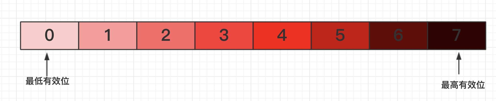
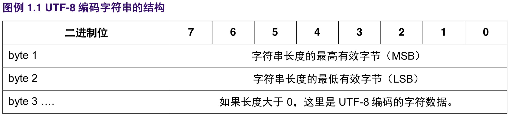
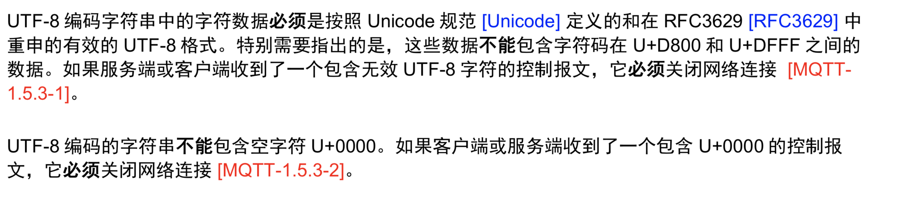
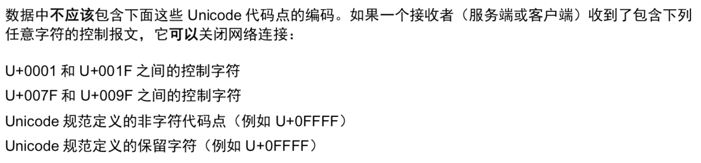

# MQTT概述

MQTT是一个 ***客户端架构的*** 发布/订阅模式的 ***消息传输协议*** .

它的设计思想是轻巧、开放、简单、规范，易于实现。这些特点使得它对很多场景来说都是很好的选择，特别是对于受限的环境如机器与机器的通信（M2M）以及物联网环境

# 1. 1 MQTT协议的组织结构

*    第一章 - 介绍

*   第二章 – MQTT 控制报文格式

*   第三章 – MQTT 控制报文

*   第四章 – 操作行为

*   第五章 – 安全

*   第六章 – 使用 WebSocket 作为网络传输层 t

*   第七章 – 一致性目标


# 1.2 术语

网络连接 (Network Connection)
应用消息(Application Message)
客户端(Client)
服务端(Server)
订阅(Subscription)
主题名(Topic Name)
主题过滤器(Topic Filter:)
会话(Session)
控制报文(MQTT Control Packet)


### 应用消息(Application Message)

```

1.  MQTT 协议通过网络传输应用数据。应用消息通过 MQTT 传输时，它们有关联的服务质量(QoS)和主题 (Topic)。

```


### 订阅( Subscription )

订阅包含一个主题过滤器 (Topic Filter)  和 一个最大的服务质量(QoS)等级.

| 主题过滤器 (Topic Filter) | 服务质量(QoS) |
|---|---|







### 主题名(Topic Name)
服务器发送应用消息的一个副本给每一个匹配的客户端订阅

### 主题过滤器( Topic Filter )
订阅中的一个表达式, 用于表示相关的一个或多个主题. 主题过滤器可以使用通配符

### 会话(Session)
客户端和服务端之间的状态交互. 一些会话持续时长与网络连接一样, 另一些可以在客户端和服务端的多个连续网络连接间扩展.

### 控制报文(MQTT Control Packet)
通过网络连接发送的信息数据包, MQTT规范定义了十四种不同类型的控制报文, 其中一个(PUBLISH 报文 )用于传输应用消息

# 1.5 数据表示
## 1.5.1 二进制位
字节中的位从0到7. 第7位是最高有效位, 第0位是最低有效位.




### 1.5.2 整数数值

整数数值是16位, 使用大端序 (big-endian, 高位字节在低位字节前面). 这意味着一个16位的字在网络上表示为最高有效字节(MSB), 后面跟着最低有效字节(LSB)

###  1.5.3 UTF-8 编码字符串

除非另有说明, 所有的UTF-8编码字符串的长度都比必须在0~65535 字节范围内







UTF-8 编码序列 0XEF 0xBB 0xBF 总是被解释为 U+FEFF(零宽度非换行空白字符)，无论它出现在字符 串的什么位置，报文接收者都不能跳过或者剥离它 [MQTT-1.5.3-3]。


