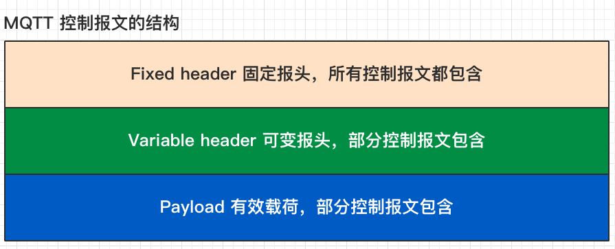
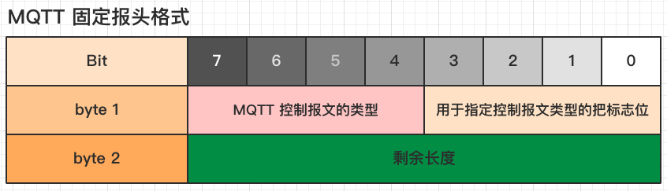
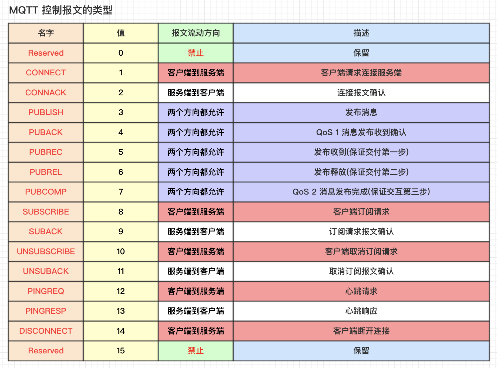
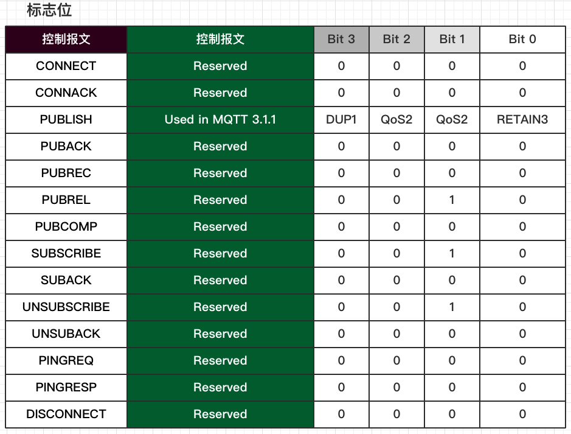
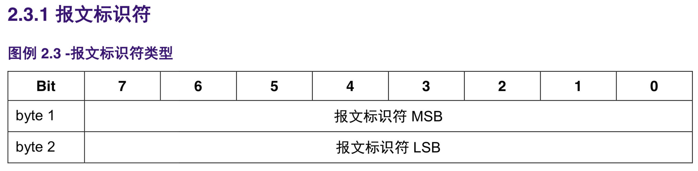
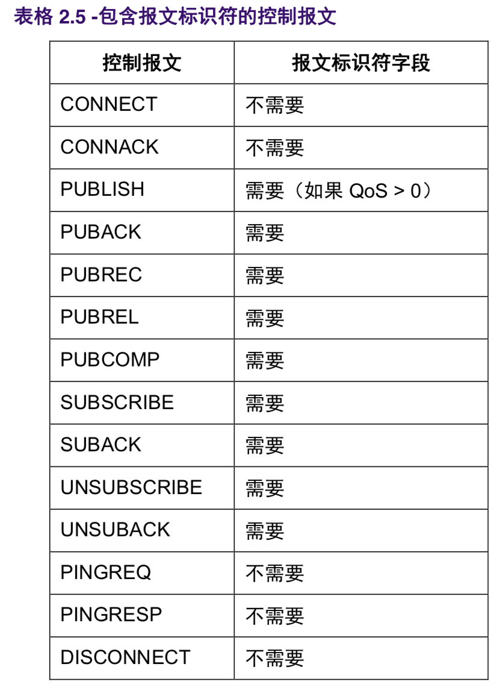
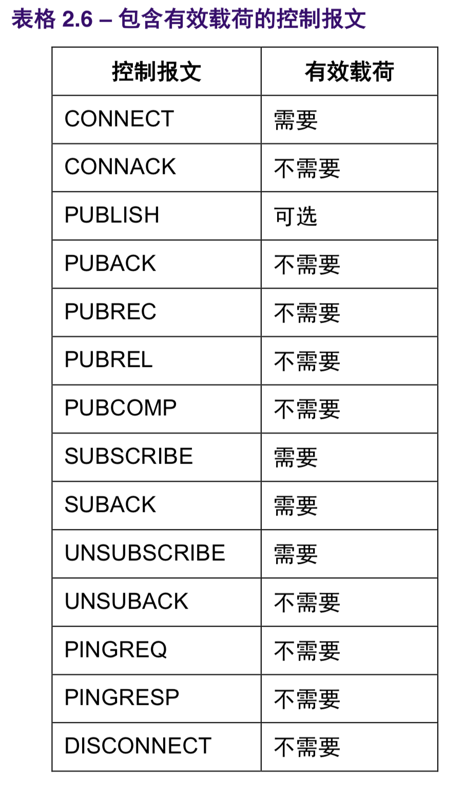

# 2.1 MQTT 控制报文的结构

MQTT 协议通过交换预定义的MQTT控制器报文来通信.




# 2.2 固定报头

固定报头格式



# 2.2.1 MQTT 控制报文的类型




# 2.2.2 标志

固定报头第 1 个字节的剩余的 4 位 [3-0]包含每个 MQTT 控制报文类型特定的标志，见 表格 2.2 -标志位。 表格 2.2 中任何标记为“保留”的标志位，都是保留给以后使用的，必须设置为表格中列出的值 [MQTT- 2.2.2-1]。如果收到非法的标志，接收者必须关闭网络连接。有关错误处理的详细信息见 4.8 节 [MQTT- 2.2.2-2]。


DUP1 =控制报文的重复分发标志 QoS2 = PUBLISH 报文的服务质量等级 RETAIN3 = PUBLISH 报文的保留标志 PUBLISH 控制报文中的 DUP, QoS 和 RETAIN 标志的描述见 3.3.1 节。


# 2.2.3 剩余长度

位置: 从第二个字节开始

####  1. 剩余长度(Remaining Length) 表示当前报文剩余部分的字节数
####  2. 包括 可变报头 和 负载的数据
####  3. 剩余长度 不包括用于编码剩余长度字段本身的字节数。


剩余长度字段使用一个变长度编码方案，对小于 128 的值它使用单字节编码。更大的值按下面的方式处理。 低 7 位有效位用于编码数据，最高有效位用于指示是否有更多的字节。因此每个字节可以编码 128 个数值 和一个延续位(continuation bit)。剩余长度字段最大 4 个字节。


#### 4. 剩余长度字段最大 4 个字节。


分别表示(每个字节的低 7 位用于编码数据，最高位是标志位): 1 个字节时，从 0(0x00)到 127(0x7f)
2 个字节时，从 128(0x80,0x01)到 16383(0Xff,0x7f)
3 个字节时，从 16384(0x80,0x80,0x01)到 2097151(0xFF,0xFF,0x7F)
4 个字节时，从 2097152(0x80,0x80,0x80,0x01)到 268435455(0xFF,0xFF,0xFF,0x7F)


非规范评注

非负整数 X 使用变长编码方案的算法如下:

```

 do

encodedByte = X MOD 128

X = X DIV 128
// if there are more data to encode, set the top bit of this byte if ( X > 0 )

encodedByte = encodedByte OR 128 endif

'output' encodedByte while ( X > 0 )

```

MOD 是模运算，DIV 是整数除法，OR 是位操作或(C 语言中分别是%，/，|) 非规范评注

 剩余长度字段的解码算法如下: 

```
multiplier = 1 value = 0
do

encodedByte = 'next byte from stream'
value += (encodedByte AND 127) * multiplier multiplier *= 128
if (multiplier > 128*128*128)

throw Error(Malformed Remaining Length) while ((encodedByte AND 128) != 0)

```

AND 是位操作与(C 语言中的&) 这个算法终止时，value 包含的就是剩余长度的值。
这个算法终止时，value 包含的就是剩余长度的值。


# 2.3 可变报头



很多控制报文的可变报头部分包含一个两字节的报文标识符字段。这些报文是 PUBLISH(QoS>0 时)， PUBACK，PUBREC，PUBREL，PUBCOMP，SUBSCRIBE, SUBACK，UNSUBSCIBE， UNSUBACK。


SUBSCRIBE，UNSUBSCRIBE 和 PUBLISH(QoS 大于 0)控制报文必须包含一个非零的 16 位报文标识 符(Packet Identifier)[MQTT-2.3.1-1]。客户端每次发送一个新的这些类型的报文时都必须分配一个当前 未使用的报文标识符 [MQTT-2.3.1-2]。如果一个客户端要重发这个特殊的控制报文，在随后重发那个报文 时，它必须使用相同的标识符。当客户端处理完这个报文对应的确认后，这个报文标识符就释放可重用。 QoS 1 的 PUBLISH 对应的是 PUBACK，QoS 2 的 PUBLISH 对应的是 PUBCOMP，与 SUBSCRIBE 或 UNSUBSCRIBE 对应的分别是 SUBACK 或 UNSUBACK [MQTT-2.3.1-3]。发送一个 QoS 0 的 PUBLISH 报文时，相同的条件也适用于服务端 [MQTT-2.3.1-4]。


QoS 设置为 0 的 PUBLISH 报文不能包含报文标识符 [MQTT-2.3.1-5]。

PUBACK, PUBREC, PUBREL 报文必须包含与最初发送的 PUBLISH 报文相同的报文标识符 [MQTT-2.3.1- 6]。类似地，SUBACK 和 UNSUBACK 必须包含在对应的 SUBSCRIBE 和 UNSUBSCRIBE 报文中使用的 报文标识符 [MQTT-2.3.1-7]。

需要报文标识符的控制报文在 表格 2.5 -包含报文标识符的控制报文 中列出。



客户端和服务端彼此独立地分配报文标识符。因此，客户端服务端组合使用相同的报文标识符可以实现并 发的消息交换。


# 2.4 有效载荷


