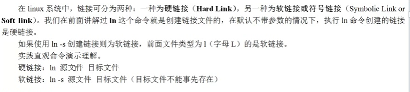
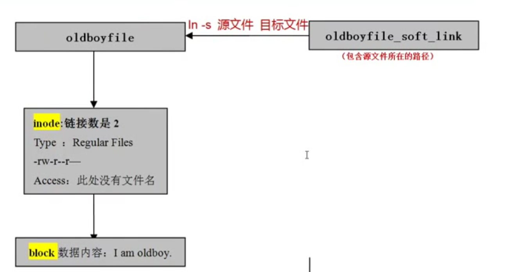
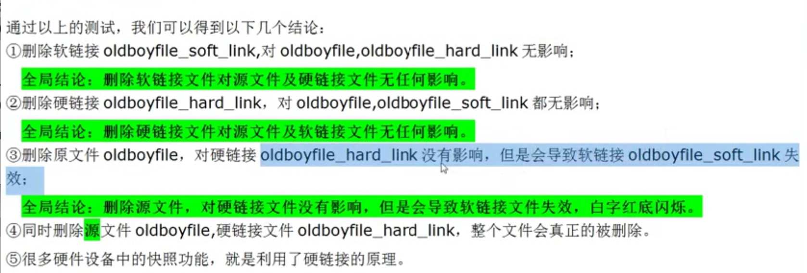
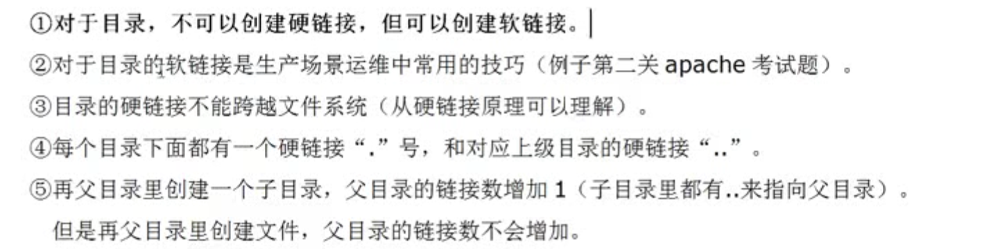
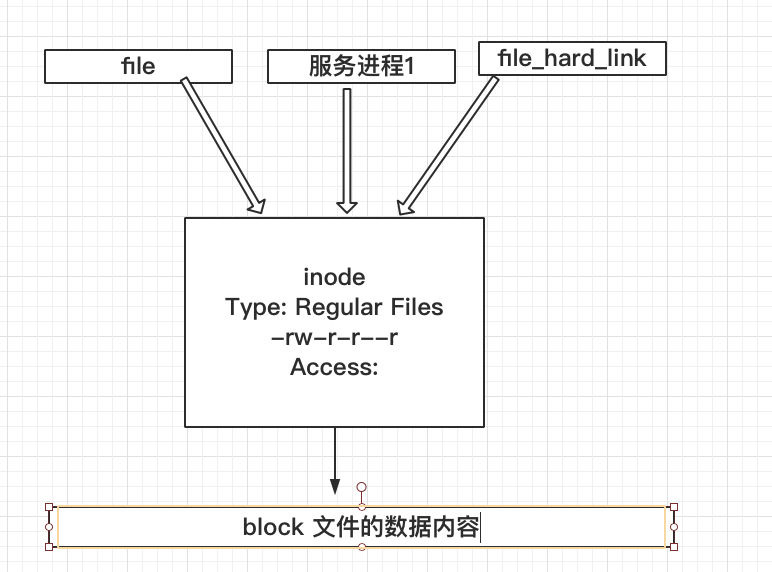

# 链接分为两种

# 硬链接 (ln 源文件, 硬链接文件)

```

硬链接是通过索引节点*(inode)来进行链接的.....


linux文件系统中. 多个文件指向同一个索引节点(inode),是允许的, 这样情况的文件我们叫他硬链接文件....


用硬链接我就可以防止文件'误删'

ln me.txt wo.txt
ls -l me.txt
-rw-r--r--. 2 root root 10 Nov 20 03:08 me.txt


硬链接有备份的作用

针对这个问题就来了, 来跟我说说linux的删除原理.....
我的回答是如果想真的删除一个文件,要删除一个inode的所有硬链接.....????
```

# 符号链接或者软链接(快捷方式)


```

不带参数创建的就是硬链接

ln -s 带了参数创建的就是软链接


touch orFile
ln -s orFile soft_file
ls -lhi

29360280 lrwxrwxrwx. 1 root root 6 Nov 20 03:36 soft_file -> orFile
29360278 -rw-r--r--. 1 root root 0 Nov 20 03:36 orFile


readlink soft_file 

orFile


// 软链接装软件
ln -s /xxxxx/xxxx2.1.6/ /xxxxxx/xxxx

!ln // 执行最近一个ln的命令
```

# 链接小结


# 目录的小结



```

1.对目录好像不可以创建硬链接

2. 但是可以创建软链接

3.每个目录下面都有一个硬链接"."号, 和对应的上级目录的硬链接".."

点和当前目录互为硬链接

```


# 文件删除原理




```

静态文件的删除,没有服务进程
i_link// 硬链接数量
i_count // 进程的引用计数
以上图i_link=2 和 i_count=1,  文件删除的条件 i_link=0 并且i_count=0


i_link为0并且,i_count为零
```


# 命令演练

## 看看我的服务器硬盘使用情况 df -h
```
 df -h

Filesystem Size Used Avail Use% Mounted on

/dev/vda1 20G 919M  20G  5% /

devtmpfs 225M  0 225M  0% /dev

tmpfs  245M  0 245M  0% /dev/shm

tmpfs  245M  33M 212M 14% /run

tmpfs  245M  0 245M  0% /sys/fs/cgroup

tmpfs 49M  0  49M  0% /run/user/0

```

## 看看根所有文件占用的情况  du -sh /*

```

du -sh /*

0  /bin

119M  /boot

0  /dev

33M  /etc

16K  /home

0  /lib

0  /lib64

0  /media

0  /mnt

0  /opt

du: cannot access '/proc/24982/task/24982/fd/4': No such file or directory

du: cannot access '/proc/24982/task/24982/fdinfo/4': No such file or directory

du: cannot access '/proc/24982/fd/4': No such file or directory

du: cannot access '/proc/24982/fdinfo/4': No such file or directory

0  /proc

56K  /root

33M  /run

0  /sbin

0  /srv

0  /sys

4.0K  /tmp

589M  /usr

134M  /var

12K  /wt

```


# 看看总分区 fdisk -l

```

Disk /dev/vda: 21.5 GB, 21474836480 bytes, 41943040 sectors

Units = sectors of 1 * 512 = 512 bytes

Sector size (logical/physical): 512 bytes / 512 bytes

I/O size (minimum/optimal): 512 bytes / 512 bytes

Disk label type: dos

Disk identifier: 0x000b1ef9

 Device Boot Start  End Blocks  Id System

/dev/vda1  * 2048 41943006 20970479+ 83 Linux

Disk /dev/vdb: 0 MB, 436224 bytes, 852 sectors

Units = sectors of 1 * 512 = 512 bytes

Sector size (logical/physical): 512 bytes / 512 bytes

I/O size (minimum/optimal): 512 bytes / 512 bytes


```


# 查看被删除的文件  lsof|grep del


# 重启阿帕奇服务器


# inode满了和,  block满了


# df -i  // 看inode 满没满

# df -h // 是block满了
