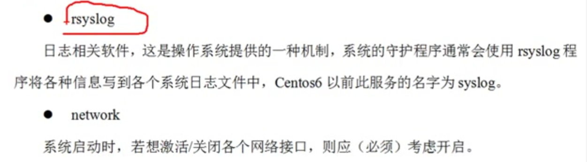
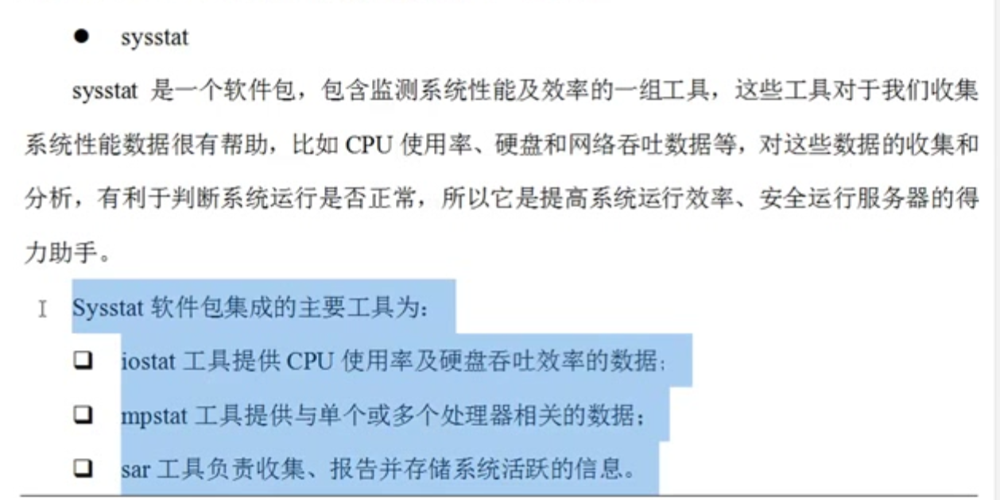

# 要的服务2017年11月19日16:44:55








```
sshd

rsyslog

network

crond // 定时任务????

sysstat


```


```

看看哪些是在3级别上运行

 chkconfig --list|grep "3:on"


alias egrep='egrep --color=auto'
/usr/bin/egrep


/// 同时过滤两个字符串

egrep "3306|1521" /etc/services 

mysql **3306**/tcp # MySQL

mysql **3306**/udp # MySQL

ncube-lm **1521**/tcp # nCube License Manager

ncube-lm **1521**/udp # nCube License Manager


/// 同时过滤两个字符串 grep版
grep -E --color=auto "3306|1521" /etc/services

mysql **3306**/tcp # MySQL

mysql **3306**/udp # MySQL

ncube-lm **1521**/tcp # nCube License Manager

ncube-lm **1521**/udp # nCube License Manager
```


```

chkconfig --list


chkconfig --list|grep 3:on


chkconfig --list|grep 3:on |egrep "crond|sshd|network|rsyslog|sysstat"  // 

// 排除看看
chkconfig --list|grep 3:on |egrep -v "crond|sshd|network|rsyslog|sysstat"

// 拿到所有服务名字了
chkconfig --list|grep 3:on |egrep -v "crond|sshd|network|rsyslog|sysstat" |awk '{print $1}'


// 拿到所有操作的命令
chkconfig --list|grep 3:on |egrep -v "crond|sshd|network|rsyslog|sysstat" |awk '{print "chkconfig",$1,"off"}'


// 交给bash 作为命令执行
chkconfig --list|grep 3:on |egrep -v "crond|sshd|network|rsyslog|sysstat" |awk '{print "chkconfig",$1,"off"}' |bash
```


```
ls
ls -a  // 显示所有包含隐藏
ls -l  // 查看文件属性
ls -lh  // 显示文件多点, 多少k, 多少m, 多少G

ls -F  // 在目录后面加了一个斜杠

// 单独查看某个文件/夹的详细属性
ll -d xxx
```


```
属性不变
cp -a 

165 cp -a file{3,9}.txt

 166 ls -l

 167 cp -a file{3,9}.txt

 168 alias

 169 pwd

 170 ls

 171 ls -F

 172 mkdir dir{1..5}

 173 ls

 174 ls -F

 175 cp dir{3.7}

 176 cp dir{3,7}

 177 cp -a dir{3,7}

 178 ls -F

cp 不能直接复制目录

cp -a // 也是可以复制目录的

```


```
mv
移动文件, 重名了
// 将文件 st.txt 重命名为ovelsu.txt
mv st.txt {,ovelsu.txt}
\mv llk.txt {,ovelsu.txt} // 反斜杠不不不提示
/usr/bin/mv llk.txt {,ovelsu.txt}


// 多个文件的移动, 多个文件的重命名
mv `find /wt/ -type f -name "*.txt"` /tmp/
mv /tmp/file{1..5}.txt /wt/
mv file{1..5}.txt /tmp/

find . -type f -name "*txt"|xargs -i mv {} /wt/
```


```
非常危险
rm 

```


```
xargs
1--------------------------------------------
# cat >>hi.txt<<EOF

> 1 2 3 4 5 6

> 7 8 9

> 10 11

> EOF

1--------------------------------------------
cat hi.txt 

1 2 3 4 5 6

7 8 9

10 11


1--------------------------------------------
xargs < hi.txt 

1 2 3 4 5 6 7 8 9 10 11


2--------------------------------------------
我要4个数字一行
xargs -n 4 <hi.txt 

1 2 3 4

5 6 7 8

9 10 11

```