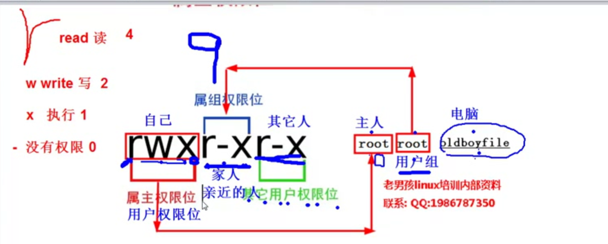

# 文件权限细讲



| 符号 | 意思 | 数字 |
|---|---|---|
| r | 读 | 4 |
| w | 写 | 2 |
|x| 执行 | 1 |
| - | 没有权限 | 0 |
```
liunx 的权限, 是三个一组的,

前三位是属主权限位
中间三位是属组权限位
后三位是其他用户权限位

linux的权限准确的说是12位, 其中三位是特殊权限


我们先讲就位权限位/......


drwxr-xr-x.
```


例子:drwxr-xr-x.
#  权限的前三(例子rwx)-------属主, 用户权限位

--------------------

# 中间三 -------属组


# 后三 -------------其他用户权限位


#  最后还有个点., 基本没意思......   

--------------------

```


```


#  

--------------------

```


```


#  

--------------------

```


```
