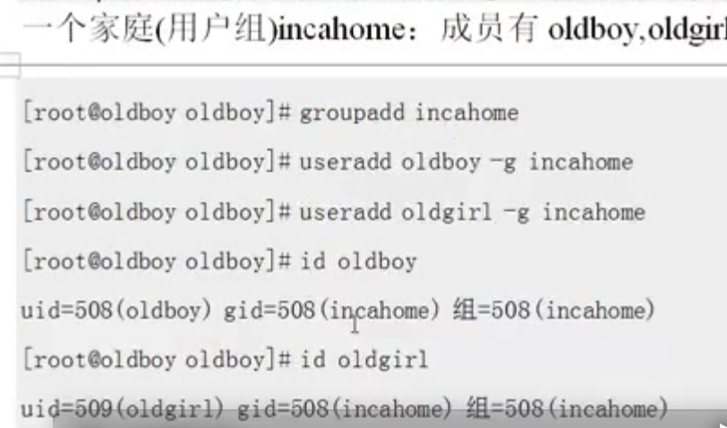
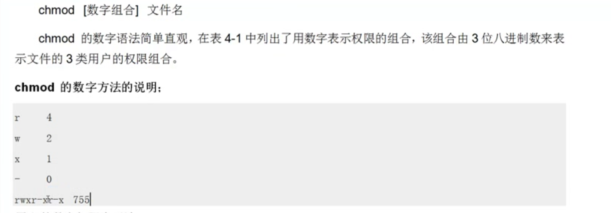
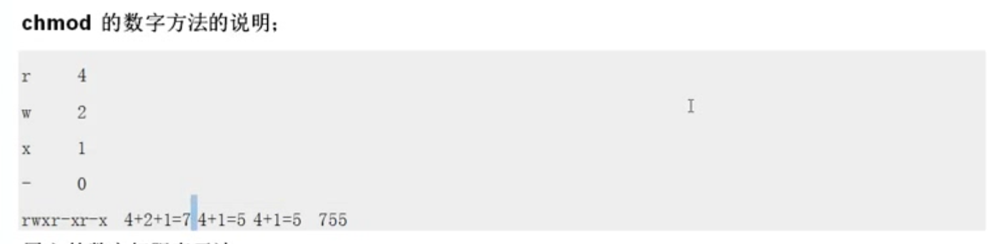
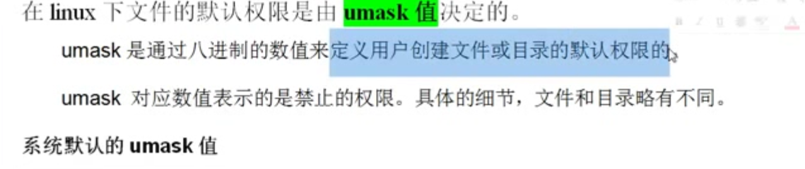
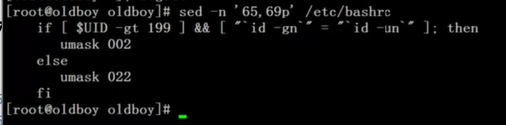
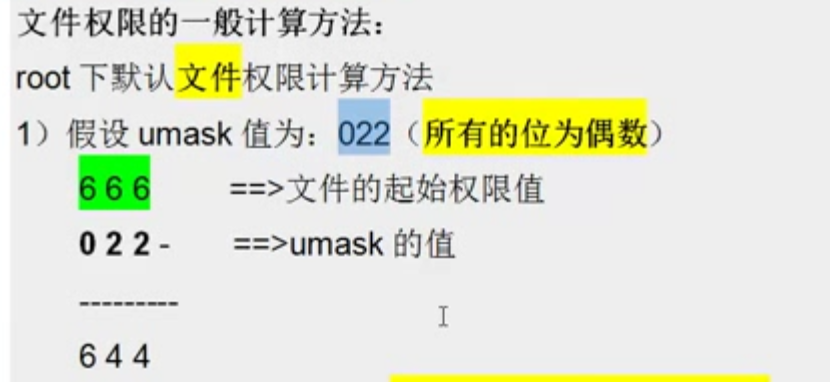
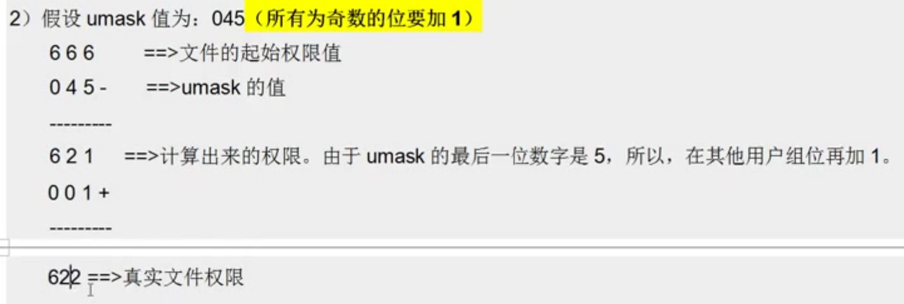
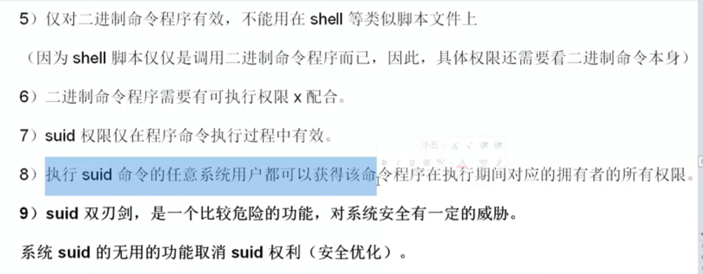
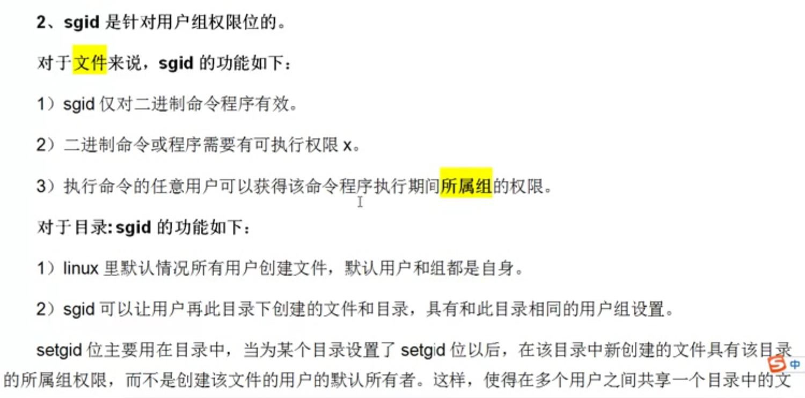
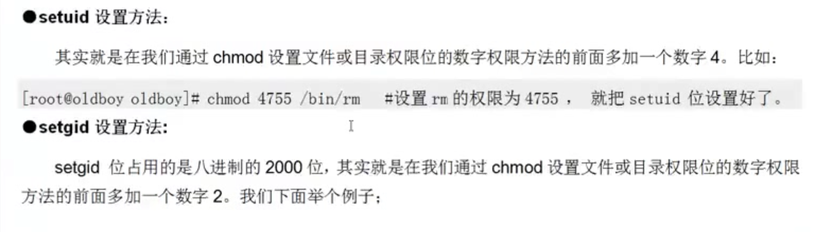

# 
```

创建用户, 创建组
让用户数组我们创建的组


 groupadd incahome
useradd oveSt -g incahome

// 删除用户
userdel -r oveSt
```
-------



#  chmod







-------------
```
改变文件权限有字母和数字
我们常用数字

chmod 715 test

```
------------- 字符改变版


```


```


# 总结 目录755,文件644

-------------









```
022

普通 002
 umask

0002
```


---------------------------------------------------------

# 问下面 s 是什么意思
```

ls -l `which passwd`

-rwsr-xr-x. 1 root root 27832 Jun 10 2014 /usr/bin/passwd


```
# 答


 
```


普通用户为什么可以改自己的密码?? 就是有了s

...
```
# suid



-------------------


# sgid


--------------------------------------

-------------------





