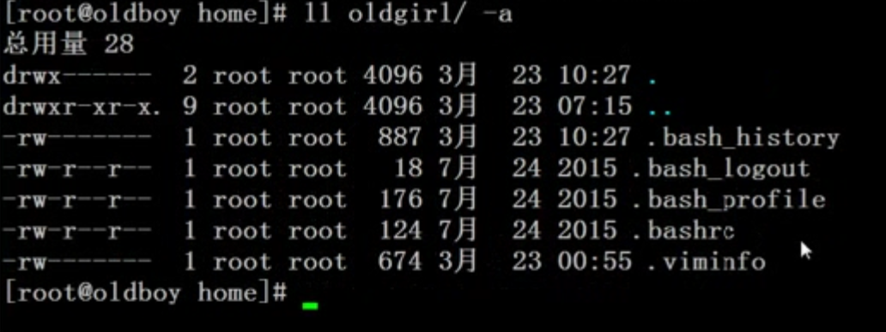
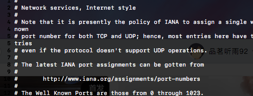

#  chattr  --改扩展属性的 , 也就是在安全方面有点用

```

chattr [ -RVf ] [ -v version ] [ mode ] files...

chattr +a wo.txt
// 删除不了了
````
--------------------------------------


# lsattr

```
root$ lsattr wo.txt 
---------------- wo.txt
```
--------------------------------------


# chown





#  chgrp  主要是改用户组
--------------------------------------

# cat 

--------------------------------------

#  tac 就是上面那家伙翻过来, 功能也是

--------------------------------------

#  more 

```


wc -l /etc/services 

11176 /etc/services

more命令看大文件(然后空格是看下一行b是看上一行.h是帮助=看现在是多少行), 
```
--------------------------------------


#  less 学了less 就忘more吧   less -N /etc/services  显示行号




-------------

```

more 是把文件一次性全打开

less 是一屏一屏的打开的

```

#  head 显示文件的首部??? 默认打印前10行

-------------
```


head /etc/services

#

# Network services, Internet style

#

# Note that it is presently the policy of IANA to assign a single well-known

# port number for both TCP and UDP; hence, most entries here have two entries

# even if the protocol doesn't support UDP operations.

#

# The latest IANA port assignments can be gotten from

#

#  http://www.iana.org/assignments/port-numbers
```


#  tail 查看文件后10行

-------------

```

head /wt/tail.txt 

1

2

3

4

5

6

7

8

9

 **~**  [01:19:15]

**root$** tail /wt/tail.txt

8

9

10

1

11

12

13

14

15

 **~**  [01:19:29]


wc -l 看某个文件有多少行..more命令看大文件(然后空格是看下一行b是看上一行.h是帮助=看现在是多少行),  tail -f 参数可以实时的输出日志参数, -F的话是如果没有那个文件我就一直等着你生成, 然后实时显示
```

#  cut 切割, 切割文件每一行

-------------

```

-b // 按照字节来切 

echo "I am developer , and you?" >> /wt/devel.txt

ut -b 3-4 /wt/devel.txt 

am


cut -b -4 /wt/devel.txt 

I am


-c // 按照字符
```


#  

-------------


#  

-------------


#  

-------------


#  

-------------


#  

-------------


