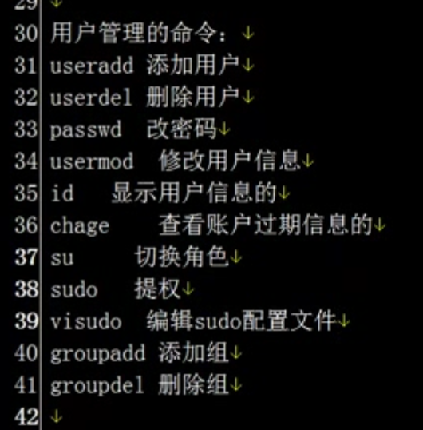

#   cd /etc/skel 存放新用户配置文件的目录

--------------------

```
用户的环境变量没了, 去
cd /etc/skel 下面拷贝回来就ok了 
```

#  split

--------------------

```
按照指定的行数或大小分割文件


cat >>/wt/lkmy.txt <<EOF
ada
asdas
dasd
EOF

 split -l 5 /wt/lkmy.txt myBL_


myBL_aa myBL_ab myBL_ac myBL_ad
```


#  paste

--------------------

```


```


#  sort

--------------------


#  wc

--------------------


#  dos2unix

--------------------


#  diff 比较多个文件的不不同

--------------------


#  tr  转换或者删除字符串的

--------------------


#  tee  多重定向

--------------------


#  vi vim

--------------------
#  

--------------------


