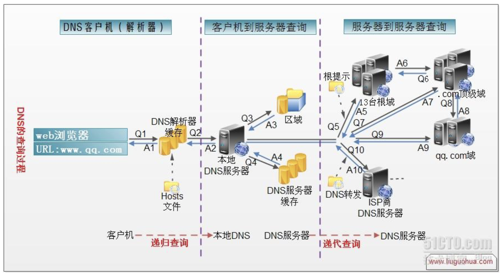

#  DNS 概念

```

DNS (Domain Name system)


A 记录  www.baidu.com  ---->> 1.1.1.1
CNAME  别名------>常被CDN 服务商应用

MX解析记录  30452342@qq.com , @qq.com就是MX记录,  将来我搭建邮件服务器的时候就要搞这个MX记录


PTR 反向解析   1.1.1.1 ------> www.baidu.com   用得多的就是邮件服务

```


# DNS解析流程原理 (必会)

```


```


# 根

```

全球13台根服务器

```

# 顶级域名


```
com, me, net, cc

````

# 一级域名

```

baidu, google, cctv

```

# 主机  

```

www.baidu.com
```


DNS 解析流程
DNS 解析过程





```


 dig @8.8.8.8 www.baidu.com +trace

; <<>> DiG 9.9.4-RedHat-9.9.4-51.el7 <<>> @8.8.8.8 www.baidu.com +trace
; (1 server found)
;; global options: +cmd
.			208847	IN	NS	a.root-servers.net.
.			208847	IN	NS	b.root-servers.net.
.			208847	IN	NS	c.root-servers.net.
.			208847	IN	NS	d.root-servers.net.
.			208847	IN	NS	e.root-servers.net.
.			208847	IN	NS	f.root-servers.net.
.			208847	IN	NS	g.root-servers.net.
.			208847	IN	NS	h.root-servers.net.
.			208847	IN	NS	i.root-servers.net.
.			208847	IN	NS	j.root-servers.net.
.			208847	IN	NS	k.root-servers.net.
.			208847	IN	NS	l.root-servers.net.
.			208847	IN	NS	m.root-servers.net.
.			208847	IN	RRSIG	NS 8 0 518400 20171203050000 20171120040000 46809 . ASjan/U6BJTNLcaLnYiM4dDus1ORdalcsF6ljF5GDrmqQ4ECrsDZMxNC qoH/8BmIFdCeeJ40SyXMplYUIvEh6OMd8vSUTimWPrG1JKG90SHpv5OJ BKsw2p+i0isL8X8jkSlg77cQHipn/tjQVqGD02gmcHJn9aJFysfusr6Q bcGRcmFIdvV46OTP/vgWWPDn+8I5u5ja0QHrlpeQMmkfs5TtZYhq+cKA xVjSvQ/ZSILrfOPeW1Ov8NWStUm6cq4ebDio2ucX4Om+Yc41pILqzTcm LMQWCutax35jmnmrg1HPIpZYng5Fv7AywJAV9UrnKmTLDJ43EoDq1Js5 Ee4WbQ==
;; Received 525 bytes from 8.8.8.8#53(8.8.8.8) in 14 ms

com.			172800	IN	NS	a.gtld-servers.net.
com.			172800	IN	NS	b.gtld-servers.net.
com.			172800	IN	NS	c.gtld-servers.net.
com.			172800	IN	NS	d.gtld-servers.net.
com.			172800	IN	NS	e.gtld-servers.net.
com.			172800	IN	NS	f.gtld-servers.net.
com.			172800	IN	NS	g.gtld-servers.net.
com.			172800	IN	NS	h.gtld-servers.net.
com.			172800	IN	NS	i.gtld-servers.net.
com.			172800	IN	NS	j.gtld-servers.net.
com.			172800	IN	NS	k.gtld-servers.net.
com.			172800	IN	NS	l.gtld-servers.net.
com.			172800	IN	NS	m.gtld-servers.net.
com.			86400	IN	DS	30909 8 2 E2D3C916F6DEEAC73294E8268FB5885044A833FC5459588F4A9184CF C41A5766
com.			86400	IN	RRSIG	DS 8 1 86400 20171205170000 20171122160000 46809 . ZeOD+SOSuqdJoly/LfxEDA9NurgH0ojyq8x8LdMbkAUa+EiFxED30trW 0rb0WoU7Sk5ixV4L0Bm/Emngt8i9+n6p4Te8c1iPhamZTkJptaFFLh76 /Et/H9+F5gB146H1pKqGNY+qP6U1VFLUqix/HQbeVC5OSF0Sb0qtZ14X YLoqqsOwGkSgyPI8EU5HZi53UWxScejaCvmycHf1kOrhR7+mnW/VcYCy IPkf0p8o+tmn8BzeyvRctac+elTfb771R6eCc7+SsjlmVAq9YC9BR3Za fFv1yyl7FWpc0X9na+upcwRfCcMfMXAzQ1QU9eI1/gsTjlsLtai0XWPi 3Xb5vg==
;; Received 1173 bytes from 192.203.230.10#53(e.root-servers.net) in 14 ms

baidu.com.		172800	IN	NS	dns.baidu.com.
baidu.com.		172800	IN	NS	ns2.baidu.com.
baidu.com.		172800	IN	NS	ns3.baidu.com.
baidu.com.		172800	IN	NS	ns4.baidu.com.
baidu.com.		172800	IN	NS	ns7.baidu.com.
CK0POJMG874LJREF7EFN8430QVIT8BSM.com. 86400 IN NSEC3 1 1 0 - CK0Q1GIN43N1ARRC9OSM6QPQR81H5M9A NS SOA RRSIG DNSKEY NSEC3PARAM
CK0POJMG874LJREF7EFN8430QVIT8BSM.com. 86400 IN RRSIG NSEC3 8 2 86400 20171129054811 20171122043811 11324 com. BE74rM2oFN38PFPdbMua/NJB8pMJDKK/hkYStFhnaA+VtnsLHZFg83OU NQUQlPhuwP/BNuSKc8ZEh+RPlujFESZV3N9U9uVU5m53O3xLdNvR7Pkw FaUKS9AqTGDYH4ihp/K/KmfaZyT9cAoXY9ejyMhGZN4laP9Eiw0mVKmc W74=
HPVV2B5N85O7HJJRB7690IB5UVF9O9UA.com. 86400 IN NSEC3 1 1 0 - HQ01I3PFSK4TG3Q31LT3RIMHGBFQU42T NS DS RRSIG
HPVV2B5N85O7HJJRB7690IB5UVF9O9UA.com. 86400 IN RRSIG NSEC3 8 2 86400 20171127053853 20171120042853 11324 com. khKPkcRjmpuCkoNjnUPXG+EA16xzJaGRWFZtgTfVQitV+Y5TXa2gUaq7 XzHumraw0+trsfcJ/puwZAiJ1iyjvsH1ilTCVof9Zu4u79u9++1cjSV7 HEHNmdXI+gIRN/9gMJ4WJZR1ybrDlwyYqAqFiLHRLPQAOM6EqmwS7HpZ ujc=
;; Received 697 bytes from 192.35.51.30#53(f.gtld-servers.net) in 787 ms

www.baidu.com.		1200	IN	CNAME	www.a.shifen.com.
a.shifen.com.		1200	IN	NS	ns4.a.shifen.com.
a.shifen.com.		1200	IN	NS	ns3.a.shifen.com.
a.shifen.com.		1200	IN	NS	ns1.a.shifen.com.
a.shifen.com.		1200	IN	NS	ns2.a.shifen.com.
a.shifen.com.		1200	IN	NS	ns5.a.shifen.com.
;; Received 239 bytes from 180.76.76.92#53(ns7.baidu.com) in 37 ms

```


#  dig

```
dig @8.8.8.8 www.baidu.com +trace


root$ dig www.codertomwu.com                

; <<>> DiG 9.9.4-RedHat-9.9.4-51.el7 <<>> www.codertomwu.com
;; global options: +cmd
;; Got answer:
;; ->>HEADER<<- opcode: QUERY, status: NOERROR, id: 4048
;; flags: qr rd ra; QUERY: 1, ANSWER: 1, AUTHORITY: 0, ADDITIONAL: 1

;; OPT PSEUDOSECTION:
; EDNS: version: 0, flags:; udp: 4096
;; QUESTION SECTION:
;www.codertomwu.com.		IN	A

;; ANSWER SECTION:
www.codertomwu.com.	600	IN	A	16.243.64.8

;; Query time: 791 msec
;; SERVER: 67.207.67.2#53(67.207.67.2)
;; WHEN: Thu Nov 23 03:17:18 UTC 2017
;; MSG SIZE  rcvd: 63

 ~ [03:17:18]
```


#  nslookup

--------------------

```

root$ nslookup
> www.bbbaidu.com
Server:		67.207.67.2
Address:	67.207.67.2#53

Non-authoritative answer:
Name:	www.bbbaidu.com
Address: 47.88.53.127
> www.google.com
Server:		67.207.67.2
Address:	67.207.67.2#53

Non-authoritative answer:
Name:	www.google.com
Address: 172.217.31.68
> 


```


#  host

--------------------

```

host www.google.com

www.google.com has address 172.217.31.68

www.google.com has IPv6 address 2404:6800:4001:800::2004
```


#  ping

--------------------


#  

--------------------


#  

--------------------


#  

--------------------


 1. 
```

cd /etc/sysconfig/network-scripts

 **/etc/sysconfig/network-scripts** [04:26:59]

**root$** cat ifcfg-eth0                   

# Created by cloud-init on instance boot automatically, do not edit.

#

BOOTPROTO=none

DEFROUTE=yes

DEVICE=eth0

GATEWAY=128.199.128.1

HWADDR=2e:60:70:e5:4e:a3

IPADDR=15.29.57.33

IPADDR1=10.15.0.5

MTU=1500

NETMASK=255.255.192.0

NETMASK1=255.255.0.0

ONBOOT=yes

TYPE=Ethernet

USERCTL=no

```


#  TYPE 网络类型,以太网没?

----------------------


#  ONBOOT 为yes才能保证下次开机启动激活额网卡设备部

----------------------


#  BOOTPROTO 启动协议, 获取配置方式, 有 none|boop|dhcp

----------------------


#  HWADDR 以太网硬件地址

----------------------

  


#  命令blkid 查看磁盘的UUID

----------------------


#   NETMASK  子网掩码
----------------------


#   网卡的生效
----------------------

```


停掉
ifdown eth0

启动  

ifup  etho 


// 全部生效
/etc/init.d/network restart


```


#   网卡的DNS优先于cat /etc/resolv.conf. 网卡配置了这里就不不生效

```


并且重启网卡, 会覆盖/etc/resolv.conf

// nameserver 就是DNS
cat /etc/resolv.conf
nameserver 162.207.227.2
```
----------------------


#   
----------------------


#   
----------------------


