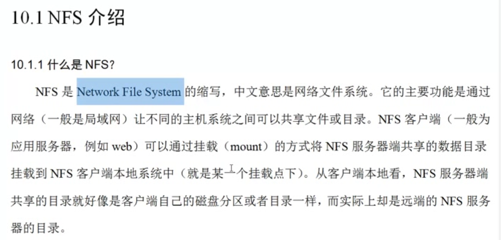
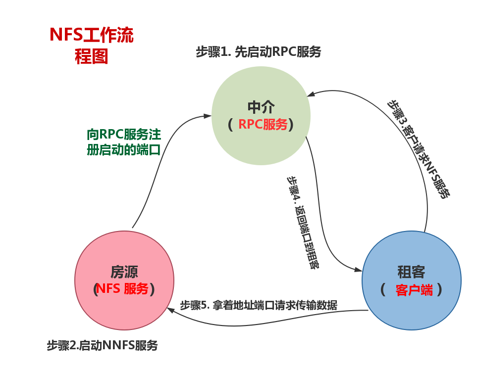
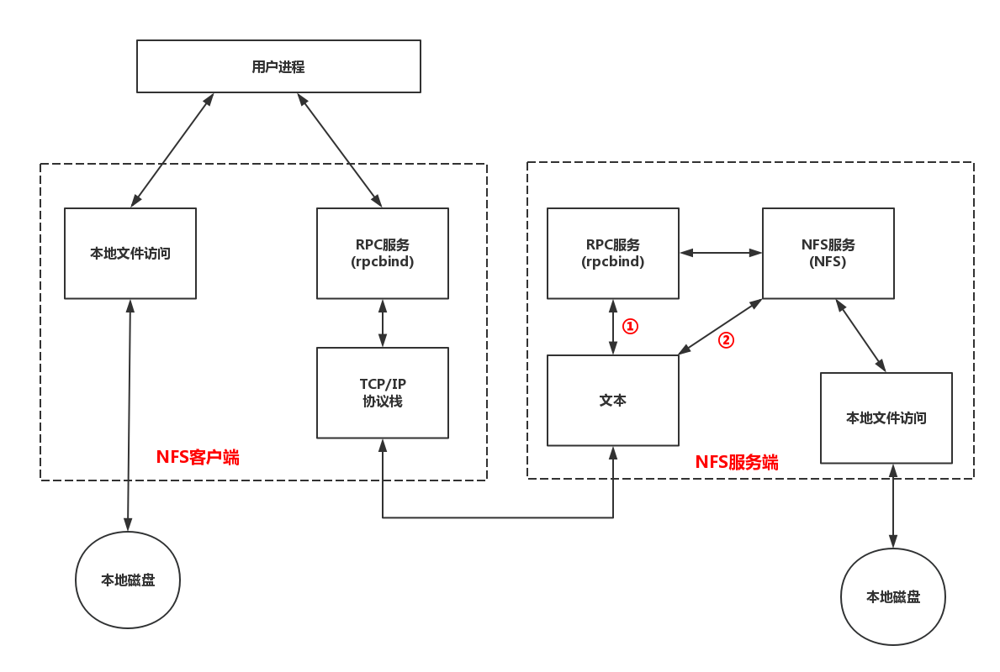
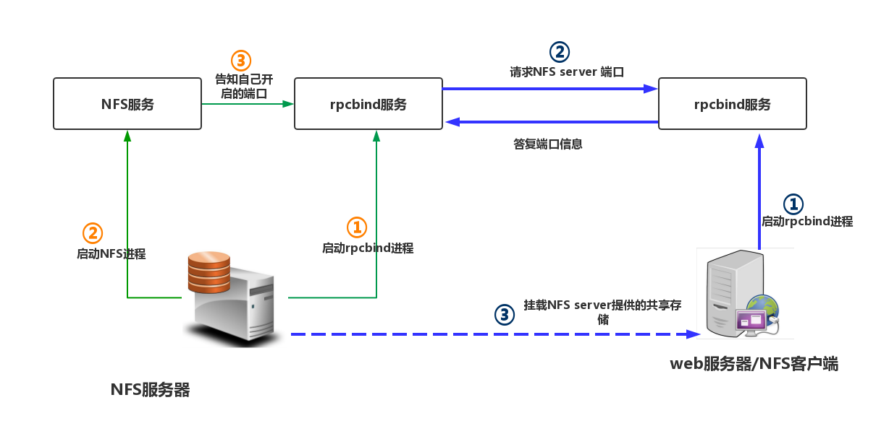
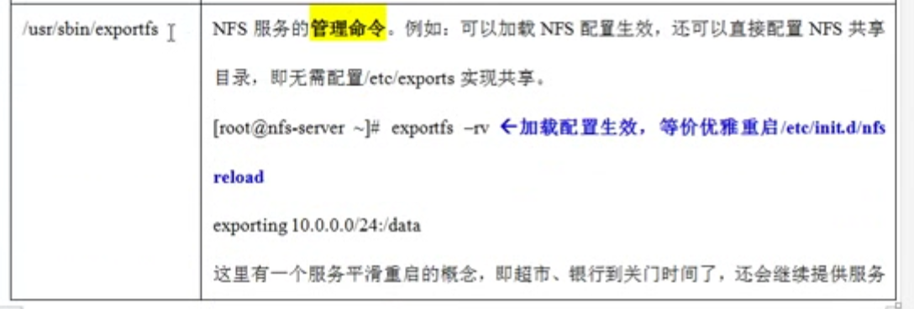

# 什么是NFS , 用来存图片视频文件的, 搞存储的.  共享存储


```

Network File System 
网络文件系统

让不同主机系统之间可以共享文件或者目录


```


# NFS 是独立的文件系统, 网络文件系统


#  NFS 是一台,   后面别人用的是Moosefs(mfs), GlusterFS, FastDFS

# NFS 效率不高, 用啥啊mfs, GlusterFS, 

# 公共的NFS系统


# NFS 每次重启它的端口都是不一样的 

# 每次重启端口都不一样, 又想让用户找到它, 这时候就需要RPC服务 


# NFS工作流程图(形象)





# NFS工作流程图(具体)





# centos6 RPC叫rpcbind.   centos7叫啥? 


# 开搞========================


#  NFS 软件列表

###  要部署NFS服务,  需要安装下面的软件包

####  房源
>  nfs-utils : NFS服务的主程序, 包括rpc.nfsd, rpc.mountd这两个daemons和相关文档说明, 以及执行命令文件等.


#### 中介
>  rpcbind: CentOS6.X 下面RPC的主程序, NFS可以视为一个RPC程序, 在启动任何一个RPC程序之前, 需要做好端口和功能的对应映射工作, 这个映射工作就是有rpcbind服务来完成的. 因此,在提供NFS服务之前I必须先启动rpcbind服务才行.


# rpm -aq nfs-utils rpcbind 看看上面的两个软件包是不是安装了


#  后面我们要自己做一个yum仓库 


#  保留安装包

```

vim /etc/yum.conf 

[main]

cachedir=/var/cache/yum/$basearch/$releasever

keepcache=0

debuglevel=2

logfile=/var/log/yum.log

exactarch=1

obsoletes=1

gpgcheck=1

plugins=1

installonly_limit=5

bugtracker_url=http://bugs.centos.org/set_project.php?project_id=23&ref=http://bugs.centos.org/bug_report_page.php?category=yum

distroverpkg=centos-release


// 将keepcache 改为1, yum install 下载软件的安装包就不自动删除了, 保存在
r
cachedir=/var/cache/yum/$basearch/$releasever

```


# 基础软件安装

```

yum install lrzsz nmap tree dos2unix nc -y

打补丁
yum update 或者 yum upgrade

```


# -y是不提示直接装


# rpc 的端口111

```

netstat -lntup|grep rpc

udp 0 0 0.0.0.0:829  0.0.0.0:*  22278/**rpc**bind       

udp 0 0 0.0.0.0:111  0.0.0.0:*  22278/**rpc**bind       

udp6  0 0 :::829 :::* 22278/**rpc**bind       

udp6  0 0 :::111

```

# rpcinfo -p localhost (看rpc的房源)

```

program vers proto  port service

 100000 4  tcp 111 portmapper

 100000 3  tcp 111 portmapper

 100000 2  tcp 111 portmapper

 100000 4  udp 111 portmapper

 100000 3  udp 111 portmapper

 100000 2  udp 111 portmapper

```

# 别人的================================

# 啃爹的玩意从centOS7 开始 使用systemd服务来代替daemon


#  原来的 service 命令与 systemctl 命令对比

| daemon命令 | systemctl命令 | 说明 |
|---|---|---|
| service [服务] start 	| systemctl start [unit type] 		| 启动服务 |
| service [服务] stop		| systemctl stop [unit type] 		| 停止服务 |
| service [服务] restart  | systemctl restart [unit type] 	| 重启服务 |


> 此外还是二个systemctl参数没有与service命令参数对应

```
status：参数来查看服务运行情况
reload：重新加载服务，加载更新后的配置文件（并不是所有服务都支持这个参数，比如network.service）

**应用举例：**

#启动网络服务
systemctl start network.service

#停止网络服务
systemctl stop network.service

#重启网络服务
systemctl restart network.service

#查看网络服务状态
systemctl status network.serivce
```

#  init 命令与systemctl命令对比

| init命令 | systemctl命令 | 说明 |
| --- | --- | --- |
| init 0 | systemctl poweroff | 系统关机 |
| init 6 | systemctl reboot | 重新启动 |


与开关机相关的其他命令：

| systemctl命令 | 说明 |
| --- | --- |
| systemctl suspend | 进入睡眠模式 |
| systemctl hibernate | 进入休眠模式 |
| systemctl rescue | 强制进入救援模式 |
| systemctl emergency | 强制进入紧急救援模式 |


# OS7安装NFS

方法一

```

检查：rpm -qa nfs-utils rpcbind 最佳
yum install nfs-utils rpcbind -y
```

方法2： LANG = en

```


> yum grouplist | grep -i nfs
> yum groupinstall “NFS file server ” -y

```
启动 rpcbind (centos 6.8)

```

/etc/init.d/rpcbind status
/etc/init.d/rpcbind start

```

启动 rpcbind (centos 7)


```
systemctl start rpcbind.service
systemctl status rpcbind.service

```

启动NFS

```

systemctl start nfs-server.service

```

查看rpcbind 端口

```

netstat -lntup | grep rpcbind 默认端口 111
netstat -lntup | grep 111
rpcinfo -p localhost 查看rpclist

```

配置nfs配置文件(/etc/exports ] 默认是空的)


```

vim /etc/exports
示例：
/data 168.1.1.1(rw,sync,all_squash)
/data 168.1.1.*(rw,sync,all_squash)
sync：写入磁盘

```


使配置生效

```

exportfs -r

注：配置文件说明：

/opt/test 为共享目录

192.168.1.0/24 可以为一个网段，一个IP，也可以是域名，域名支持通配符 如: *.qq.com

rw：read-write，可读写；

ro：read-only，只读；

sync：文件同时写入硬盘和内存；

async：文件暂存于内存，而不是直接写入内存；

no_root_squash：NFS客户端连接服务端时如果使用的是root的话，那么对服务端分享的目录来说，也拥有root权限。显然开启这项是不安全的。

root_squash：NFS客户端连接服务端时如果使用的是root的话，那么对服务端分享的目录来说，拥有匿名用户权限，通常他将使用nobody或nfsnobody身份；

all_squash：不论NFS客户端连接服务端时使用什么用户，对服务端分享的目录来说都是拥有匿名用户权限；

anonuid：匿名用户的UID值，可以在此处自行设定。

anongid：匿名用户的GID值。

```


# 查看有什么启动命令 /etc/init.d/nfs 会输出命令集合

# showmount -e 127.0.0.1 查看挂载的目录


#  关闭防火墙

```


> systemctl stop firewalld.service
> systemctl disable firewalld.service


```


# 客户端需要启动 rpc

```

客户端也需要安装rpcbind, 建议nfs一起安装,便于使用showmount命令

centos6.8 /etc/init.d/rpcbind start
centos7 systemctl start rpcbind.service

或者将启动命令放入 /etc/rc.local 或者 使用 echo “/etc/init.d/rpcbind start” >> /etc/rc.local

客户端挂载目录 mount -t nfs 10.0.0.7:/data /mnt
echo “/bin/mount -t nfs 10.0..0.1:/data /mnt” >> /etc/rc.local

```
# #### nfs不能向服务端写数据,是权限的问题

```

cat /var/lib/nfs/etab

/script 192.168.42.*(rw,sync,wdelay,hide,nocrossmnt,secure,root_squash,no_all_squash,no_subtree_check,secure_locks,acl,no_pnfs,anonuid=65534,anongid=65534,sec=sys,rw,secure,root_squash,no_all_squash)

/data 192.168.42.*(rw,sync,wdelay,hide,nocrossmnt,secure,root_squash,no_all_squash,no_subtree_check,secure_locks,acl,no_pnfs,anonuid=65534,anongid=65534,sec=sys,rw,secure,root_squash,no_all_squash)

[root@nfs-1 data]# grep 65534 /etc/passwd nfsnobody:x:65534:65534:Anonymous NFS User:/var/lib/nfs:/sbin/nologin

chown -R nfsnobody /data

```


http://www.178linux.com/73581

http://blog.csdn.net/xuplus/article/details/51669063


# 我的================================

# systemctl stop rpcbind 停掉rpc

# 注意
```

OS7停掉rpc顺序如下

systemctl stop rpcbind.socket
systemctl stop rpcbind

systemctl stop nfs-server.service
先干掉rpcbind.socket
再干掉rpcbind

rpcinfo -p localhost
rpcinfo: can't contact portmapper: RPC: Remote system error - Connection refused
```

# 重启nfs: systemctl restart nfs-server


```

重启nfs会把 rpc启动  苦笑
```

# 启动完rpc做个检查看看rpc状态

```

 systemctl status rpcbind.service

```
systemctl stop rpcbind.socket
systemctl stop rpcbind
systemctl stop nfs-server.service


# nfs 和 rpc开机自启动

```

systemctl enable rpcbind.service

systemctl enable nfs-server.service

```


# 取消开机自启动

```

systemctl disable rpcbind.service
systemctl disable nfs-server.service

```

# OS6的开机自启动

```

chkconfig rpcbind on
chkconfig nfs on

```

# 怎么看启动先后顺序 (OS6的)

```

ls /etc/rc.d/rc3.d/|grep -E "nfs|rpcbind"

```
# 哪里控制的启动顺序(OS6的)

```
head /etc/init.d/nfs

```


# systemctl stop

# systemctl restart


# ps -ef|egrep "nfs|rpc" 查看nfs和rpc的进程
ps -ef|egrep "nfs|rpc"

```

ps -ef|egrep "nfs|rpc"


```


init.d 和 service 还是

/etc/init.d/nfs start 好, service nfs start 还行~


# cat /etc/exports NFS文件的配置路径, 默认是空的

# man exports

# 配置 NFS文件

```

格式:
NFS共享的目录 NFS客户端地址(参数1, 参数2.......)

一台iPhoneX  给哪个女孩  (只给看一下?, 可以摸, 完全给她)


vim /etc/exports


// rw 可读可写, sync直接写到池磁盘, 不是特别大的并发的话我们用sync, 特大并发的话我们用async-异步写入 
/data 128.199.177.156(rw,sync)


```
# systemctl reload nfs-server
# 重启我们用  ,  reload要比restart是丝滑些
systemctl restart nfs-server


# 啥是平滑重启,  优雅的, 平滑的

```

五点多了去银行拿到票了可以做着, 然后银行开始关门, 马上六点了不再放票. 已经拿到票的银行服务好,没拿到票的拒绝访问.
reload就是这样

```
#  reload == exportfs -rv

# 自我检查一哈: showmount -e 128.199.177.156 

showmount -e 182.22.177.156

Export list for 182.22.177.156:

# NFS 没有账号密码限制


# NFS客户端





# 开始挂载了先showmount一下

```

 showmount -e 103.111.140.160     

Export list for 103.111.140.160:

/data 223.9.22.156

```

# mount -t nfs  103.111.140.160:/data /mnt 挂载 

mount -t nfs 159.89.140.160:/data /mnt


| 参数名称 | 参数用途 |
|---|---|
| all_squash | 不管访问NFS Server共享目录的用户身份如何，它的权限都将被压成匿名用户，同时它的UID和GID都会变成nfsnobody帐号身份。在早期多个NFS 客户端同时读写NFS Server数据时，这个参数很有用。在生产中配置NFS的重要技巧:1) 确保所有客户端服务器对NFS 共享目录具备相同的用户访问权限 |
| rw | 读写 |
| ro | 只读 |
| sync | 磁盘同步 |
| async | 写入时数据会先写到内存缓冲区，只到硬盘有空档才会再写入磁盘，这样可以提升写入效率! 风险为若服务器宕机或不正常关机，会损失缓冲区中未写入磁盘的数据( 解决办法: 服务器主板电池或加UPS 不间断电源) ! |
| no_root_squash | 访问NFSServer共享目录的用户如果是root的话，它对该共享目录具有root权限。这个配置原本是为无盘客户端准备的。用户应避免使用! |
| root_squash | 如果访问NFS Server 共享目录的用户是root,则它的权限将被压缩成置名用户，同时它的UID和GID通常会变成nfsnobody帐号身份。 |
| all_squash | 不管访问NFS Server共享目录的用户身份如何，它的权限都将被压缩成置名用户，同时它的UID和GID都会变成nfsnobody帐号身份。在早期多个NFS客户端同时读写NFSServer数据时，这个参数很有用。在生产中配置NFS 的重要技巧:1) 确保所有客户端服务器对NFS共享目录具备相同的用户访问权限 a.all_squash把所有客户端都压缩成固定的匿名用户(UID相同) b.就是anonuid,anongid 指定的UID 和GID 的用户。 2) 所有的客户端和服务端都需要有一个相同的UID 和GID 的用户，即nfsnobody(UID 必须相同)。 |
| anonuid | 参数以anon*开头即指anonymous匿名用户，这个用户的UID 设置值通常为nfsnobody的UID值，当然也可以自行设置这个UID值。但是，UID 必须存在于/etc/passwd 中。在多NFS Clients 时,如多台Web Server共享一个NFS 目录,通过这个参数可以使得不同的NFSClients写入的数据对所有NFSClients 保持同样的用户权限，即为配置的匿名UID对应用户权限，这个参数很有用，一般默认即可 |
| anongid | 同anonuid,区别就是把uid(用户id)换成gid(组id) |


# NFS 服务的重点知识梳理

```
当多个NFS 客户端访问服务器端的读写文件时，需要具有以下几个权限:
口
NFS 服务器/etc/exports 设置需要开放可写入的权限，即服务端的共享权限。
NFS 服务器实际要共享的NFS 目录权限具有可写入w 的权限，即服务端本地目
录的安全权限。
每台机器都对应存在和NFS默认配置UID的相同UID65534 的nfsnobody用户( 确
保所有客户端的访问权限统一，否则每个机器需要同时建立相同UID的用户，并
覆盖NFS 的默认用户配置)。
只有满足上述三个条件，多个NFS 客户端才能具有查看、修改、删除其他任意NFS
客户端上传文件的权限，这在大规模的集群环境中作为集群共享存储时尤为重要。
表10-4 列出了常用的重点NFS 服务文件或命令。 

```


 

 


 

 

cat /proc/mounts


# 后面的操作=======开始

 
 
 
 
 
 

```
 
 
 
 

```

# 后面的操作=======结束


