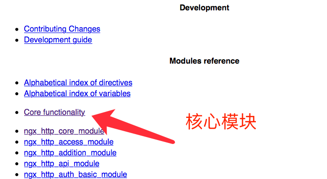

http://nginx.org/en/docs/



# 访问日志/application/nginx/logs/access.log


# 核心模块mian区

```

#user nobody;

worker_processes 1;

#error_log logs/error.log;

#error_log logs/error.log notice;

#error_log logs/error.log info;

#pid logs/nginx.pid;


/**
说明
// 表示真正搞活进程的数量
Nginx 有一个 进程master, 有若干个worker 进程, 

一般和CPU的核数相同吧~

*/ 
worker_processes  


```


# 核心模块events区

```

events {

 worker_connections 1024;

}


/**

连接数

1024是上面一个worker可以服务的最大用户数量, 一个worker 可以接几个客户
一个worker同时可以接的最大数量

*/

worker_connections

```

# 所以Nginx的最大并发连接=worker_connections*worker_processes 

# http区, Nginx http核心模块

```

http {

 include  mime.types;

 default_type application/octet-stream;

 #log_format main '$remote_addr - $remote_user [$time_local] "$request" '

 # '$status $body_bytes_sent "$http_referer" '

 # '"$http_user_agent" "$http_x_forwarded_for"';

 #access_log logs/access.log main;

 sendfile on;

 #tcp_nopush  on;

 #keepalive_timeout 0;

 keepalive_timeout 65;

 #gzip on;

 server {

 listen  80;

 server_name localhost;

 #charset koi8-r;

 #access_log logs/host.access.log main;

 location / {

 root  html;

 index index.html index.htm;

 }

 #error_page 404 /404.html;

 # redirect server error pages to the static page /50x.html

 #

 error_page  500 502 503 504 /50x.html;

 location = /50x.html {

 root  html;

 }

 # proxy the PHP scripts to Apache listening on 127.0.0.1:80

 #

 #location ~ \.php$ {

 # proxy_pass  http://127.0.0.1;

 #}

 # pass the PHP scripts to FastCGI server listening on 127.0.0.1:9000

 #

 #location ~ \.php$ {

 # root  html;

 # fastcgi_pass  127.0.0.1:9000;

 # fastcgi_index index.php;

 # fastcgi_param SCRIPT_FILENAME /scripts$fastcgi_script_name;

 # include fastcgi_params;

 #}

 # deny access to .htaccess files, if Apache's document root

 # concurs with nginx's one

 #

 #location ~ /\.ht {

 # deny all;

 #}

 }

 # another virtual host using mix of IP-, name-, and port-based configuration

 #

 #server {

 # listen  8000;

 # listen  somename:8080;

 # server_name somename alias another.alias;

 # location / {

 # root  html;

 # index index.html index.htm;

 # }

 #}

 # HTTPS server

 #

 #server {

 # listen  443 ssl;

 # server_name localhost;

 # ssl_certificate cert.pem;

 # ssl_certificate_key cert.key;

 # ssl_session_cache shared:SSL:1m;

 # ssl_session_timeout 5m;

 # ssl_ciphers HIGH:!aNULL:!MD5;

 # ssl_prefer_server_ciphers on;

 # location / {

 # root  html;

 # index index.html index.htm;

 # }

 #}

}


```


# http模块中重要的是server模块

# server 模块里面勒, 又分location区块


# 一个主站www,, 一个bbs, 一个博客, 我们只需要三个server就ok了


#  location斜线表示默认, =优先级最高
```

location / {

 root  html;

 index index.html index.htm;

 }


```

# 所有的server标签都要在 http标签内


# http标签说明

```

/**

包含的意思

包含了类型文件mime.types;

*/
include  mime.types;


/**

如果出现错误了去找哪个文件

*/
 error_page  500 502 503 504 /50x.html;
```