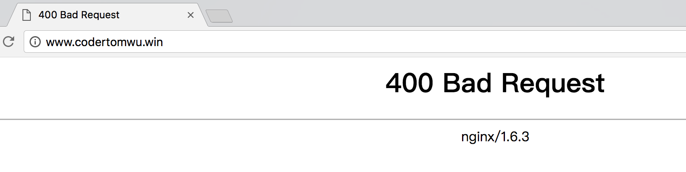
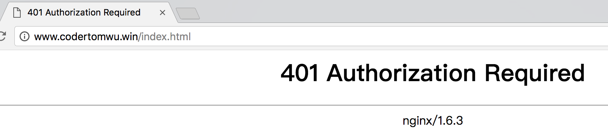
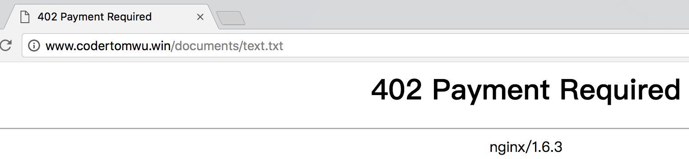
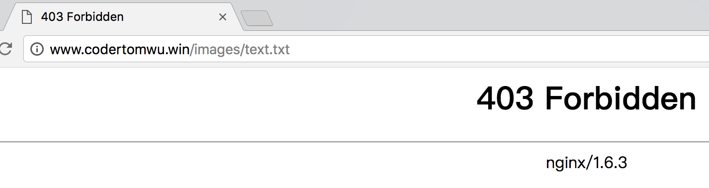
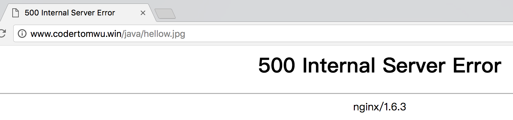
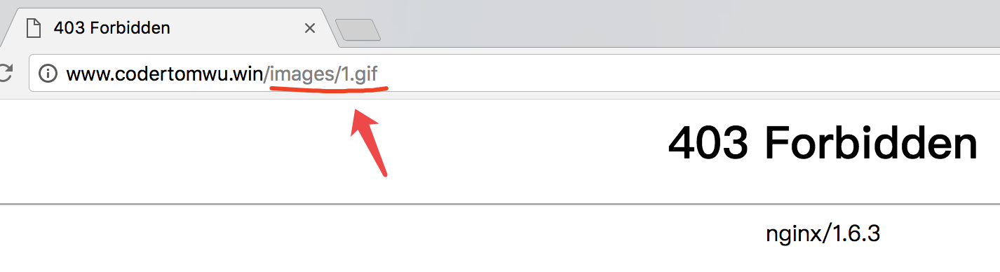
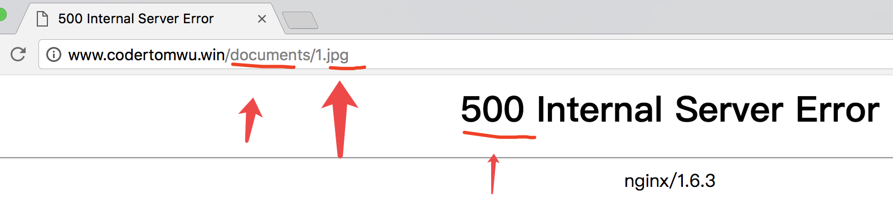

# location 的作用
location 指令的作用是可以根据用户请求的URI 来执行不同的应用，其实就是根据用户请求的网站的地址URL 匹配，匹配成功即进行相关的
操作。
 

```
location[=|~|~*|^~]uri{

...
}


```

location 就相当于if , if [..]uir, 然后执行{}


| location | [=,~,~*,^~,@]  | uri | {...} |
|---|---|---|---|
| 指令 | 匹配标识 | 匹配网站 | 匹配URI后要执行的配置段 |


语法列表说明
 上表是对location 语法的说明。上述语法中的URI 部分是关键，这个URI 可以是普通的
字符串地址路径或者是正则表达式，当匹配成功则执行后面大括号里面的相关指令。正则
表达式的前面还可以有~或~*等特殊的字符。


```
http://www.codertomwu.win/coderTom/

location /coderTom/{
	do something

}

'coderTom'是http://www.codertomwu.win后面的路径


```


'~' : 大小写敏感匹配

'*' : 不区分大小写匹配


'^~':  作用是在常规的字符串匹配检查之后，不做正则表达式的检查，即如果最明确的那个
字符串匹配的location 配置中有此前缀，那么不做正则表达式的检查。

'=': 精确匹配


```
// 精确匹配
location  =  /  {


  [  configuration  A  ]

}

location  /  {

  [  configuration  B  ]

}

location  /documents/  {

  [  configuration  C  ]

}


 # 匹配任何以 /images/ 开始的请求，并停止匹配 其它location


location  ^~  /images/  {

 

  [  configuration  D ]

}

location  ~*  \.(gif|jpg|jpeg)$  {

  # 匹配以 gif, jpg, or jpeg结尾的请求.

  # 但是所有 /images/ 目录的请求将由 [Configuration C]处理.  

  [  configuration  E ]

}


```


| 用户请求的URL | 完整的URL | 匹配的配置 |
|---|---|---|
| / | http://www.codertomwu.com/ | configuration A |
| /index.html | http://www.codertomwu.com/ | configuration B |
| /documents/document.html | http://www.codertomwu.com/documents/document.html | configuration C |
| /images/1.png | http://www.codertomwu.com/images/1.png | configuration D |
| /documents/1.jpg | http://www.codertomwu.com/documents/1.jpg | configuration E |


# 测试
```
worker_processes  1;


events {
    worker_connections  1024;
}

error_log logs/error.log error;

http {
    include       mime.types;
    default_type  application/octet-stream;
    sendfile        on;
    keepalive_timeout  65;


    server {

        listen  80;

        server_name wwww.codertomwu.win codertomwu.win;

	
	location = / {

 	   return 400;

	}

	location / {

  	   return 401;

	}

	location /documents/  {

  	   return 402;

	}


	location  ^~  /images/  {

 	   return 403;

	}

	location  ~*  \.(gif|jpg|jpeg)$  {

 	   return 500;

	}


 }


}

```


# 测试结果





















| 用户请求的URI | 设置的状态码 | 说明 |
|---|---|---|
| 当为空或/的时候 | 返回400, 即匹配了: location = / { return 400; }  | =是精确匹配优先级最高,无论放置的顺序如何都将优先被匹配井执行。 |
|  /index.html或任意不匹配其他location的字符串 | 返回401, 即匹配了: location / { return 401; } | /为默认匹配，即如果没有匹配上其它的location,则最后匹配“默认匹配”的部分。 |
| /documents/document.html | 返回402, 即匹配了: location /documents/  { return 402; } | 此部分为路径匹配，即匹配了路径/documents/, 注意后面的/documents/ntsl.jpg,没有匹配此处的locatiom,而是匹配了结尾的ntsl.jpg |
| /images/1.gif | 403, 即匹配了: location ^~  /images/  { return 403; } | 此部分为路径匹配，但是前面增加了特殊字符^~,所以优先匹配路径,而没有匹配结尾的1.gif. |

| /documents/1.jpg | ```  返回500, 匹配了location ~*  \.(gif|jpg|jpeg)$ { return 500; }   ``` | 此部分匹配了1.jpg,属于扩展名匹配，虽然有/documents/但还是匹配了扩展名。 |
|---|---|---|


| 不用URI及特殊字符组合匹配顺序 | 匹配说明 |
|---|---|
| 第一名:  location = / | 精确匹配 |
| 第二名: location ^~  /images/ | 匹配常規字符串，不做正则匹配检查。 |
| 第三名: ```  location ~*  \.(gif|jpg|jpeg)$  ``` | 正则匹配 |
| 第四名:  location /documents/  | 匹配常规字符串，如果有正则则优先匹配正则。 |
| 第五名: location / | 所有location都不能匹配后的默认匹配 |


