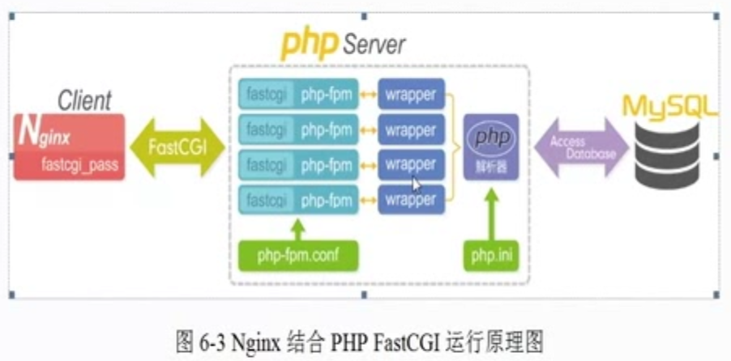

# 什么是CGI

CGI 的全称为“通用网关接口”(Common Gateway  Interface),为HTTP 服务器与其他
机器上的程序服务通信交流的一种工具，CGI 程序须运行在网络服务器上。

传统CGI接口方式的主要缺点是性能较差，因为每次HTTP 服务器遇到动态程序时都
需要通过重新启动解析器来执行解析，之后结果才会被返回给HTTP 服务器。这在处理高
并发访问时几乎是不可用的，因此就诞生了FastCGI。另外，传统的CGI 接口方式安全性
也很差，故而现在已经很少被使用了。

 #  什么是FastCGI

FastCGI 是一个可伸缩地、高速地在HTTP 服务器和动态脚本语言间通信的接口(在
Linux 下，FastCGI 接口即为socket,  这个socket 可以是文件socket,也可以是IP socket),
主要优点是把动态语言和HTTP服务器分离开来。多数流行的HTTP服务器都支持FastCGI,
包括Apache、Nginx 和Ligttpd 等。
同时，FastCGI 也被许多脚本语言所支持，比较流行的脚本语言之一为PHP。FastCGI
接口采用的是C/S架构，它可以将HTTP 服务器和脚本解析服务器分开，同时还能在脚本
解析服务器上启动一个或多个脚本来解析守护进程。当HTTP 服务器遇到动态程序时，可
以将其直接交付给FastCGI进程来执行，然后将得到的结果返回给浏览器。这种方式可以
让HTTP 服务器专一地处理静态请求，或者将动态脚本服务器的结果返回给客户端，这在
很大程度上提高了整个应用系统的性能。

Nginx不支持对外部动态程序的直接调用或者解析，所有的外部程序(包括PHP) 必
须通过FastCGI接口来调用。FastCGI接口在Limux 下是socket,为了调用CGI 程序，还需
要一个FastCGI 的wrapper (可以理解为用于启动另一个程序的程序)，这个wrapper绑定
在某个固定的socket 上，如端口或文件socket.当Nginx 将CGI 请求发送给这个socket 的
时候，通过FastCGI接口,wrapper接收到请求，然后派生出一个新的线程，这个线程调用
解释器或外部程序处理脚本来读取返回的数据;接着,wrapper再将返回的数据通过FastCGI
接口,沿着固定的socket 传递给Ngimx: 最后，Nginx将返回的数据发送给客户端，这就是
Nginx+FastCGI 的整个运作过程。

