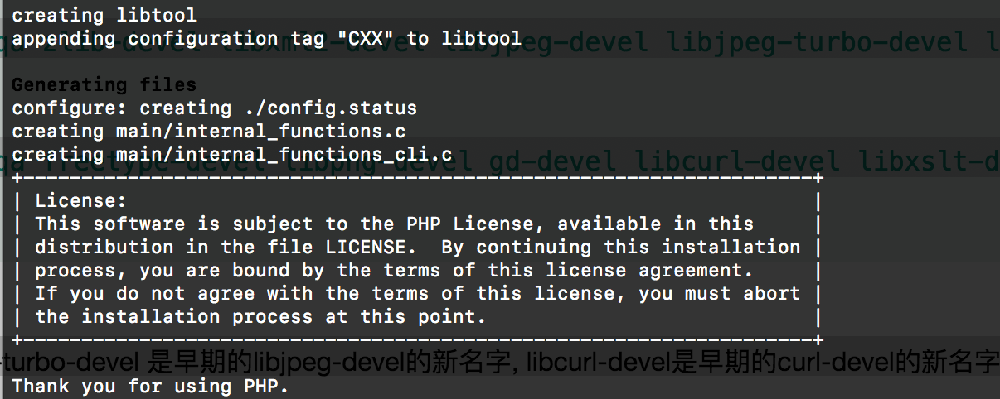

# 1. PHP是一门语言, 光有它还不够, 还需要安装一些库

```

rpm -qa zlib-devel libxml2-devel libjpeg-devel libjpeg-turbo-devel libiconv-devel


rpm -qa freetype-devel libpng-devel gd-devel libcurl-devel libxslt-devel

```

libjpeg-turbo-devel 是早期的libjpeg-devel的新名字, libcurl-devel是早期的curl-devel的新名字.


```
rpm -qa zlib-devel libxml2-devel libjpeg-devel libjpeg-turbo-devel libiconv-devel

zlib-devel-1.2.7-17.el7.x86_64


rpm -qa freetype-devel libpng-devel gd-devel libcurl-devel libxslt-devel
// 啥都毛

```


# 2.装包

```

yum install zlib-devel libxml2-devel libjpeg-devel libjpeg-turbo-devel libiconv-devel -y


yum install freetype-devel libpng-devel gd-devel libcurl-devel libxslt-devel -y


```
libiconv-devel : 是没有的, 以后我们自己打个包放到我们自己的yum源里


 # 3.centOS7手工装libiconv-devel

http://www.gnu.org/software/libiconv/
https://ftp.gnu.org/pub/gnu/libiconv/

```

mkdir -p /home/wt/tools
cd /home/wt/tools
wget https://ftp.gnu.org/pub/gnu/libiconv/libiconv-1.14.tar.gz
tar zxf libiconv-1.14.tar.gz
cd libiconv-1.14
./configure --prefix=/usr/local/libiconv


cd /wt/tools/libiconv-1.14/srclib
/*
编辑stdio.in.h

//搜索
/_GL_WARN_ON_USE (gets, "gets is a security hole - use fgets instead")


// 搜索到了注释它,然后加三句在它后面
#if defined(__GLIBC__) && !defined(__UCLIBC__) && !__GLIBC_PREREQ(2, 16)

 _GL_WARN_ON_USE (gets, "gets is a security hole - use fgets instead");

#endif


*/
vim stdio.in.h


make
make install
```


# 安装 libmcrypt-devel

装epel源

```

wget -O /etc/yum.repos.d/epel.repo http://mirrors.aliyun.com/repo/epel-7.repo


yum -y install libmcrypt-devel
```


# 安装mhash

```

yum -y install mhash

```

yum install mhash mcrypt -y
# 安装mcrypt

```

yum -y install mcrypt

```


# 检查一下PHP的相关扩展库

```


rpm -qa libmcrypt-devel mhash mcrypt
   

```
# 解压

```

cd /xxx/tools

tar xf php-5.5.32.tar.gz


```


# PHP编译(5.5.32)

```

./configure \
prefix=/application/php5.5.32 \
--with-mysql=/application/mysql/ \
--with-pdo-mysql=mysqlnd \
--with-iconv-dir=/usr/local/libiconv \
--with-freetype-dir \
--with-jpeg-dir \
--with-png-dir \
--with-zlib \
--with-libxml-dir=/usr \
--enable-xml \
--disable-rpath \
--enable-bcmath \
--enable-shmop \
--enable-sysvsem \
--enable-inline-optimization \
--enable-mbregex \
--with-curl \
--enable-fpm \
--enable-mbstring \
--with-mcrypt \
--with-gd \
--enable-gd-native-ttf \
--with-openssl \
--with-mhash \
--enable-pcntl \
--enable-sockets \
--with-xmlrpc \
--enable-soap \
--enable-short-tags \
--enable-static \
--with-xsl \
--with-fpm-user=www \
--with-fpm-group=www \
--enable-ftp \
--enable-opcahe=no
```

看到下面这图就算编译成功




# 做个链接

```

ln  -s /application/mysql/lib/libmysqlclient.so.18 /usr/lib64/


```


# 如果报什么共享库错误, 就去find , 然后放到


find  这句话"error while loading shared libraries:" 后面的文件, 

```


error while loading shared libraries: libmysqlclient.so.18: cannot open ......

```


find / -type f -name "libmysqlclient.so*"

找到所在文件夹,然后把文件夹放到, /etc/ld.so.conf 

```

vim /etc/ld.so.conf

// 放进去了后ldconfig生效
ldconfig

```

# 防止报找不到phar.phar错

```

cd /wt/tools/php-5.5.32/ext/phar
touch phar.phar
```


# make -j (有多核CPU的话更快)

```

make

```

# make install
 

```
[PEAR] Structures_Graph- installed: 1.1.1

[PEAR] XML_Util  - installed: 1.3.0

[PEAR] PEAR  - installed: 1.10.1

Wrote PEAR system config file at: /application/php5.5.32/etc/pear.conf

You may want to add: /application/php5.5.32/lib/php to your php.ini include_path

/wt/tools/php-5.5.32/build/shtool install -c ext/phar/phar.phar /application/php5.5.32/bin

ln -s -f phar.phar /application/php5.5.32/bin/phar

Installing PDO headers: /application/php5.5.32/include/php/ext/pdo/

```


# ln -s /application/php5.5.32/ /application/php


# cp php.ini-production /application/php/lib/php.ini


# cd /application/php/etc/

```

/**
配置进程数量啊个数啊
超时时间啊
*/
php-fpm.conf.default


cp php-fpm.conf.default php-fpm.conf

```

# cp php-fpm.conf.default php-fpm.conf


# /application/php/sbin/php-fpm (启动PHP)