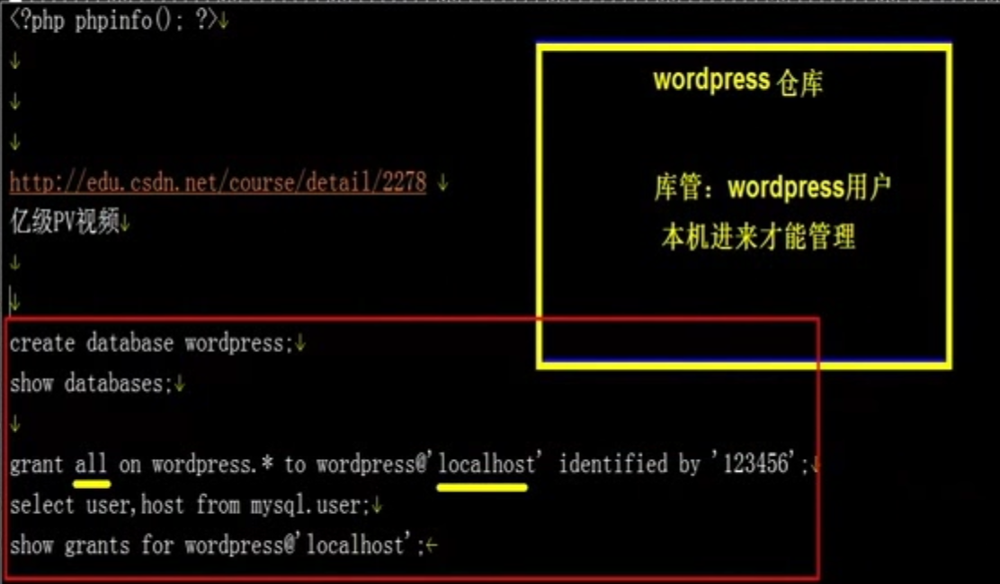

# 登录MySQL建个表

```
mysql -uroot -p

show databases;
+--------------------+

| Database  |

+--------------------+

| information_schema |

| mysql |

| performance_schema |

| test  |

+--------------------+

4 rows in set (0.01 sec)


// 把没用的干掉

drop database test;


// 创建一个数据库
create database wordpress;


// 查看MySQL下面有哪些用户
select user,host from mysql.user;

ERROR 2006 (HY000): MySQL server has gone away

No connection. Trying to reconnect...

Connection id: 1

Current database: *** NONE ***

+------+--------------------+

| user | host  |

+------+--------------------+

| root | 127.0.0.1 |

| root | ::1 |

| | xxxx |

| root | x |xxx

| | localhost |

| root | localhost |

+------+--------------------+

6 rows in set (0.01 sec)


// 为wordpress添加用户
grant all on wordpress.* to wordpress@'localhost' identified by '123456';
select user,host from mysql.user;

// 查看用户的权限
show grants for wordpress@'localhost'; 


// 刷新让权限生效
flush privileges;
```



# MySQL命令

```
// 删除数据库
drop database test;

// 创建数据库
create database wordpress;

// 展示数据库
show databases;

// 展示当前用户
select user();
system whoami

// 查看MySQL下面有哪些用户
select user,host from mysql.user;

/**
授权所有 给某个用户  
grant 表示授权
all 所有权限
*.*(第一个是所有库, 第二*是所有表)

wordpress 哪个用户
localhost 哪个主机名可以访问, 这个就是只有本机能访问

*/ 
grant all on wordpress.* to wordpress@'localhost' identified by '123456';
grant all on *.* to wordpress@'localhost' identified by '123456';


// 删除用户
drop user wordpress@'localhost';


// 查看用户的权限
show grants for wordpress@'localhost'; 


// 进入某个表 cd 到里面去
use wordpress;

// 看表的内容
show tables;
```


# 调整Nginx + PHP

把blog.conf改成如下
```
vim  /application/nginx/conf/extra/blog.conf


server {

 listen 80;

 server_name blog.codertomwu.win;

 location / {

 root html/blog;

 index index.php index.html index.htm;

 }

 location ~ .*\.(php|php5)?$ {

 root  html/blog;

 fastcgi_pass  127.0.0.1:9000;

 fastcgi_index index.php;

 include fastcgi.conf;

 }

}

```

# https://cn.wordpress.org


#  下载wordpress

```
cd /xxx/tools

wget https://cn.wordpress.org/wordpress-4.9.1-zh_CN.tar.gz


```


# 解压

```

tar xf wordpress-4.9.1-zh_CN.tar.gz

```


# 拷贝到blog下面去

```

 cp -a wordpress/* /application/nginx/html/blog

```


# 给个权限后面再改

```

chown -R www.www /application/nginx/html/blog/


```


# 重启Nginx

```

/application/nginx/sbin/nginx -t
/application/nginx/sbin/nginx -s reload


```


# 伪静态


控制台------>设置------>固定链接----->自定义结构

```

/content/%post_id%.html

```


服务器
```


```