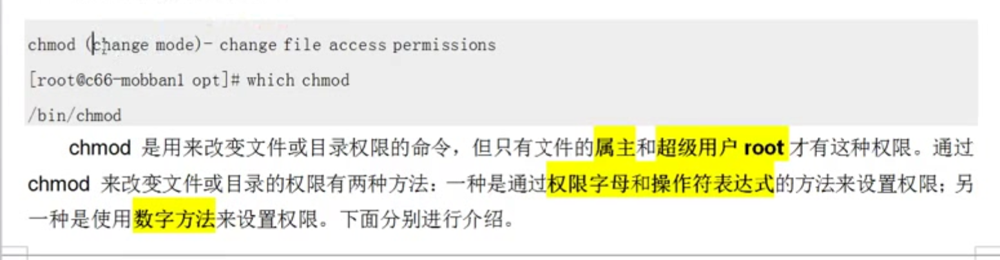

# 
```

创建用户, 创建组
让用户数组我们创建的组


 groupadd incahome
useradd oveSt -g incahome

// 删除用户
userdel -r oveSt
```
-------


#  chmod



-------------
```
改变文件权限有字母和数字
我们常用数字

chmod 715 test

```
------------- 字符改变版

```


```


# 

-------------
```

```

# 

-------------
```

```


