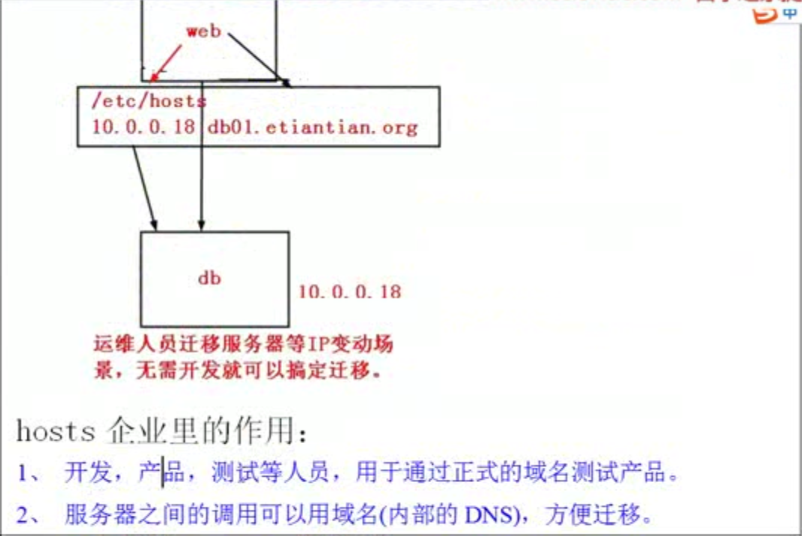
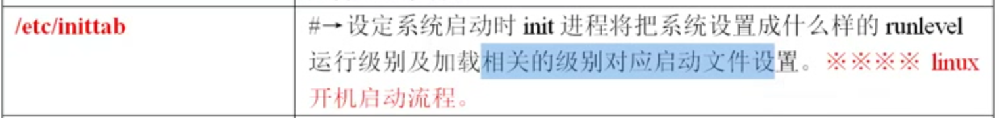

[重要子目录牛逼的总结](http://yangrong.blog.51cto.com/6945369/1288072)


# 网卡的配置文件 2017年11月18日22:31:17

```

cat /etc/sysconfig/network-scripts/ifcfg-eth0


BOOTPROTO=none

DEFROUTE=yes

DEVICE=eth0           // 物理设备名, eth0 表示第一块网卡

GATEWAY=128.99.18.1     // 网关,路由器的地址

HWADDR=0l:60:19:h5:4e:93       // mac地址

IPADDR=220.109.77.100

ONBOOT=yes     // 控制 网卡是不是开机启动

TYPE=Ethernet    // 以太网

USERCTL=no

NETMASK=255.255.255.0  // 子网掩码

DNS2=8.8.8.8
```


```

对网卡配置文件修改后,生效命令

// 因为别的网卡可能在提供服务
/etc/init.d/network restart     //  这个是重启所有网卡, 生产环境不能这么高

你修改ifcfg-eth0 就生效ifcfg-eth0就行了.....


```


```
看看当前与本机连接的ip netstat -an|grep 128 


```


```

// 本地 的客户端DNS的配置文件,.......

cat /etc/resolv.conf

```




```

/etc/hosts     // 机房局域网内使用的DNS

// 优先互联网上的DNS

// 我要买个DNS我就可以恶心其他网站
// 要做反解


机房之间的调用用hosts比比较好
```


------------------------------------------------------------------------------------
# 改名2017年11月19日00:48:32

```
配置主机名的目录
修改主机名
cat /etc/sysconfig/network

NETWORKING=yes


NOZEROCONF=yes

```


------------------------------------------------------------------------------------

# 实现要挂载的文件系统 /etc/fstab

```
2017年11月19日00:58:31

cat /etc/fstab

就是开机帮你把磁盘挂上

```

------------------------------------------------------------------------------------


# cat /etc/rc.local         

```
 让一个软件跟着系统开机一起起来.......

```


------------------------------------------------------------------------------------

# /etc/inittab

```

开机的时候把系统设置成什么样的级别
```

------------------------------------------------------------------------------------
#  cat /etc/issue
```
登录的提示
```

------------------------------------------------------------------------------------
# /etc/motd
```
echo "回来了,辛苦啦,么么么哒~" >/etc/motd
```

------------------------------------------------------------------------------------
# /etc/redhat-release 

```
cat /etc/redhat-release 

CentOS Linux release 10.9.1708 (Core)
```


------------------------------------------------------------------------------------
#  /usr/local/   ----->咱们通过源码编译的软件

```
ls /usr/local/

bin  etc  games  include  lib  lib64  libexec  sbin  share  src

```

------------------------------------------------------------------------------------

#  /usr/src/

```

有时我们上传软件,放在服务器什么位置......就搁着了~

ls /usr/src/

debug  kernels

```


------------------------------------------------------------------------------------
# ls /var/log/mess*

```
系统日志啥的


 dmesg也可以看
```


------------------------------------------------------------------------------------

# cat /var/log/secure
```

// 系统登录信息记录


// 看看最近10条登录???

tail -10 /var/log/secure

```


------------------------------------------------------------------------------------

# cat /proc/version
```

cat /proc/version

cat /proc/cpuinfo

cat /proc/meminfo  // 内存

cat /proc/loadavg   // 负载, 性能状况
0.00 0.01 0.05 2/97 9116

```


------------------------------------------------------------------------------------
#  子目录小结 2017年11月19日12:05:52
```

/etc/sysconfig/network-scripts/ifcfg-eth0     // 网卡配置文件

cat /etc/resolv.conf  // 本地局域网DNS, 但是还是网卡的比较优先DNS-------

cat /etc/hosts      // 本地的主机名, 解析相关, 如果是window电脑在这里修改,可以吧www.baidu.com指向自己

cat /etc/sysconfig/network // 主机名, 也可以陪网关

cat /etc/fstab    // 开机磁盘自动挂载 6列

cat /etc/rc.local    // 一开机和机器一起启动的软件,写在这路...启动命令放在这了

cat /etc/inittab    // 开机的时候设置运行级别, 加载相应级别的脚本

ls /etc/init.d/     // 我们使用yum 安装的软件,默认的启动命令

cat /etc/profile   // 全局的环境变量配置文件

ls /usr/local/     // 默认的软件安装目录

ls /usr/src        // 源码安装目录

ls /var/log/mes*   // 系统日志

cat /var/log/secure   // 安全日志

cd /var/spool/cron/root

cat /proc/cpuinfo// cpu
cat /proc/meminfo// 内存
 cat /proc/loadavg // 负载
 cat /proc/mounts// 挂载
```


------------------------------------------------------------------------------------
# 
```
环境变量集合

cat ~/.bashrc          // 局部的, 只针对当前用户
cat /etc/profile       // 所有用户
cat /etc/bashrc		   // 所有用户
```


------------------------------------------------------------------------------------
# 
```


```
