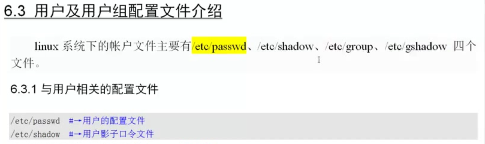
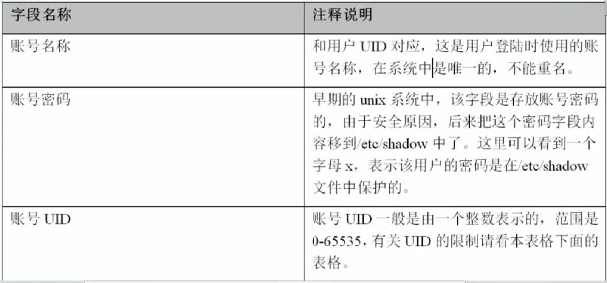
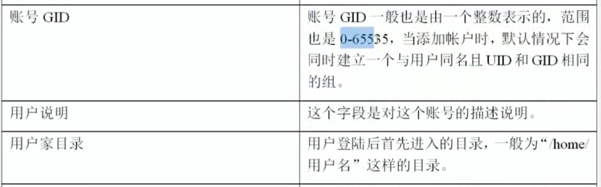
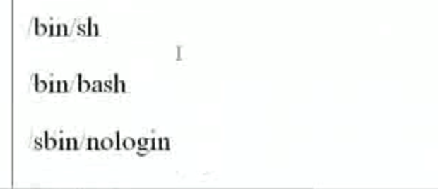
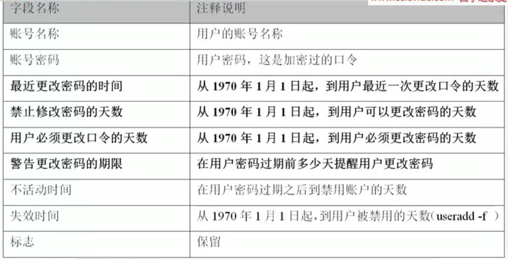

```

创建一个用户会创建下面四个


 useradd shuT


tail -l /etc/passwd
tail -l /etc/shadow
tail -l /etc/group
tail -l /etc/gshadow
```


# 密码文件有7列,每个的意思这里有.,








#  /etc/shadow




# 小结


```

1. useradd 添加用户会改  /etc/passwd   /etc/shadow   /etc/group   /etc/gshadow 4个文件

2. password 为用户设置密码会改  /etc/shadow

```


