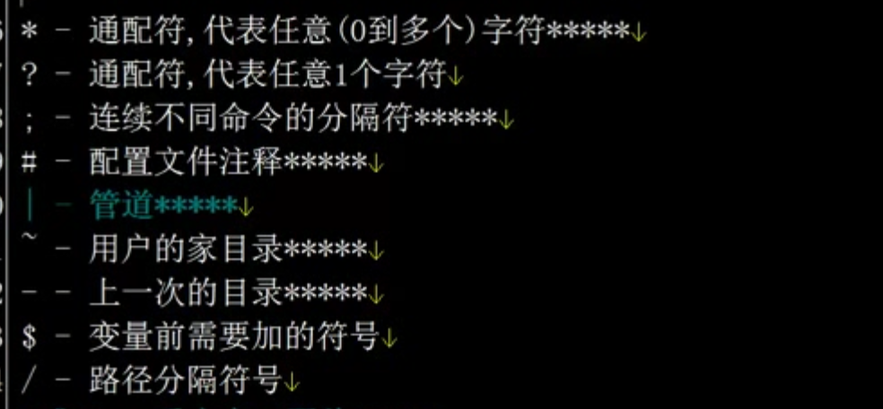
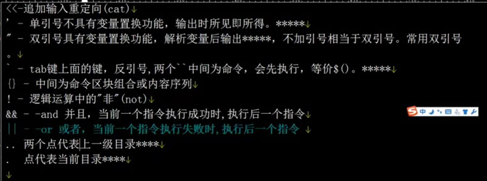

```

创建一个用户会创建下面四个


 useradd shuT


tail -l /etc/passwd
tail -l /etc/shadow
tail -l /etc/group
tail -l /etc/gshadow
```


# 密码文件有7列,每个的意思这里有.,


#  /etc/shadow


# 小结


```

1. useradd 添加用户会改  /etc/passwd   /etc/shadow   /etc/group   /etc/gshadow 4个文件

2. password 为用户设置密码会改  /etc/shadow

```


# 通配符





```

* - 代表所有
? - 通配符, 代表任意1个字符
; - 连续不不同的命令的分隔符    // pwd;pwd
# - 配置文件注释
| 管道
~ 用户家目录
- 上一次的目录
$ 变量前需要加的符号
/ 路径分隔符号

```


