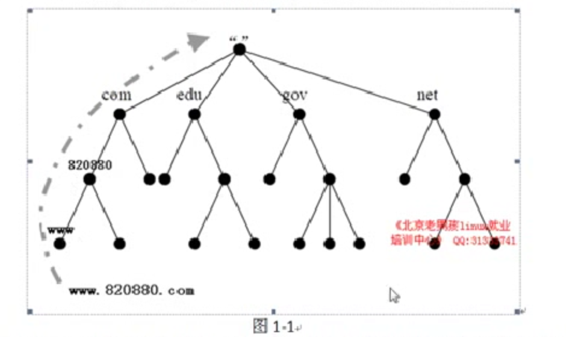

#  DNS 概念

```

DNS (Domain Name system)


A 记录  www.baidu.com  ---->> 1.1.1.1
CNAME  别名------>常被CDN 服务商应用

MX解析记录  30452342@qq.com , @qq.com就是MX记录,  将来我搭建邮件服务器的时候就要搞这个MX记录


PTR 反向解析   1.1.1.1 ------> www.baidu.com   用得多的就是邮件服务

```


# DNS解析流程原理 (必会)

```


```




# 根

```

全球13台根服务器

```

# 顶级域名


```
com, me, net, cc

````

# 一级域名

```

baidu, google, cctv

```

# 主机  

```

www.baidu.com
```


DNS 解析流程
DNS 解析过程


