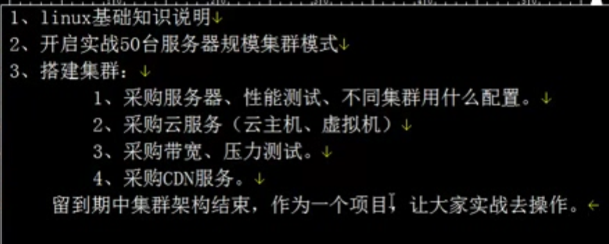
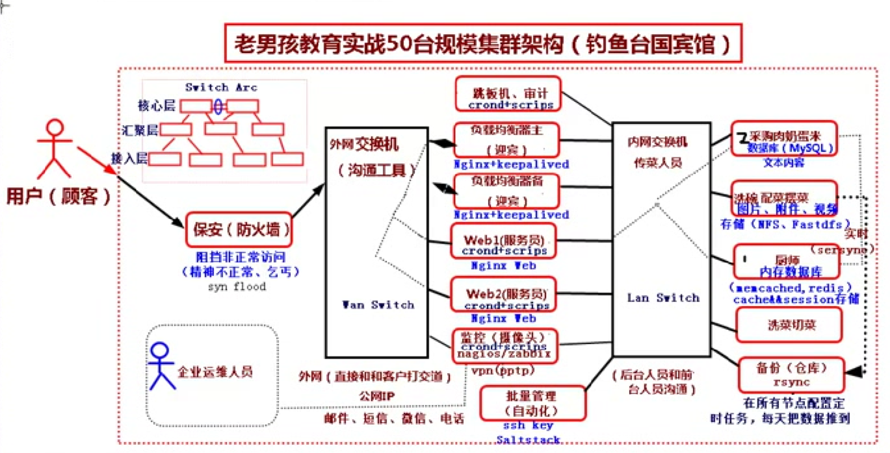
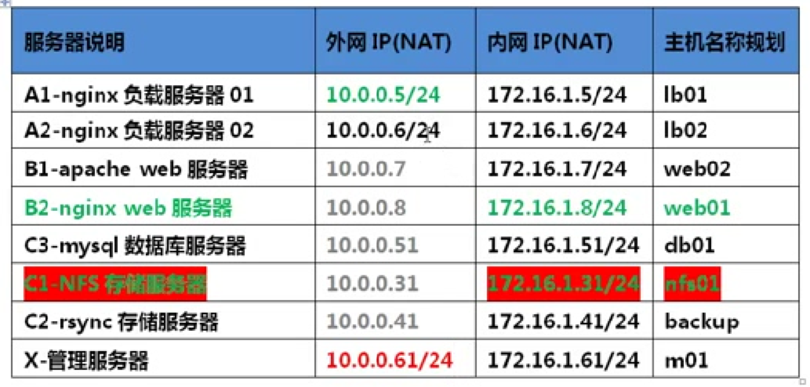
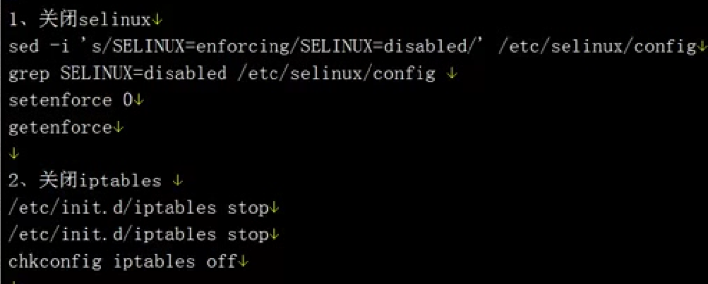
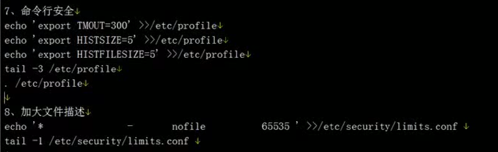
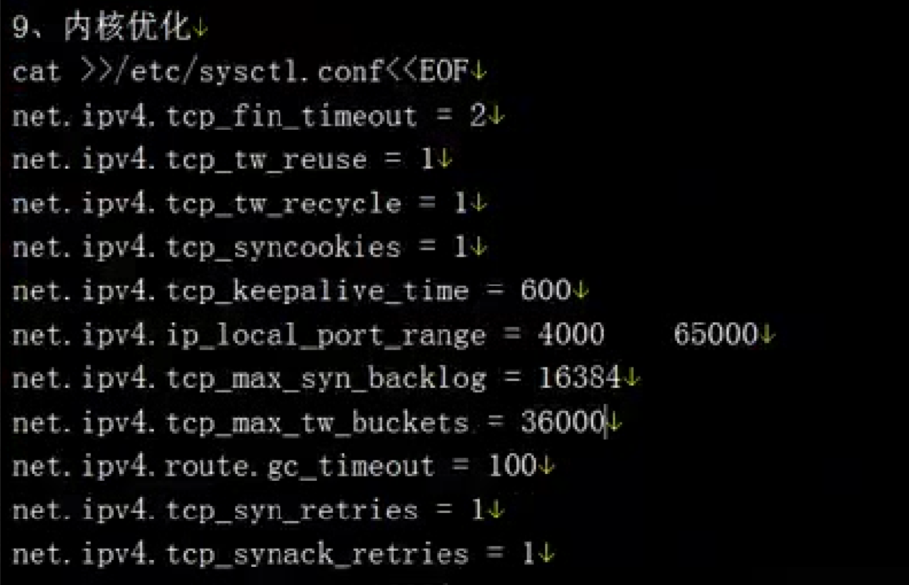
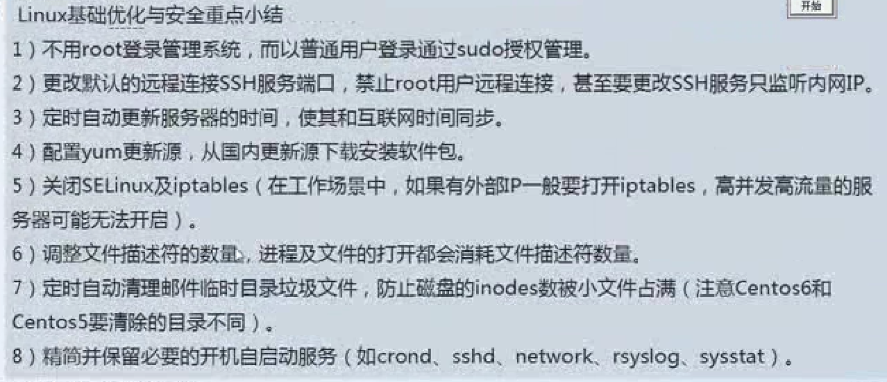

| 服务器说明 | 数量 | 名称规划 |
|---|---|---|
| 负载均衡服务器(迎宾) 			| 两台 | 对访问网站的流量进行分流,减少流量对某台服务器的压力 |
| web服务器(服务员) 				| 两台 | 处理用户页面访问请求(Nginx, Apache) |
| NFS存储(兼职批量管理) 		| 一台 | 存储图片 附件 头像等静态数据 |
| 备份服务器(rsync) 					| 一台 | 对全网服务器数据,进行实施与定时备份 |
| 数据库服务器(MySQL)			| 一台 | 对动态变化数据进行存储(文本内容) |
| 管理服务器 							| 一台 | 作为yum创库服务器, 提供全网服务器的软件下载,    跳板机,操作审计 vpn(pptp) |
| 说明: 总计需要服务器8台, 完成 |  |  |

