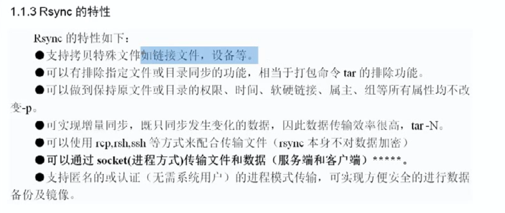
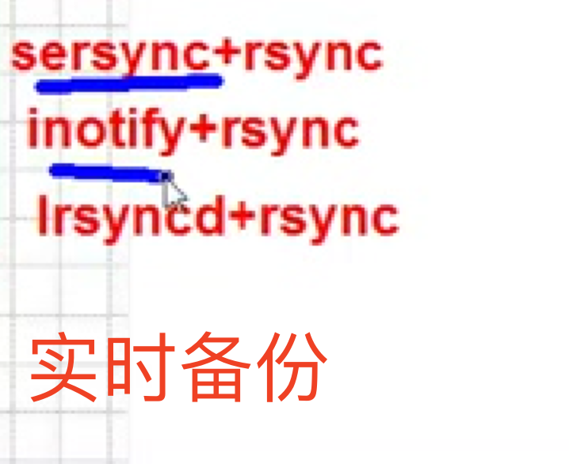
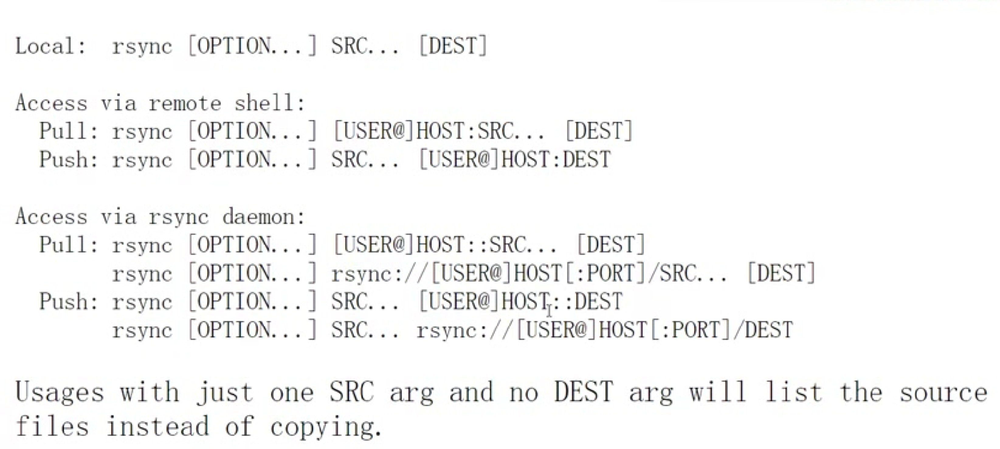
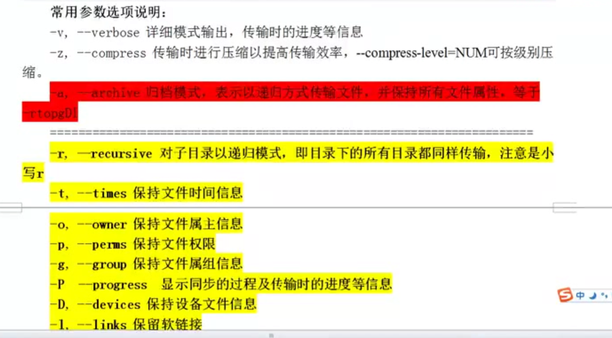
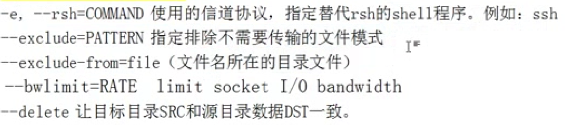

# rsync 特性




# 实时备份



# 关于rsync的项目(运维简历上可以写)


# rsync 三种工作方式





# rsync -vzrtopg wwo.txt /tmp  ------相当于copy

```
rsync -vzrtopg wwo.txt /tmp 

sending incremental file list

wwo.txt

sent 167 bytes received 31 bytes 396.00 bytes/sec

total size is 228 speedup is 1.15


-v是答应过程好像

```


# rsync  参数







# rsync 不带/拷贝只拷贝文件夹下的文件


# rsync -avz /Users/XXX/Desktop/Test/1rsync -e 'ssh -p 22' root@109.29.33.16:/wt/dir3


# vim /etc/ssh/sshd_config

```

( GSSAPIAuthentication 改为NO加 UseDNS no   速度就快了?)
vim /etc/ssh/sshd_config


78 # GSSAPI options

79 GSSAPIAuthentication  yes

80 GSSAPICleanupCredentials  no

81 #GSSAPIStrictAcceptorCheck yes

82 #GSSAPIKeyExchange no

83 #GSSAPIEnablek5users no


#ShowPatchLevel no

#UseDNS yes

#PidFile /var/run/sshd.pid

#MaxStartups 10:30:100

```


# =======================================重要知识分界线

# 服务就是daemon


# daemon 是配在备份服务器上的.


# cat /etc/rsyncd.conf

```

cat /etc/rsyncd.conf   

# /etc/rsyncd: configuration file for rsync daemon mode

# See rsyncd.conf man page for more options.

# configuration example:

# uid = nobody

# gid = nobody

# use chroot = yes

# max connections = 4

# pid file = /var/run/rsyncd.pid

# exclude = lost+found/

# transfer logging = yes

# timeout = 900

# ignore nonreadable = yes

# dont compress  = *.gz *.tgz *.zip *.z *.Z *.rpm *.deb *.bz2

# [ftp]

# path = /home/ftp
 
# comment = ftp export area


````


// 解释说明

***uid = rsync***    // 用户, 远端的命令使用rsync访问共享目录
***gid = rsync***  // 用户组
***use chroot = no***  // 安全相关
***max connections = 200***   // 最大连接数
***timeout = 300***   // 超时时间
***pid file = /var/run/rsyncd.pid***   // 进程对应的进程号文件
***lock file = /var/log/rsync.log***    // 锁文件
***log file = /var/log/rsyncd.log***   // 日志文件  出错
***[backup]***  // 模块名称
***path = /backup***   // 服务器提供访问的目录
***ignore errors***    // 忽略错误
***read only = false***      // 可写
***list = false***   // 不能列表  不能ls啥的~

hosts allow = xx.xx.xx.xx // 允许哪些机器过来连
hosts deny = 0.0.0.0/32  // 拒绝哪些机器过来连,  0.0.0.0/32 表示谁都可以过来 
auth users = rsync_backup    //虚拟用户,   独立于系统用户以外的虚拟用户 , 和系统账号没什么关系
secrets file = /ect/rsync.password  // 虚拟用户的密码, 虚拟账户对应的账号和密码 

```

vim /etc/rsyncd.conf 

uid = rsync
gid = rsync
use chroot = no
max connections = 4
timeout = 300
pid file = /var/run/rsyncd.pid
lock file = /var/run/rsync.lock
log file = /var/log/rsyncd.log
[backup]
path = /backup
ignore errors
read only = false
list = false


hosts allow = 16.3.11.11/24
hosts deny = 0.0.0.0/32
auth users = rsync_backup
secrets file = /ect/rsync.password
```


# 'rsync' 用户不存在


```
id rsync

id: rsync: no such user


useradd rsync -s /sbin/nologin -M  // 创建一个不需要登录, 没有家目录的虚拟用户

useradd rsync -s /sbin/nologin -M

 **~sync**  [05:11:58]

**root$** tail -1 /etc/passwd

rsync:x:1004:1005::/home/rsync:/sbin/nologin


```


# rsync --daemon (rsync 启动服务)


# 怎么看启动服务

```
ps -ef|grep rsync|grep -v grep

root  21918  1 0 17:13 ? 00:00:00 rsync --daemon

```


# 创建backup目录

```
mkdir /backup

```


# 改backup权限

```
chown rsync.rsync /backup/

```


# 创建 rsync.password

```

vim /etc/rsync.password

chmod 600 /etc/rsync.password

ls /etc/rsync.password -l
```


# lsof -i :873


# 客户端配置密码文件就OK了

```

vim /etc/rsync.password


// 创建backup目录
mkdir -p backup


// 创建100个文件
touch stu{01..100}


// 推文件了.......
rsync -avz /backup/ rsync_backup@101.129.177.156::backup/ --password-file=/etc/rsync.password


rsync -avz /backup/shutingY rsync_backup@122.90.77.65::backup/ --password-file=/etc/rsync.password


rsync -avz /Users/codew/Desktop/netTest rsync_backup@122.90.77.65::backup/


rsync -avz /backup/sss rsync_backup@122.90.77.65::backup/ --password-file=/etc/rsync.password

```


# 遇到的问题1 (skipping directory)

```

# rsync /backup/wtKKK/ rsync_backup@122.90.77.65::backup/

skipping directory .

```
### 解决办法加个-r参数

```


```


# ERROR: The remote path must start with a module name not a /
## 解决办法

```
去掉::后面的/
rsync -avzr /backup/wtKKK/ rsync_backup@19.99.17.156::/backup/ --password-file=/etc/rsync.password


如下:
rsync -avzr /backup/wtKKK/ rsync_backup@19.99.17.156::backup/ --password-file=/etc/rsync.password
```


# ERROR: auth failed on module Xxxxx

## 解决办法
```

1. 看看那你客户端密码是不是对的?


```


# ERROR: Unknown module 'xxxxxx'

## 解决办法
```

在服务器端添加客户端IP

```

# ERROR: chdir failed (服务端没得文件夹......, 找不着服务端的目录)

## 解决办法

```


创建你目录呗还能咋地~

```


# rsync error: some files/attrs were not transferred (see previous errors) (code 23) at main.c(1183) [sender=3.1.1]

# 创建了目录但是你没给文件夹授权

```


rsync -avz /backup/ rsync_backup@89.10.77.46::backup/ --password-file=/etc/rsync.password 

sending incremental file list

./

rsync: failed to set times on "." (in backup): Operation not permitted (1)

ccvt1.com

ccvt10.com

ccvt11.com

ccvt12.com

ccvt13.com

ccvt14.com

ccvt15.com

ccvt16.com

ccvt17.com

ccvt18.com

ccvt19.com

ccvt2.com

ccvt20.com

ccvt3.com

ccvt4.com

ccvt5.com

ccvt6.com

ccvt7.com

ccvt8.com

ccvt9.com

rsync: mkstemp ".ccvt1.com.ej7cTk" (in backup) failed: Permission denied (13)

rsync: mkstemp ".ccvt10.com.XXMpMn" (in backup) failed: Permission denied (13)

rsync: mkstemp ".ccvt11.com.ikKCFq" (in backup) failed: Permission denied (13)

rsync: mkstemp ".ccvt12.com.DKCQyt" (in backup) failed: Permission denied (13)

rsync: mkstemp ".ccvt13.com.UCJ4rw" (in backup) failed: Permission denied (13)

rsync: mkstemp ".ccvt14.com.j9Djlz" (in backup) failed: Permission denied (13)

rsync: mkstemp ".ccvt15.com.sRXzeC" (in backup) failed: Permission denied (13)

rsync: mkstemp ".ccvt16.com.TM4Q7E" (in backup) failed: Permission denied (13)

rsync: mkstemp ".ccvt17.com.wsv90H" (in backup) failed: Permission denied (13)

rsync: mkstemp ".ccvt18.com.99HtUK" (in backup) failed: Permission denied (13)

rsync: mkstemp ".ccvt19.com.iyDONN" (in backup) failed: Permission denied (13)

rsync: mkstemp ".ccvt2.com.TUfaHQ" (in backup) failed: Permission denied (13)

rsync: mkstemp ".ccvt20.com.kgoxAT" (in backup) failed: Permission denied (13)

rsync: mkstemp ".ccvt3.com.FC3UtW" (in backup) failed: Permission denied (13)

rsync: mkstemp ".ccvt4.com.Ur3inZ" (in backup) failed: Permission denied (13)

rsync: mkstemp ".ccvt5.com.x5CHg2" (in backup) failed: Permission denied (13)

rsync: mkstemp ".ccvt6.com.A6D794" (in backup) failed: Permission denied (13)

rsync: mkstemp ".ccvt7.com.XDDA37" (in backup) failed: Permission denied (13)

rsync: mkstemp ".ccvt8.com.MjU5Wa" (in backup) failed: Permission denied (13)

rsync: mkstemp ".ccvt9.com.hFtFQd" (in backup) failed: Permission denied (13)

sent 996 bytes received 2,132 bytes 893.71 bytes/sec

total size is 0 speedup is 0.00

rsync error: some files/attrs were not transferred (see previous errors) (code 23) at main.c(1183) [sender=3.1.1]


```
## 解决办法

```

对文件夹授权你啊还能咋整

chown rsync.rsync /backup/

rsyncd.conf
uid = rsync
gid = rsync

```


# 修改了rsync的配置文件后我们要重启

```

// 先杀死
pkill rsync

// 看看是不是真的杀死了
lsof -i :873

// 重启
rsync --daemon

// 再看看是不是起来了
lsof -i :873


```


# rm -fr /xxxx/删除文件夹


# tail -4 /var/log/rsyncd.log (看rsync 的日志) 


# 多模块开始================================


可以不同模块不同密码


# 先来个备份

```

cp /etc/rsyncd.conf{,.bak}


```


# 修改rsyncd.conf (为其添加如下)
```

[coderTom]
path = /coderTom
ignore errors
read only = false
list = false
hosts allow = 62.43.64.1/24
#hosts deny = 0.0.0.0/32
#auth users = rsync_backup
#secrets file = /ect/rsync.password


cat >>/etc/rsyncd.conf<<EOF

[coderTom]

path = /coderTom

ignore errors

read only = false

list = false

hosts allow = 12.23.14.8/24

#hosts deny = 0.0.0.0/32

#auth users = rsync_backup

#secrets file = /ect/rsync.password

EOF

```


# 多模块样板

```
 

vim /etc/rsyncd.conf 

uid = rsync
gid = rsync
use chroot = no
max connections = 4
timeout = 300
pid file = /var/run/rsyncd.pid
lock file = /var/run/rsync.lock
log file = /var/log/rsyncd.log
ignore errors
read only = false
list = false
hosts allow = 16.3.11.11
#hosts deny = 0.0.0.0/32
auth users = rsync_backup
secrets file = /ect/rsync.password

[backup]
path = /backup
[coderTom]
path = /coderTom
[oveLT]
path = /oveLT

```


#  排除同步 (常见的是客户端排除,客户端指定)

# 排除单个文件 (结果没有a)

## rsync -avz --exclude=a  /backup/ rsync_backup@22.90.17.56::backup/ --password-file=/etc/rsync.password

## rsync -avz --exclude={a..d}  /backup/ rsync_backup@22.90.17.56::backup/ --password-file=/etc/rsync.password


```


```


# 无差异同步
### xxx文件有啥 服务端那边就有啥, xxx有的服务端有要删除...

```

rsync -avz --delete /xxxx/ rsync_backup@128.199.177.156::backup/

```