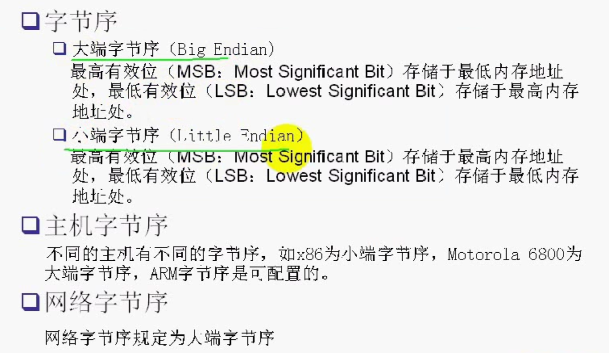
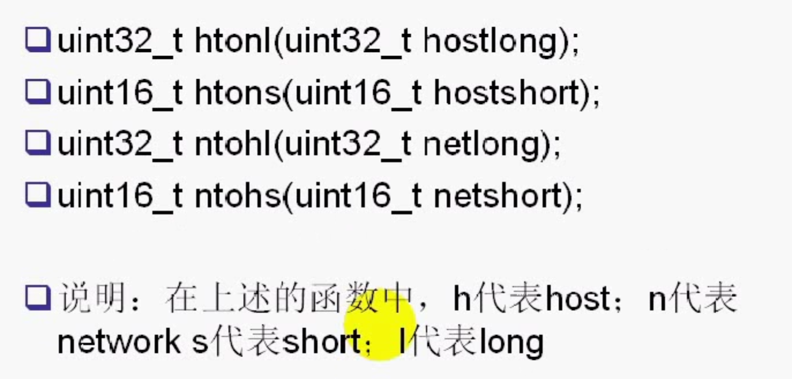
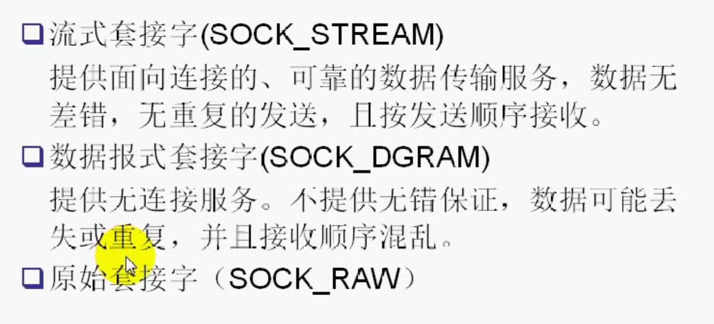

0X12345678

----------------------->内存地址增长方向

大端字节序: 12 34 56 78

小端字节序: 78 56 34 12

网络字节序是大端字节序




字节序测试代码

```

// MAC是小端, 苹果手机也是小端
#import <Foundation/Foundation.h>
#include <stdio.h>
#include <arpa/inet.h>
int main(int argc, const char * argv[]) {

  unsigned  int x = 0x12345678;

  unsigned  char *p = (unsigned  char *)&x;

 printf("%0x_%0x_%0x_%0x \n", p[0], p[1], p[2], p[3]);

  return  0;

}

```





```

 htonl // 将主机字节序转成网络字节序

```


## 地址转换函数


32位地址 <==>点分十进制

```

#import <Foundation/Foundation.h>

#include <stdio.h>

#include <arpa/inet.h>

int main(int argc, const char * argv[]) {

  unsigned  int x = 0x12345678;

  unsigned  char *p = (unsigned  char *)&x;

 printf("%0x_%0x_%0x_%0x \n", p[0], p[1], p[2], p[3]);

 unsigned int y = htonl(x);

 p = (unsigned char *)&y;

 printf("%0x_%0x_%0x_%0x \n", p[0], p[1], p[2], p[3]);

  // 将点分十进制转换成32

 unsigned long addr = inet_addr("192.168.0.100");

// in_addr_t adr = inet_addr("192.168.0.100");

 printf("%u \n", ntohl(addr));

  // 将一个地址结构转成点分十进制

 struct in_addr ipaddr;

 ipaddr.s_addr = addr;

 printf("%s \n", inet_ntoa(ipaddr));

  return  0;

}


```

### 套接字类型

1. 流式套接字(SOCK_STREAM)---TCP, 面向连接

2. 数据报式套接字(SOCK_DGRAM)----

3. 原始套接字(SOCK_RAW)

