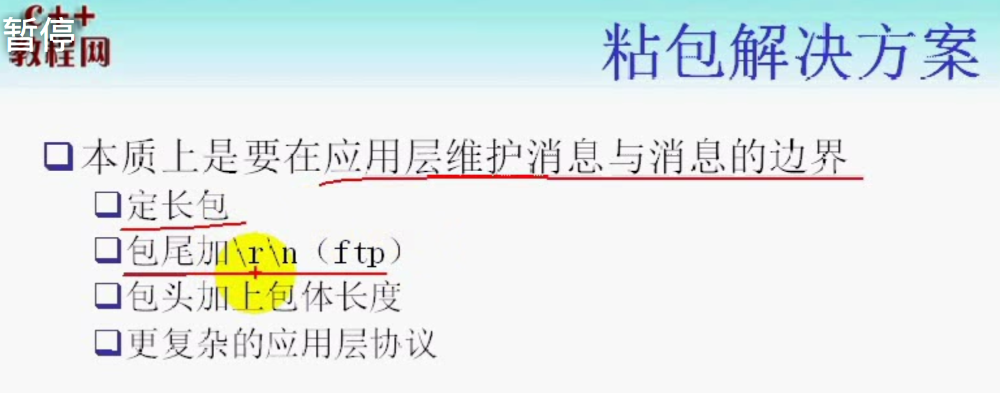
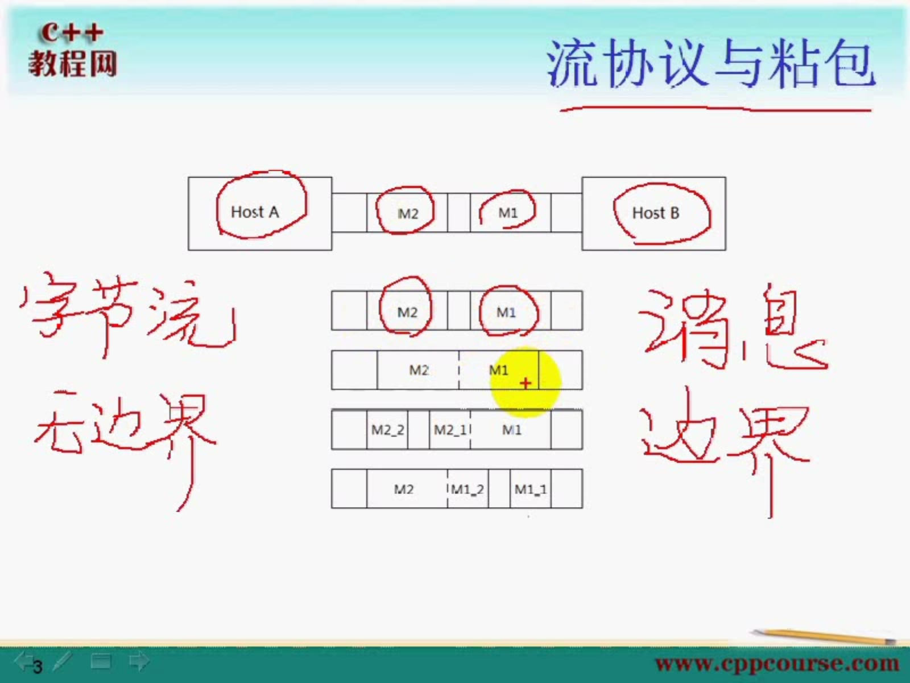
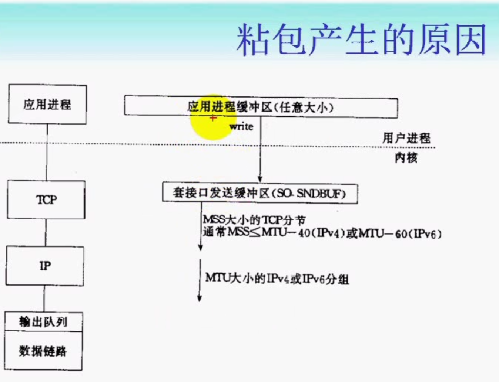

 什么粘包?

 TCP是一个流协议, 所以它会导致粘包问题出现.

 粘包产生的原因?

 粘包问题的处理方案?

 readn writen 函数分装

# 流协议与粘包问题.
 TCP是一个基于字节流的传输服务, 所以TCP传输的数据之间是没有边界的,我们把他看成是字节流,像流水一样我们无法区分流水之间的边界.
无边界

而UDP是基于消息的,  它传输的是报文,数据报,   是有边界的

有边界和无边界可以反应在对方接受程序上的. 字节流的话不能保证一次读操作一定返回多少个字节,是一个消息,两个消息,还是1.5个消息是不确定的.
而UDP能保证一次读操作就是一个消息.

所以一次读操作可能是一个消息的一部分, 或者还含有其他消息, 这就是粘包问题.

A给B发送两个消息(两个数据包)
1. 一次读操作返回第一条消息M1, 第二次读操作返回也刚好是M2----没有粘包问题
2. 一次读操作返回了M1和M2的所以, 这里的M1和M2没有边界, 这样就粘在一起了, -------粘包问题
3. 第一次读操作返回了M1的全部和M2的一部分, 第二次读操作读到M2的后一部分
4. 第一次读操作读到m1的前一部分, 第二次读操作读到m1的后一部分和全部m2

# 粘包产生的原因?

数据发送过程经过的步骤

1. 应用层将数据调用write方法, 将应用层缓冲区中的数据拷贝到套接口发送缓冲区(SO_SNDBUF)

2. 套接口发送缓冲区有一个SO_SNDBUF的限制, 如果应用层的缓冲区一条消息的大小超过SO_SNDBUF的大小, 就有可能产生粘包问题, 因为消息被分割了, 一部分放到套接口发送缓冲区可能被发送出去了, 对方已经接受了一部分, 另外一部分可能才放到套接口发送缓冲区进一步发送出去, 这是对方就延迟接收了消息的后一部分. 就导致了粘包问题的出现

因为数据包的分割(分片..)
TCP传输段有最大段的限制MSS大小限制
链路层有最大传输单元的限制, 如果传输单元大于了MTU会在IP层又进行分组或者分片.
TCP的流量控制,拥塞控制
TCP的延迟发送机制

# 粘包问题解决方案

readn // 接受确定数目读操作
writen//发送确切 数目的写操作

