网络层 负责在不同网络之间传发数据包 基于数据包的IP地址转发

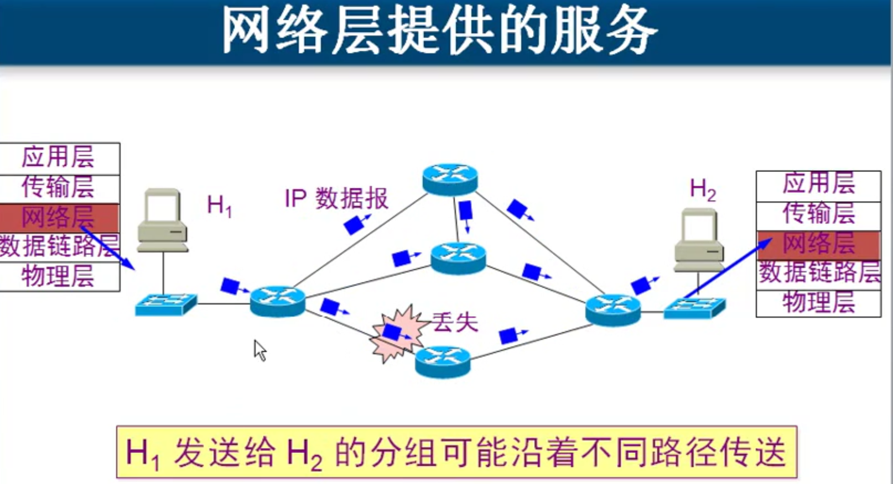
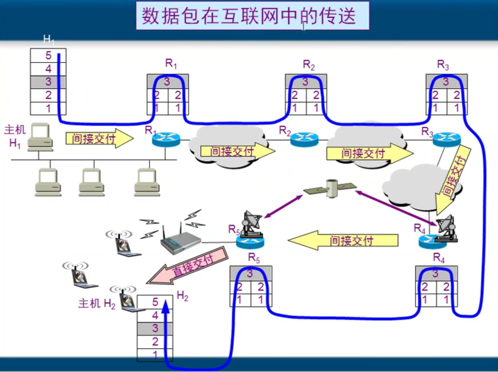
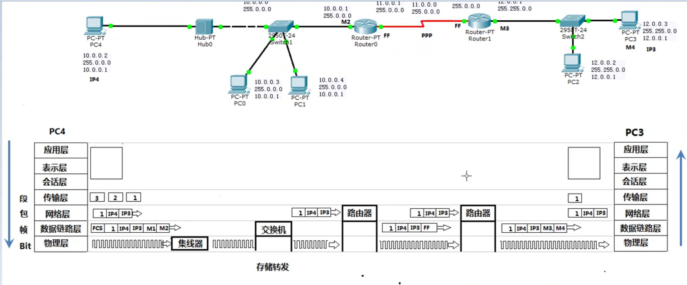

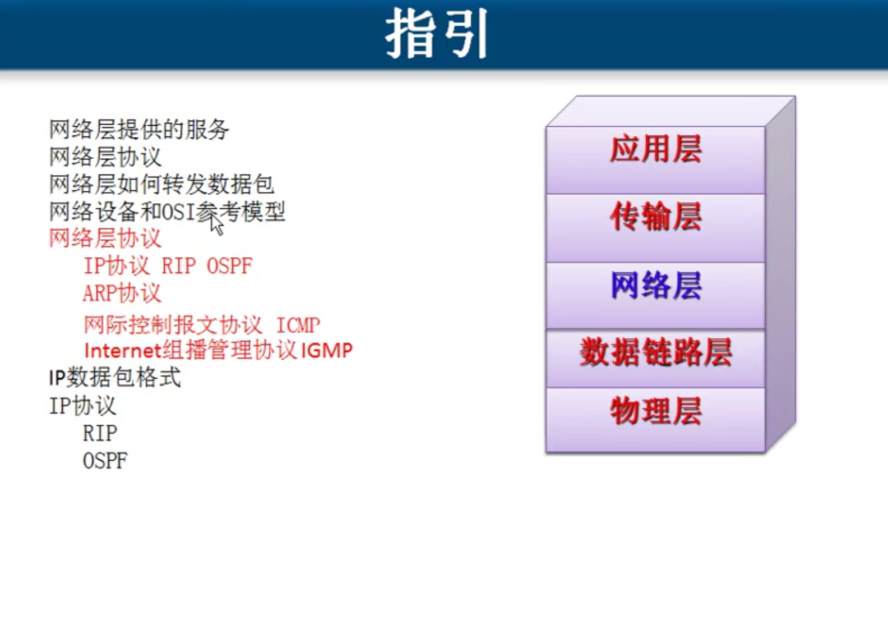

# 网络层协议
IP协议RIP OSPF
ARP协议
网际控制报文协议ICMP
Internet组播管理协议IGMP

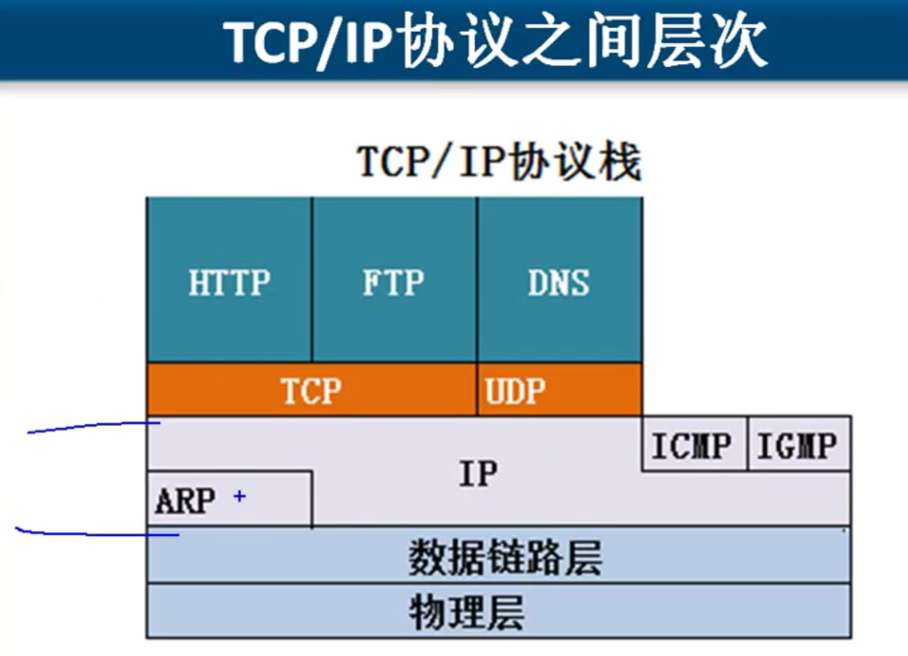

# ARP协议

将IP地址通过广播 目标MAC地址是FF-FF-FF-FF-FF-FF 解析目标IP地址的MAC地址
ARP 只能是一个网段的

ARP绑定

# ICMP 检测用的
使用这个协议最多的命令是Ping

使用ICMP协议的命令
ping time 查看延迟
Linux  64
Windows  128
Unix 255

# IGMP Internet  组播管理协议(跨多个网段, 跨多个路由器)
点到点
广播
组播=多播(电视频道, )

(CCNP,  面会讲怎么在路由器里设置多播)

# IP 

### IP 数据包

一个IP数据包由首部和数据两部分组成。
- 首部的前一部分是固定长度，共20字节，是所有IP数据报必须具有的。
- 在首部的固定部分的后面是一些可选字段，其长度是可变的。
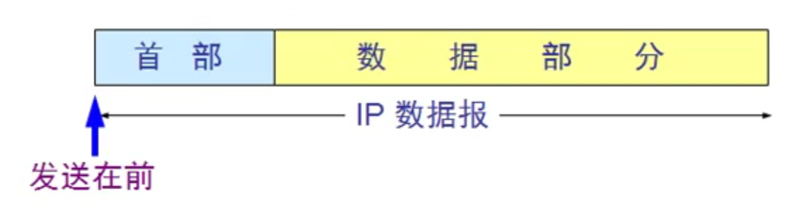
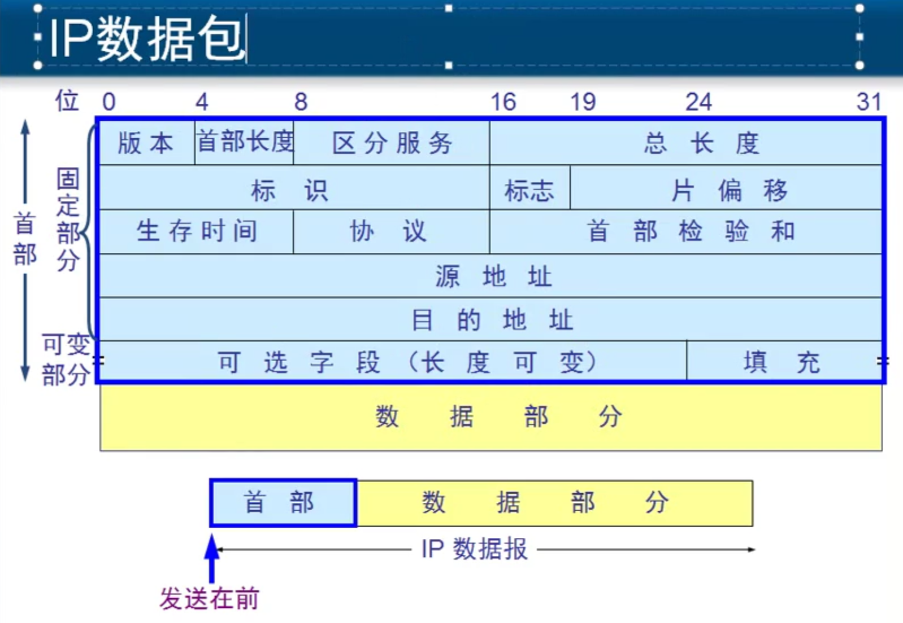
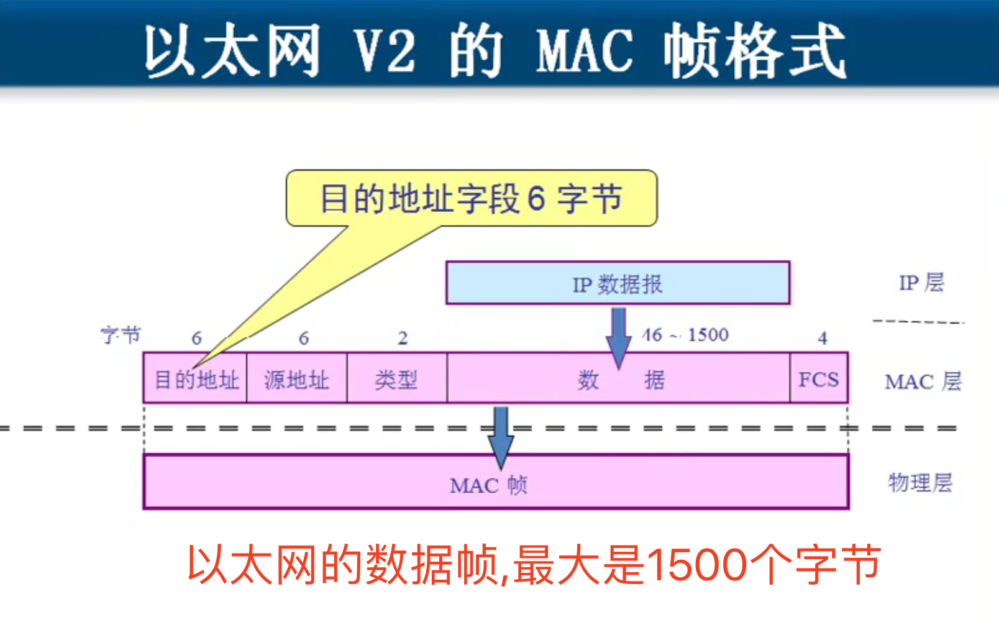
数据链路层帧最小64字节,  64-6-6-2-4=46, 数据本分就是最小46字节

## 网络层  数据包 最大65535字节
## 数据链路层 数据最大1500字节   最大传输单元 MTU

网络层数据包大于1500字节给数据链路层的时候, 要分片 `包分片`   `数据包分片 `
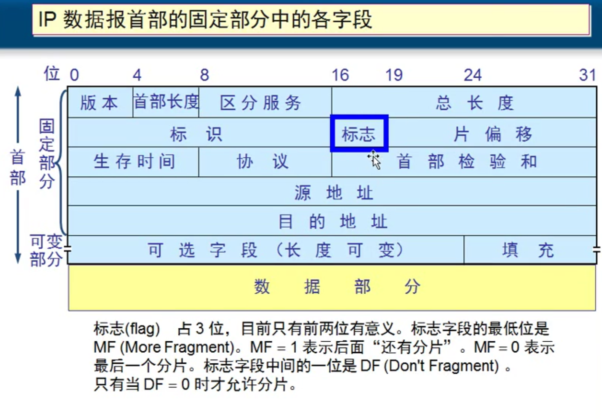
标志: 是说网络数据包的标识
标识: 是说这个分片后面还有没有, 是不是分片
片偏移: 就是下面说的值

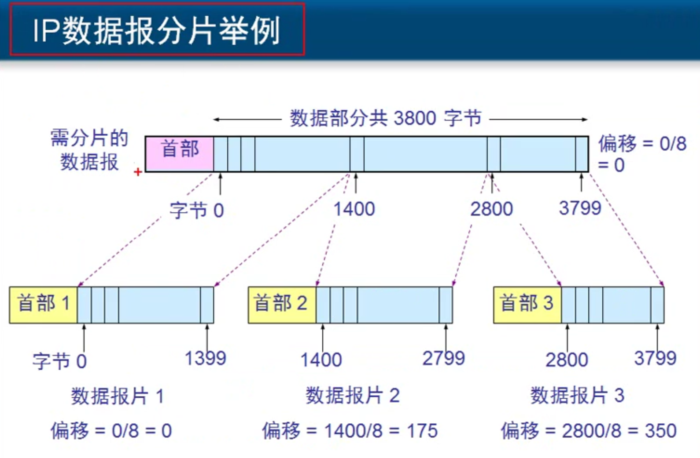
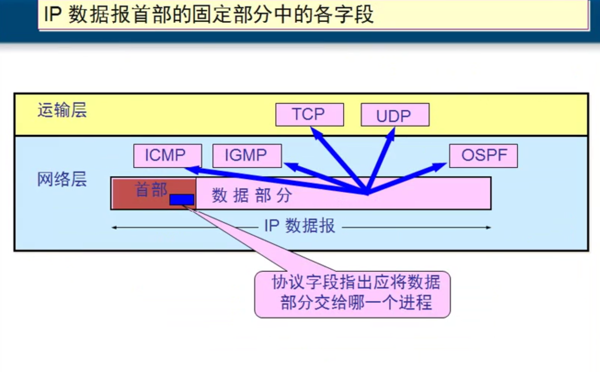

协议号 `ICMP 协议号1`  `IGMP协议2` `TCP 6`  `IPV6 41`  `OSPF 89`  `UDP 17`

## IP协议 (自动学习路由表, 所有能够让路由器学习到路由表的协议我们统称为IP协议 )
RIP
OSPF

### 网络畅通的条件就是网络数据包有去有回
计算机必须要配网关
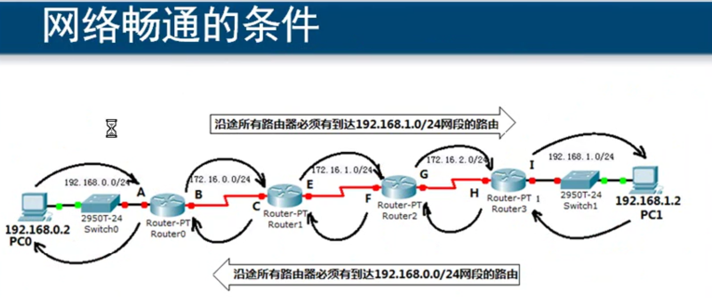

静态路由
需要管理员告诉路由器所有没有直连的网络下一跳给谁
静态路由的缺点适合于小规模网络不能够自动调整路由

动态路由

RIP 周期性广播路由表 条数越少越优 30秒更新一下路由信息 最大条数 15跳

