# 传输层
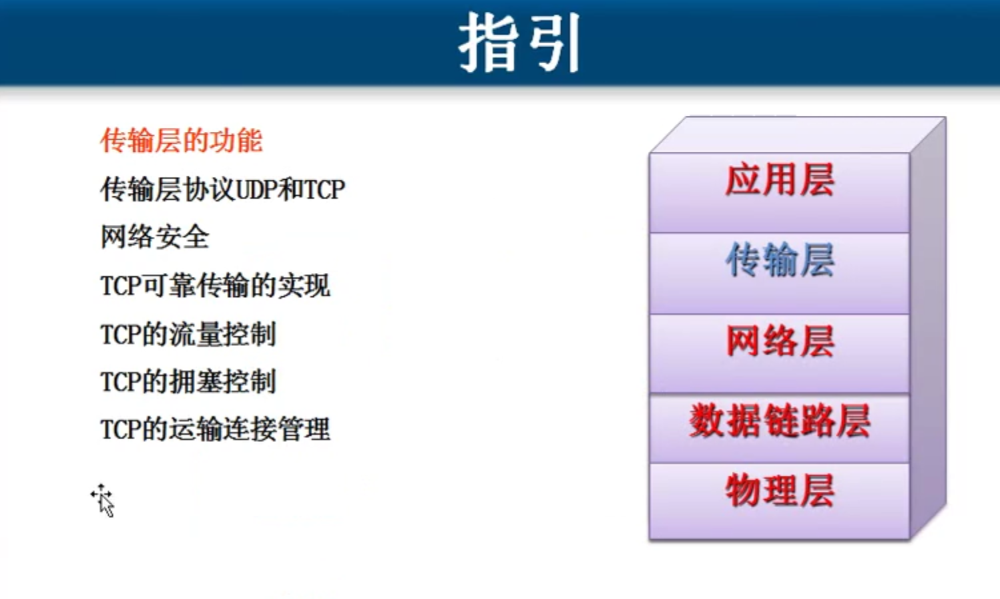

##  传输层两个协议

在TCP/ IP协议栈，传输层有两个协议TCP和UDP
- TCP (Transmission Control Protocol,传输控制协议) 协议。
- UDP (User Data Protocol,用户数据报协议) 协议。

TCP 需要将要传输的文件`分段传输`   `建立会话`   `可靠传输`  `流量控制`
UDP `一个数据包`就能够完成数据通信  `不分段`     `不需要建立会话`  `不需要流量控制`  `不可靠传输`
		屏幕广播	多播或者广播

用TCP情况
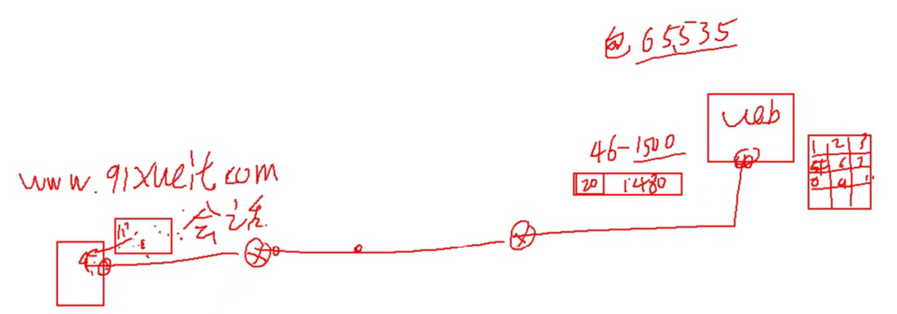

用UDP情况 (域名解析)
 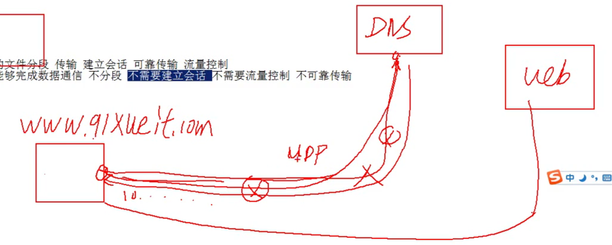

查看会话  netstat -n
查看建立会话的进程 netstat -nb

## 传输层和应用层之间的关系

 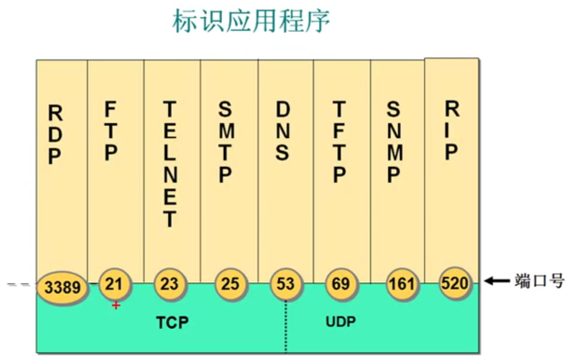

常见的应用层协议使用的端口

http=TCP+80
https=TCP+443
rdp=TCP+3389
ftp=TCP+21
SMTP=TCP+25
POP3=TCP+110
telnet=TCP+23
SQL=TCP+1433
DNS=UDP+53

##  服务和应用层协议之间的关系 

 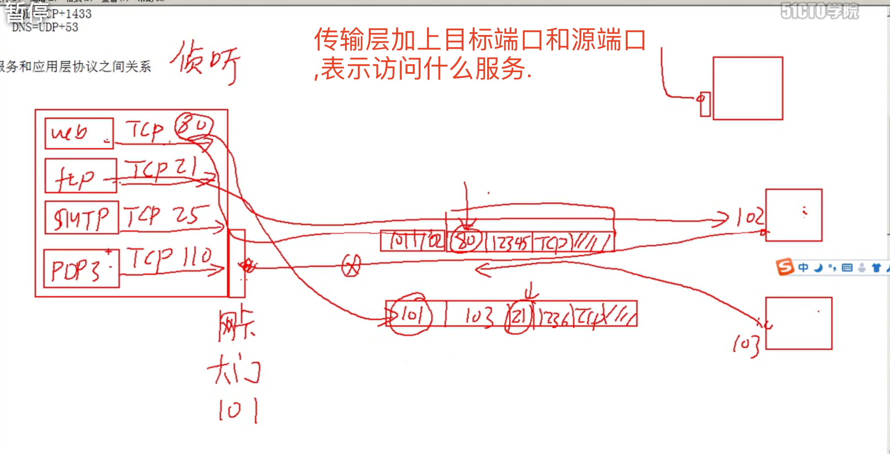

服务使用 TCP或UDP的端口 侦听客户端请求
客户端使用IP地址定位服务器使用目标端口 定位服务
可以在服务器网卡上设置只开放必要的端口实现服务器网络安全

netstat -an // 查看本机监听的端口

如何查看服务侦听的端口
netstat -an  // 查看本机监听的端口
netstat -n 查看建立的会话
netstat -nb 查看建立会话的进程
telnet 192.168.80.100 3389 测试远程计算机某个端口是否打开
## 上面那些都不是书上的内容

## 传输层为相互通信的应用进程提供了逻辑通信
 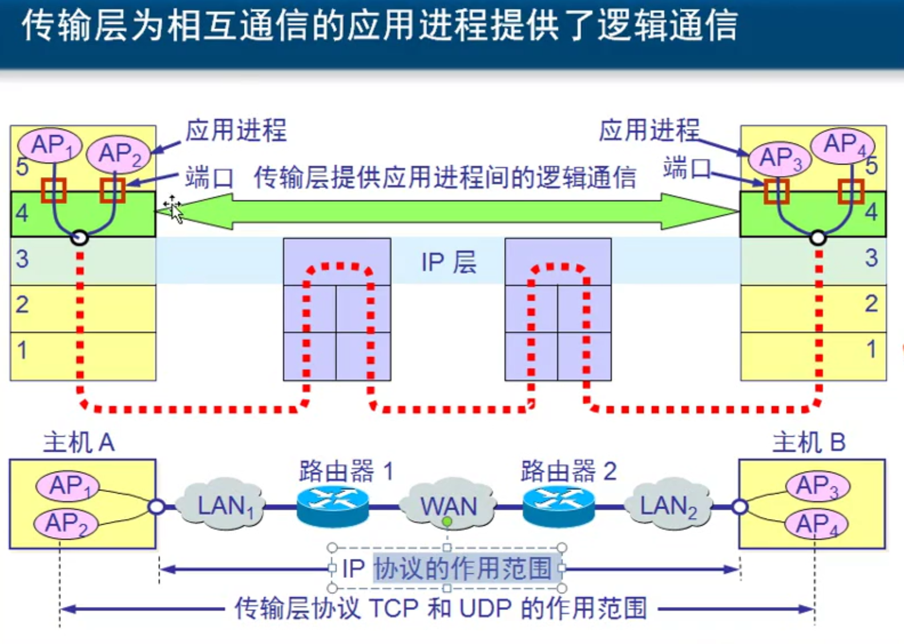

## 传输层的主要功能

传输层为`应用进程之间`提供`端到端的`逻辑通信(但网络层是为`主机之间`提供逻辑通信)
传输层还要对收到的报文进行差错检测。
传输层提供面向连接和无连接的服务。

## 传输层的端口
 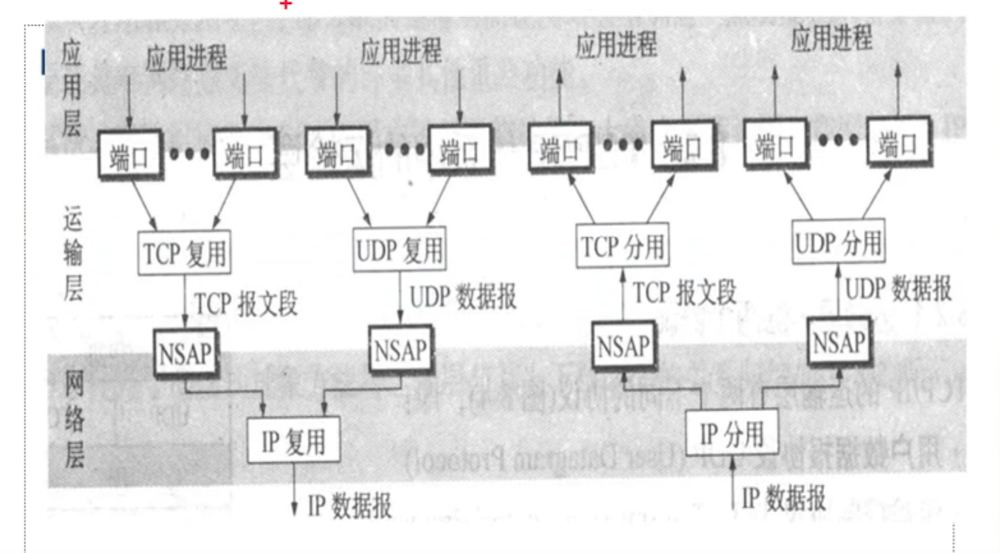

网络层用协议号表示是哪个 TCP 6 UDP 7  IGMP 1

### TCP 的端口
端口用一个16位端口号进行标志.

端口号只具有`本地` 意义, 即端口号是为了标志本计算机应用层中的各进程. 在因特网中不同计算机的相同端口号是没有联系的.

端口 0-65535
熟知端口 0-1023
登记端口 RMD 3389

熟知端口，数值一般为0~1023。
FTP:21
TELNET:23
SMTP:25
DNS:53
HTTP:80
https:443
RDP:3389
登记端口号，数值为1024~49151
客户端口号，数值为49152~65535

### 上面只是相关知识普及 , 下面开始是TCP和UDP的特点

## UDP的特点

UDP 是无连接的，即发送数据之前不需要建立连接。
UDP 使用尽最大努力交付，即不保证可靠交付，同时也不使用拥塞控制。
UDP 是面向报文的。UDP没有拥塞控制，很适合多媒体通信的要求。
UDP支持一对一、一对多、多对一和多对多的交互通信。
UDP 的首部开销小，只有8个字节。
 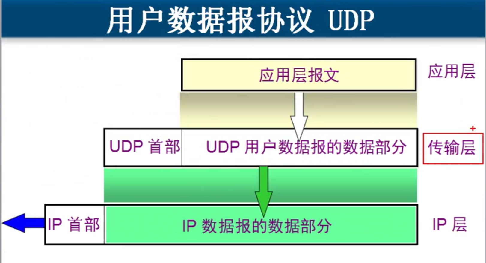

 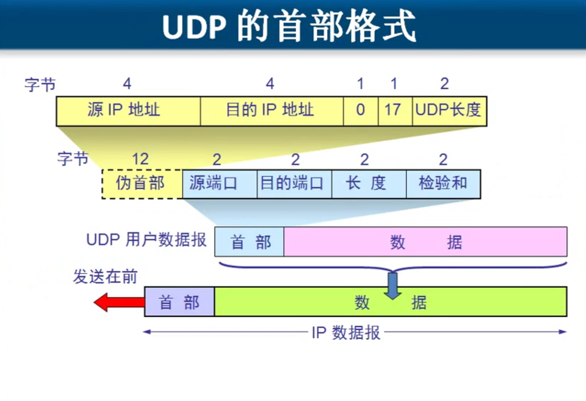
长度是说整个UDP包的长度
 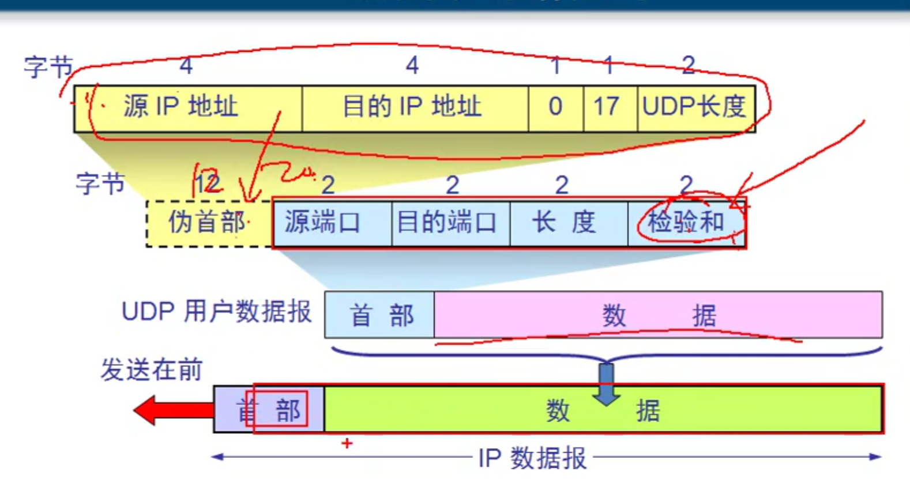

 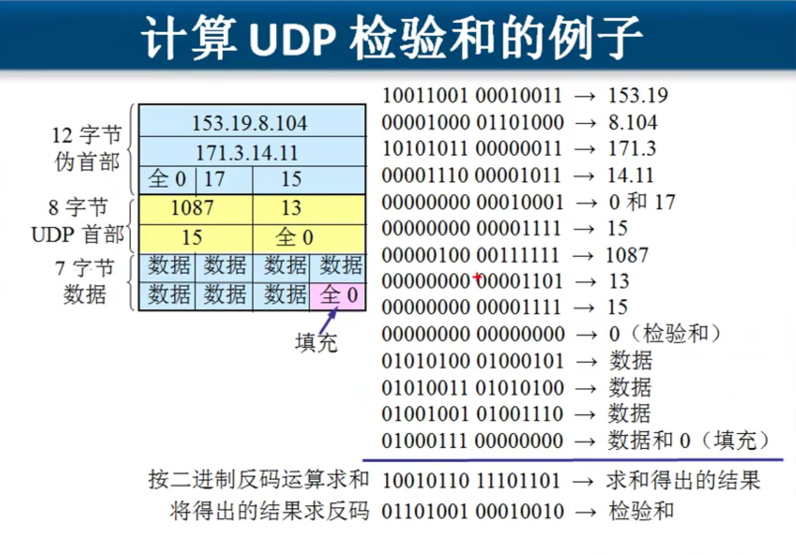

## TCP特点
- TCP 如何实现`可靠传输`
- TCP 协议如何实现`流量控制`
- TCP协议如何`避免网络拥塞`

## TCP概述

- TCP 是面向连接的传输层协议。
- 每一条TCP 连接只能有两个端点(endpoint),每一条TCP 连接只能是点对点的(一对一).
- TCP 提供可靠交付的服务。
- TCP 提供全双工通信。
- 面向字节流。

面向字节流
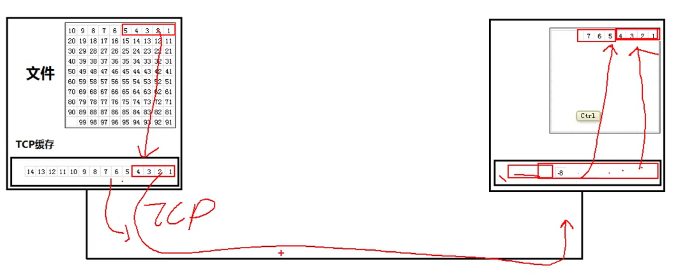

## TCP的连接

- TCP把连接作为最基本的抽象。
- 每一条TCP 连接有两个端点。
- TCP连接的端点不是主机，不是主机的IP地址，不是应用进程，也不是传输层的协议端口。TCP连接的端点叫做套接字(socket)。 
- `端口号`拼接到`IP地址` 即构成了套接字。

## 可靠传输的工作原理--------停止等待协议
只要你没告诉我收到,我就认为你没收到...
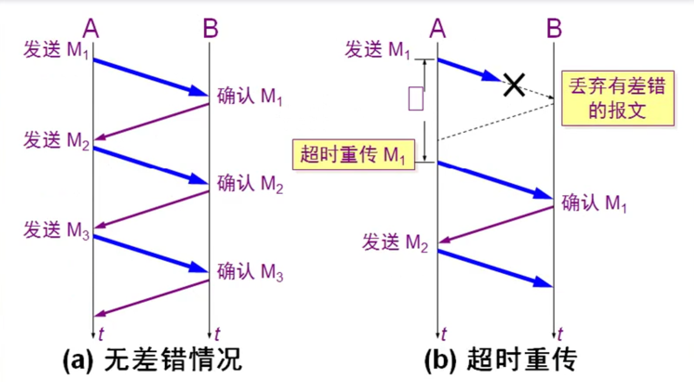

## 可靠通信的实现
使用上述的确认和重传机制，我们就可以`在不可靠的传输网络上实现可靠的通信。`
这种可靠传输协议常称为`自动重传请求ARQ`(Automatic Repeat reQuest)。
ARQ表明重传的请求是`自动`进行的。接收方不需要请求发送方重传某个出错的分
组。

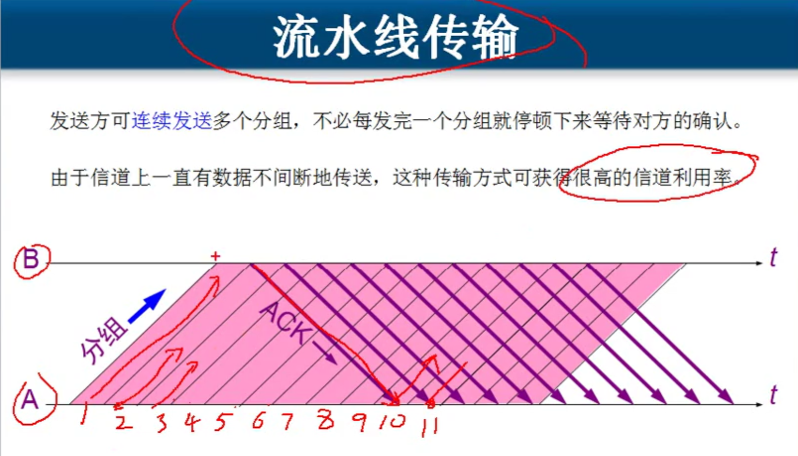
 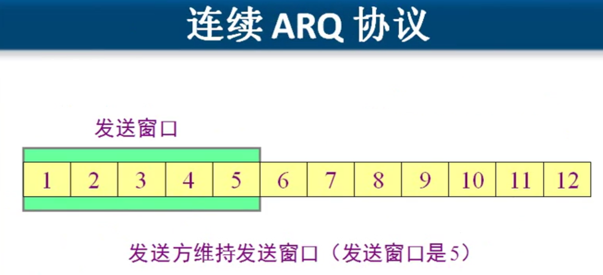

 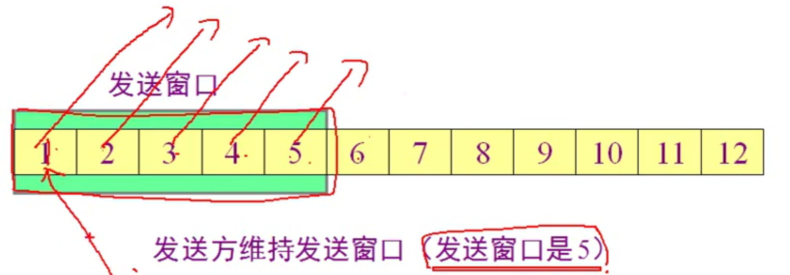
 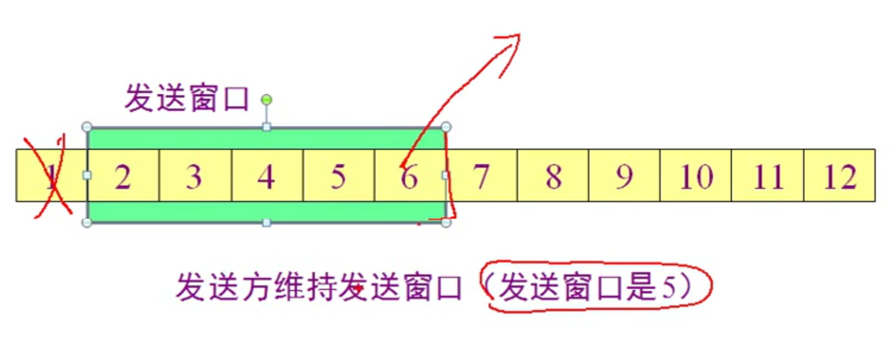
 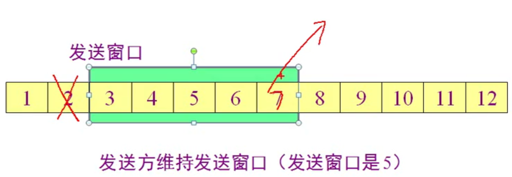
 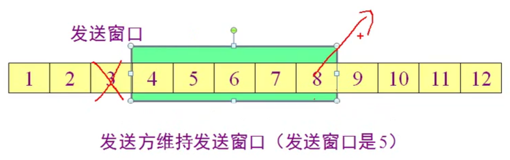

