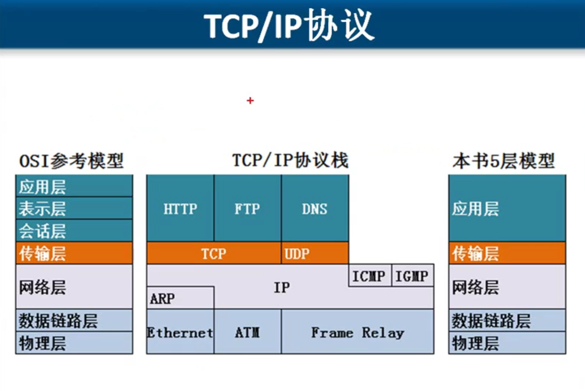

# 应用层
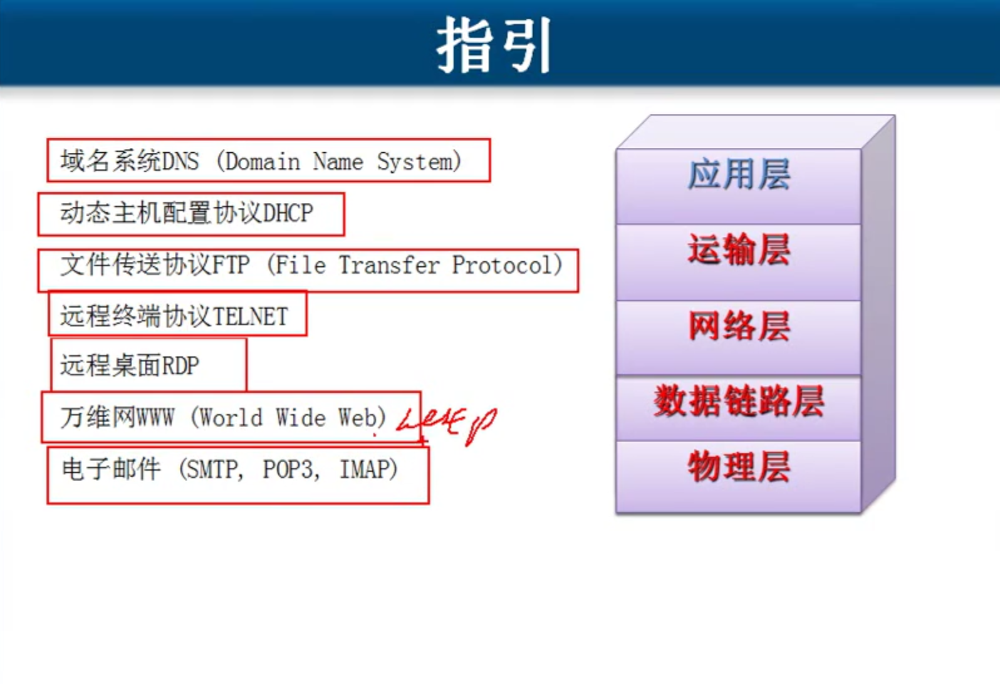

## 域名系统NDS( Domain Name System)

域名

根
顶级域名  com  edu  net  cn  org  gov 

根知道 顶级域名那些负责解析
顶级域名查具体的
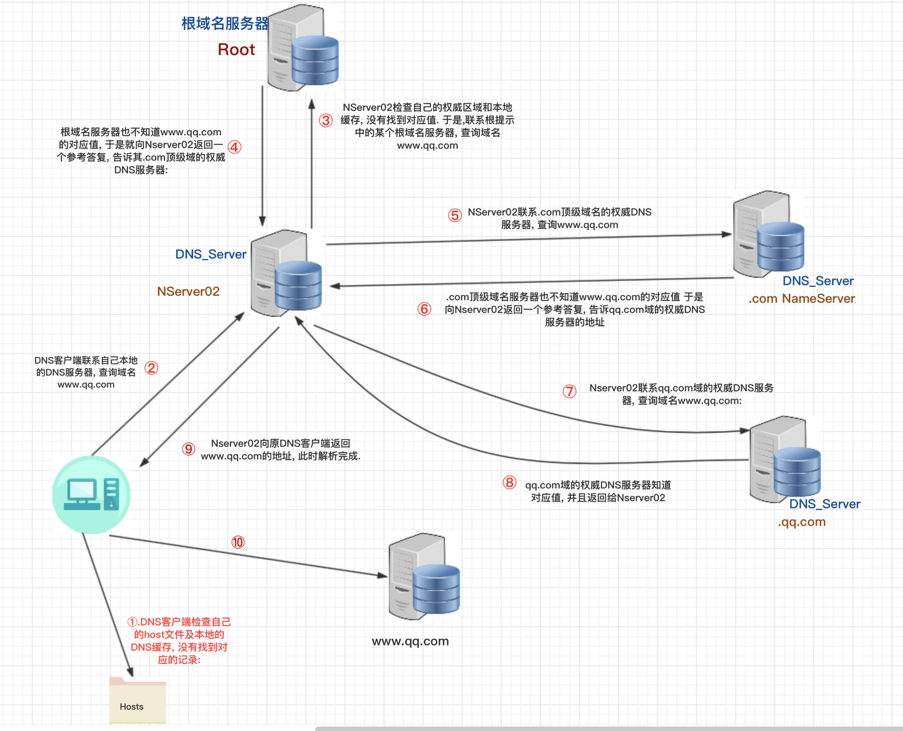

## 动态主机配置协议DHCP

使用这个服务网络配置好,就可以上网了

## 文件传输协议FTP (File Transfer Protocol)

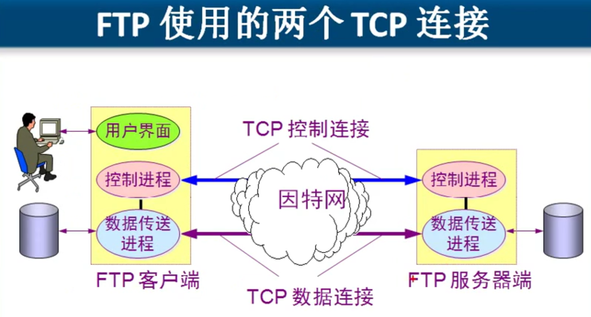
主动模式
被动模式

主动模式
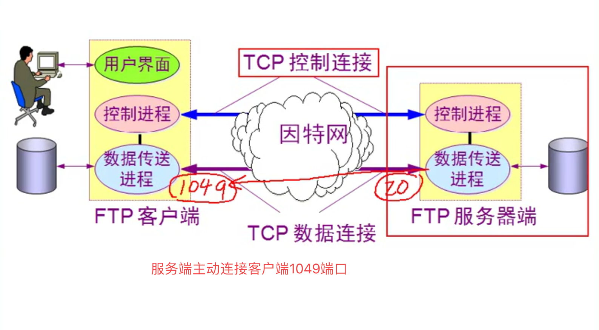

### FTP服务概述
- FTP连接方式
  - 控制连接: 标准端口为21,用于发送FTP 命令信息
  - 数据连接: 标准端口为20，用于上传、下载数据
  - 数据连接的建立类型:
    - 主动模式: 服务端从20端口主动向客户端发起连接
    - 被动模式: 服务端在指定范围内的某个端口被动等待客户端发起连接
- FTP传输模式
  - 文本模式:ASCII模式，以文本序列传输数据
  - 二进制模式: Binary模式，以二进制序列传输数据

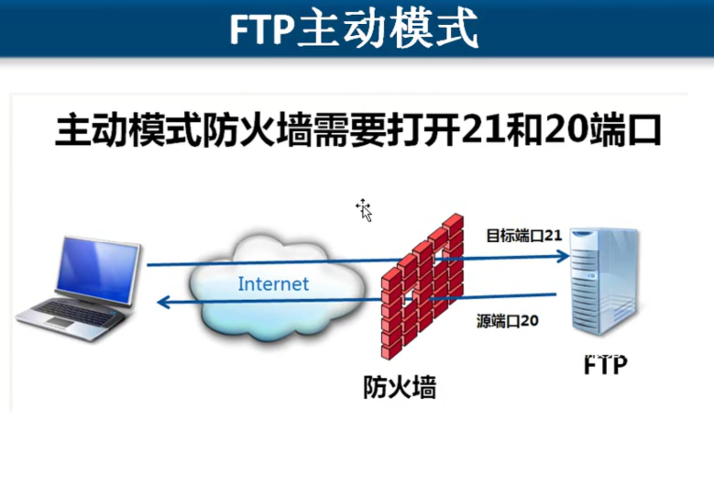
FTP协议
- 主动模式    
  - ftp客户端告诉F]P服务器使用什么端口侦听
  - FTP服务器和FTP客户端的这个端口建立连接 源端口20

- 被动模式
  - FTP服务器打开一个新端口等待FTP客户端的连接

***FTP服务器端如果有防火墙需要在防火墙开21和20端口使用主动模式进行数据连接***

## TELNET 协议 远程终端协议
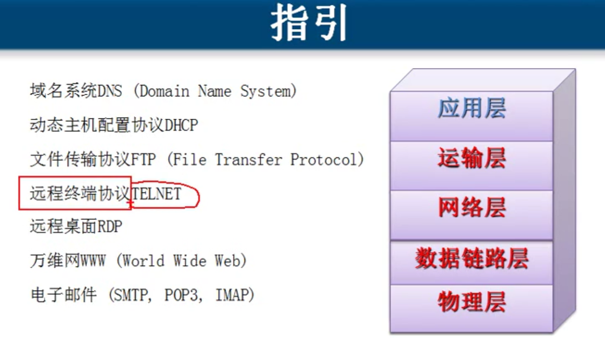

## HTTP协议

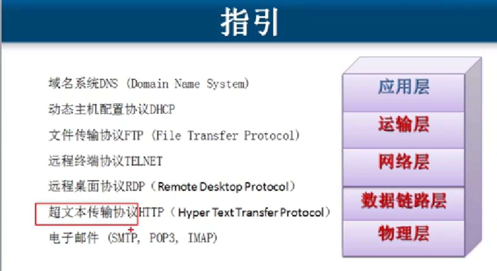
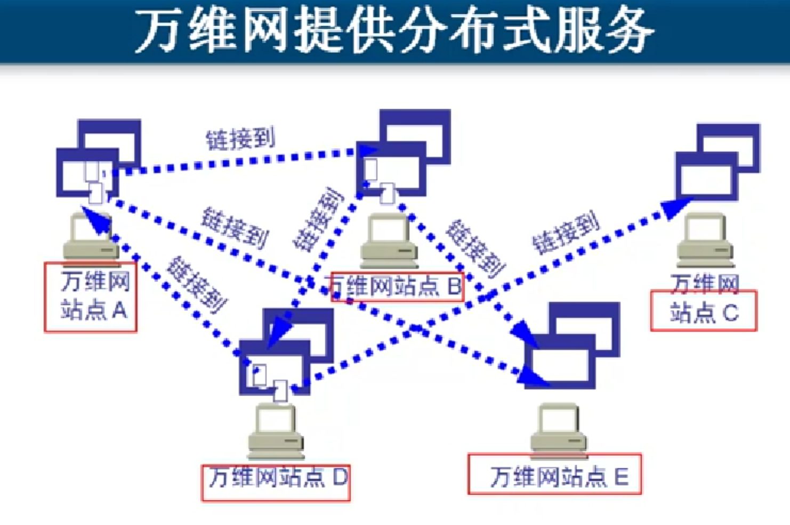
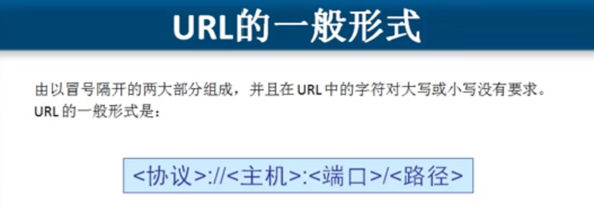
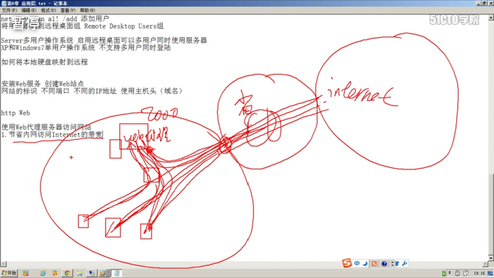

网站的标识 不同端口 不同的IP地址 使用主机头(域名)
Web http

使用Web代理服务器访问网站
1.节省内网访问Internet的带宽
2. 绕过防火墙

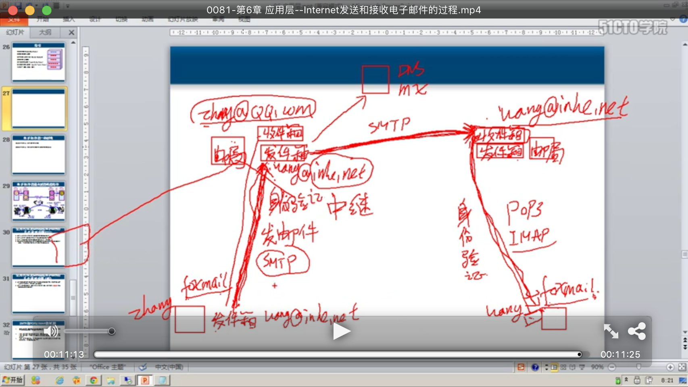
