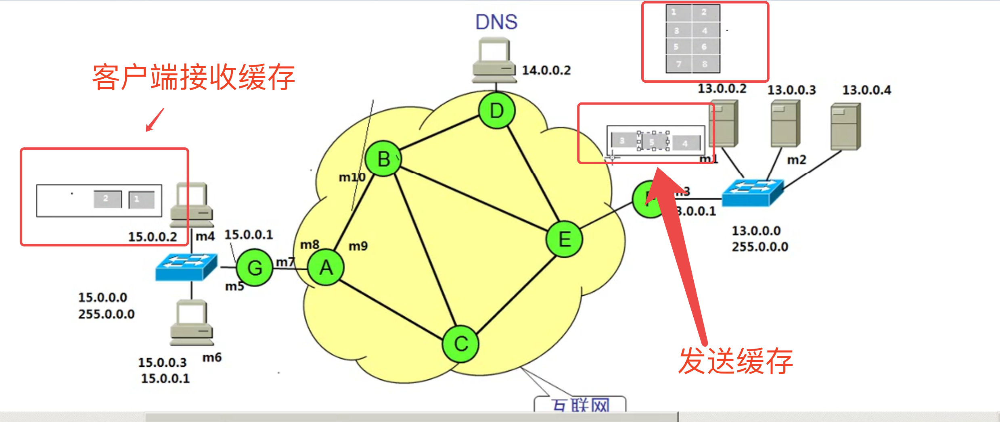
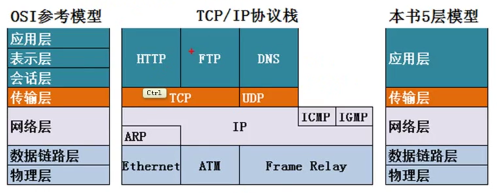
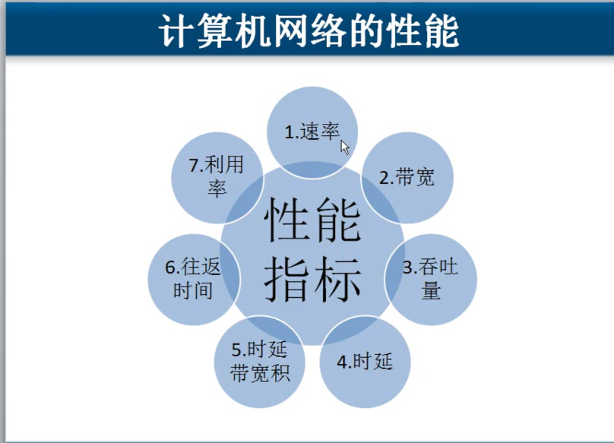
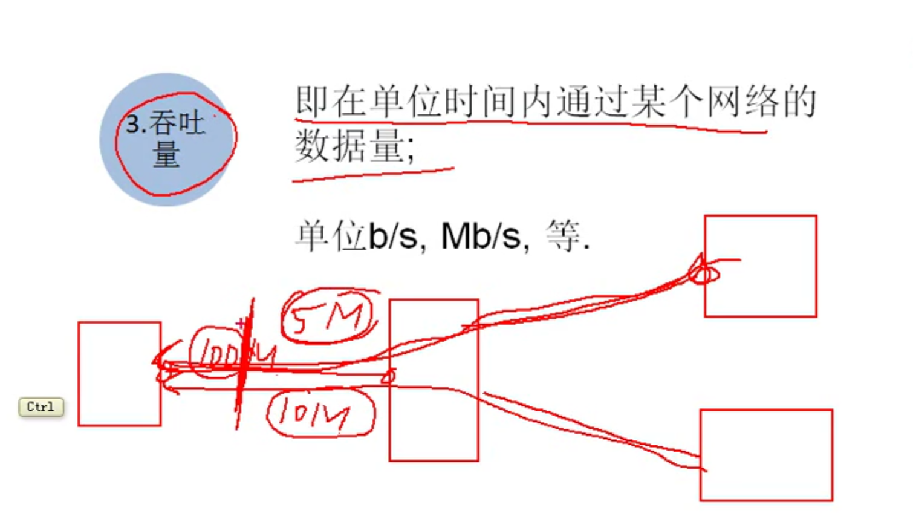

2017年12月17日01:48:53

# 第一章 计算机网络概述

* 局域网 ------覆盖范围小  自己花钱购买设备  带宽固定  自己维护  100米  带宽 10M  100M 1000M
* 广域网 ------ 距离远  花钱租人家的服务 
* Internet  ------ 由ISP组成 自己的机房 对网民提供访问Internet连接(ADSL 光纤到户)

网络设备用网线连接交换网线最长100米(笔记本到交换机, 局域网的标准), 教室交换机到机房交换机也不超过100米, 图中笔记本到交换机会进行信号加强 .

教室里面的交换机叫做 ***接入层交换机***

机房里的那个叫做 ***汇聚层交换机***

## Internet 和广域网

ISP就是运营商, 联通,电信,移动,网通

世界上最远的距离是网通到电信, 跨运营商访问

广域网就是花钱买带宽, 花钱租人家的服务

花钱买的带宽是说从你家到运营商距离的传输带宽, 如图, 

说我家的带宽挺高的怎么访问有的网站慢有的网站快, 就是这个道理

## IP地址

13.0.0.0
255.0.0.0 // 子网掩码
网络部分
主机部分

13网段, 13说的就是网络部分
0.0.0就是主机部分

255.0.0.0子网掩码就是告诉我们哪是网络部分哪是主机部分

13.0.0.0
255.0.0.0 // 子网掩码
说的就是13是网络部分

13.0.0.0
255.255.0.0 // 子网掩码
说的就是13.0是网络部分  0.0是主机部分

13.0.0.0
255.255.255.0 // 子网掩码
说的就是13.0.0是网络部分, 0是主机部分

网关的地址是本网段的第一个地址

MAC地址是出厂时就固定到芯片里的了

# 05-数据包和数据帧

源地址 目标地址

包含了MAC地址的叫数据帧
没包含的叫数据包

传输的时候从一个路由器到另一个路由器的时候, MAC地址一直在变

包是没变的帧因为MAC地址变一直在变

IP地址决定了数据最终到哪去, MAC地址决定了吓一跳该给谁

# 06-访问网站数据传输过程

# 互联网上一个数据包最大1500个字节

# 网卡都有缓存, 发送缓存, 接收缓存

# 07-OSI参考模型

应用层       	所有能产生网络流量的程序
表示层      	在传输之前是否要进行加密 或压缩处理  用二进制 还是 ASCII
会话层       	查木马 netstat -n
传输层       	可靠传输 流量控制 不可靠传输
网络层       	负责选择最佳路径  规划IP地址
数据链路层 	定义了帧的开始和结束 透明传输(中间插的转义位)   差错校验
物理层		     定义接口标准(网卡几根线啥的)   电气标准(电压啥的)  如何在物理上传输更快的速度

### 一个包就能搞定的就用不可靠传输UDP, 比如ping
### 自己可以规划路径----静态路由

# 08理解OSI分层思想

# 09排障

 
# 10 OSI参考模型

# 11-网络性能指标

## 1.速率----比特率
连接在计算机网络上的主机在数字信道上传送数据位数的速率, 也称为data rate或 bit rate

单位是b/s, kb/s ,  Mb/s, Gb/s

0011010101, 每一位都是一比特

买了10M带宽的网, 说是10M 比特.  我们实际看到的100k/s 计量单位是字节, 一字节等于8bit

一个发送端一个接收端就是一个信道
## 2.带宽
数据通信领域中, 数字信道所能传送的最高数据率.

单位是b/s, kb/s ,  Mb/s, Gb/s

## 3.吞吐量

即在单位时间内通过某个网络的数据量

单位 b/s, Mb/s, 等

速率5M+速率10M = 15M 吞吐量
图中带宽是100M

## 4,时延----延迟

发送时延是说一个文件从我的网卡开始发,到完全走出我的网卡

传播速度是固定了的,和介质有关铜线?光纤?  我们买带宽说从2M换成20M是改变的发送时延, 是说数据从我们的网卡出去用多长时间, 完全出去了到网线中去了数

光纤支持更高的发送速度, 

传播速度铜线23.1万公里.  光纤20.5万公里

##  5. 时延带宽积
有多少数据正在线路上

## 6.往返时间

去和回来的时间

从发送方发送数据开始,
到发送方收到接收方确认

## 7.网络利用率

