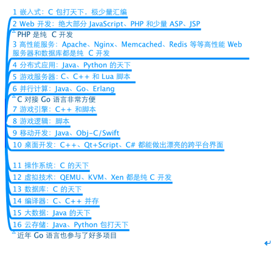
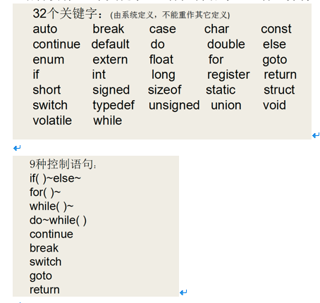
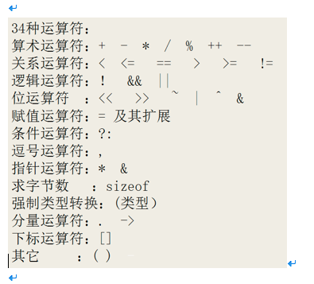
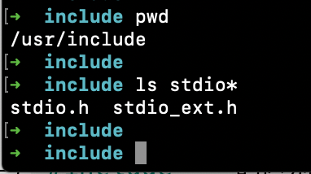
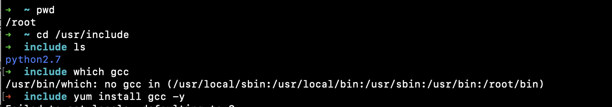
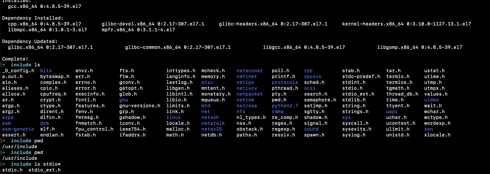
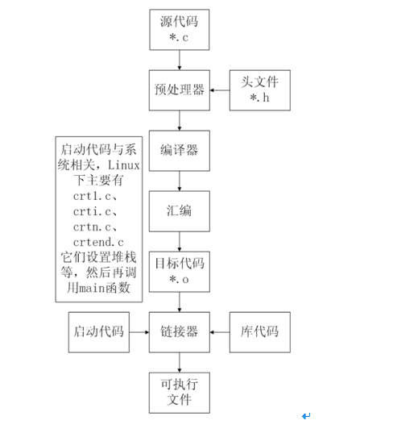
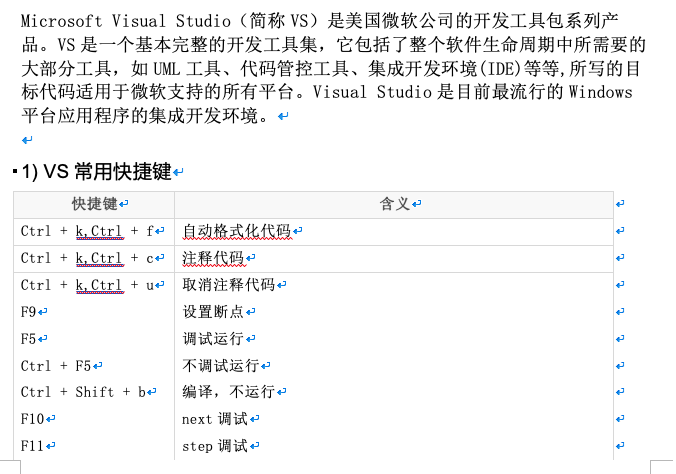
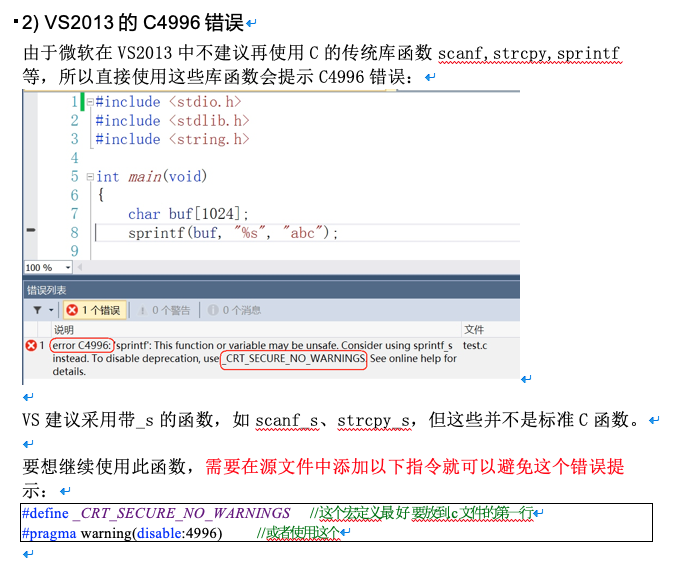

# 1. c 的简洁

C语言仅有`32个关键字`，`9种控制语句`，`34种运算符`，却能完成无数的功能





# 2. 通过gcc 编译c代码


## 2.1 gcc 编译器

编辑器(如`vi`、`记事本`)是指我用它来写程序的（编辑代码），而我们写的代码语句，电脑是不懂的，我们需要把它转成电脑能懂的语句，编译器就是这样的转化工具。就是说，**我们用编辑器编写程序，由编译器编译后才可以运行！**

`编译器`是将易于编写、阅读和维护的高级计算机语言翻译为计算机能解读、运行的低级机器语言的程序。

gcc（GNU  Compiler Collection，GNU 编译器套件），是由 GNU 开发的编程语言编译器。gcc原本作为GNU操作系统的官方编译器，现已被大多数类Unix操作系统（如Linux、BSD、Mac  OS X等）采纳为标准的编译器，gcc同样适用于微软的Windows。


gcc最初用于编译C语言，随着项目的发展gcc已经成为了能够编译`C`、`C++`、`Java`、`Ada`、`fortran`、`Object C`、`Object C++`、`Go`语言的编译器大家族。


## 2.2 编译命令格式:

```c

gcc [-option1] ... <filename>

g++ [-option1] ... <filename>

```


- 命令、选项和源文件之间使用空格分隔

- 一行命令中可以有零个、一个或多个选项

- 文件名可以包含文件的绝对路径，也可以使用相对路径

- 如果命令中不包含输出可执行文件的文件名，可执行文件的文件名会自动生成一个默认名，Linux平台为a.out，Windows平台为a.exe


## 2.3 gcc、g++编译常用选项说明


# 3. 代码分析


 `include`头文件包含

- `#include`的意思是头文件包含，`#include <stdio.h>`代表包含`stdio.h`这个头文件

- 使用C语言库函数需要提前包含库函数对应的头文件，如这里使用了printf()函数，需要包含stdio.h头文件

- 可以通过man 3 printf查看printf所需的头文件


- `#include< >` 与 `#include ""`的区别：
  - `< >` 表示系统**直接**按系统指定的目录检索
  - `""` 表示系统**先**在 `""` 指定的路径(没写路径代表当前路径)查找头文件，如果找不到，**再**按系统指定的目录检索

stdio.h是在操作系统的系统目录下：




ps: 在`mac`电脑里没找到`/usr/include`目录, 在`linux`系统下存在, 什么`centos`, `Ubuntu`里面就有.. 初始化`linux`下面呢啥都没有, 然后需要安装`gcc`以后才有如下





# 4. c程序编译步骤


C代码编译成可执行程序经过4步：

1）`预处理`：宏定义展开、头文件展开、条件编译等，同时将代码中的注释删除，这里并不会检查语法

2）`编译`：检查语法，将预处理后文件编译生成汇编文件

3）`汇编`：将汇编文件生成目标文件(二进制文件)

4）`链接`：C语言写的程序是需要依赖各种库的，所以编译之后还需要把库链接到最终的可执行程序中去





# 5. gcc 编译过程


## 5.1 分步编译


## 5.2 一步编译

`gcc hello.c -o demo`（还是经过：`预处理`、`编译`、`汇编`、`链接`的过程）


# 6. CPU内部结构与寄存器(了解)


## 6.1 64位和32位系统区别

- 寄存器是CPU内部最基本的存储单元

- CPU对外是通过总线(地址、控制、数据)来和外部设备交互的，总线的宽度是8位，同时CPU的寄存器也是8位，那么这个CPU就叫8位CPU

- 如果总线是32位，寄存器也是32位的，那么这个CPU就是32位CPU

- 有一种CPU内部的寄存器是32位的，但总线是16位，准32为CPU

- 所有的64位CPU兼容32位的指令，32位要兼容16位的指令，所以在64位的CPU上是可以识别32位的指令

- 在64位的CPU构架上运行了64位的软件操作系统，那么这个系统是64位

- 在64位的CPU构架上，运行了32位的软件操作系统，那么这个系统就是32位

- 64位的软件不能运行在32位的CPU之上


## 6.2 寄存器名字(了解)


## 6.3 寄存器、缓存、内存三者关系


- 按与CPU远近来分，离得最近的是`寄存器`，然后`缓存`(`CPU缓存`)，最后`内存`。

- `CPU计算时`，先预先把要用的`数据`从`硬盘`读到`内存`，然后再把即将要用的数据读到`寄存器`。于是 `CPU``<--->``寄存器``<--->``内存`，这就是它们之间的信息交换。

- 那为什么有`缓存`呢？因为如果经常操作内存中的同一址地的数据，就会影响速度。于是就在`寄存器`与`内存`之间设置一个`缓存`。

- 因为从`缓存`提取的速度远高于`内存`。当然`缓存`的价格肯定远远高于`内存`，不然的话，机器里就没有内存的存在。

- 由此可以看出，从远近来看：**CPU**`〈---〉`**寄存器**`〈---〉` **缓存** `<--->` **内存**。


# 7. 集成开发环境


`集成开发环境`（`IDE`，`Integrated Development Environment `）是用于提供程序开发环境的应用程序，一般**包括**`代码编辑器`、`编译器`、`调试器`和`图形用户界面工具`。集成了代`码编写功能`、`分析功能`、`编译功能`、`调试功能`等一体化的开发软件服务套。所有具备这一特性的软件或者软件套（组）都可以叫集成开发环境。


## 7.1 Qt Creator

Qt Creator是跨平台的` Qt IDE`， `Qt Creator` 是 `Qt` 被 `Nokia` 收购后推出的一款新的轻量级集成开发环境（IDE）。此 IDE 能够跨平台运行，支持的系统包括 Linux（32 位及 64 位）、Mac OS X 以及 Windows。根据官方描述，Qt Creator 的设计目标是使开发人员能够利用 Qt 这个应用程序框架更加快速及轻易的完成开发任务。


## 7.2 Microsoft Visual Studio




