# 数组和字符串

# 目录

1. [概述](#cdata4001)
2. [一维数组](#cdata4002)
    1. [一维数组的定义和使用](#cdata4002a)
    2. [一维数组的初始化](#cdata4002b)
    3. [数组名](#cdata4002c)
    4. [强化训练](#cdata4002d)
     
3. [二维数组](#cdata4003)
    1. [二维数组的定义和使用](#cdata4003a) 
    2. [二维数组的初始化](#cdata4003b) 
    3. [数组名](#cdata4003c) 
    4. [强化训练](#cdata4003d) 
4. [多维数组(了解)](#cdata4004)
5. [字符数组与字符串](#cdata4005)
    1. [字符数组与字符串区别](#cdata4005a)
    2. [字符串的初始化](#cdata4005b)
    3. [字符串的输入输出](#cdata4005c)
    4. [强化训练：字符串追加](#cdata4005d)


### cdata4001
# 1. 概述

- 在程序设计中，为了方便处理数据把具有相同类型的若干变量按有序形式组织起来——称为数组。

- **数组就是在内存中连续的相同类型的变量空间**。同一个数组所有的成员都是相同的数据类型，同时所有的成员在内存中的地址是连续的。

### cdata4002
# 2. 一维数组

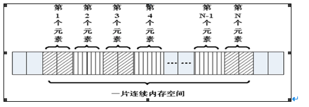
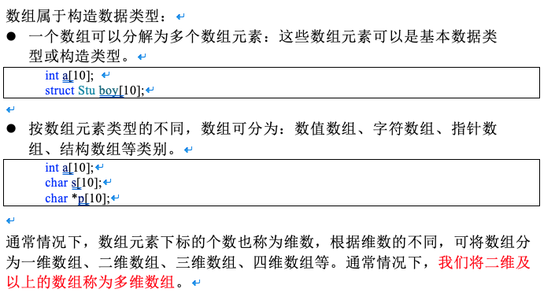


### cdata4002a
## 2.1 一维数组的定义和使用

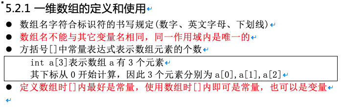

```c

#include <stdio.h>

int main()
{
	int a[10];//定义了一个数组，名字叫a，有10个成员，每个成员都是int类型
	//a[0]…… a[9]，没有a[10]
	//没有a这个变量，a是数组的名字，但不是变量名，它是常量
	a[0] = 0;
	//……
	a[9] = 9;

	int i = 0;
	for (i = 0; i < 10; i++)
	{
		a[i] = i; //给数组赋值
	}

	//遍历数组，并输出每个成员的值
	for (i = 0; i < 10; i++)
	{
		printf("%d ", a[i]);
	}
	printf("\n");

	return 0;
}


```


### cdata4002b
## 2.2 一维数组的初始化

在定义数组的同时进行赋值，称为初始化。全局数组若不初始化，编译器将其初始化为零。`局部数组若不初始化，内容为随机值`。

```c

  int  a[10] = { 1, 2, 3, 4, 5, 6, 7, 8, 9, 10 };//定义一个数组，同时初始化所有成员变量

  int  a[10] = { 1, 2, 3 };//初始化前三个成员，后面所有元素都设置为0

  int  a[10] = { 0 };//所有的成员都设置为0

   //[]中不定义元素个数，定义时必须初始化

   int a[] = { 1, 2, 3, 4, 5 };//定义了一个数组，有5个成员

```


### cdata4002c
## 2.3 数组名

`数组名是一个地址的常量，代表数组中首元素的地址。`

```c

#include <stdio.h>

int main()
{
	int a[10] = { 1, 2, 3, 4, 5, 6, 7, 8, 9, 10 };//定义一个数组，同时初始化所有成员变量

	printf("a = %p\n", a);
	printf("&a[0] = %p\n", &a[0]);

	int n = sizeof(a); //数组占用内存的大小，10个int类型，10 * 4  = 40
	int n0 = sizeof(a[0]);//数组第0个元素占用内存大小，第0个元素为int，4

	int i = 0;
	for (i = 0; i < sizeof(a) / sizeof(a[0]); i++)
	{
		printf("%d ", a[i]);
	}
	printf("\n");

	return 0;
}


```


### cdata4002d
## 2.4 强化训练


1. 一维数组的最值

```c

#include <stdio.h>

int main()
{
	int a[] = {  1, -2, 3,- 4, 5, -6, 7, -8, -9, 10 };//定义一个数组，同时初始化所有成员变量

	int i = 0;
	int max = a[0];
	for (i = 1; i < sizeof(a) / sizeof(a[0]); i++)
	{
		if (a[i] > max)
		{
			max = a[i];
		}
	}
	printf("数组中最大值为：%d\n", max);

	return 0;
}


```


2. 一维数组的逆置

```c

#include <stdio.h>

int main()
{
	int a[] = {  1, -2, 3,- 4, 5, -6, 7, -8, -9, 10 };//定义一个数组，同时初始化所有成员变量

	int i = 0;
	int j = sizeof(a) / sizeof(a[0]) -1;
	int tmp;

	while (i < j)
	{
		tmp = a[i];
		a[i] = a[j];
		a[j] = tmp;
		i++;
		j--;
	}

	for (i = 0; i < sizeof(a) / sizeof(a[0]); i++)
	{
		printf("%d ", a[i]);
	}
	printf("\n");

	return 0;
}


```


3. 冒泡法排序


```c

#include <stdio.h>

int main()
{
	int a[] = {  1, -2, 3,- 4, 5, -6, 7, -8, -9, 10 };//定义一个数组，同时初始化所有成员变量

	int i = 0;
	int j = 0;
	int n = sizeof(a) / sizeof(a[0]);
	int tmp;

	//1、流程
	//2、试数
	for (i = 0; i < n-1; i++)
	{
		for (j = 0; j < n - i -1 ; j++)//内循环的目的是比较相邻的元素，把大的放到后面
		{
			if (a[j]  > a[j + 1])
			{
				tmp = a[j];
				a[j] = a[j+1];
				a[j+1] = tmp;
			}
		}
	}

	for (i = 0; i < n; i++)
	{
		printf("%d ", a[i]);
	}
	printf("\n");

	return 0;
}


```


### cdata4003
# 3. 二维数组


### cdata4003a
## 3.1 二维数组的定义和使用

二维数组定义的一般形式是

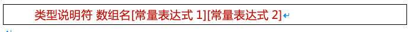

其中常量表达式1表示第一维下标的长度，常量表达式2 表示第二维下标的长度。

int a[3][4];

- 命名规则同一维数组
- 定义了一个三行四列的数组，数组名为a其元素类型为整型，该数组的元素个数为3×4个，即：

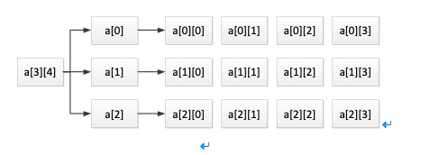

二维数组a是按行进行存放的，先存放a[0]行，再存放a[1]行、a[2]行，并且每行有四个元素，也是依次存放的。

- 二维数组在概念上是二维的：其下标在两个方向上变化，对其访问一般需要两个下标。

- 在内存中并不存在二维数组，二维数组实际的硬件存储器是连续编址的，`也就是说内存中只有一维数组`，即放完一行之后顺次放入第二行，和一维数组存放方式是一样的。


```c

#include <stdio.h>

int main()
{
	//定义了一个二维数组，名字叫a
	//由3个一维数组组成，这个一维数组是int [4]
	//这3个一维数组的数组名分别为a[0],a[1],a[2]
	int a[3][4];

	a[0][0] = 0;
	//……
	a[2][3] = 12;

	//给数组每个元素赋值
	int i = 0;
	int j = 0;
	int num = 0;
	for (i = 0; i < 3; i++)
	{
		for (j = 0; j < 4; j++)
		{
			a[i][j] = num++;
		}
	}

	//遍历数组，并输出每个成员的值
	for (i = 0; i < 3; i++)
	{
		for (j = 0; j < 4; j++)
		{
			printf("%d, ", a[i][j]);
		}
		printf("\n");
	}

	return 0;
}


```


### cdata4003b
## 3.2 二维数组的初始化

```c

//分段赋值 	int a[3][4] = {{ 1, 2, 3, 4 },{ 5, 6, 7, 8, },{ 9, 10, 11, 12 }};
	int a[3][4] = 
	{ 
		{ 1, 2, 3, 4 },
		{ 5, 6, 7, 8, },
		{ 9, 10, 11, 12 }
	};

	//连续赋值
	int a[3][4] = { 1, 2, 3, 4 , 5, 6, 7, 8, 9, 10, 11, 12  };

	//可以只给部分元素赋初值，未初始化则为0
	int a[3][4] = { 1, 2, 3, 4  };

	//所有的成员都设置为0
	int a[3][4] = {0};

	//[]中不定义元素个数，定义时必须初始化
	int a[][4] = { 1, 2, 3, 4, 5, 6, 7, 8};


```

### cdata4003c
## 3.3 数组名

数组名是一个地址的常量，代表数组中首元素的地址。

```c

#include <stdio.h>

int main()
{
	//定义了一个二维数组，名字叫a
	//二维数组是本质上还是一维数组，此一维数组有3个元素
//每个元素又是一个一维数组int[4]
	int a[3][4] = { 1, 2, 3, 4 , 5, 6, 7, 8, 9, 10, 11, 12  };

	//数组名为数组首元素地址，二维数组的第0个元素为一维数组
	//第0个一维数组的数组名为a[0]
	printf("a = %p\n", a);
	printf("a[0] = %p\n", a[0]);
	
	//测二维数组所占内存空间，有3个一维数组，每个一维数组的空间为4*4
	//sizeof(a) = 3 * 4 * 4 = 48
	printf("sizeof(a) = %d\n", sizeof(a));

	//测第0个元素所占内存空间，a[0]为第0个一维数组int[4]的数组名，4*4=16
	printf("sizeof(a[0]) = %d\n", sizeof(a[0]) );

	//测第0行0列元素所占内存空间，第0行0列元素为一个int类型，4字节
	printf("sizeof(a[0][0]) = %d\n", sizeof(a[0][0]));

	//求二维数组行数
	printf("i = %d\n", sizeof(a) / sizeof(a[0]));

	// 求二维数组列数
	printf("j = %d\n", sizeof(a[0]) / sizeof(a[0][0]));

	//求二维数组行*列总数
	printf("n = %d\n", sizeof(a) / sizeof(a[0][0]));

	return 0;
}


```


### cdata4003d
## 3.4 强化训练

```c

#include <stdio.h>

int main()
{
	//二维数组：  五行、三列
	//行代表人：  老大到老五
	//列代表科目：语、数、外
	float a[5][3] = { { 80, 75, 56 }, { 59, 65, 71 }, { 59, 63, 70 }, { 85, 45, 90 }, { 76, 77, 45 } };

	int i, j, person_low[3] = { 0 };
	float s = 0, lesson_aver[3] = { 0 };

	for (i = 0; i < 3; i++)
	{
		for (j = 0; j < 5; j++)
		{
			s = s + a[j][i];
			if (a[j][i] < 60)
			{
				person_low[i]++;
			}
		}

		lesson_aver[i] = s / 5;
		s = 0;
	}

	printf("各科的平均成绩:\n");
	for (i = 0; i < 3; i++)
	{
		printf("%.2f\n", lesson_aver[i]);
	}
		
	printf("各科不及格的人数:\n");
	for (i = 0; i < 3; i++)
	{
		printf("%d\n", person_low[i]);
	}
		
	return 0;
}


```

### cdata4004
# 4. 多维数组(了解)


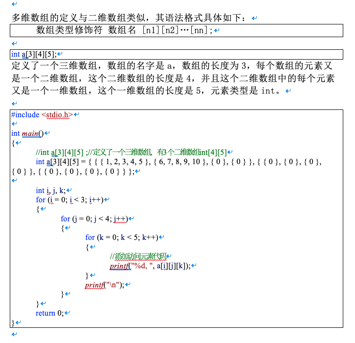


### cdata4005
# 5. 字符数组与字符串


### cdata4005a
## 5.1 字符数组与字符串区别

- C语言中没有字符串这种数据类型，可以通过char的数组来替代；

- 字符串一定是一个char的数组，但char的数组未必是字符串；

- `数字0(和字符‘\0’等价)结尾的char数组就是一个字符串`，但如果char数组没有以数字0结尾，那么就不是一个字符串，只是普通字符数组，所以`字符串是一种特殊的char的数组`。


```c

#include <stdio.h>

int main()
{
	char c1[] = { 'c', ' ', 'p', 'r', 'o', 'g' }; //普通字符数组
	printf("c1 = %s\n", c1); //乱码，因为没有’\0’结束符

	//以‘\0’(‘\0’就是数字0)结尾的字符数组是字符串
	char c2[] = { 'c', ' ', 'p', 'r', 'o', 'g', '\0'}; 
	printf("c2 = %s\n", c2);

	//字符串处理以‘\0’(数字0)作为结束符，后面的'h', 'l', 'l', 'e', 'o'不会输出
	char c3[] = { 'c', ' ', 'p', 'r', 'o', 'g', '\0', 'h', 'l', 'l', 'e', 'o', '\0'};
	printf("c3 = %s\n", c3);

	return 0;
}


```


### cdata4005b
## 5.2 字符串的初始化

```c

#include <stdio.h>

// C语言没有字符串类型，通过字符数组模拟
// C语言字符串，以字符‘\0’, 数字0
int main()
{
	//不指定长度, 没有0结束符，有多少个元素就有多长
	char buf[] = { 'a', 'b', 'c' };
	printf("buf = %s\n", buf);	//乱码

	//指定长度，后面没有赋值的元素，自动补0
	char buf2[100] = { 'a', 'b', 'c' };
char buf[1000]={“hello”};
	printf("buf2 = %s\n", buf2);

	//所有元素赋值为0
	char buf3[100] = { 0 };

	//char buf4[2] = { '1', '2', '3' };//数组越界

	char buf5[50] = { '1', 'a', 'b', '0', '7' };
	printf("buf5 = %s\n", buf5);

	char buf6[50] = { '1', 'a', 'b', 0, '7' };
	printf("buf6 = %s\n", buf6);

	char buf7[50] = { '1', 'a', 'b', '\0', '7' };
	printf("buf7 = %s\n", buf7);

	//使用字符串初始化，编译器自动在后面补0，常用
	char buf8[] = "agjdslgjlsdjg";

	//'\0'后面最好不要连着数字，有可能几个数字连起来刚好是一个转义字符
	//'\ddd'八进制字义字符，'\xdd'十六进制转移字符
	// \012相当于\n
	char str[] = "\012abc";
	printf("str == %s\n", str);

	return 0;
}


```


### cdata4005c
## 5.3 字符串的输入输出


由于字符串采用了'\0'标志，字符串的输入输出将变得简单方便。


```c

#include <stdio.h>

int  main()

{

 char str[100];

 printf("input string1 : \n");

 scanf("%s", str);//scanf(“%s”,str)默认以空格分隔

 printf("output:%s\n", str);

 return 0;

}

```


1. gets()


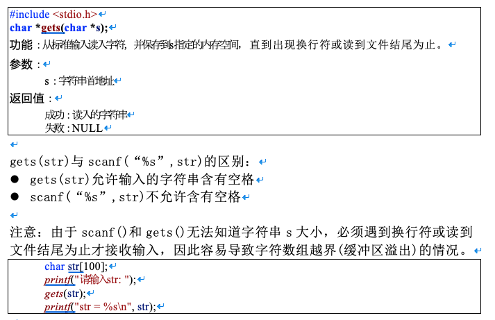


2. fgets()

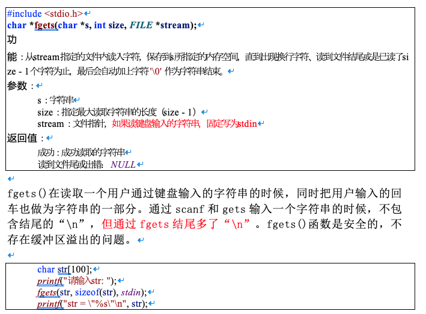


3. puts()

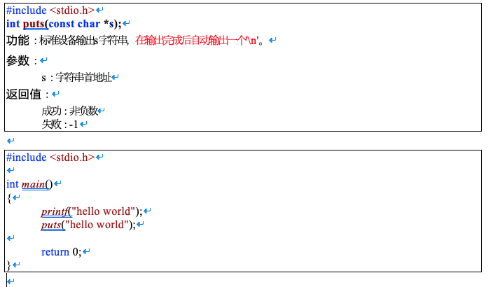


4. fputs()

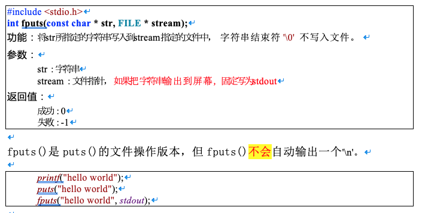


5. strlen()


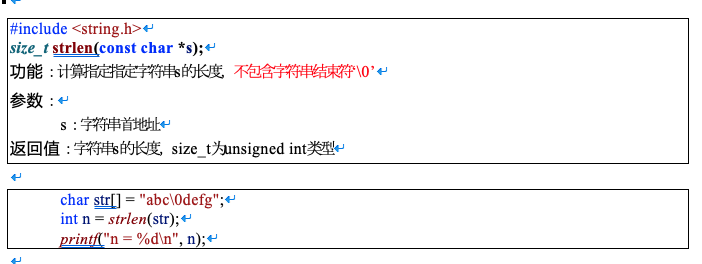


### cdata4005d
## 5.4 强化训练：字符串追加

```c

#include <stdio.h>

int  main()

{

 char str1[] = "abcdef";

 char str2[] = "123456";

 char dst[100];

 int i = 0;

 while (str1[i] != 0)

 {

 dst[i] = str1[i];

 i++;

 }

 int j = 0;

 while (str2[j] != 0)

 {

 dst[i + j] = str2[j];

 j++;

 }

 dst[i + j] = 0; //字符串结束符

 printf("dst = %s\n", dst);

 return 0;

}

```
