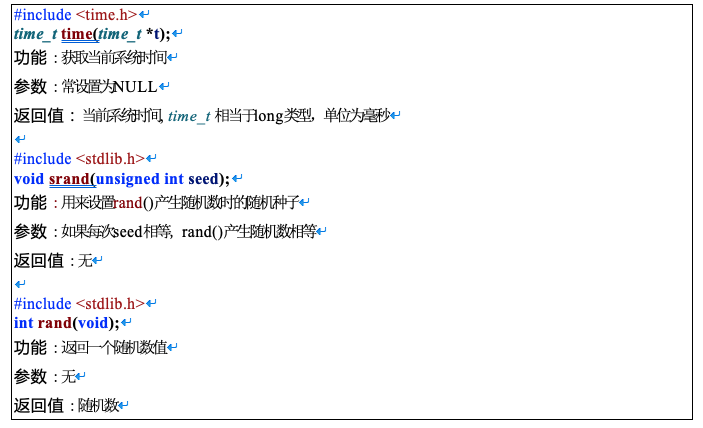
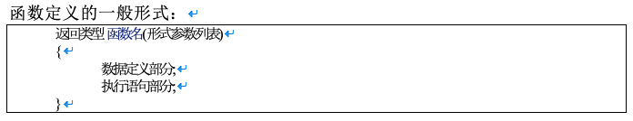
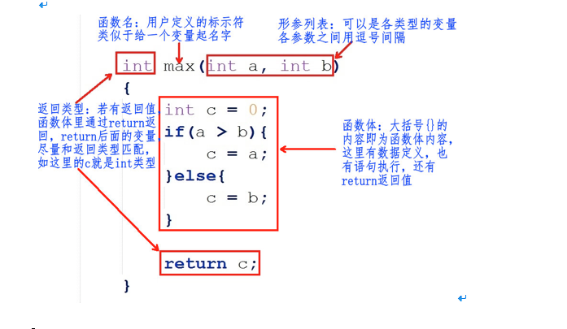
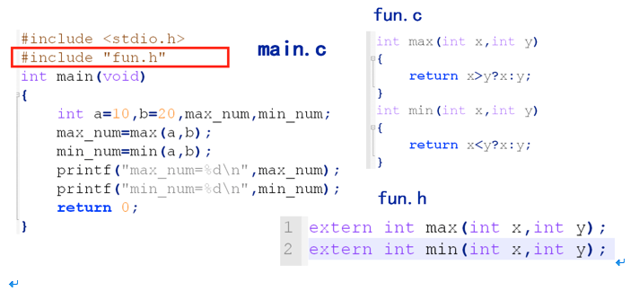
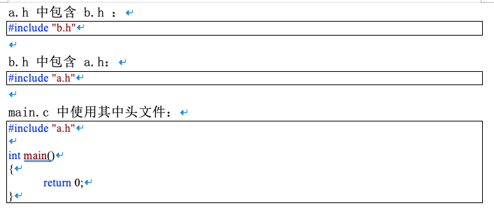
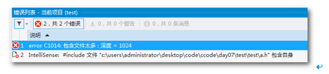

# 函数


# 目录

1. [概述](#cdata5001)
    1. [函数分类](#cdata5001a)
    2. [函数的作用](#cdata5001b)
    3. [函数的调用：产生随机数](#cdata5001c)
2. [函数的定义](#cdata5002)
    1. [ 函数定义格式](#cdata5002a) 
    2. [ 函数名字、形参、函数体、返回值](#cdata5002b) 
3. [函数的调用](#cdata5003)
    1. [函数执行流程](#cdata5003a)
    2. [函数的形参和实参](#cdata5003b)
    3. [无参函数调用](#cdata5003c)
    4. [有参函数调用](#cdata5003d)
    5. [函数返回值](#cdata5003e)
4. [函数的声明](#cdata5004)
5. [main函数与exit函数](#cdata5005)
6. [多文件(分文件)编程](#cdata5006)
    1. [分文件编程](#cdata5006a)
    2. [防止头文件重复包含](#cdata5006b)


### cdata5001
# 1. 概述


### cdata5001a
## 1.1 函数分类

C 程序是由函数组成的，我们写的代码都是由主函数 main()开始执行的。函数是 C 程序的基本模块，是用于完成特定任务的程序代码单元。

从函数定义的角度看，函数可分为系统函数和用户定义函数两种：

- `系统函数，即库函数`：这是由编译系统提供的，用户不必自己定义这些函数，可以直接使用它们，如我们常用的打印函数printf()。

- `用户定义函数`：用以解决用户的专门需要。


### cdata5001b
## 1.2 函数的作用

- 函数的使用可以省去重复代码的编写，降低代码重复率

```c

// 求两数的最大值
int max(int a, int b)
{
	if (a > b){
		return a;
	}
	else{
		return b;
	}
}

int main()
{
	// 操作1 ……
	// ……
	int a1 = 10, b1 = 20, c1 = 0;
	c1 = max(a1, b1); // 调用max()

	// 操作2 ……
	// ……
	int a2 = 11, b2 = 21, c2 = 0;
	c2 = max(a2, b2); // 调用max()

	// ……

	return 0;
}


```


- 函数可以让程序更加模块化，从而有利于程序的阅读，修改和完善

假如我们编写一个实现以下功能的程序：读入一行数字；对数字进行排序；找到它们的平均值；打印出一个柱状图。如果我们把这些操作直接写在main()里，这样可能会给用户感觉代码会有点凌乱。但，假如我们使用函数，这样可以让程序更加清晰、模块化：

```c

#include <stdio.h>

int main()
{
	float list[50];

	// 这里只是举例，函数还没有实现
	readlist(list, 50);
	sort(list, 50);
	average(list, 50);
	bargraph(list, 50);

	return 0;
}


```

这里我们可以这么理解，`程序就像公司，公司是由部门组成的，这个部门就类似于C程序的函数。`默认情况下，公司就是一个大部门( 只有一个部门的情况下 )，相当于C程序的main()函数。如果公司比较小( 程序比较小 )，因为任务少而简单，一个部门即可( main()函数 )胜任。但是，如果这个公司很大( 大型应用程序 )，任务多而杂，如果只是一个部门管理( 相当于没有部门，没有分工 )，我们可想而知，公司管理、运营起来会有多混乱，不是说这样不可以运营，只是这样不完美而已，如果根据公司要求分成一个个部门( 根据功能封装一个一个函数 )，招聘由行政部门负责，研发由技术部门负责等，这样就可以分工明确，结构清晰，方便管理，各部门之间还可以相互协调。


### cdata5001c
## 1.3 函数的调用：产生随机数

当调用函数时，需要关心5要素：

- `头文件`：包含指定的头文件

- `函数名字`：函数名字必须和头文件声明的名字一样

- `功能`：需要知道此函数能干嘛后才调用

- `参数`：参数类型要匹配

- `返回值`：根据需要接收返回值



```c

#include <stdio.h>
#include <time.h>
#include <stdlib.h>

int main()
{
	time_t tm = time(NULL);//得到系统时间
	srand((unsigned int)tm);//随机种子只需要设置一次即可

	int r = rand();
	printf("r = %d\n", r);

	return 0;
}


```


### cdata5002
# 2. 函数的定义

### cdata5002a
## 2.1  函数定义格式





### cdata5002b
## 2.2  函数名字、形参、函数体、返回值


1. 函数名

理论上是可以随意起名字，最好起的名字见名知意，应该让用户看到这个函数名字就知道这个函数的功能。注意，函数名的后面有个圆换号`()`，代表这个为函数，不是普通的变量名。

2. 形参列表

在定义函数时指定的形参，`在未出现函数调用时，它们并不占内存中的存储单元，`因此称它们是形式参数或虚拟参数，简称形参，表示它们并不是实际存在的数据，所以，形参里的变量不能赋值。

```c

void max(int a = 10, int b = 20) // error, 形参不能赋值
{
}

```

在定义函数时指定的形参，必须是，类型+变量的形式：

```c

//1: right, 类型+变量
void max(int a, int b)
{
}

//2: error, 只有类型，没有变量
void max(int, int)
{
}

//3: error, 只有变量，没有类型
int a, int b;
void max(a, b)
{
}


```


在定义函数时指定的形参，可有可无，根据函数的需要来设计，`如果没有形参，圆括号内容为空，或写一个void关键字`：

```c

// 没形参， 圆括号内容为空
void max()
{
}

// 没形参， 圆括号内容为void关键字
void max(void)
{
}


```


3. 函数体

花括号`{ }`里的内容即为函数体的内容，这里为`函数功能实现的过程`，这和以前的写代码没太大区别，以前我们把代码写在main()函数里，现在只是把这些写到别的函数里。

4. 返回值

函数的返回值是通过函数中的`return`语句获得的，`return`后面的值也可以是一个表达式。

a. 尽量保证return语句中表达式的值和函数返回类型是同一类型。

```c

int max() // 函数的返回值为int类型
{
	int a = 10;
	return a;// 返回值a为int类型，函数返回类型也是int，匹配
}


```

b. 如果函数返回的类型和return语句中表达式的值不一致，则以函数返回类型为准，即`函数返回类型决定返回值的类型`。对数值型数据，可以自动进行类型转换。

```c

double max() // 函数的返回值为double类型
{
	int a = 10;
	return a;// 返回值a为int类型，它会转为double类型再返回
}


```

`注意`：如果函数返回的类型和return语句中表达式的值不一致，而它又无法自动进行类型转换，程序则会报错。

c. return语句的另一个作用为中断return所在的执行函数，类似于break中断循环、switch语句一样。

```c

int max()
{
	return 1;// 执行到，函数已经被中断，所以下面的return 2无法被执行到
	return 2;// 没有执行
}


```

d. 如果函数带返回值，return后面必须跟着一个值，如果函数没有返回值，函数名字的前面必须写一个void关键字，这时候，我们写代码时也可以通过return中断函数(也可以不用)，只是这时，return后面不带内容( 分号“；”除外)。

```c

void max()// 最好要有void关键字
{
	return; // 中断函数，这个可有可无
}


```


### cdata5003
# 3. 函数的调用

`定义函数后，我们需要调用此函数才能执行到这个函数里的代码段`。这和main()函数不一样，main()为编译器设定好自动调用的主函数，无需人为调用，我们都是在main()函数里调用别的函数，`一个 C 程序里有且只有一个main()函数。`

### cdata5003a
## 3.1 函数执行流程

```c

#include <stdio.h>

void print_test()
{
	printf("this is for test\n");
}

int main()
{
	print_test();	// print_test函数的调用

	return 0;
}


```


1. **进入main()函数**

2. **调用print_test()函数**：

    1. 它会在main()函数的前寻找有没有一个名字叫`“print_test”`的函数定义；

    2. 如果找到，接着检查函数的参数，这里调用函数时没有传参，函数定义也没有形参，参数类型匹配；

    3. 开始执行`print_test()`函数，这时候，`main()`函数里面的执行会阻塞( 停 )在`print_test()`这一行代码，等待   `print_test()`函数的执行。

3. **print_test()函数执行完( 这里打印一句话 )，main()才会继续往下执行，执行到return 0, 程序执行完毕**。


### cdata5003b
## 3.2 函数的形参和实参

- 形参出现在函数定义中，在整个函数体内都可以使用，离开该函数则不能使用。
- 实参出现在主调函数中，进入被调函数后，实参也不能使用。
- 实参变量对形参变量的数据传递是“值传递”，即单向传递，只由实参传给形参，而不能由形参传回来给实参。
- 在调用函数时，编译系统临时给形参分配存储单元。调用结束后，形参单元被释放。
- 实参单元与形参单元是不同的单元。调用结束后，形参单元被释放，函数调用结束返回主调函数后则不能再使用该形参变量。实参单元仍保留并维持原值。`因此，在执行一个被调用函数时，形参的值如果发生改变，并不会改变主调函数中实参的值。`

### cdata5003c
## 3.3 无参函数调用

如果是调用无参函数，则不能加上“实参”，但括号不能省略。

```c

// 函数的定义
void test()
{
}

int main()
{
	// 函数的调用
	test();	// right, 圆括号()不能省略
	test(250); // error, 函数定义时没有参数

return 0;
}


```


### cdata5003d
## 3.4 有参函数调用

1. 如果实参表列包含多个实参，则各参数间用逗号隔开。

```c

// 函数的定义

void  test(int  a, int  b)

{

}

int  main()

{

  int  p = 10, q = 20;

  test(p, q); // 函数的调用

  return 0;

}

```


2. 实参与形参的个数应相等，类型应匹配(相同或赋值兼容)。实参与形参按顺序对应，一对一地传递数据。

3. 实参可以是常量、变量或表达式，`无论实参是何种类型的量，在进行函数调用时，它们都必须具有确定的值，以便把这些值传送给形参。`所以，这里的变量是在圆括号( )外面定义好、赋好值的变量。

```c

// 函数的定义
void test(int a, int b)
{
}

int main()
{
	// 函数的调用
	int p = 10, q = 20;
	test(p, q);	// right
	test(11, 30 - 10); // right

	test(int a, int b); // error, 不应该在圆括号里定义变量

	return 0;
}


```


### cdata5003e
## 3.5 函数返回值


1. 如果函数定义没有返回值，函数调用时不能写void关键字，调用函数时也不能接收函数的返回值。

```c

// 函数的定义
void test()
{
}

int main()
{
	// 函数的调用
	test(); // right
	void test(); // error, void关键字只能出现在定义，不可能出现在调用的地方
	int a = test();	// error, 函数定义根本就没有返回值

	return 0;
}


```


2. 如果函数定义有返回值，这个返回值我们根据用户需要可用可不用，但是，假如我们需要使用这个函数返回值，`我们需要定义一个匹配类型的变量来接收`。

```c

// 函数的定义, 返回值为int类型
int test()
{
}

int main()
{
	// 函数的调用
	int a = test(); // right, a为int类型
	int b;
	b = test();	// right, 和上面等级

	char *p = test(); // 虽然调用成功没有意义, p为char *, 函数返回值为int, 类型不匹配

	// error, 必须定义一个匹配类型的变量来接收返回值
	// int只是类型，没有定义变量
	int = test();	
	
	// error, 必须定义一个匹配类型的变量来接收返回值
	// int只是类型，没有定义变量
	int test();
	
	return 0;
}


```


### cdata5004
# 4. 函数的声明

- 如果使用用户自己定义的函数，而该函数与调用它的函数（即主调函数）不在同一文件中，或`者函数定义的位置在主调函数之后`，则必须在调用此函数之前对被调用的函数作声明。

- 所谓函数声明，就是在函数尚在未定义的情况下，事先将该函数的有关信息通知编译系统，相当于告诉编译器，函数在后面定义，以便使编译能正常进行。

- **注意**：一个函数只能被定义一次，但可以声明多次。

```c

#include <stdio.h>

int max(int x, int y); // 函数的声明，分号不能省略
// int max(int, int); // 另一种方式

int main()
{
	int a = 10, b = 25, num_max = 0;
	num_max = max(a, b); // 函数的调用

	printf("num_max = %d\n", num_max);

	return 0;
}

// 函数的定义
int max(int x, int y)
{
	return x > y ? x : y;
}


```


**函数定义和声明的区别：**

1. 定义是指对函数功能的确立，包括指定函数名、函数类型、形参及其类型、函数体等，它是一个完整的、独立的函数单位。

2. 声明的作用则是把函数的名字、函数类型以及形参的个数、类型和顺序(注意，不包括函数体)通知编译系统，以便在对包含函数调用的语句进行编译时，据此对其进行对照检查（例如函数名是否正确，实参与形参的类型和个数是否一致）。

### cdata5005
# 5. main函数与exit函数

在main函数中调用exit和return结果是一样的，但在子函数中调用return只是代表子函数终止了，在子函数中调用exit，那么程序终止。

```c

#include <stdio.h>
#include <stdlib.h>

void fun()
{
	printf("fun\n");
	//return;
	exit(0);
}

int main()
{
	fun();
	while (1);

	return 0;
}


```


### cdata5006
# 6. 多文件(分文件)编程


### cdata5006a
## 6.1 分文件编程


- 把函数声明放在头文件xxx.h中，在主函数中包含相应头文件

- 在头文件对应的xxx.c中实现xxx.h声明的函数




### cdata5006b
## 6.2 防止头文件重复包含


当一个项目比较大时，往往都是分文件，这时候有可能不小心把同一个头文件 include 多次，或者头文件嵌套包含。




编译上面的例子，会出现如下错误：





为了避免同一个文件被include多次，C/C++中有两种方式，一种是 #ifndef 方式，一种是 #pragma once 方式。

方法一：

```c

#ifndef __SOMEFILE_H__
#define __SOMEFILE_H__

// 声明语句

#endif


```


方法二：


```c


#pragma once

// 声明语句


```
