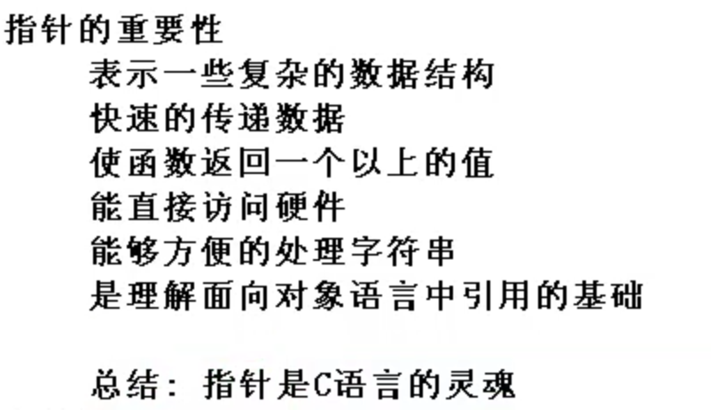
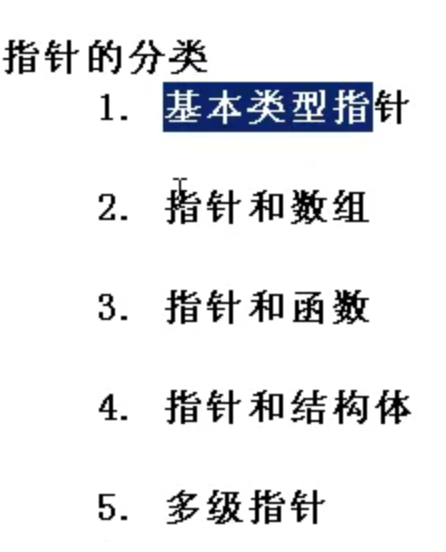
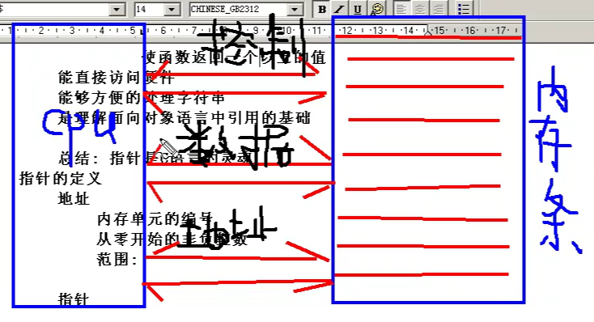
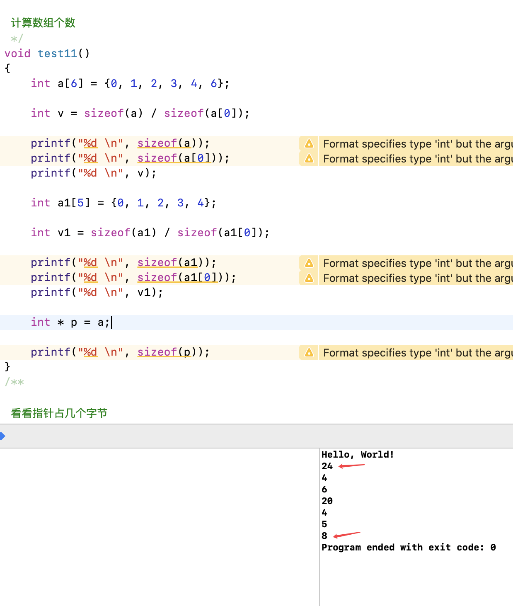

- 指针就是地址, 地址解释指针
- 地址就是内存单元的编号
- 指针变量是存放地址的变量
- 指针和指针变量是两个不同的概念
- 但是要注意: 通常我们叙述时会把指针变量简称为指针, 实际上它们含义并不一样
- 指针的本质就是一个操作受限的非负整数



#   char:占一个字节分配一个地址

#   int: 占四个字节分配四个地址

#   double 8个字节


# 内存里最小单元是一个字节


一个字节(Byte) = 8位(bit)

1KB( Kilobyte，千字节)=1024B [6] 

1MB( Megabyte，兆字节)=1024KB [6] 

1GB( Gigabyte，吉字节，千兆)=1024MB [6] 

1TB( Trillionbyte，万亿字节，太字节)=1024GB [6] 

1PB( Petabyte，千万亿字节，拍字节)=1024TB [6] 

1EB( Exabyte，百亿亿字节，艾字节)=1024PB [6] 

1 ZB(Zettabyte，十万亿亿字节，泽字节)=1024EB [6] 

1YB( Yottabyte，一亿亿亿字节，尧字节)=1024ZB [6] 

BB( Brontobyte，千亿亿亿字节)=1024YB [6]


# 地址线就是地址总线





地址总线为n, 那么可寻址2的n次方

2的32次方

2的10次方 = 1024 字节

1024x1024   KB( Kilobyte，千字节)

1024x1024x1024 = 1GB( Gigabyte，吉字节，千兆

1024x1024x1024 * 2 * 2 =  1GB * 4 = 4GB 

所以32位的电脑最高寻址为4GB


64位的话

1024x1024x1024 x 1024x1024x1024 * 2 x 2 x 2 x 2


# int * p的意思

`p`是变量
`int *` 是数据类型, 代表存放`int`类型的指针

```c

//

// main.cpp

// pointer

//

// Created by codew on 8/2/20.

// Copyright © 2020 codertom. All rights reserved.

//

#include <iostream>

using  namespace  std;

int main(int argc, const char * argv[]) {

  // insert code here...

  std::cout << "Hello, World!\n";

 int * p;

 int i = 3;

 int j;

 p = &i;

 cout << "*p = " << *p << endl;

 return 0;

}

```

- p 保存i的地址
- p执行i
- 因为p指向i所以`*p` 就是i


# & 取地址符


# 指针和数组

## 指针和一维数组

数组名

```c

/**

 一维数组名就是第一个元素的地址

 一维数组是常量不可改变

 */

void  test6()

{

 int a[5] = {0, 1, 2, 3, 4};

 int b[5] = {0, 1, 2, 3, 4};

 printf("%#x \n", a);

 printf("%#x \n", &a[0]);

  // 一维数组是常量不可改变

// a = &b[2];

 for (int i = 0; i < 5; i++){

 printf("%d \n", a[i]);

 }

}

```

下标和指针的关系, 确定一个数组

```c

void  test7()

{

 int a[5] = {0, 1, 2, 3, 4};

 showArr(a, 5);

}

void changeArr(int * pArr)

{

 pArr[3] = 88;

}

void showArr(int * pArr, int len)

{

 for (int i = 0; i < len; i++) {

// printf("%d", *(pArr+i) );

 // 也可以写成

 printf("%d", pArr[i] );

 }

}

/**

 一维数组名就是第一个元素的地址

 一维数组是常量不可改变

 */

void  test6()

{

 int a[5] = {0, 1, 2, 3, 4};

 int b[5] = {0, 1, 2, 3, 4};

 printf("%x \n", a);

 printf("%#x \n", &a[0]);

  // 一维数组是常量不可改变

// a = &b[2];

 for (int i = 0; i < 5; i++){

 printf("%d \n", a[i]);

 }

}

```


3. 指针变量的运算

指针变量不能 `加` `乘` `除`

如果`两个`**指针变量**指向的是**同一块**`连续空间`中的`不同存储单`元, 则这两个指针变量才`可以相减`


```c

/**

 指针相减

 */

void  test9()

{

 int a[5] = {0, 1, 2, 3, 4};

 int *p = a;

 int *q = &a[4];

 int value = q - p;

 // 4

 printf("两个元素相隔%d个单元", value);

}

```


# 一个指针变量到底占几个字节

64位的指针是8个字节

32位的指针是4个字节

armv7l(我的树莓派) 是32位

centos 64位测试一样ok


# sizeof 数组名时是求的是整个数组多少字节, 当用指针包裹一下却是算的指针的大小


```c

/**

 计算数组个数

 */

void  test11()

{

 int a[6] = {0, 1, 2, 3, 4, 6};

 int v = sizeof(a) / sizeof(a[0]);

 printf("%d \n", sizeof(a));

 printf("%d \n", sizeof(a[0]));

 printf("%d \n", v);

 int a1[5] = {0, 1, 2, 3, 4};

 int v1 = sizeof(a1) / sizeof(a1[0]);

 printf("%d \n", sizeof(a1));

 printf("%d \n", sizeof(a1[0]));

 printf("%d \n", v1);

 int * p = a;

 printf("%d \n", sizeof(p));

}

```




#  万能指针void *