# 文件操作

# 目录

1. [概述](#c9data001)
    1. [磁盘文件和设备文件](#c9data001a)
    2. [ 磁盘文件的分类](#c9data001b)
    3. [文本文件和二进制文件](#c9data001c)
2. [文件的打开和关闭](#c9data002)
    1. [文件指针](#c9data002a) 
    2. [文件的打开](#c9data002b) 
    3. [文件的关闭](#c9data002c) 
3. [文件的顺序读写](#c9data003)
    1. [按照字符读写文件fgetc、fputc](#c9data003a) 
    2. [按照行读写文件fgets、fputs](#c9data003b) 
    3. [按照格式化文件fprintf、fscanf](#c9data003c) 
    4. [按照块读写文件fread、fwrite](#c9data003d) 
4. [文件的随机读写](#c9data004)
5. [Windows和Linux文本文件区别](#c9data005)
6. [获取文件状态](#c9data006)
7. [删除文件、重命名文件名](#c9data007)
8. [文件缓冲区](#c9data008)
    1. [文件缓冲区](#c9data008a)
    2. [磁盘文件的存取](#c9data008b)
    3. [更新缓冲区](#c9data008c)


### c9data001
# 1. 概述

### c9data001a
## 1.1 磁盘文件和设备文件

- 磁盘文件

指一组相关数据的有序集合,通常存储在外部介质(如磁盘)上，使用时才调入内存。

- 设备文件

在操作系统中把每一个与主机相连的输入、输出设备看作是一个文件，把它们的输入、输出等同于对磁盘文件的读和写。


### c9data001b
## 1.2 磁盘文件的分类

计算机的存储在物理上是二进制的，所以物理上所有的磁盘文件本质上都是一样的：以字节为单位进行顺序存储。

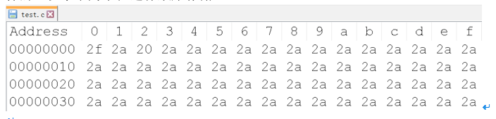


从用户或者操作系统使用的角度（逻辑上）把文件分为：

- 文本文件：基于字符编码的文件 

- 二进制文件：基于值编码的文件

### c9data001c
## 1.3 文本文件和二进制文件


1. 文本文件
- 基于字符编码，常见编码有ASCII、UNICODE等

- 一般可以使用文本编辑器直接打开

- 数5678的以ASCII存储形式(ASCII码)为：

  - 00110101 00110110 00110111 00111000

2. 二进制文件

- 基于值编码,自己根据具体应用,指定某个值是什么意思

- 把内存中的数据按其在内存中的存储形式原样输出到磁盘上

- 数5678的存储形式(二进制码)为：

  - 00010110 00101110


### c9data002
# 2. 文件的打开和关闭


### c9data002a
## 2.1 文件指针

在C语言中用一个指针变量指向一个文件，这个指针称为文件指针。


```c

typedef struct
{
	short           level;	//缓冲区"满"或者"空"的程度 
	unsigned        flags;	//文件状态标志 
	char            fd;		//文件描述符
	unsigned char   hold;	//如无缓冲区不读取字符
	short           bsize;	//缓冲区的大小
	unsigned char   *buffer;//数据缓冲区的位置 
	unsigned        ar;	 //指针，当前的指向 
	unsigned        istemp;	//临时文件，指示器
	short           token;	//用于有效性的检查 
}FILE;


```


FILE是系统使用typedef定义出来的有关文件信息的一种结构体类型，`结构中含有文件名、文件状态和文件当前位置等信息。`

声明FILE结构体类型的信息包含在头文件“stdio.h”中，一般设置一个指向FILE类型变量的指针变量，然后通过它来引用这些FILE类型变量。通过文件指针就可对它所指的文件进行各种操作。

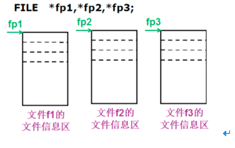

C语言中有三个特殊的文件指针由系统默认打开，`用户无需定义即可直接使用`:

- `stdin`： 标准输入，默认为当前终端（键盘），我们使用的scanf、getchar函数默认从此终端获得数据。

- `stdout`：标准输出，默认为当前终端（屏幕），我们使用的printf、puts函数默认输出信息到此终端。

- `stderr`：标准出错，默认为当前终端（屏幕），我们使用的perror函数默认输出信息到此终端。

### c9data002b
## 2.2 文件的打开

任何文件使用之前必须打开：

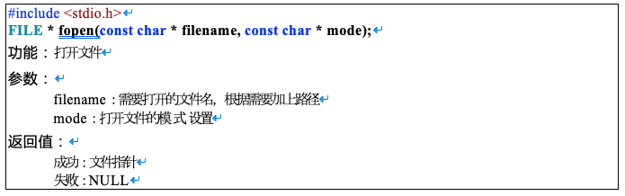

第一个参数的几种形式:

```c

	FILE *fp_passwd = NULL;

	//相对路径：
	//打开当前目录passdw文件：源文件(源程序)所在目录
	FILE *fp_passwd = fopen("passwd.txt", "r");
	
	//打开当前目录(test)下passwd.txt文件
	fp_passwd = fopen(". / test / passwd.txt", "r");
	
	//打开当前目录上一级目录（相对当前目录）passwd.txt文件
	fp_passwd = fopen(".. / passwd.txt", "r");
		
	//绝对路径：
	//打开C盘test目录下一个叫passwd.txt文件
	fp_passwd = fopen("c:/test/passwd.txt","r");


```

第二个参数的几种形式(打开文件的方式)：

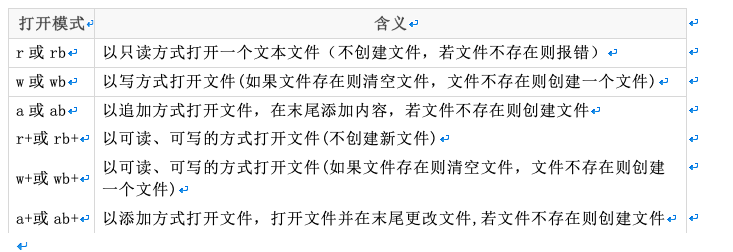


**注意：**

- b是二进制模式的意思，b只是在Windows有效，在Linux用r和rb的结果是一样的

- Unix和Linux下所有的文本文件行都是\n结尾，而Windows所有的文本文件行都是\r\n结尾

- 在Windows平台下，以“文本”方式打开文件，不加b：

  - 当读取文件的时候，系统会将所有的 "\r\n" 转换成 "\n"

  - 当写入文件的时候，系统会将 "\n" 转换成 "\r\n" 写入

  - `以"二进制"方式打开文件，则读写都不会进行这样的转换`

- 在Unix/Linux平台下，“文本”与“二进制”模式没有区别，"\r\n" 作为两个字符原样输入输出


```c

int main(void)
{
	FILE *fp = NULL;

	// "\\"这样的路径形式，只能在windows使用
	// "/"这样的路径形式，windows和linux平台下都可用，建议使用这种
	// 路径可以是相对路径，也可是绝对路径
	fp = fopen("../test", "w");
	//fp = fopen("..\\test", "w");

	if (fp == NULL) //返回空，说明打开失败
	{
		//perror()是标准出错打印函数，能打印调用库函数出错原因
		perror("open");
		return -1;
	}

	return 0;
}


```


### c9data002c
## 2.3 文件的关闭


任何文件在使用后应该关闭：

- 打开的文件会占用内存资源，如果总是打开不关闭，会消耗很多内存

- 一个进程同时打开的文件数是有限制的，超过最大同时打开文件数，再次调用fopen打开文件会失败

- 如果没有明确的调用fclose关闭打开的文件，那么程序在退出的时候，操作系统会统一关闭。

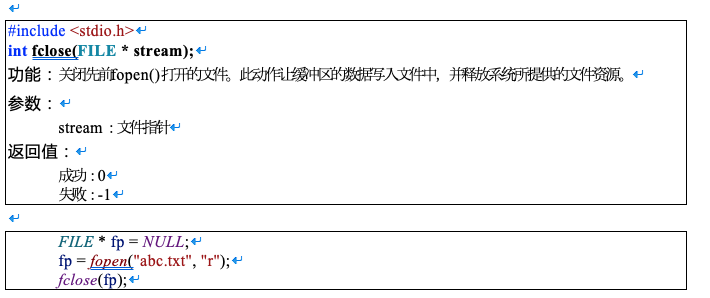
### c9data003
# 3. 文件的顺序读写


### c9data003a
## 3.1 按照字符读写文件fgetc、fputc

1. 写文件

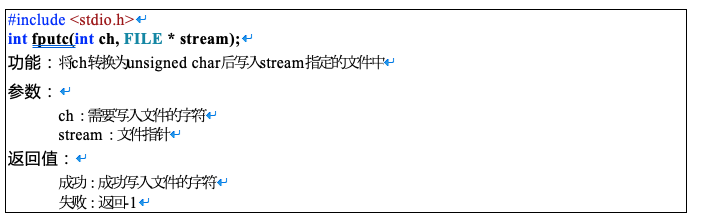


```c

char buf[] = "this is a test for fputc";
int i = 0;
int n = strlen(buf);
for (i = 0; i < n; i++)
{
	//往文件fp写入字符buf[i]
	int ch = fputc(buf[i], fp);
	printf("ch = %c\n", ch);
}


```


2. 文件结尾

在C语言中，EOF表示文件结束符(end of file)。在while循环中以EOF作为文件结束标志，`这种以EOF作为文件结束标志的文件，必须是文本文件`。在文本文件中，数据都是以字符的ASCII代码值的形式存放。我们知道，ASCII代码值的范围是0~127，不可能出现-1，因此可以用EOF作为文件结束标志。


```c

#define EOF     (-1)


```

当把数据以二进制形式存放到文件中时，就会有-1值的出现，因此不能采用EOF作为二进制文件的结束标志。为解决这一个问题，ANSI C提供一个feof函数，用来判断文件是否结束。**feof函数既可用以判断二进制文件又可用以判断文本文件。**

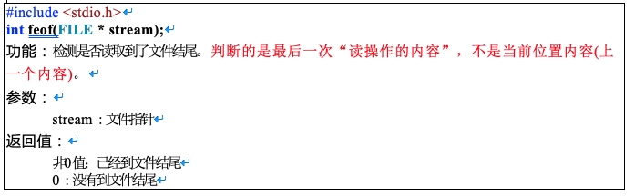


3. 读文件
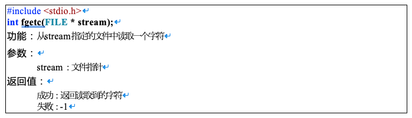


```c

char ch;
#if 0
while ((ch = fgetc(fp)) != EOF)
{
	printf("%c", ch);
}
printf("\n");
#endif

while (!feof(fp)) //文件没有结束，则执行循环
{
	ch = fgetc(fp);
	printf("%c", ch);
}
printf("\n");


```


4. 强化训练：实现vi、cat命令

略~

### c9data003b
## 3.2 按照行读写文件fgets、fputs


1. 写文件
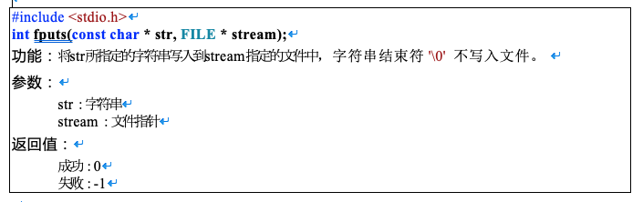

```c

char *buf[] = { "123456\n", "bbbbbbbbbb\n", "ccccccccccc\n" };
int i = 0;
int n = 3;
for (i = 0; i < n; i++)
{
	int len = fputs(buf[i], fp);
	printf("len = %d\n", len);
}


```


2. 读文件

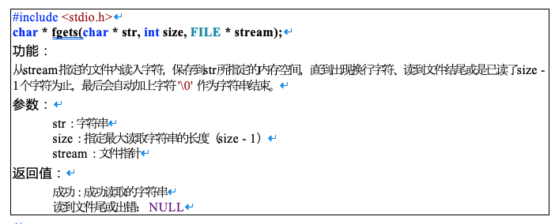

```c

char buf[100] = 0;

while (!feof(fp)) //文件没有结束
{
	memset(buf, 0, sizeof(buf));
	char *p = fgets(buf, sizeof(buf), fp);
	if (p != NULL)
	{
		printf("buf = %s", buf);
	}
}


```


### c9data003c
## 3.3 按照格式化文件fprintf、fscanf

1. 写文件
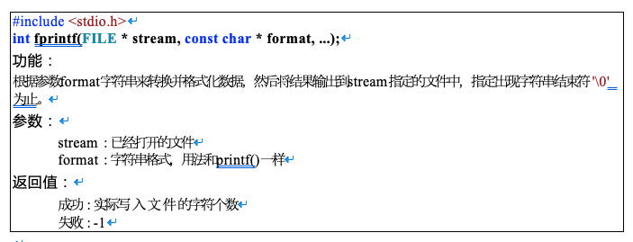


```c

fprintf(fp, "%d %d %d\n", 1, 2, 3);

```

2. 读文件
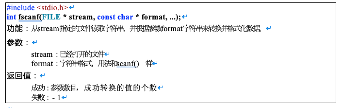


```c

int a = 0;
int b = 0;
int c = 0;
fscanf(fp, "%d %d %d\n", &a, &b, &c);
printf("a = %d, b = %d, c = %d\n", a, b, c);


```

### c9data003d
## 3.4 按照块读写文件fread、fwrite

1. 写文件

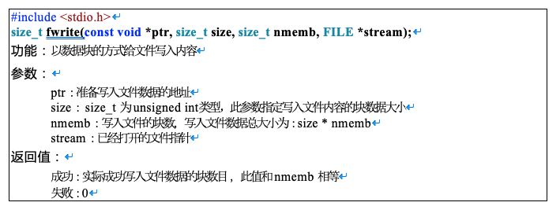


```c

typedef struct Stu
{
	char name[50];
	int id;
}Stu;

Stu s[3];
int i = 0;
for (i = 0; i < 3; i++)
{
	sprintf(s[i].name, "stu%d%d%d", i, i, i);
	s[i].id = i + 1;
}

int ret = fwrite(s, sizeof(Stu), 3, fp);
printf("ret = %d\n", ret);


```

2. 读文件
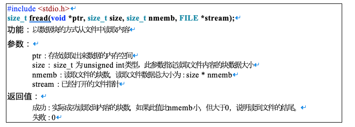

```c

typedef struct Stu
{
	char name[50];
	int id;
}Stu;

Stu s[3];
int ret = fread(s, sizeof(Stu), 3, fp);
printf("ret = %d\n", ret);

int i = 0;
for (i = 0; i < 3; i++)
{
	printf("s = %s, %d\n", s[i].name, s[i].id);
}


```


### c9data004
# 4. 文件的随机读写
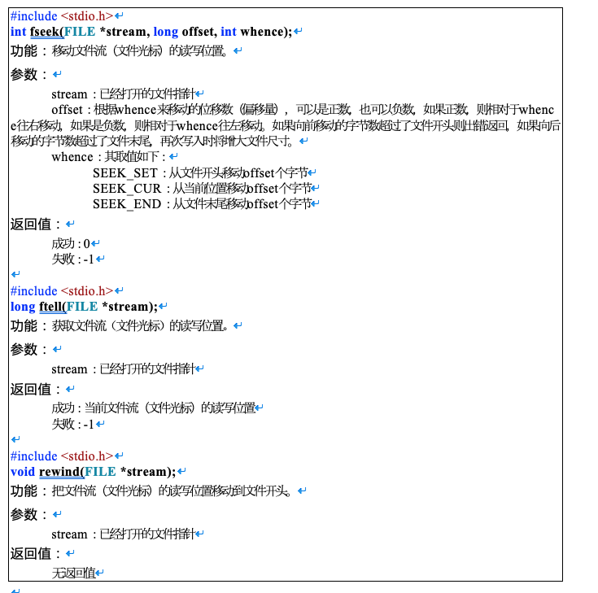


```c


typedef struct Stu
{
	char name[50];
	int id;
}Stu;

//假如已经往文件写入3个结构体
//fwrite(s, sizeof(Stu), 3, fp);

Stu s[3];
Stu tmp; 
int ret = 0;

//文件光标读写位置从开头往右移动2个结构体的位置
fseek(fp, 2 * sizeof(Stu), SEEK_SET);

//读第3个结构体
ret = fread(&tmp, sizeof(Stu), 1, fp);
if (ret == 1)
{
	printf("[tmp]%s, %d\n", tmp.name, tmp.id);
}

//把文件光标移动到文件开头
//fseek(fp, 0, SEEK_SET);
rewind(fp);

ret = fread(s, sizeof(Stu), 3, fp);
printf("ret = %d\n", ret);

int i = 0;
for (i = 0; i < 3; i++)
{
	printf("s === %s, %d\n", s[i].name, s[i].id);
}


```

### c9data005
# 5.Windows和Linux文本文件区别


- b是二进制模式的意思，b只是在Windows有效，在Linux用r和rb的结果是一样的

- Unix和Linux下所有的文本文件行都是\n结尾，而Windows所有的文本文件行都是\r\n结尾

- 在Windows平台下，以“文本”方式打开文件，不加b：
     - 当读取文件的时候，系统会将所有的 "\r\n" 转换成 "\n"
     - 当写入文件的时候，系统会将 "\n" 转换成 "\r\n" 写入
     - 以"二进制"方式打开文件，则读\写都不会进行这样的转换

- 在Unix/Linux平台下，“文本”与“二进制”模式没有区别，"\r\n" 作为两个字符原样输入输出


判断文本文件是Linux格式还是Windows格式:

```c


#include<stdio.h>

int main(int argc, char **args)
{
	if (argc < 2)
		return 0;

	FILE *p = fopen(args[1], "rb");
	if (!p)
		return 0;

	char a[1024] = { 0 };
	fgets(a, sizeof(a), p);

	int len = 0;
	while (a[len])
	{
		if (a[len] == '\n')
		{
			if (a[len - 1] == '\r')
			{
				printf("windows file\n");
			}
			else
			{
				printf("linux file\n");
			}
		}
		len++;
	}

	fclose(p);

	return 0;
}


```


### c9data006
# 6.获取文件状态

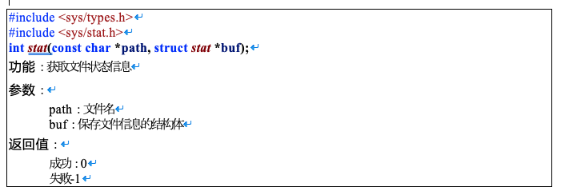

```c

struct stat {
	dev_t         st_dev;         //文件的设备编号
	ino_t         st_ino;          //节点
	mode_t        st_mode;   //文件的类型和存取的权限
	nlink_t       st_nlink;     //连到该文件的硬连接数目，刚建立的文件值为1
	uid_t         st_uid;         //用户ID
	gid_t         st_gid;         //组ID
	dev_t         st_rdev;      //(设备类型)若此文件为设备文件，则为其设备编号
	off_t         st_size;        //文件字节数(文件大小)
	unsigned long st_blksize;   //块大小(文件系统的I/O 缓冲区大小)
	unsigned long st_blocks;    //块数
	time_t        st_atime;     //最后一次访问时间
	time_t        st_mtime;    //最后一次修改时间
	time_t        st_ctime;     //最后一次改变时间(指属性)
};


```


```c

#include <sys/types.h>
#include <sys/stat.h>
#include <stdio.h>

int main(int argc, char **args)
{
	if (argc < 2)
		return 0;

	struct stat st = { 0 };

	stat(args[1], &st);
	int size = st.st_size;//得到结构体中的成员变量
	printf("%d\n", size);
	return 0;
}


```


### c9data007
# 7.删除文件、重命名文件名

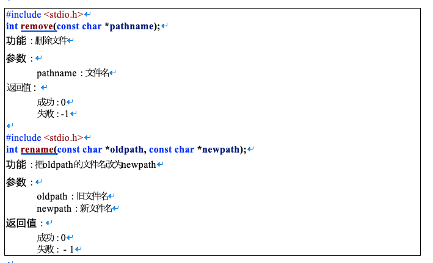

### c9data008
# 8. 文件缓冲区

### c9data008a
## 8.1 文件缓冲区


- ANSI C标准采用“缓冲文件系统”处理数据文件。

- 所谓缓冲文件系统是指系统自动地在内存区为程序中每一个正在使用的文件开辟一个文件缓冲区从内存向磁盘输出数据必须先送到内存中的缓冲区，装满缓冲区后才一起送到磁盘去。

- 如果从磁盘向计算机读入数据，则一次从磁盘文件将一批数据输入到内存缓冲区(充满缓冲区)，然后再从缓冲区逐个地将数据送到程序数据区(给程序变量) 。

### c9data008b
## 8.2 磁盘文件的存取
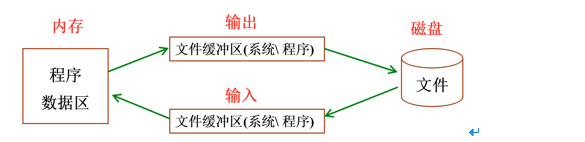


- 磁盘文件，一般保存在硬盘、U盘等掉电不丢失的磁盘设备中，在需要时调入内存

- 在内存中对文件进行编辑处理后，保存到磁盘中

- 程序与磁盘之间交互，不是立即完成，系统或程序可根据需要设置缓冲区，以提高存取效率

### c9data008c
## 8.3 更新缓冲区

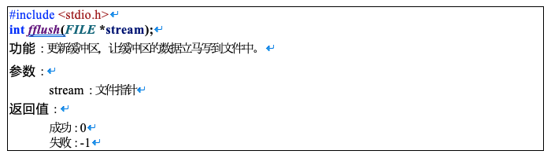


