# c高级


# 目录

1. [技术层次](#chighdata001)
2. [C语言概述](#chighdata002)
    1. [C语言的起源](#chighdata002a)
    2. [使用C语言的理由](#chighdata002b)
    3. [C语言标准](#chighdata002c)
3. [内存分区](#chighdata003)
    1. [数据类型](#chighdata003a)
    2. [变量](#chighdata003b)
    3. [程序的内存分区模型](#chighdata003c)
    4. [栈的生长方向和内存存放方向](#chighdata003d)
4. [指针强化](#chighdata004)
    1. [指针是一种数据类型](#chighdata004a)
    2. [指针的意义_间接赋值](#chighdata004b)
    3. [指针做函数参数](#chighdata004c)
    4. [字符串指针强化](#chighdata004d)
    5. [一级指针易错点](#chighdata004e)
    6. [const使用](#chighdata004f)
5. [指针的指针(二级指针)](#chighdata005)
    1. [二级指针基本概念](#chighdata005a)
    2. [二级指针做形参输出特性](#chighdata005b)
    3. [二级指针做形参输入特性](#chighdata005c)
    4. [强化训练_画出内存模型图](#chighdata005d)
    5. [多级指针](#chighdata005e)
6. [多维数组](#chighdata006)
    1. [一维数组](#chighdata006a)
    2. [多维数组](#chighdata006b)
    3. [总结](#chighdata006c)
     
7. [结构体](#chighdata007)
    1. [结构体基础知识](#chighdata007a) 
        1. [结构体类型的定义](#chighdata007a1) 
        2. [结构体变量的定义](#chighdata007a2) 
        3. [结构体变量的初始化](#chighdata007a3) 
        4. [结构体成员的使用](#chighdata007a4) 
        5. [结构体赋值](#chighdata007a5) 
        6. [结构体数组](#chighdata007a6) 
    2. [结构体嵌套指针](#chighdata007b) 
    3. [结构体成员偏移量](#chighdata007c) 
    4. [结构体字节对齐](#chighdata007d) 


8. [文件操作](#chighdata008)
    1. [文件相关概念](#chighdata008a)
    2. [文件的操作](#chighdata008b)
        1. [文件流总览](#chighdata008b1)
        2. [文件指针](#chighdata008b2)
        3. [文件缓冲区](#chighdata008b3)
        4. [文件打开关闭](#chighdata008b4)
        5. [文件读写函数回顾](#chighdata008b5)
    3. [文件读写案例](#chighdata008c)
     
9. [链表](#chighdata009)
    1. [链表基本概念](#chighdata009a) 
        1. [什么是链表](#chighdata009a1)
        2. [有关结构体的自身引用](#chighdata009a2)
        3. [链表节点](#chighdata009a3)
        4. [链表的分类](#chighdata009a4)
    2. [链表基本操作](#chighdata009b) 
        1. [创建链表](#chighdata009b1)
        2. [遍历链表](#chighdata009b2)
        3. [插入节点](#chighdata009b3)
        4. [删除节点](#chighdata009b4)
        5. [销毁链表](#chighdata009b5)
10. [函数指针和回调函数](#chighdata010)
    1. [函数指针](#chighdata010a) 
        1. [函数类型](#chighdata010a1)
        2. [函数指针(指向函数的指针)](#chighdata010a2)
        3. [函数指针数组](#chighdata010a3)
        4. [函数指针做函数参数(回调函数)](#chighdata010a4)
11. [预处理](#chighdata011)
    1. [预处理的基本概念](#chighdata011a) 
    2. [文件包含指令(#include)](#chighdata011b) 
    3. [宏定义](#chighdata011c) 
    4. [](#chighdata011d) 
    5. [](#chighdata011e) 
12. [动态库的封装和使用](#chighdata012)
13. [递归函数](#chighdata013)
14. [面向接口编程](#chighdata014)
15. [位运算](#chighdata015)
    1. [位逻辑运算符](#chighdata015a)
    2. [移位运算符](#chighdata015b)


### chighdata015
# 15. 位运算

可以使用C对变量中的个别位进行操作。您可能对人们想这样做的原因感到奇怪。这种能力有时确实是必须的，或者至少是有用的。C提供位的逻辑运算符和移位运算符。在以下例子中，我们将使用二进制计数法写出值，以便您可以了解对位发生的操作。在一个实际程序中，您可以使用一般的形式的整数变量或常量。例如不适用00011001的形式，而写为25或者031或者0x19.在我们的例子中，我们将使用8位数字，从左到右，每位的编号是7到0。

### chighdata015a
## 15.1 位逻辑运算符

### 15.1.1 按位取反`~`

一元运算符~将每个1变为0，将每个0变为1，如下面的例子：

```c

~(10011010)
01100101

```

假设a是一个unsigned char，已赋值为2.在二进制中，2是00000010.于是-a的值为11111101或者253。请注意该运算符不会改变a的值，a仍为2。

```c

unsigned char a = 2;   //00000010
unsigned char b = ~a;  //11111101
printf("ret = %d\n", a); //ret = 2
printf("ret = %d\n", b); //ret = 253

```


### 15.1.2 位与（`AND`）: `&`

二进制运算符&通过对两个操作数逐位进行比较产生一个新值。对于每个位，只有两个操作数的对应位都是1时结果才为1。

```c

   (10010011) 
 & (00111101) 
 = (00010001)

```


C也有一个组合的位与-赋值运算符：&=。下面两个将产生相同的结果：

```c

val &= 0377
val = val & 0377

```


### 15.1.3 位或（`OR`）:`|`

二进制运算符|通过对两个操作数逐位进行比较产生一个新值。对于每个位，如果其中任意操作数中对应的位为1，那么结果位就为1.

```c

	(10010011)
  | (00111101)
  = (10111111)

```

C也有组合位或-赋值运算符： |=

```c

val |= 0377
val = val | 0377

```


### 15.1.4 位异或: 

二进制运算符^对两个操作数逐位进行比较。对于每个位，如果操作数中的对应位有一个是1(但不是都是1)，那么结果是1.如果都是0或者都是1，则结果位0.


```c

	(10010011)
  ^ (00111101)
  = (10101110)

```


C也有一个组合的位异或-赋值运算符： ^=

```c

val ^= 0377
val = val ^ 0377

```


### 15.1.5 用法

### 15.1.5.1 打开位

已知：10011010：

1. 将位2打开

flag |  10011010

```c

(10011010)
|(00000100)
=(10011110)

```

2. 将所有位打开。

flag | ~flag

```c

(10011010)
|(01100101)
=(11111111)

```

### 15.1.5.2 关闭位

flag & ~flag

```c

(10011010)
&(01100101)
=(00000000)

```

### 15.1.5.3 转置位

转置(toggling)一个位表示如果该位打开，则关闭该位；如果该位关闭，则打开。您可以使用位异或运算符来转置。其思想是如果b是一个位(1或0)，那么如果b为1则b^1为0，如果b为0，则1^b为1。无论b的值是0还是1,0^b为b.

flag ^ 0xff

```c

(10010011)
^(11111111)
=(01101100)

```


### 15.1.5.4 交换两个数不需要临时变量

```c

//a ^ b = temp;
//a ^ temp = b;
//b ^ temp = a
 (10010011)
^(00100110)
=(10110101)

 (10110101)
^(00100110)
  10010011
  
  int a = 10;
  int b = 30;

```


### chighdata015b
## 15.2 移位运算符


现在让我们了解一下C的移位运算符。移位运算符将位向左或向右移动。同样，我们仍将明确地使用二进制形式来说明该机制的工作原理。

## 15.2.1 左移 <<

左移运算符<<将其左侧操作数的值的每位向左移动，移动的位数由其右侧操作数指定。空出来的位用0填充，并且丢弃移出左侧操作数末端的位。在下面例子中，每位向左移动两个位置。

```c

(10001010) << 2
(00101000)

```

该操作将产生一个新位置，但是不改变其操作数。

```c

1 << 1 = 2;
2 << 1 = 4;
4 << 1 = 8;
8 << 2 = 32

```

左移一位相当于原值*2.

## 15.2.2 右移 >>

右移运算符>>将其左侧的操作数的值每位向右移动，移动的位数由其右侧的操作数指定。丢弃移出左侧操作数有段的位。对于unsigned类型，使用0填充左端空出的位。**对于有符号类型，结果依赖于机器。空出的位可能用0填充，或者使用符号(最左端)位的副本填充。**


```c

//有符号值
(10001010) >> 2
(00100010)     //在某些系统上的结果值

(10001010) >> 2
(11100010)     //在另一些系统上的结果

//无符号值
(10001010) >> 2
(00100010)    //所有系统上的结果值

```


## 15.2.3 用法：移位运算符

移位运算符能够提供快捷、高效（依赖于硬件）对2的幂的乘法和除法。

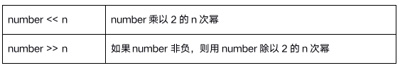


### chighdata001
# 1. 技术层次

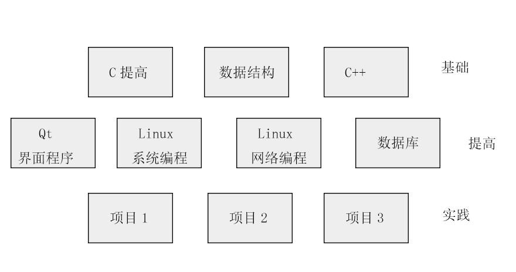


### chighdata002
# 2. C语言概述

欢迎大家来到c语言的世界，c语言是一种强大的专业化的编程语言。


### chighdata002a
## 2.1 C语言的起源

贝尔实验室的Dennis Ritchie在1972年开发了C,当时他正与ken Thompson一起设计UNIX操作系统，然而，C并不是完全由Ritchie构想出来的。它来自Thompson的B语言。


### chighdata002b
## 2.2 使用C语言的理由


在过去的几十年中，c语言已成为最流行和最重要的编程语言之一。它之所以得到发展，是因为人们尝试使用它后都喜欢它。过去很多年中，许多人从c语言转而使用更强大的`c++`语言，但c有其自身的优势，仍然是一种重要的语言，而且它还是学习`c++`的必经之路。


- 高效性。c语言是一种高效的语言。c表现出通常只有汇编语言才具有的精细的控制能力(汇编语言是特定cpu设计所采用的一组内部制定的助记符。不同的cpu类型使用不同的汇编语言)。如果愿意，您可以细调程序以获得最大的速度或最大的内存使用率。

- 可移植性。c语言是一种可移植的语言。意味着，在一个系统上编写的c程序经过很少改动或不经过修改就可以在其他的系统上运行。

- 强大的功能和灵活性。c强大而又灵活。比如强大灵活的UNIX操作系统便是用c编写的。其他的语言(Perl、Python、BASIC、Pascal)的许多编译器和解释器也都是用c编写的。结果是当你在一台Unix机器上使用Python时，最终由一个c程序负责生成最后的可执行程序。

### chighdata002c
## 2.3 C语言标准

## 2.3.1  K&R C

起初，C语言没有官方标准。1978年由[美国电话电报公司](http://baike.baidu.com/view/190900.htm)(AT&T）贝尔实验室正式发表了C语言。布莱恩·柯林汉（Brian Kernighan） 和 丹尼斯·里奇（Dennis Ritchie） 出版了一本书，名叫《[The C Programming Language](http://baike.baidu.com/view/5012996.htm)》。这本书被 C语言开发者们称为**K&R**，很多年来被当作 C语言的非正式的标准说明。人们称这个版本的 C语言为**K&R C**。

K&R C主要介绍了以下特色：[结构体](http://baike.baidu.com/view/204974.htm)（struct）类型；长整数（long int）类型；无符号整数（unsigned int）类型；把运算符=+和=-改为+=和-=。因为=+和=-会使得编译器不知道使用者要处理i = -10还是i =- 10，使得处理上产生混淆。

即使在后来[ANSI C](http://baike.baidu.com/view/3979609.htm)标准被提出的许多年后，K&R C仍然是许多编译器的最准要求，许多老旧的编译器仍然运行K&R C的标准。

## 2.3.2 ANSI C/C89标准

1970到80年代，C语言被广泛应用，从大型主机到小型微机，也衍生了C语言的很多不同版本。1983年，美国国家标准协会（ANSI）成立了一个委员会X3J11，来制定 C语言标准。 

1989年，美国国家标准协会（ANSI）通过了C语言标准，被称为**ANSI X3.159-1989 "Programming Language C"**。因为这个标准是1989年通过的，所以一般简称**C89标准**。有些人也简称**ANSI C**，因为这个标准是美国国家标准协会（ANSI）发布的。

1990年，[国际标准化组织](http://baike.baidu.com/view/42488.htm)（ISO）和[国际电工委员会](http://baike.baidu.com/view/159311.htm)（IEC）把C89标准定为C语言的国际标准，命名为**ISO/IEC 9899:1990 - Programming languages -- C**[5]  。因为此标准是在1990年发布的，所以有些人把简称作**C90标准**。不过大多数人依然称之为**C89标准**，因为此标准与ANSI C89标准完全等同。

1994年，国际标准化组织（ISO）和国际电工委员会（IEC）发布了C89标准修订版，名叫ISO/IEC 9899:1990/Cor 1:1994[6]  ，有些人简称为**C94标准**。

1995年，国际标准化组织（ISO）和国际电工委员会（IEC）再次发布了C89标准修订版，名叫ISO/IEC 9899:1990/Amd 1:1995 - C Integrity[7]  ，有些人简称为**C95标准**。

## 2.3.3 C99标准

1999年1月，国际标准化组织（ISO）和国际电工委员会（IEC）发布了C语言的新标准，名叫**ISO/IEC 9899:1999 - Programming languages -- C** ，简称**C99标准**。这是C语言的第二个官方标准。

例如：

增加了新关键字 restrict，inline，_Complex，_Imaginary，_Bool

支持 long long，long double _Complex，float _Complex 这样的类型

支持了不定长的数组。数组的长度就可以用变量了。声明类型的时候呢,就用 int a[*] 这样的写法。不过考虑到效率和实现，这玩意并不是一个新类型。

### chighdata003
# 3. 内存分区

### chighdata003a
## 3.1 数据类型


### 3.1.1 数据类型概念

```c

什么是数据类型？为什么需要数据类型?

数据类型是为了更好进行内存的管理,让编译器能确定分配多少内存。

```

我们现实生活中，狗是狗，鸟是鸟等等，每一种事物都有自己的类型，那么程序中使用数据类型也是来源于生活。

当我们给狗分配内存的时候，也就相当于给狗建造狗窝，给鸟分配内存的时候，也就是给鸟建造一个鸟窝，我们可以给他们各自建造一个别墅，但是会造成内存的浪费，不能很好的利用内存空间。

我们在想，如果给鸟分配内存，只需要鸟窝大小的空间就够了，如果给狗分配内存，那么也只需要狗窝大小的内存，而不是给鸟和狗都分配一座别墅，造成内存的浪费。

当我们定义一个变量，a = 10,编译器如何分配内存？计算机只是一个机器，它怎么知道用多少内存可以放得下10？

所以说，数据类型非常重要，它可以告诉编译器分配多少内存可以放得下我们的数据。


```c

狗窝里面是狗，鸟窝里面是鸟，如果没有数据类型，你怎么知道冰箱里放得是一头大象!

```


**数据类型基本概念：**

- 类型是对数据的抽象;

- 类型相同的数据具有相同的表示形式、存储格式以及相关操作;

- 程序中所有的数据都必定属于某种数据类型;

- 数据类型可以理解为创建变量的模具: **固定大小内存的别名**;


### 3.1.2 数据类型别名

**示例代码：**

```c

typedef unsigned int u32;
typedef struct _PERSON{
	char name[64];
	int age;
}Person;

void test(){
	u32 val; //相当于 unsigned int val;
	Person person; //相当于 struct PERSON person;
}

```


### 3.1.3 void数据类型

void字面意思是”无类型”,void* 无类型指针，无类型指针可以指向任何类型的数据。

void定义变量是没有任何意义的，当你定义void a，编译器会报错。

void真正用在以下两个方面：

- 对函数返回的限定；

- 对函数参数的限定；


**示例代码：**

```c

//1. void修饰函数参数和函数返回
void test01(void){
	printf("hello world");
}

//2. 不能定义void类型变量
void test02(){
	void val; //报错
}

//3. void* 可以指向任何类型的数据，被称为万能指针
void test03(){
	int a = 10;
	void* p = NULL;
	p = &a;
	printf("a:%d\n",*(int*)p);
	
	char c = 'a';
	p = &c;
	printf("c:%c\n",*(char*)p);
}

//4. void* 常用于数据类型的封装
void test04(){
	//void * memcpy(void * _Dst, const void * _Src, size_t _Size);
}

```

### 3.1.4 sizeof操作符

sizeof是c语言中的一个操作符，类似于++、--等等。sizeof能够告诉我们编译器为某一特定数据或者某一个类型的数据在内存中分配空间时分配的大小，大小以字节为单位。

基本语法：


```c

sizeof(变量);

sizeof 变量；

sizeof(类型);

```


**sizeof 注意点：**

- sizeof返回的占用空间大小是为这个变量开辟的大小，而不只是它用到的空间。和现今住房的建筑面积和实用面积的概念差不多。所以对结构体用的时候，大多情况下就得考虑字节对齐的问题了；

- sizeof返回的数据结果类型是unsigned int；

- 要注意数组名和指针变量的区别。通常情况下，我们总觉得数组名和指针变量差不多，但是在用sizeof的时候差别很大，对数组名用sizeof返回的是整个数组的大小，而对指针变量进行操作的时候返回的则是指针变量本身所占得空间，在32位机的条件下一般都是4。而且当数组名作为函数参数时，在函数内部，形参也就是个指针，所以不再返回数组的大小；

**示例代码：**

```c

//1. sizeof基本用法
void test01(){
	int a = 10;
	printf("len:%d\n", sizeof(a));
	printf("len:%d\n", sizeof(int));
	printf("len:%d\n", sizeof a);
}

//2. sizeof 结果类型
void test02(){
	unsigned int a = 10;
	if (a - 11 < 0){
		printf("结果小于0\n");
	}
	else{
		printf("结果大于0\n");
	}
	int b = 5;
	if (sizeof(b) - 10 < 0){
		printf("结果小于0\n");
	}
	else{
		printf("结果大于0\n");
	}
}

//3. sizeof 碰到数组
void TestArray(int arr[]){
	printf("TestArray arr size:%d\n",sizeof(arr));
}
void test03(){
	int arr[] = { 10, 20, 30, 40, 50 };
	printf("array size: %d\n",sizeof(arr));

	//数组名在某些情况下等价于指针
	int* pArr = arr;
	printf("arr[2]:%d\n",pArr[2]);
	printf("array size: %d\n", sizeof(pArr));

	//数组做函数函数参数，将退化为指针,在函数内部不再返回数组大小
	TestArray(arr);
}

```


### 3.1.5 数据类型总结


- 数据类型本质是固定内存大小的别名，是个模具，C语言规定：通过数据类型定义变量；

- 数据类型大小计算（sizeof）；

- 可以给已存在的数据类型起别名typedef；

- 数据类型的封装（void 万能类型）；

### chighdata003b
## 3.2 变量

### 3.2.1 变量的概念

既能读又能写的`内存对象`，称为变量；

若一旦初始化后不能修改的对象则称为常量。

```

变量定义形式： 类型  标识符, 标识符, … , 标识符

```


### 3.2.2 变量名的本质

- 变量名的本质：一段连续内存空间的别名；

- 程序通过变量来申请和命名内存空间 int a = 0；

- 通过变量名访问内存空间；

- 不是向变量名读写数据，而是向变量所代表的内存空间中读写数据；


**修改变量的两种方式：**

```c

    void test(){
	
	int a = 10;

	//1. 直接修改
	a = 20;
	printf("直接修改,a:%d\n",a);

	//2. 间接修改
	int* p = &a;
	*p = 30;

	printf("间接修改,a:%d\n", a);
}

```

### chighdata003c
## 3.3 程序的内存分区模型


### 3.3.1 内存分区

#### 3.3.1.1 运行之前


我们要想执行我们编写的c程序，那么第一步需要对这个程序进行编译。

```c

1）预处理：宏定义展开、头文件展开、条件编译，这里并不会检查语法
2）编译：检查语法，将预处理后文件编译生成汇编文件
3）汇编：将汇编文件生成目标文件(二进制文件)
4）链接：将目标文件链接为可执行程序

```

当我们编译完成生成可执行文件之后，我们通过在linux下size命令可以查看一个可执行二进制文件基本情况：

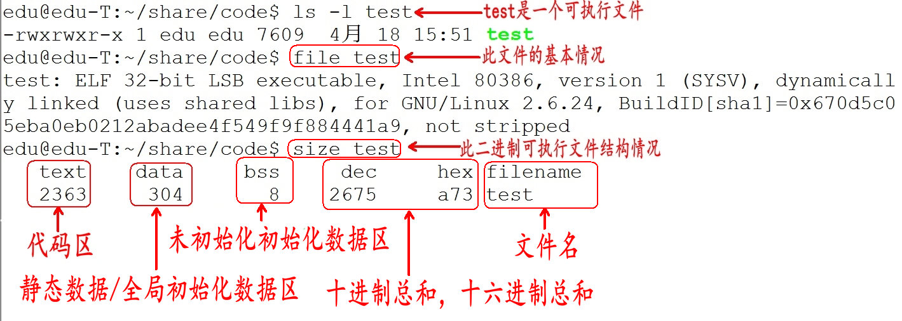


通过上图可以得知，在没有运行程序前，也就是说`程序没有加载到内存前`，可执行程序内部已经分好3段信息，分别为`代码区（text）`、`数据区（data）`和`未初始化数据区（bss）`3 个部分（有些人直接把data和bss合起来叫做静态区或全局区）。

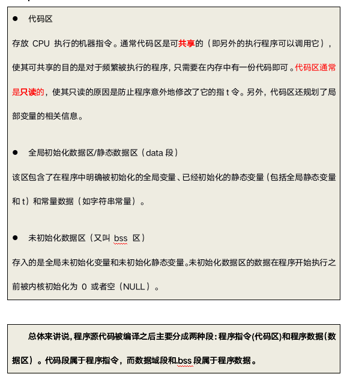

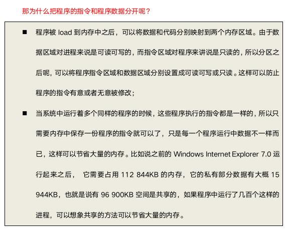


#### 3.3.1.2 运行之后

程序在加载到内存前，`代码区和全局区(data和bss)的大小就是固定的`，程序运行期间不能改变。然后，运行可执行程序，操作系统把物理硬盘程序load(加载)到内存，`除了根据可执行程序的信息分出代码区（text）、数据区（data）和未初始化数据区（bss）之外，还额外增加了栈区、堆区`。


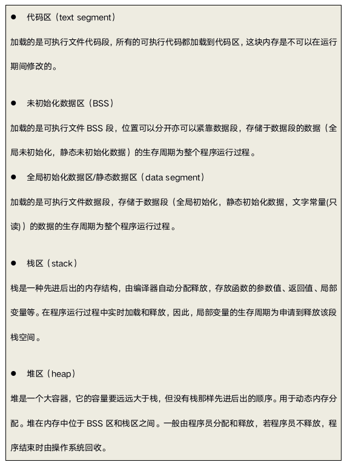

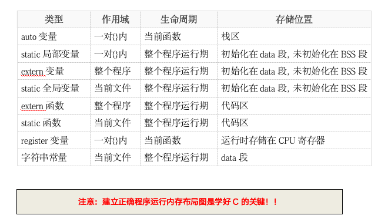


### 3.3.2 分区模型

### 3.3.2.1 栈区

由系统进行内存的管理。主要存放函数的参数以及局部变量。在函数完成执行，系统自行释放栈区内存，不需要用户管理。

```c

#char* func(){
	char p[] = "hello world!"; //在栈区存储 乱码
	printf("%s\n", p);
	return p;
}
void test(){
	char* p = NULL;
	p = func();  
	printf("%s\n",p); 
}

```

### 3.3.2.2 堆区

由编程人员手动申请，手动释放，若不手动释放，程序结束后由系统回收，生命周期是整个程序运行期间。使用malloc或者new进行堆的申请。

```c

char* func(){
	char* str = malloc(100);
	strcpy(str, "hello world!");
	printf("%s\n",str);
	return str;
}

void test01(){
	char* p = NULL;
	p = func();
	printf("%s\n",p);
}

void allocateSpace(char* p){
	p = malloc(100);
	strcpy(p, "hello world!");
	printf("%s\n", p);
}

void test02(){
	
	char* p = NULL;
	allocateSpace(p);

	printf("%s\n", p);
}

```

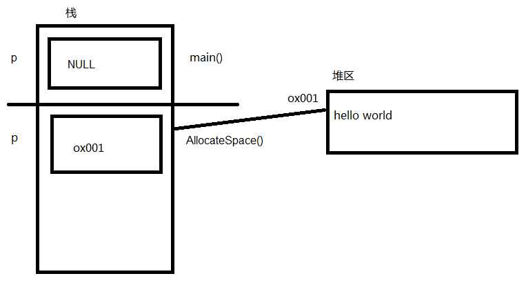

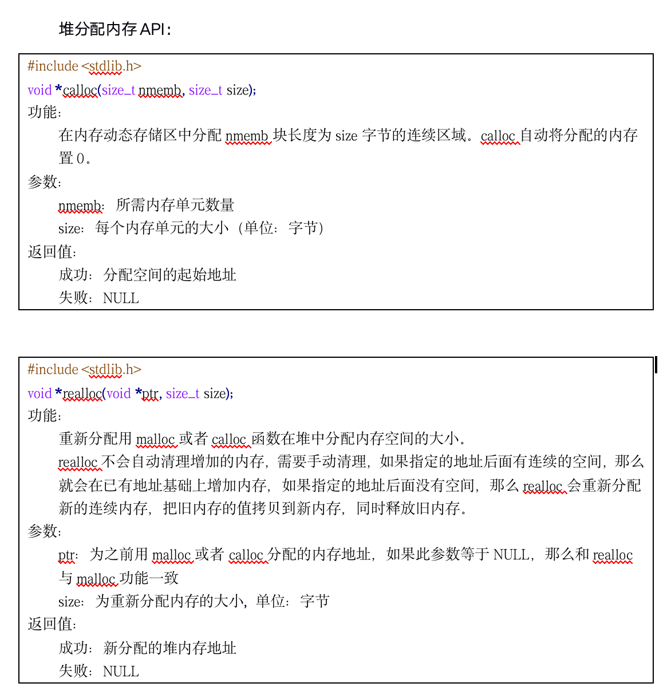

**示例代码：**


```c

void test01(){
	
	int* p1 = calloc(10,sizeof(int));
	if (p1 == NULL){
		return;
	}
	for (int i = 0; i < 10; i ++){
		p1[i] = i + 1;
	}
	for (int i = 0; i < 10; i++){
		printf("%d ",p1[i]);
	}
	printf("\n");
	free(p1);
}

void test02(){
	int* p1 = calloc(10, sizeof(int));
	if (p1 == NULL){
		return;
	}
	for (int i = 0; i < 10; i++){
		p1[i] = i + 1;
	}

	int* p2 = realloc(p1, 15 * sizeof(int));
	if (p2 == NULL){
		return;
	}

	printf("%d\n", p1);
	printf("%d\n", p2);

	//打印
	for (int i = 0; i < 15; i++){
		printf("%d ", p2[i]);
	}
	printf("\n");

	//重新赋值
	for (int i = 0; i < 15; i++){
		p2[i] = i + 1;
	}
	
	//再次打印
	for (int i = 0; i < 15; i++){
		printf("%d ", p2[i]);
	}
	printf("\n");

	free(p2);
}

```


### 3.3.2.3 全局/静态区

全局静态区内的变量在编译阶段已经分配好内存空间并初始化。这块内存在程序运行期间一直存在,它主要存储**全局变量**、**静态变量**和**常量**。

**注意****：**


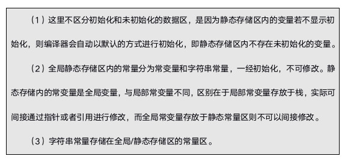


**示例代码****：**

```c

int v1 = 10;//全局/静态区
const int v2 = 20; //常量，一旦初始化，不可修改
static int v3 = 20; //全局/静态区
char *p1; //全局/静态区，编译器默认初始化为NULL

//那么全局static int 和 全局int变量有什么区别？

void test(){
	static int v4 = 20; //全局/静态区
}

```

**加深理解****：**

```c

char* func(){
	static char arr[] = "hello world!"; //在静态区存储 可读可写
	arr[2] = 'c';
	char* p = "hello world!"; //全局/静态区-字符串常量区 
	//p[2] = 'c'; //只读，不可修改 
	printf("%d\n",arr);
	printf("%d\n",p);
	printf("%s\n", arr);
	return arr;
}
void test(){
	char* p = func();
	printf("%s\n",p);
}

```

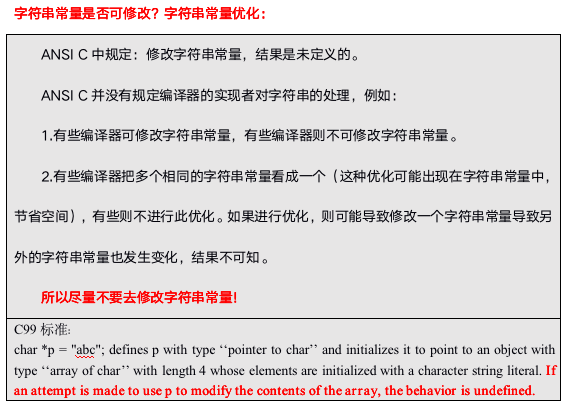


字符串常量地址是否相同？
tc2.0，同文件字符串常量地址不同。
Vs2013,字符串常量地址同文件和不同文件都相同。
Dev c++、QT同文件相同，不同文件不同。


### 3.3.2.4 总结

在理解C/C++内存分区时，常会碰到如下术语：数据区，堆，栈，静态区，常量区，全局区，字符串常量区，文字常量区，代码区等等，初学者被搞得云里雾里。在这里，尝试捋清楚以上分区的关系。
数据区包括：堆，栈，全局/静态存储区。
- 全局/静态存储区包括：常量区，全局区、静态区。
- 常量区包括：字符串常量区、常变量区。
- 代码区：存放程序编译后的二进制代码，不可寻址区。

**可以说，C/C++内存分区其实只有两个，即代码区和数据区。**

### 3.3.3 函数调用模型

### 3.3.3.1 函数调用流程

栈(stack)是现代计算机程序里最为重要的概念之一，几乎每一个程序都使用了栈，没有栈就没有函数，没有局部变量，也就没有我们如今能见到的所有计算机的语言。在解释为什么栈如此重要之前，我们先了解一下传统的栈的定义：

在经典的计算机科学中，栈被定义为一个特殊的容器，用户可以将数据压入栈中(入栈，push)，也可以将压入栈中的数据弹出(出栈，pop),但是栈容器必须遵循一条规则：**先入栈的数据最后出栈**(First In Last Out,FILO).

在经典的操作系统中，栈总是向下增长的。压栈的操作使得栈顶的地址减小，弹出操作使得栈顶地址增大。

栈在程序运行中具有极其重要的地位。最重要的，栈保存一个函数调用所需要维护的信息，这通常被称为堆栈帧(Stack Frame)或者活动记录(Activate Record).一个函数调用过程所需要的信息一般包括以下几个方面：

- 函数的返回地址；

- 函数的参数；

- 局部变量；

- 保存的上下文：包括在函数调用前后需要保持不变的寄存器。

我们从下面的代码，分析以下函数的调用过程：

```c

int func(int a,int b){
	int t_a = a;
	int t_b = b;
	return t_a + t_b;
}

int main(){
	int ret = 0;
	ret = func(10, 20);
	return EXIT_SUCCESS;
}

```

### 3.3.3.2 调用惯例


现在，我们大致了解了函数调用的过程，这期间有一个现象，那就是函数的调用者和被调用者对函数调用有着一致的理解，例如，它们双方都一致的认为函数的参数是按照某个固定的方式压入栈中。如果不这样的话，函数将无法正确运行。

     如果函数调用方在传递参数的时候先压入a参数，再压入b参数，而被调用函数则认为先压入的是b,后压入的是a,那么被调用函数在使用a,b值时候，就会颠倒。

因此，**函数的调用方和被调用方对于函数是如何调用的必须有一个明确的约定，只有双方都遵循同样的约定，函数才能够被正确的调用，这样的约定被称为****”****调用惯例(**Calling Convention)”.一个调用惯例一般包含以下几个方面：

**函数参数的传递顺序和方式**

函数的传递有很多种方式，最常见的是通过栈传递。函数的调用方将参数压入栈中，函数自己再从栈中将参数取出。对于有多个参数的函数，调用惯例要规定函数调用方将参数压栈的顺序：从左向右，还是从右向左。有些调用惯例还允许使用寄存器传递参数，以提高性能。

**栈的维护方式**

在函数将参数压入栈中之后，函数体会被调用，此后需要将被压入栈中的参数全部弹出，以使得栈在函数调用前后保持一致。这个弹出的工作可以由函数的调用方来完成，也可以由函数本身来完成。

为了在链接的时候对调用惯例进行区分，调用惯例要对函数本身的名字进行修饰。不同的调用惯例有不同的名字修饰策略。

事实上，在c语言里，存在着多个调用惯例，而默认的是cdecl.任何一个没有显示指定调用惯例的函数都是默认是cdecl惯例。比如我们上面对于func函数的声明，它的完整写法应该是：


int _cdecl func(int a,int b);

**注意: _cdecl不是标准的关键字，在不同的编译器里可能有不同的写法，例如gcc里就不存在_cdecl这样的关键字，而是使用__attribute__((cdecl)).**

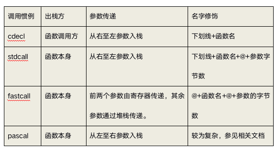


### 3.3.3.3 函数变量传递分析

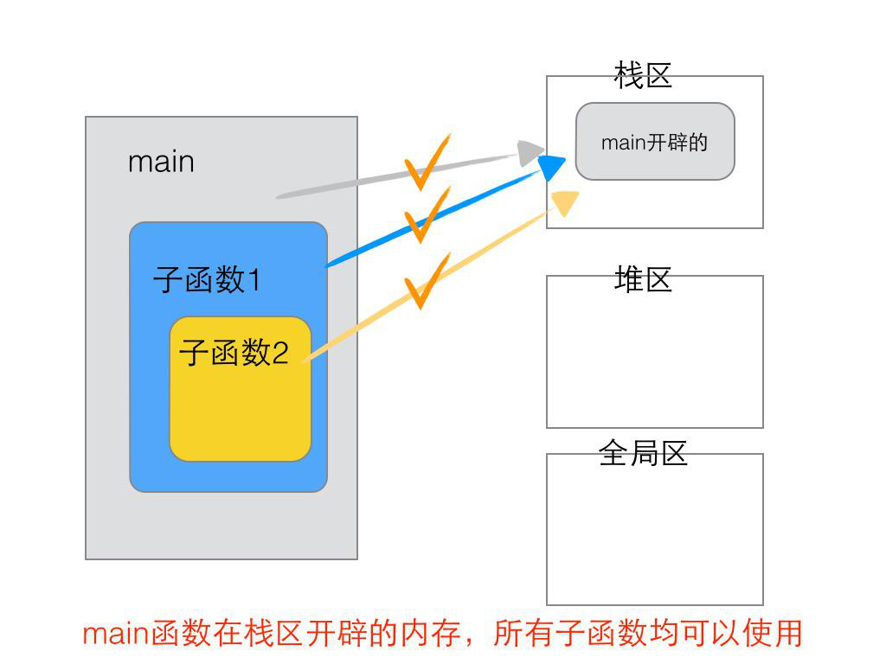
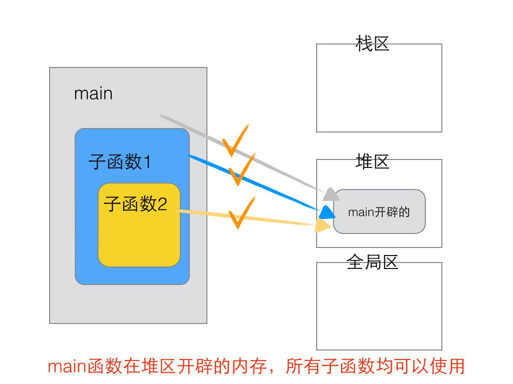
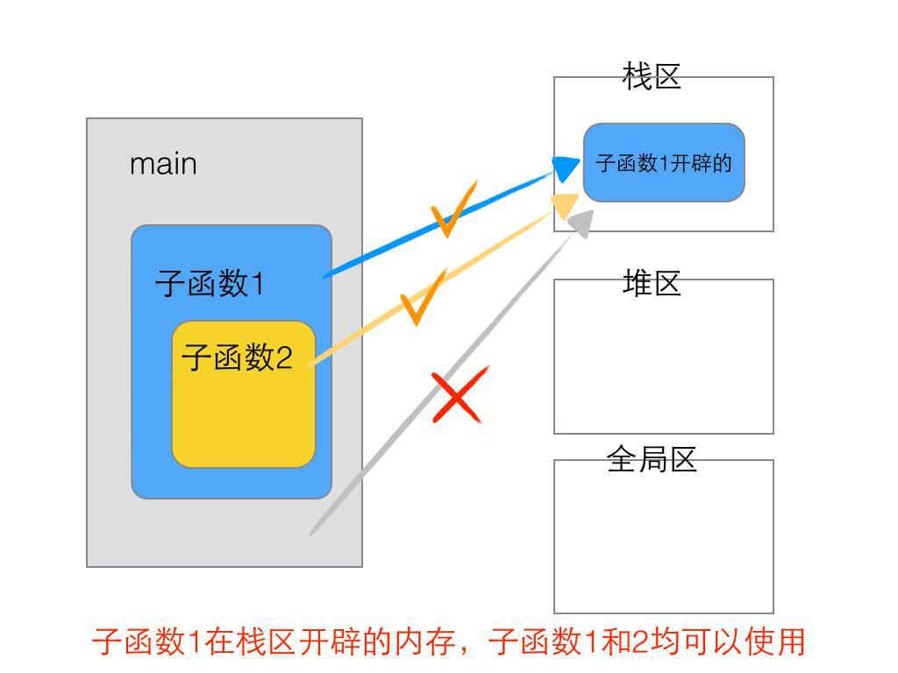
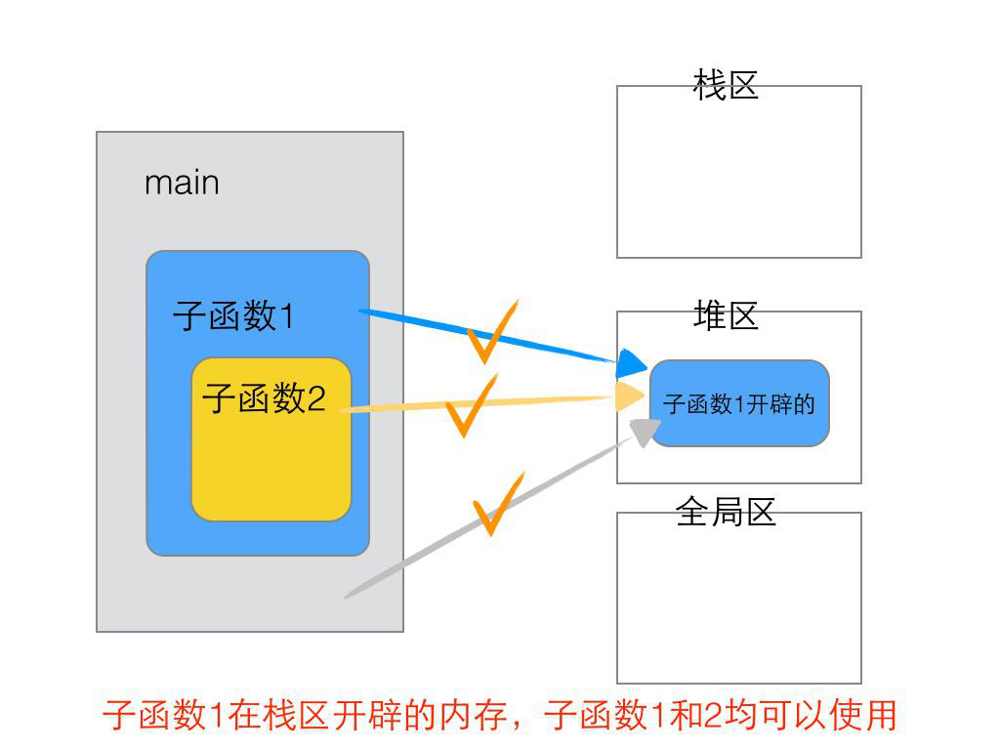
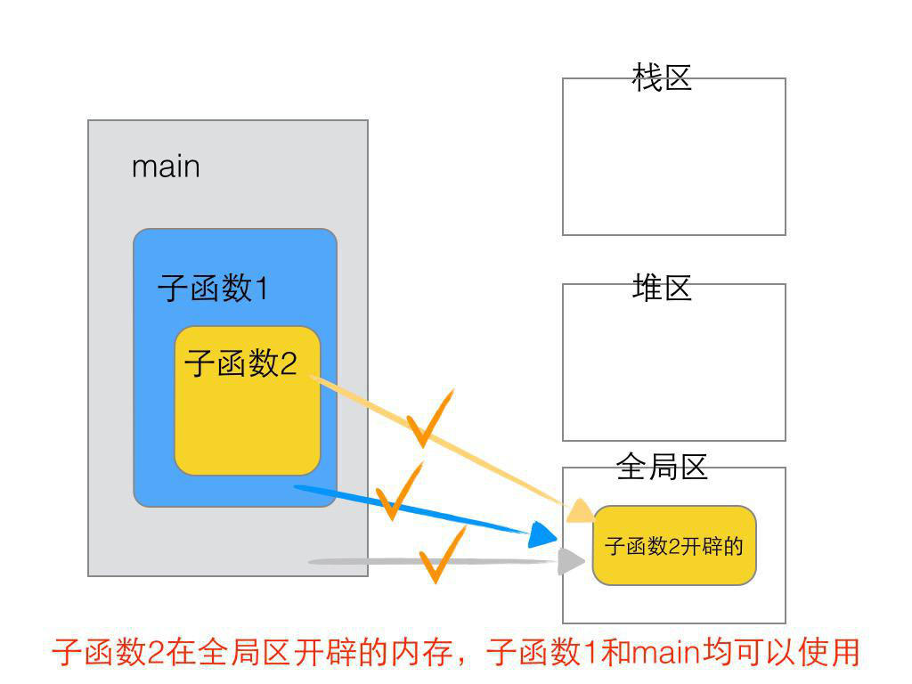


### chighdata003d
## 3.4 栈的生长方向和内存存放方向

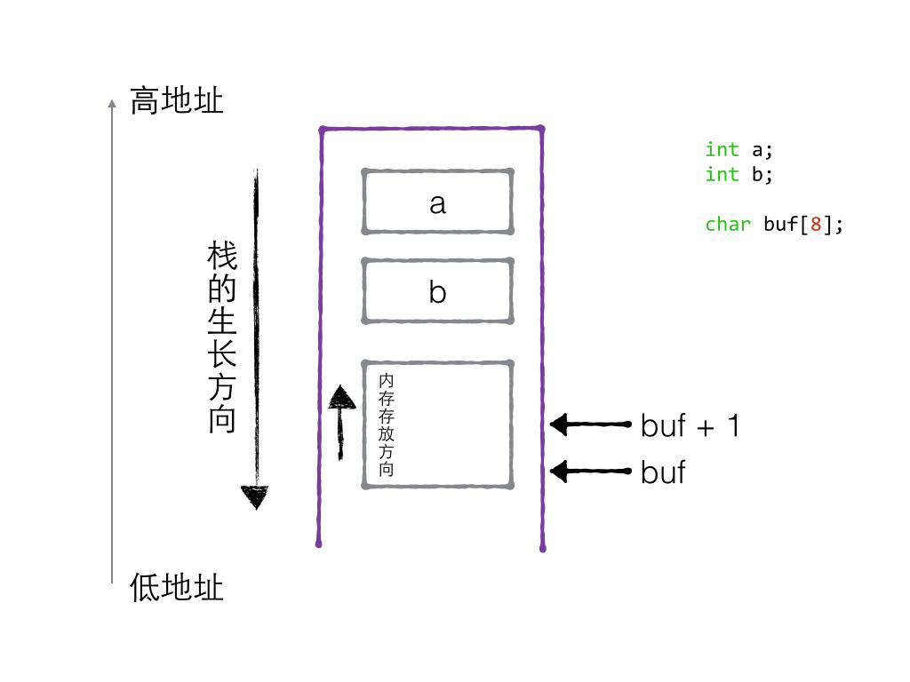


```c

//1. 栈的生长方向
void test01(){

	int a = 10;
	int b = 20;
	int c = 30;
	int d = 40;

	printf("a = %d\n", &a);
	printf("b = %d\n", &b);
	printf("c = %d\n", &c);
	printf("d = %d\n", &d);

	//a的地址大于b的地址，故而生长方向向下
}

//2. 内存生长方向(小端模式)
void test02(){
	
	//高位字节 -> 地位字节
	int num = 0xaabbccdd;
	unsigned char* p = &num;

	//从首地址开始的第一个字节
	printf("%x\n",*p);
	printf("%x\n", *(p + 1));
	printf("%x\n", *(p + 2));
	printf("%x\n", *(p + 3));
}

```


### chighdata004
# 4. 指针强化


### chighdata004a
## 4.1 指针是一种数据类型

### chighdata004a1
### 4.1.1 指针变量

指针是一种数据类型，占用内存空间，用来保存内存地址。

```c

void test01(){
	
	int* p1 = 0x1234;
	int*** p2 = 0x1111;

	printf("p1 size:%d\n",sizeof(p1));
	printf("p2 size:%d\n",sizeof(p2));


	//指针是变量，指针本身也占内存空间，指针也可以被赋值
	int a = 10;
	p1 = &a;

	printf("p1 address:%p\n", &p1);
	printf("p1 address:%p\n", p1);
	printf("a address:%p\n", &a);

}

```

### chighdata004a2
### 4.1.2 野指针和空指针

1. 空指针

标准定义了NULL指针，它作为一个特殊的指针变量，表示不指向任何东西。要使一个指针为NULL,可以给它赋值一个零值。为了测试一个指针百年来那个是否为NULL,你可以将它与零值进行比较。

对指针解引用操作可以获得它所指向的值。但从定义上看，NULL指针并未指向任何东西，因为对一个NULL指针因引用是一个非法的操作，在解引用之前，必须确保它不是一个NULL指针。

 如果对一个NULL指针间接访问会发生什么呢？结果因编译器而异。

**不允许向NULL和非法地址拷贝内存****：**

```c

void test(){
	char *p = NULL;
	//给p指向的内存区域拷贝内容
	strcpy(p, "1111"); //err

	char *q = 0x1122;
	//给q指向的内存区域拷贝内容
	strcpy(q, "2222"); //err		
}

```

2. 野指针

**在使用指针时，要避免野指针的出现：**

野指针指向一个已删除的对象或未申请访问受限内存区域的[指针](http://baike.baidu.com/view/159417.htm)。与空指针不同，野指针无法通过简单地判断是否为 [NULL](http://baike.baidu.com/view/329484.htm)避免，而只能通过养成良好的编程习惯来尽力减少。对野指针进行操作很容易造成程序错误。

**什么情况下回导致野指针？**

1. **指针变量未初始化**

- 任何指针变量刚被创建时不会自动成为NULL指针，它的缺省值是随机的，它会乱指一气。所以，指针变量在创建的同时应当被初始化，要么将指针设置为NULL，要么让它指向合法的内存。

2. **指针释放后未置空**

- 有时指针在free或delete后未赋值 NULL，便会使人以为是合法的。别看free和delete的名字（尤其是delete），它们只是把指针所指的内存给释放掉，但并没有把指针本身干掉。此时指针指向的就是“垃圾”内存。释放后的指针应立即将指针置为NULL，防止产生“野指针”。

3. **指针操作超越变量作用域**

- 不要返回指向栈内存的指针或引用，因为栈内存在函数结束时会被释放。


```c

void test(){
	int* p = 0x001; //未初始化
	printf("%p\n",p);
	*p = 100;
}

```


**操作野指针是非常危险的操作，应该规避野指针的出现：**


1. **初始化时置 NULL**

- 指针变量一定要初始化为NULL，因为任何指针变量刚被创建时不会自动成为NULL指针，它的缺省值是随机的。

2. **释放时置 NULL**

- 当指针p指向的内存空间释放时，没有设置指针p的值为NULL。delete和free只是把内存空间释放了，但是并没有将指针p的值赋为NULL。通常判断一个指针是否合法，都是使用if语句测试该指针是否为NULL。

### chighdata004a3
### 4.1.3 间接访问操作符

通过一个指针访问它所指向的地址的过程叫做间接访问，或者叫解引用指针，这个用于执行间接访问的操作符是*。

注意：对一个`int*`类型指针解引用会产生一个整型值，类似地，对一个`float*`指针解引用会产生了一个float类型的值。


1. 在指针声明时，* 号表示所声明的变量为指针

2. 在指针使用时，* 号表示操作指针所指向的内存空间

- 1）* 相当通过地址(指针变量的值)找到指针指向的内存，再操作内存

- 2）* 放在等号的左边赋值（给内存赋值，写内存）

- 3）* 放在等号的右边取值（从内存中取值，读内存）

```c

//解引用
void test01(){

	//定义指针
	int* p = NULL;
	//指针指向谁，就把谁的地址赋给指针
	int a = 10;
	p = &a;
	*p = 20;//*在左边当左值，必须确保内存可写
	//*号放右面，从内存中读值
	int b = *p;
	//必须确保内存可写
	char* str = "hello world!";
	*str = 'm';

	printf("a:%d\n", a);
	printf("*p:%d\n", *p);
	printf("b:%d\n", b);
}

```


### chighdata004a4
### 4.1.4 指针的步长

指针是一种数据类型，是指它指向的内存空间的数据类型。指针所指向的内存空间决定了指针的步长。指针的步长指的是，当指针+1时候，移动多少字节单位。

思考如下问题：

```c

int a = 0xaabbccdd;
unsigned int *p1 = &a;
unsigned char *p2 = &a;

//为什么*p1打印出来正确结果？
printf("%x\n", *p1);
//为什么*p2没有打印出来正确结果？
printf("%x\n", *p2);

//为什么p1指针+1加了4字节？
printf("p1  =%d\n", p1);
printf("p1+1=%d\n", p1 + 1);
//为什么p2指针+1加了1字节？
printf("p2  =%d\n", p2);
printf("p2+1=%d\n", p2 + 1);

```


### chighdata004b
## 4.2 指针的意义_间接赋值


### chighdata004b1
### 4.2.1 间接赋值的三大条件

通过指针间接赋值成立的三大条件：

- 1）2个变量（一个普通变量一个指针变量、或者一个实参一个形参）

- 2）建立关系

- 3）通过 * 操作指针指向的内存

```c

void test(){
	int a = 100;	//两个变量
	int *p = NULL;
	//建立关系
	//指针指向谁，就把谁的地址赋值给指针
	p = &a;
	//通过*操作内存
	*p = 22;
}

```


### chighdata004b2
### 4.2.2 如何定义合适的指针变量


```c

void test(){
	int b;  
	int *q = &b; //0级指针
	int **t = &q;
	int ***m = &t;
}

```


### chighdata004b3
### 4.2.3 间接赋值：从0级指针到1级指针


```c

int func1(){ return 10; }

void func2(int a){
	a = 100;
}
//指针的意义_间接赋值
void test02(){
	int a = 0;
	a = func1();
	printf("a = %d\n", a);

	//为什么没有修改？
	func2(a);
	printf("a = %d\n", a);
}

//指针的间接赋值
void func3(int* a){
	*a = 100;
}

void test03(){
	int a = 0;
	a = func1();
	printf("a = %d\n", a);

	//修改
	func3(&a);
	printf("a = %d\n", a);
}

```

### chighdata004b4
### 4.2.4 间接赋值：从1级指针到2级指针

```c

void AllocateSpace(char** p){
	*p = (char*)malloc(100);
	strcpy(*p, "hello world!");
}

void FreeSpace(char** p){

	if (p == NULL){
		return;
	}
	if (*p != NULL){
		free(*p);
		*p = NULL;
	}

}

void test(){
	
	char* p = NULL;

	AllocateSpace(&p);
	printf("%s\n",p);
	FreeSpace(&p);

	if (p == NULL){
		printf("p内存释放!\n");
	}
}

```


### chighdata004b5
### 4.2.5 间接赋值的推论

- 用1级指针形参，去间接修改了0级指针(实参)的值。

- 用2级指针形参，去间接修改了1级指针(实参)的值。

- 用3级指针形参，去间接修改了2级指针(实参)的值。

- 用n级指针形参，去间接修改了n-1级指针(实参)的值。

### chighdata004c
## 4.3 指针做函数参数

指针做函数参数，具备输入和输出特性：

- `输入`：主调函数分配内存

- `输出`：被调用函数分配内存


### chighdata004c1
## 4.3.1 输入特性

```c

void fun(char *p /* in */)
{
	//给p指向的内存区域拷贝内容
	strcpy(p, "abcddsgsd");
}

void test(void)
{
	//输入，主调函数分配内存
	char buf[100] = { 0 };
	fun(buf);
	printf("buf  = %s\n", buf);
}

```

### chighdata004c2
## 4.3.2 输出特性

```c

void fun(char **p /* out */, int *len)
{
	char *tmp = (char *)malloc(100);
	if (tmp == NULL)
	{
		return;
	}
	strcpy(tmp, "adlsgjldsk");

	//间接赋值
	*p = tmp;
	*len = strlen(tmp);
}

void test(void)
{
	//输出，被调用函数分配内存，地址传递
	char *p = NULL;
	int len = 0;
	fun(&p, &len);
	if (p != NULL)
	{
		printf("p = %s, len = %d\n", p, len);
	}
}

```


### chighdata004d
## 4.4 字符串指针强化


### chighdata004d1
## 4.4.1 字符串指针做函数参数

1. 字符串基本操作

```c

//字符串基本操作
//字符串是以0或者'\0'结尾的字符数组，(数字0和字符'\0'等价)
void test01(){

	//字符数组只能初始化5个字符，当输出的时候，从开始位置直到找到0结束
	char str1[] = { 'h', 'e', 'l', 'l', 'o' };
	printf("%s\n",str1);

	//字符数组部分初始化，剩余填0
	char str2[100] = { 'h', 'e', 'l', 'l', 'o' };
	printf("%s\n", str2);

	//如果以字符串初始化，那么编译器默认会在字符串尾部添加'\0'
	char str3[] = "hello";
	printf("%s\n",str3);
	printf("sizeof str:%d\n",sizeof(str3));
	printf("strlen str:%d\n",strlen(str3));

	//sizeof计算数组大小，数组包含'\0'字符
	//strlen计算字符串的长度，到'\0'结束

	//那么如果我这么写,结果是多少呢？
	char str4[100] = "hello";
	printf("sizeof str:%d\n", sizeof(str4));
	printf("strlen str:%d\n", strlen(str4));

	//请问下面输入结果是多少？sizeof结果是多少？strlen结果是多少？
	char str5[] = "hello\0world"; 
	printf("%s\n",str5);
	printf("sizeof str5:%d\n",sizeof(str5));
	printf("strlen str5:%d\n",strlen(str5));

	//再请问下面输入结果是多少？sizeof结果是多少？strlen结果是多少？
	char str6[] = "hello\012world";
	printf("%s\n", str6);
	printf("sizeof str6:%d\n", sizeof(str6));
	printf("strlen str6:%d\n", strlen(str6));
}

```


八进制和十六进制转义字符：


2. 字符串拷贝功能实现


```c

//拷贝方法1
void copy_string01(char* dest, char* source ){

	for (int i = 0; source[i] != '\0';i++){
		dest[i] = source[i];
	}

}

//拷贝方法2
void copy_string02(char* dest, char* source){
	while (*source != '\0' /* *source != 0 */){
		*dest = *source;
		source++;
		dest++;
	}
}

//拷贝方法3
void copy_string03(char* dest, char* source){
	//判断*dest是否为0，0则退出循环
	while (*dest++ = *source++){}
}


```


3. 字符串反转模型


```c

void reverse_string(char* str){

	if (str == NULL){
		return;
	}

	int begin = 0;
	int end = strlen(str) - 1;
	
	while (begin < end){
		
		//交换两个字符元素
		char temp = str[begin];
		str[begin] = str[end];
		str[end] = temp;

		begin++;
		end--;
	}

}

void test(){
	char str[] = "abcdefghijklmn";
	printf("str:%s\n", str);
	reverse_string(str);
	printf("str:%s\n", str);
}

```


### chighdata004d2
## 4.4.2 字符串的格式化


1. sprintf

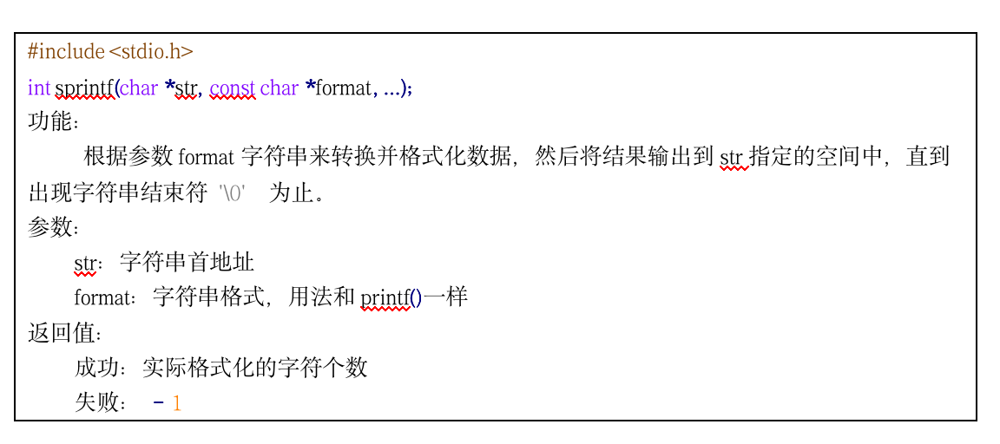


```c

void test(){
	
	//1. 格式化字符串
	char buf[1024] = { 0 };
	sprintf(buf, "你好,%s,欢迎加入我们!", "John");
	printf("buf:%s\n",buf);

	memset(buf, 0, 1024);
	sprintf(buf, "我今年%d岁了!", 20);
	printf("buf:%s\n", buf);

	//2. 拼接字符串
	memset(buf, 0, 1024);
	char str1[] = "hello";
	char str2[] = "world";
	int len = sprintf(buf,"%s %s",str1,str2);
	printf("buf:%s len:%d\n", buf,len);

	//3. 数字转字符串
	memset(buf, 0, 1024);
	int num = 100;
	sprintf(buf, "%d", num);
	printf("buf:%s\n", buf);
	//设置宽度 右对齐
	memset(buf, 0, 1024);
	sprintf(buf, "%8d", num);
	printf("buf:%s\n", buf);
	//设置宽度 左对齐
	memset(buf, 0, 1024);
	sprintf(buf, "%-8d", num);
	printf("buf:%s\n", buf);
	//转成16进制字符串 小写
	memset(buf, 0, 1024);
	sprintf(buf, "0x%x", num);
	printf("buf:%s\n", buf);

	//转成8进制字符串
	memset(buf, 0, 1024);
	sprintf(buf, "0%o", num);
	printf("buf:%s\n", buf);
}

```

2. sscanf

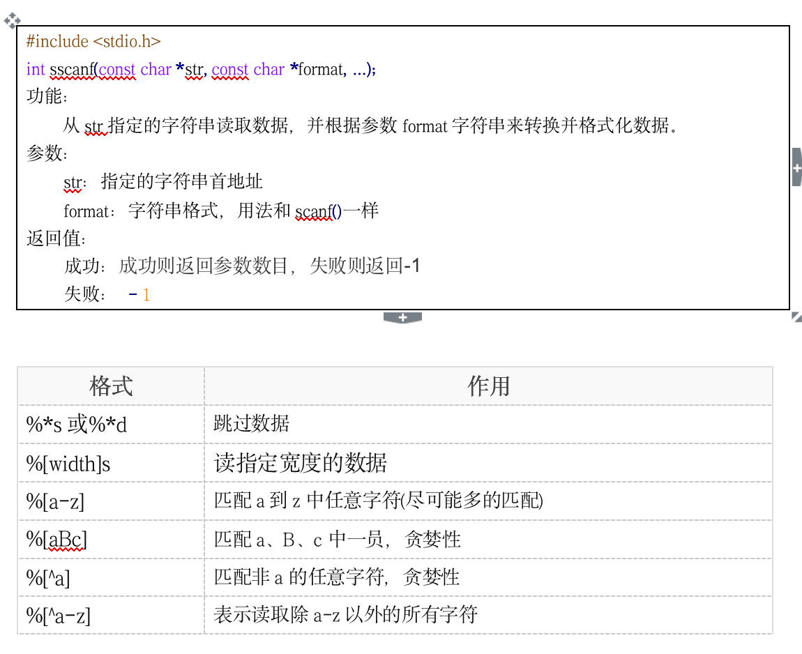

```c

//1. 跳过数据
void test01(){
	char buf[1024] = { 0 };
	//跳过前面的数字
	//匹配第一个字符是否是数字，如果是，则跳过
	//如果不是则停止匹配
	sscanf("123456aaaa", "%*d%s", buf); 
	printf("buf:%s\n",buf);
}

//2. 读取指定宽度数据
void test02(){
	char buf[1024] = { 0 };
	//跳过前面的数字
	sscanf("123456aaaa", "%7s", buf);
	printf("buf:%s\n", buf);
}

//3. 匹配a-z中任意字符
void test03(){
	char buf[1024] = { 0 };
	//跳过前面的数字
	//先匹配第一个字符，判断字符是否是a-z中的字符，如果是匹配
	//如果不是停止匹配
	sscanf("abcdefg123456", "%[a-z]", buf);
	printf("buf:%s\n", buf);
}

//4. 匹配aBc中的任何一个
void test04(){
	char buf[1024] = { 0 };
	//跳过前面的数字
	//先匹配第一个字符是否是aBc中的一个，如果是，则匹配，如果不是则停止匹配
	sscanf("abcdefg123456", "%[aBc]", buf);
	printf("buf:%s\n", buf);
}

//5. 匹配非a的任意字符
void test05(){
	char buf[1024] = { 0 };
	sscanf("bcdefag123456", "%[^a]", buf);
	printf("buf:%s\n", buf);
}

//6. 匹配非a-z中的任意字符
void test06(){
	char buf[1024] = { 0 };
	sscanf("123456ABCDbcdefag", "%[^a-z]", buf);
	printf("buf:%s\n", buf);
}

```


### chighdata004e
## 4.5 一级指针易错点


### chighdata004e1
## 4.5.1 越界

```c

void test(){
	char buf[3] = "abc";
	printf("buf:%s\n",buf);
}

```


### chighdata004e2
## 4.5.2 指针叠加会不断改变指针指向

```c

void test(){
	char *p = (char *)malloc(50);
	char buf[] = "abcdef";
	int n = strlen(buf);
	int i = 0;

	for (i = 0; i < n; i++)
	{
		*p = buf[i];
		p++; //修改原指针指向
	}

	free(p);
}

```


### chighdata004e3
## 4.5.3 返回局部变量地址

```c

char *get_str()
{
	char str[] = "abcdedsgads"; //栈区，
	printf("[get_str]str = %s\n", str);
	return str;
}

```


### chighdata004e4
## 4.5.4 同一块内存释放多次（不可以释放野指针）

```c

void test(){	
	char *p = NULL;

	p = (char *)malloc(50);
	strcpy(p, "abcdef");

	if (p != NULL)
	{
		//free()函数的功能只是告诉系统 p 指向的内存可以回收了
		// 就是说，p 指向的内存使用权交还给系统
		//但是，p的值还是原来的值(野指针)，p还是指向原来的内存
		free(p); 
	}

	if (p != NULL)
	{
		free(p);
	}
}

```


### chighdata004f
## 4.6 const使用

```c

//const修饰变量
void test01(){
	//1. const基本概念
	const int i = 0;
	//i = 100; //错误，只读变量初始化之后不能修改

	//2. 定义const变量最好初始化
	const int j;
	//j = 100; //错误，不能再次赋值

	//3. c语言的const是一个只读变量，并不是一个常量，可通过指针间接修改
	const int k = 10;
	//k = 100; //错误，不可直接修改，我们可通过指针间接修改
	printf("k:%d\n", k);
	int* p = &k;
	*p = 100;
	printf("k:%d\n", k);
}

//const 修饰指针
void test02(){

	int a = 10;
	int b = 20;
	//const放在*号左侧 修饰p_a指针指向的内存空间不能修改,但可修改指针的指向
	const int* p_a = &a;
	//*p_a = 100; //不可修改指针指向的内存空间
	p_a = &b; //可修改指针的指向

	//const放在*号的右侧， 修饰指针的指向不能修改，但是可修改指针指向的内存空间
	int* const p_b = &a;
	//p_b = &b; //不可修改指针的指向
	*p_b = 100; //可修改指针指向的内存空间

	//指针的指向和指针指向的内存空间都不能修改
	const int* const p_c = &a;
}
//const指针用法
struct Person{
	char name[64];
	int id;
	int age;
	int score;
};

//每次都对对象进行拷贝，效率低，应该用指针
void printPersonByValue(struct Person person){
	printf("Name:%s\n", person.name);
	printf("Name:%d\n", person.id);
	printf("Name:%d\n", person.age);
	printf("Name:%d\n", person.score);
}

//但是用指针会有副作用，可能会不小心修改原数据
void printPersonByPointer(const struct Person *person){
	printf("Name:%s\n", person->name);
	printf("Name:%d\n", person->id);
	printf("Name:%d\n", person->age);
	printf("Name:%d\n", person->score);
}
void test03(){
	struct Person p = { "Obama", 1101, 23, 87 };
	//printPersonByValue(p);
	printPersonByPointer(&p);
}

```


### chighdata005
# 5. 指针的指针(二级指针)

### chighdata005a
## 5.1 二级指针基本概念

这里让我们花点时间来看一个例子，揭开这个即将开始的序幕。考虑下面这些声明：


```c

int a = 12;
int *b = &a;

```

它们如下图进行内存分配：

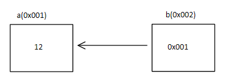


假定我们又有了第3个变量，名叫c,并用下面这条语句对它进行初始化：


```c

c = &b;

```

它在内存中的大概模样大致如下：

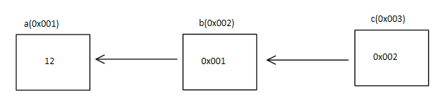


问题是：c的类型是什么？显然它是一个指针，但它所指向的是什么？变量b是一个“指向整型的指针”，所以任何指向b的类型必须是指向“指向整型的指针”的指针，更通俗地说，是一个指针的指针。

它合法吗？是的！指针变量和其他变量一样，占据内存中某个特定的位置，所以用&操作符取得它的地址是合法的。

那么这个变量的声明是怎样的声明的呢？


```c

int **c = &b;

```

那么这个`**`c如何理解呢？`*`操作符具有从右想做的结合性，所以这个表达式相当于`*(*c),`我们从里向外逐层求职。`*c`访问c所指向的位置，我们知道这是变量b.第二个间接访问操作符访问这个位置所指向的地址，也就是变量a.指针的指针并不难懂，只需要留心所有的箭头，如果表达式中出现了间接访问操作符，你就要随箭头访问它所指向的位置。


### chighdata005b
## 5.2 二级指针做形参输出特性

二级指针做参数的输出特性是指由被调函数分配内存。


```c

//被调函数,由参数n确定分配多少个元素内存
void allocate_space(int **arr,int n){
	//堆上分配n个int类型元素内存
	int *temp = (int *)malloc(sizeof(int)* n);
	if (NULL == temp){
		return;
	}
	//给内存初始化值
	int *pTemp = temp;
	for (int i = 0; i < n;i ++){
		//temp[i] = i + 100;
		*pTemp = i + 100;
		pTemp++;
	}
	//指针间接赋值
	*arr = temp;
}
//打印数组
void print_array(int *arr,int n){
	for (int i = 0; i < n;i ++){
		printf("%d ",arr[i]);
	}
	printf("\n");
}
//二级指针输出特性(由被调函数分配内存)
void test(){
	int *arr = NULL;
	int n = 10;
	//给arr指针间接赋值
	allocate_space(&arr,n);
	//输出arr指向数组的内存
	print_array(arr, n);
	//释放arr所指向内存空间的值
	if (arr != NULL){
		free(arr);
		arr = NULL;
	}
}

```

### chighdata005c
## 5.3 二级指针做形参输入特性

二级指针做形参输入特性是指由主调函数分配内存。


```c

//打印数组
void print_array(int **arr,int n){
	for (int i = 0; i < n;i ++){
		printf("%d ",*(arr[i]));
	}
	printf("\n");
}
//二级指针输入特性(由主调函数分配内存)
void test(){
	
	int a1 = 10;
	int a2 = 20;
	int a3 = 30;
	int a4 = 40;
	int a5 = 50;

	int n = 5;

	int** arr = (int **)malloc(sizeof(int *) * n);
	arr[0] = &a1;
	arr[1] = &a2;
	arr[2] = &a3;
	arr[3] = &a4;
	arr[4] = &a5;

	print_array(arr,n);

	free(arr);
	arr = NULL;
}

```

### chighdata005d
## 5.4 强化训练_画出内存模型图


```c


void mian()
{
	//栈区指针数组
	char *p1[] = { "aaaaa", "bbbbb", "ccccc" };

	//堆区指针数组
	char **p3 = (char **)malloc(3 * sizeof(char *)); //char *array[3];

	int i = 0;
	for (i = 0; i < 3; i++)
	{
		p3[i] = (char *)malloc(10 * sizeof(char)); //char buf[10]
		sprintf(p3[i], "%d%d%d", i, i, i);
	}
}

```

### chighdata005e
## 5.5 多级指针

将堆区数组指针案例改为三级指针案例：


```c

//分配内存
void allocate_memory(char*** p, int n){

	if (n < 0){
		return;
	}

	char** temp = (char**)malloc(sizeof(char*)* n);
	if (temp == NULL){
		return;
	}

	//分别给每一个指针malloc分配内存
	for (int i = 0; i < n; i++){
		temp[i] = malloc(sizeof(char)* 30);
		sprintf(temp[i], "%2d_hello world!", i + 1);
	}

	*p = temp;
}

//打印数组
void array_print(char** arr, int len){
	for (int i = 0; i < len; i++){
		printf("%s\n", arr[i]);
	}
	printf("----------------------\n");
}

//释放内存
void free_memory(char*** buf, int len){
	if (buf == NULL){
		return;
	}

	char** temp = *buf;

	for (int i = 0; i < len; i++){
		free(temp[i]);
		temp[i] = NULL;
	}

	free(temp);
}

void test(){

	int n = 10;
	char** p = NULL;
	allocate_memory(&p, n);
	//打印数组
	array_print(p, n);
	//释放内存
	free_memory(&p, n);
}

```


### chighdata006
# 6. 多维数组

可以使用C对变量中的个别位进行操作。您可能对人们想这样做的原因感到奇怪。这种能力有时确实是必须的，或者至少是有用的。C提供位的逻辑运算符和移位运算符。在以下例子中，我们将使用二进制计数法写出值，以便您可以了解对位发生的操作。在一个实际程序中，您可以使用一般的形式的整数变量或常量。例如不适用00011001的形式，而写为25或者031或者0x19.在我们的例子中，我们将使用8位数字，从左到右，每位的编号是7到0。

### chighdata006a
# 6.1 一维数组


### chighdata006b
# 6.2 多维数组


### chighdata006c
# 6.3 总结

### chighdata007
# 7. 结构体

### chighdata007a
## 7.1 结构体基础知识


#### chighdata007a1
## 7.1.1 结构体类型的定义

#### chighdata007a2
## 7.1.2 结构体变量的定义

#### chighdata007a3
## 7.1.3 结构体变量的初始化

#### chighdata007a4
## 7.1.4 结构体成员的使用

#### chighdata007a5
## 7.1.5 结构体赋值

#### chighdata007a6
## 7.1.6 结构体数组


### chighdata007b
## 7.2 结构体嵌套指针

### chighdata007c
## 7.3 结构体成员偏移量

### chighdata007d
## 7.4 结构体字节对齐


### chighdata008
# 8.文件操作


### chighdata008a
## 8.1 文件相关概念

### chighdata008b
## 8.2 文件的操作

### chighdata008b1
### 8.2.1 文件流总览

### chighdata008b2
### 8.2.2 文件指针

### chighdata008b3
### 8.2.3 文件缓冲区

### chighdata008b4
### 8.2.4 文件打开关闭

### chighdata008b5
### 8.2.5 文件读写函数回顾


### chighdata008c
## 8.3 文件读写案例


### chighdata009
# 9. 链表


### chighdata009a
## 9.1 链表基本概念


### chighdata009a1
### 9.1.1 什么是链表


### chighdata009a2
### 9.1.2 有关结构体的自身引用


### chighdata009a3
### 9.1.3 链表节点


### chighdata009a4
### 9.1.4 链表的分类


### chighdata009b
## 9.2 链表基本操作

### chighdata009b1
### 9.2.1 创建链表

### chighdata009b2
### 9.2.2 遍历链表

### chighdata009b3
### 9.2.3 插入节点

### chighdata009b4
### 9.2.4 删除节点


### chighdata009b5
### 9.2.5 销毁链表


### chighdata010
# 10.  函数指针和回调函数

### chighdata010a
## 10.1 函数指针


### chighdata010a1
## 10.1.1 函数类型


### chighdata010a2
## 10.1.2 函数指针(指向函数的指针)

### chighdata010a3
## 10.1.3 函数指针数组

### chighdata010a4
## 10.1.4 函数指针做函数参数(回调函数)


### chighdata011
# 11.  预处理

### chighdata011a
## 11.1 预处理的基本概念

### chighdata011b
## 11.2 文件包含指令(#include)

### chighdata011c
## 11.3

### chighdata011d
## 11.4

### chighdata011e
## 11.5 


### chighdata012
# 12. 动态库的封装和使用


### chighdata013
# 13. 递归函数


### chighdata014
# 14. 面向接口编程


