# c高级


# 目录

1. [技术层次](#chighdata001)
2. [C语言概述](#chighdata002)
    1. [C语言的起源](#chighdata002a)
    2. [使用C语言的理由](#chighdata002b)
    3. [C语言标准](#chighdata002c)
3. [内存分区](#chighdata003)
    1. [数据类型](#chighdata003a)
    2. [变量](#chighdata003b)
    3. [程序的内存分区模型](#chighdata003c)
    4. [栈的生长方向和内存存放方向](#chighdata003d)
4. [指针强化](#chighdata004)
    1. [指针是一种数据类型](#chighdata004a)
    2. [指针的意义_间接赋值](#chighdata004b)
    3. [指针做函数参数](#chighdata004c)
    4. [字符串指针强化](#chighdata004d)
    5. [一级指针易错点](#chighdata004e)
    6. [const使用](#chighdata004f)
5. [指针的指针(二级指针)](#chighdata005)
    1. [二级指针基本概念](#chighdata005a)
    2. [二级指针做形参输出特性](#chighdata005b)
    3. [二级指针做形参输入特性](#chighdata005c)
    4. [强化训练_画出内存模型图](#chighdata005d)
    5. [多级指针](#chighdata005e)
6. [多维数组](#chighdata006)
    1. [一维数组](#chighdata006a)
        1. [数组名](#chighdata006a1)
        2. [下标引用](#chighdata006a2)
        3. [数组和指针](#chighdata006a3)
        4. [作为函数参数的数组名](#chighdata006a4)
    2. [多维数组](#chighdata006b)
        1. [数组名](#chighdata006b1)
        2. [指向数组的指针(数组指针)](#chighdata006b2)
        3. [指针数组(元素为指针)](#chighdata006b3)
        4. [二维数组三种参数形式](#chighdata006b4)
    3. [总结](#chighdata006c)
     
7. [结构体](#chighdata007)
    1. [结构体基础知识](#chighdata007a) 
        1. [结构体类型的定义](#chighdata007a1) 
        2. [结构体变量的定义](#chighdata007a2) 
        3. [结构体变量的初始化](#chighdata007a3) 
        4. [结构体成员的使用](#chighdata007a4) 
        5. [结构体赋值](#chighdata007a5) 
        6. [结构体数组](#chighdata007a6) 
    2. [结构体嵌套指针](#chighdata007b) 
    3. [结构体成员偏移量](#chighdata007c) 
    4. [结构体字节对齐](#chighdata007d) 
        1. [内存对齐](#chighdata007d1)
        2. [内存对齐案例](#chighdata007d2)


8. [文件操作](#chighdata008)
    1. [文件相关概念](#chighdata008a)
        1. [文件的概念](#chighdata008a1)
        2. [流的概念](#chighdata008a2)
    2. [文件的操作](#chighdata008b)
        1. [文件流总览](#chighdata008b1)
        2. [文件指针](#chighdata008b2)
        3. [文件缓冲区](#chighdata008b3)
        4. [文件打开关闭](#chighdata008b4)
        5. [文件读写函数回顾](#chighdata008b5)
    3. [文件读写案例](#chighdata008c)
     
9. [链表](#chighdata009)
    1. [链表基本概念](#chighdata009a) 
        1. [什么是链表](#chighdata009a1)
        2. [有关结构体的自身引用](#chighdata009a2)
        3. [链表节点](#chighdata009a3)
        4. [链表的分类](#chighdata009a4)
    2. [链表基本操作](#chighdata009b) 
        1. [创建链表](#chighdata009b1)
        2. [遍历链表](#chighdata009b2)
        3. [插入节点](#chighdata009b3)
        4. [删除节点](#chighdata009b4)
        5. [销毁链表](#chighdata009b5)
10. [函数指针和回调函数](#chighdata010)
    1. [函数指针](#chighdata010a) 
        1. [函数类型](#chighdata010a1)
        2. [函数指针(指向函数的指针)](#chighdata010a2)
        3. [函数指针数组](#chighdata010a3)
        4. [函数指针做函数参数(回调函数)](#chighdata010a4)
11. [预处理](#chighdata011)
    1. [预处理的基本概念](#chighdata011a) 
    2. [文件包含指令(#include)](#chighdata011b) 
    3. [宏定义](#chighdata011c) 
    4. [条件编译](#chighdata011d) 
    5. [一些特殊的预定宏](#chighdata011e) 
12. [动态库的封装和使用](#chighdata012)
13. [递归函数](#chighdata013)
    1. [递归函数基本概念](#chighdata013a)
    2. [普通函数调用](#chighdata013b)
    3. [递归函数调用](#chighdata013c)
    4. [递归实现字符串反转](#chighdata013d)
14. [面向接口编程](#chighdata014)
15. [位运算](#chighdata015)
    1. [位逻辑运算符](#chighdata015a)
    2. [移位运算符](#chighdata015b)


### chighdata001
# 1. 技术层次

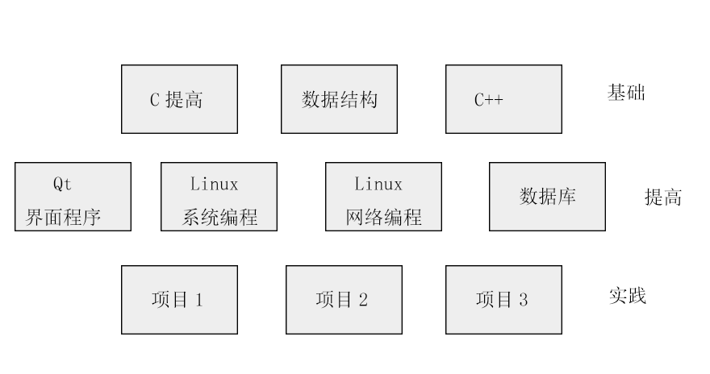


### chighdata002
# 2. C语言概述

欢迎大家来到c语言的世界，c语言是一种强大的专业化的编程语言。


### chighdata002a
## 2.1 C语言的起源

贝尔实验室的Dennis Ritchie在1972年开发了C,当时他正与ken Thompson一起设计UNIX操作系统，然而，C并不是完全由Ritchie构想出来的。它来自Thompson的B语言。


### chighdata002b
## 2.2 使用C语言的理由


在过去的几十年中，c语言已成为最流行和最重要的编程语言之一。它之所以得到发展，是因为人们尝试使用它后都喜欢它。过去很多年中，许多人从c语言转而使用更强大的`c++`语言，但c有其自身的优势，仍然是一种重要的语言，而且它还是学习`c++`的必经之路。


- 高效性。c语言是一种高效的语言。c表现出通常只有汇编语言才具有的精细的控制能力(汇编语言是特定cpu设计所采用的一组内部制定的助记符。不同的cpu类型使用不同的汇编语言)。如果愿意，您可以细调程序以获得最大的速度或最大的内存使用率。

- 可移植性。c语言是一种可移植的语言。意味着，在一个系统上编写的c程序经过很少改动或不经过修改就可以在其他的系统上运行。

- 强大的功能和灵活性。c强大而又灵活。比如强大灵活的UNIX操作系统便是用c编写的。其他的语言(Perl、Python、BASIC、Pascal)的许多编译器和解释器也都是用c编写的。结果是当你在一台Unix机器上使用Python时，最终由一个c程序负责生成最后的可执行程序。

### chighdata002c
## 2.3 C语言标准

## 2.3.1  K&R C

起初，C语言没有官方标准。1978年由[美国电话电报公司](http://baike.baidu.com/view/190900.htm)(AT&T）贝尔实验室正式发表了C语言。布莱恩·柯林汉（Brian Kernighan） 和 丹尼斯·里奇（Dennis Ritchie） 出版了一本书，名叫《[The C Programming Language](http://baike.baidu.com/view/5012996.htm)》。这本书被 C语言开发者们称为**K&R**，很多年来被当作 C语言的非正式的标准说明。人们称这个版本的 C语言为**K&R C**。

K&R C主要介绍了以下特色：[结构体](http://baike.baidu.com/view/204974.htm)（struct）类型；长整数（long int）类型；无符号整数（unsigned int）类型；把运算符=+和=-改为+=和-=。因为=+和=-会使得编译器不知道使用者要处理i = -10还是i =- 10，使得处理上产生混淆。

即使在后来[ANSI C](http://baike.baidu.com/view/3979609.htm)标准被提出的许多年后，K&R C仍然是许多编译器的最准要求，许多老旧的编译器仍然运行K&R C的标准。

## 2.3.2 ANSI C/C89标准

1970到80年代，C语言被广泛应用，从大型主机到小型微机，也衍生了C语言的很多不同版本。1983年，美国国家标准协会（ANSI）成立了一个委员会X3J11，来制定 C语言标准。 

1989年，美国国家标准协会（ANSI）通过了C语言标准，被称为**ANSI X3.159-1989 "Programming Language C"**。因为这个标准是1989年通过的，所以一般简称**C89标准**。有些人也简称**ANSI C**，因为这个标准是美国国家标准协会（ANSI）发布的。

1990年，[国际标准化组织](http://baike.baidu.com/view/42488.htm)（ISO）和[国际电工委员会](http://baike.baidu.com/view/159311.htm)（IEC）把C89标准定为C语言的国际标准，命名为**ISO/IEC 9899:1990 - Programming languages -- C**[5]  。因为此标准是在1990年发布的，所以有些人把简称作**C90标准**。不过大多数人依然称之为**C89标准**，因为此标准与ANSI C89标准完全等同。

1994年，国际标准化组织（ISO）和国际电工委员会（IEC）发布了C89标准修订版，名叫ISO/IEC 9899:1990/Cor 1:1994[6]  ，有些人简称为**C94标准**。

1995年，国际标准化组织（ISO）和国际电工委员会（IEC）再次发布了C89标准修订版，名叫ISO/IEC 9899:1990/Amd 1:1995 - C Integrity[7]  ，有些人简称为**C95标准**。

## 2.3.3 C99标准

1999年1月，国际标准化组织（ISO）和国际电工委员会（IEC）发布了C语言的新标准，名叫**ISO/IEC 9899:1999 - Programming languages -- C** ，简称**C99标准**。这是C语言的第二个官方标准。

例如：

增加了新关键字 restrict，inline，_Complex，_Imaginary，_Bool

支持 long long，long double _Complex，float _Complex 这样的类型

支持了不定长的数组。数组的长度就可以用变量了。声明类型的时候呢,就用 int a[*] 这样的写法。不过考虑到效率和实现，这玩意并不是一个新类型。

### chighdata003
# 3. 内存分区

### chighdata003a
## 3.1 数据类型


### 3.1.1 数据类型概念

```c

什么是数据类型？为什么需要数据类型?

数据类型是为了更好进行内存的管理,让编译器能确定分配多少内存。

```

我们现实生活中，狗是狗，鸟是鸟等等，每一种事物都有自己的类型，那么程序中使用数据类型也是来源于生活。

当我们给狗分配内存的时候，也就相当于给狗建造狗窝，给鸟分配内存的时候，也就是给鸟建造一个鸟窝，我们可以给他们各自建造一个别墅，但是会造成内存的浪费，不能很好的利用内存空间。

我们在想，如果给鸟分配内存，只需要鸟窝大小的空间就够了，如果给狗分配内存，那么也只需要狗窝大小的内存，而不是给鸟和狗都分配一座别墅，造成内存的浪费。

当我们定义一个变量，a = 10,编译器如何分配内存？计算机只是一个机器，它怎么知道用多少内存可以放得下10？

所以说，数据类型非常重要，它可以告诉编译器分配多少内存可以放得下我们的数据。


```c

狗窝里面是狗，鸟窝里面是鸟，如果没有数据类型，你怎么知道冰箱里放得是一头大象!

```


**数据类型基本概念：**

- 类型是对数据的抽象;

- 类型相同的数据具有相同的表示形式、存储格式以及相关操作;

- 程序中所有的数据都必定属于某种数据类型;

- 数据类型可以理解为创建变量的模具: **固定大小内存的别名**;


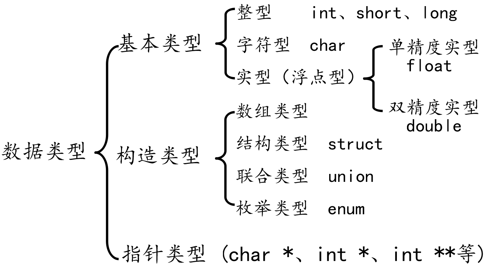


### 3.1.2 数据类型别名

**示例代码：**

```c

typedef unsigned int u32;
typedef struct _PERSON{
	char name[64];
	int age;
}Person;

void test(){
	u32 val; //相当于 unsigned int val;
	Person person; //相当于 struct PERSON person;
}

```


### 3.1.3 void数据类型

void字面意思是”无类型”,void* 无类型指针，无类型指针可以指向任何类型的数据。

void定义变量是没有任何意义的，当你定义void a，编译器会报错。

void真正用在以下两个方面：

- 对函数返回的限定；

- 对函数参数的限定；


**示例代码：**

```c

//1. void修饰函数参数和函数返回
void test01(void){
	printf("hello world");
}

//2. 不能定义void类型变量
void test02(){
	void val; //报错
}

//3. void* 可以指向任何类型的数据，被称为万能指针
void test03(){
	int a = 10;
	void* p = NULL;
	p = &a;
	printf("a:%d\n",*(int*)p);
	
	char c = 'a';
	p = &c;
	printf("c:%c\n",*(char*)p);
}

//4. void* 常用于数据类型的封装
void test04(){
	//void * memcpy(void * _Dst, const void * _Src, size_t _Size);
}

```

### 3.1.4 sizeof操作符

sizeof是c语言中的一个操作符，类似于++、--等等。sizeof能够告诉我们编译器为某一特定数据或者某一个类型的数据在内存中分配空间时分配的大小，大小以字节为单位。

基本语法：


```c

sizeof(变量);

sizeof 变量；

sizeof(类型);

```


**sizeof 注意点：**

- sizeof返回的占用空间大小是为这个变量开辟的大小，而不只是它用到的空间。和现今住房的建筑面积和实用面积的概念差不多。所以对结构体用的时候，大多情况下就得考虑字节对齐的问题了；

- sizeof返回的数据结果类型是unsigned int；

- 要注意数组名和指针变量的区别。通常情况下，我们总觉得数组名和指针变量差不多，但是在用sizeof的时候差别很大，对数组名用sizeof返回的是整个数组的大小，而对指针变量进行操作的时候返回的则是指针变量本身所占得空间，在32位机的条件下一般都是4。而且当数组名作为函数参数时，在函数内部，形参也就是个指针，所以不再返回数组的大小；

**示例代码：**

```c

//1. sizeof基本用法
void test01(){
	int a = 10;
	printf("len:%d\n", sizeof(a));
	printf("len:%d\n", sizeof(int));
	printf("len:%d\n", sizeof a);
}

//2. sizeof 结果类型
void test02(){
	unsigned int a = 10;
	if (a - 11 < 0){
		printf("结果小于0\n");
	}
	else{
		printf("结果大于0\n");
	}
	int b = 5;
	if (sizeof(b) - 10 < 0){
		printf("结果小于0\n");
	}
	else{
		printf("结果大于0\n");
	}
}

//3. sizeof 碰到数组
void TestArray(int arr[]){
	printf("TestArray arr size:%d\n",sizeof(arr));
}
void test03(){
	int arr[] = { 10, 20, 30, 40, 50 };
	printf("array size: %d\n",sizeof(arr));

	//数组名在某些情况下等价于指针
	int* pArr = arr;
	printf("arr[2]:%d\n",pArr[2]);
	printf("array size: %d\n", sizeof(pArr));

	//数组做函数函数参数，将退化为指针,在函数内部不再返回数组大小
	TestArray(arr);
}

```


### 3.1.5 数据类型总结


- 数据类型本质是固定内存大小的别名，是个模具，C语言规定：通过数据类型定义变量；

- 数据类型大小计算（sizeof）；

- 可以给已存在的数据类型起别名typedef；

- 数据类型的封装（void 万能类型）；

### chighdata003b
## 3.2 变量

### 3.2.1 变量的概念

既能读又能写的`内存对象`，称为变量；

若一旦初始化后不能修改的对象则称为常量。

```

变量定义形式： 类型  标识符, 标识符, … , 标识符

```


### 3.2.2 变量名的本质

- 变量名的本质：一段连续内存空间的别名；

- 程序通过变量来申请和命名内存空间 int a = 0；

- 通过变量名访问内存空间；

- 不是向变量名读写数据，而是向变量所代表的内存空间中读写数据；


**修改变量的两种方式：**

```c

    void test(){
	
	int a = 10;

	//1. 直接修改
	a = 20;
	printf("直接修改,a:%d\n",a);

	//2. 间接修改
	int* p = &a;
	*p = 30;

	printf("间接修改,a:%d\n", a);
}

```

### chighdata003c
## 3.3 程序的内存分区模型


### 3.3.1 内存分区

#### 3.3.1.1 运行之前


我们要想执行我们编写的c程序，那么第一步需要对这个程序进行编译。

```c

1）预处理：宏定义展开、头文件展开、条件编译，这里并不会检查语法
2）编译：检查语法，将预处理后文件编译生成汇编文件
3）汇编：将汇编文件生成目标文件(二进制文件)
4）链接：将目标文件链接为可执行程序

```

当我们编译完成生成可执行文件之后，我们通过在linux下size命令可以查看一个可执行二进制文件基本情况：

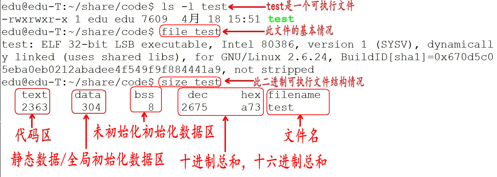


通过上图可以得知，在没有运行程序前，也就是说`程序没有加载到内存前`，可执行程序内部已经分好3段信息，分别为`代码区（text）`、`数据区（data）`和`未初始化数据区（bss）`3 个部分（有些人直接把data和bss合起来叫做静态区或全局区）。


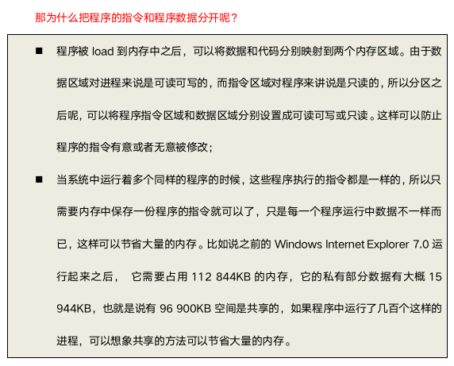


#### 3.3.1.2 运行之后

程序在加载到内存前，`代码区和全局区(data和bss)的大小就是固定的`，程序运行期间不能改变。然后，运行可执行程序，操作系统把物理硬盘程序load(加载)到内存，`除了根据可执行程序的信息分出代码区（text）、数据区（data）和未初始化数据区（bss）之外，还额外增加了栈区、堆区`。


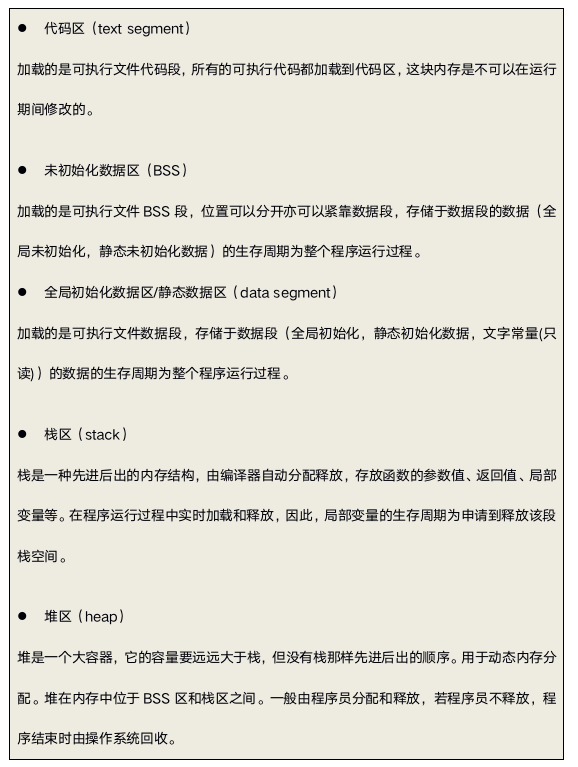


### 3.3.2 分区模型

### 3.3.2.1 栈区

由系统进行内存的管理。主要存放函数的参数以及局部变量。在函数完成执行，系统自行释放栈区内存，不需要用户管理。

```c

#char* func(){
	char p[] = "hello world!"; //在栈区存储 乱码
	printf("%s\n", p);
	return p;
}
void test(){
	char* p = NULL;
	p = func();  
	printf("%s\n",p); 
}

```

### 3.3.2.2 堆区

由编程人员手动申请，手动释放，若不手动释放，程序结束后由系统回收，生命周期是整个程序运行期间。使用malloc或者new进行堆的申请。

```c

char* func(){
	char* str = malloc(100);
	strcpy(str, "hello world!");
	printf("%s\n",str);
	return str;
}

void test01(){
	char* p = NULL;
	p = func();
	printf("%s\n",p);
}

void allocateSpace(char* p){
	p = malloc(100);
	strcpy(p, "hello world!");
	printf("%s\n", p);
}

void test02(){
	
	char* p = NULL;
	allocateSpace(p);

	printf("%s\n", p);
}

```

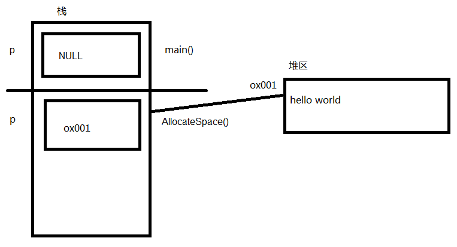

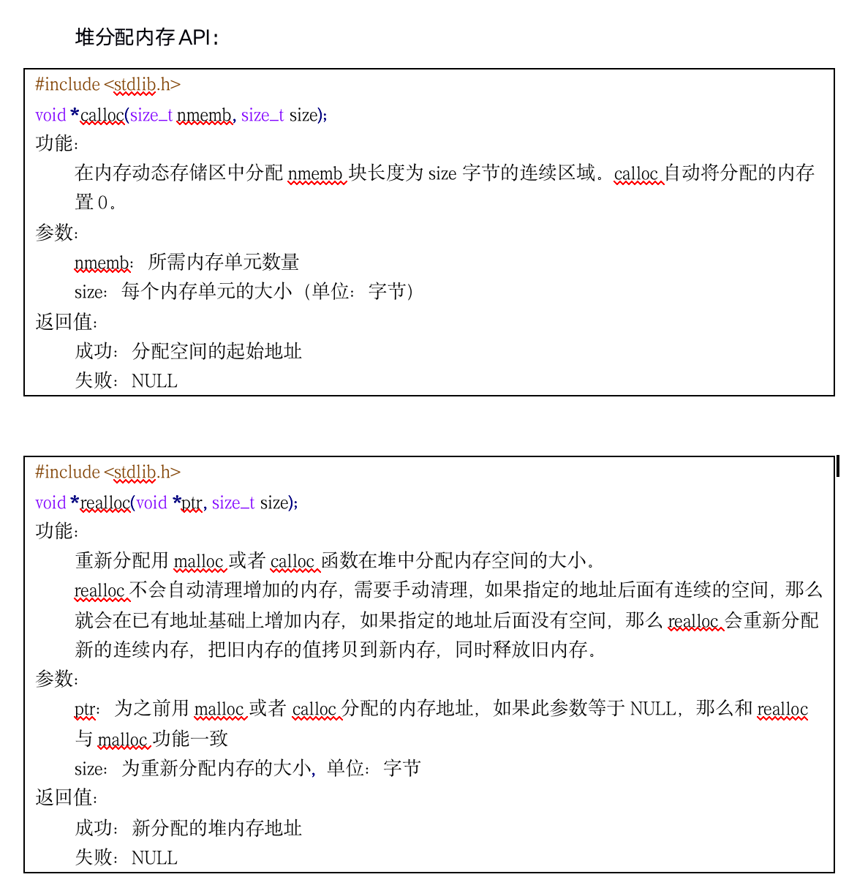

**示例代码：**


```c

void test01(){
	
	int* p1 = calloc(10,sizeof(int));
	if (p1 == NULL){
		return;
	}
	for (int i = 0; i < 10; i ++){
		p1[i] = i + 1;
	}
	for (int i = 0; i < 10; i++){
		printf("%d ",p1[i]);
	}
	printf("\n");
	free(p1);
}

void test02(){
	int* p1 = calloc(10, sizeof(int));
	if (p1 == NULL){
		return;
	}
	for (int i = 0; i < 10; i++){
		p1[i] = i + 1;
	}

	int* p2 = realloc(p1, 15 * sizeof(int));
	if (p2 == NULL){
		return;
	}

	printf("%d\n", p1);
	printf("%d\n", p2);

	//打印
	for (int i = 0; i < 15; i++){
		printf("%d ", p2[i]);
	}
	printf("\n");

	//重新赋值
	for (int i = 0; i < 15; i++){
		p2[i] = i + 1;
	}
	
	//再次打印
	for (int i = 0; i < 15; i++){
		printf("%d ", p2[i]);
	}
	printf("\n");

	free(p2);
}

```


### 3.3.2.3 全局/静态区

全局静态区内的变量在编译阶段已经分配好内存空间并初始化。这块内存在程序运行期间一直存在,它主要存储**全局变量**、**静态变量**和**常量**。

**注意****：**


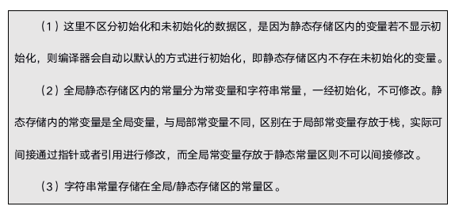


**示例代码****：**

```c

int v1 = 10;//全局/静态区
const int v2 = 20; //常量，一旦初始化，不可修改
static int v3 = 20; //全局/静态区
char *p1; //全局/静态区，编译器默认初始化为NULL

//那么全局static int 和 全局int变量有什么区别？

void test(){
	static int v4 = 20; //全局/静态区
}

```

**加深理解****：**

```c

char* func(){
	static char arr[] = "hello world!"; //在静态区存储 可读可写
	arr[2] = 'c';
	char* p = "hello world!"; //全局/静态区-字符串常量区 
	//p[2] = 'c'; //只读，不可修改 
	printf("%d\n",arr);
	printf("%d\n",p);
	printf("%s\n", arr);
	return arr;
}
void test(){
	char* p = func();
	printf("%s\n",p);
}

```


字符串常量地址是否相同？
tc2.0，同文件字符串常量地址不同。
Vs2013,字符串常量地址同文件和不同文件都相同。
Dev c++、QT同文件相同，不同文件不同。


### 3.3.2.4 总结

在理解C/C++内存分区时，常会碰到如下术语：数据区，堆，栈，静态区，常量区，全局区，字符串常量区，文字常量区，代码区等等，初学者被搞得云里雾里。在这里，尝试捋清楚以上分区的关系。
数据区包括：堆，栈，全局/静态存储区。
- 全局/静态存储区包括：常量区，全局区、静态区。
- 常量区包括：字符串常量区、常变量区。
- 代码区：存放程序编译后的二进制代码，不可寻址区。

**可以说，C/C++内存分区其实只有两个，即代码区和数据区。**

### 3.3.3 函数调用模型

### 3.3.3.1 函数调用流程

栈(stack)是现代计算机程序里最为重要的概念之一，几乎每一个程序都使用了栈，没有栈就没有函数，没有局部变量，也就没有我们如今能见到的所有计算机的语言。在解释为什么栈如此重要之前，我们先了解一下传统的栈的定义：

在经典的计算机科学中，栈被定义为一个特殊的容器，用户可以将数据压入栈中(入栈，push)，也可以将压入栈中的数据弹出(出栈，pop),但是栈容器必须遵循一条规则：**先入栈的数据最后出栈**(First In Last Out,FILO).

在经典的操作系统中，栈总是向下增长的。压栈的操作使得栈顶的地址减小，弹出操作使得栈顶地址增大。

栈在程序运行中具有极其重要的地位。最重要的，栈保存一个函数调用所需要维护的信息，这通常被称为堆栈帧(Stack Frame)或者活动记录(Activate Record).一个函数调用过程所需要的信息一般包括以下几个方面：

- 函数的返回地址；

- 函数的参数；

- 局部变量；

- 保存的上下文：包括在函数调用前后需要保持不变的寄存器。

我们从下面的代码，分析以下函数的调用过程：

```c

int func(int a,int b){
	int t_a = a;
	int t_b = b;
	return t_a + t_b;
}

int main(){
	int ret = 0;
	ret = func(10, 20);
	return EXIT_SUCCESS;
}

```

### 3.3.3.2 调用惯例


现在，我们大致了解了函数调用的过程，这期间有一个现象，那就是函数的调用者和被调用者对函数调用有着一致的理解，例如，它们双方都一致的认为函数的参数是按照某个固定的方式压入栈中。如果不这样的话，函数将无法正确运行。

     如果函数调用方在传递参数的时候先压入a参数，再压入b参数，而被调用函数则认为先压入的是b,后压入的是a,那么被调用函数在使用a,b值时候，就会颠倒。

因此，**函数的调用方和被调用方对于函数是如何调用的必须有一个明确的约定，只有双方都遵循同样的约定，函数才能够被正确的调用，这样的约定被称为****”****调用惯例(**Calling Convention)”.一个调用惯例一般包含以下几个方面：

**函数参数的传递顺序和方式**

函数的传递有很多种方式，最常见的是通过栈传递。函数的调用方将参数压入栈中，函数自己再从栈中将参数取出。对于有多个参数的函数，调用惯例要规定函数调用方将参数压栈的顺序：从左向右，还是从右向左。有些调用惯例还允许使用寄存器传递参数，以提高性能。

**栈的维护方式**

在函数将参数压入栈中之后，函数体会被调用，此后需要将被压入栈中的参数全部弹出，以使得栈在函数调用前后保持一致。这个弹出的工作可以由函数的调用方来完成，也可以由函数本身来完成。

为了在链接的时候对调用惯例进行区分，调用惯例要对函数本身的名字进行修饰。不同的调用惯例有不同的名字修饰策略。

事实上，在c语言里，存在着多个调用惯例，而默认的是cdecl.任何一个没有显示指定调用惯例的函数都是默认是cdecl惯例。比如我们上面对于func函数的声明，它的完整写法应该是：


int _cdecl func(int a,int b);

**注意: _cdecl不是标准的关键字，在不同的编译器里可能有不同的写法，例如gcc里就不存在_cdecl这样的关键字，而是使用__attribute__((cdecl)).**


### 3.3.3.3 函数变量传递分析

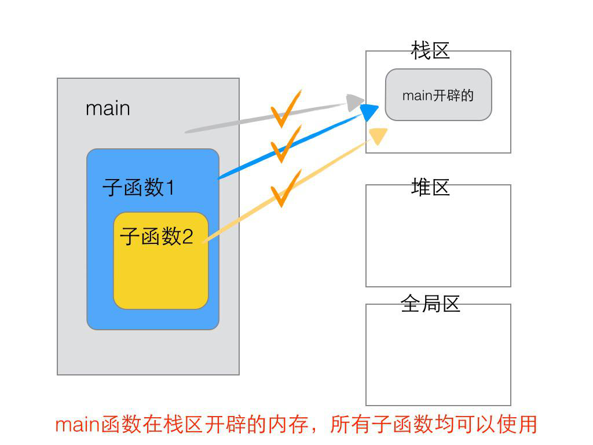

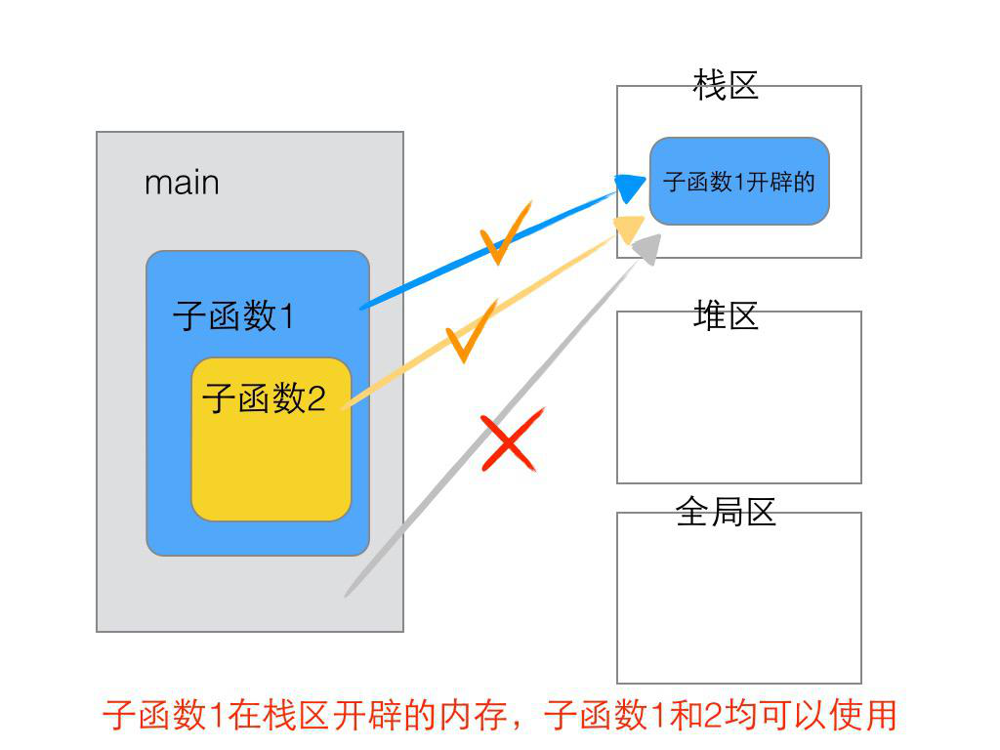
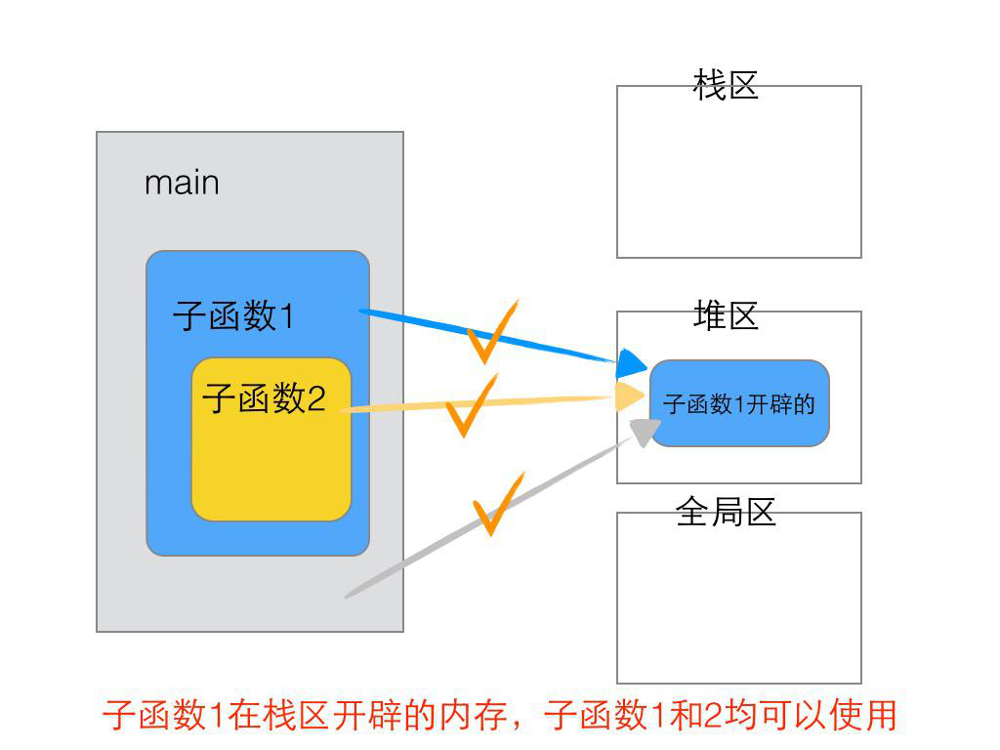


### chighdata003d
## 3.4 栈的生长方向和内存存放方向


```c

//1. 栈的生长方向
void test01(){

	int a = 10;
	int b = 20;
	int c = 30;
	int d = 40;

	printf("a = %d\n", &a);
	printf("b = %d\n", &b);
	printf("c = %d\n", &c);
	printf("d = %d\n", &d);

	//a的地址大于b的地址，故而生长方向向下
}

//2. 内存生长方向(小端模式)
void test02(){
	
	//高位字节 -> 地位字节
	int num = 0xaabbccdd;
	unsigned char* p = &num;

	//从首地址开始的第一个字节
	printf("%x\n",*p);
	printf("%x\n", *(p + 1));
	printf("%x\n", *(p + 2));
	printf("%x\n", *(p + 3));
}

```


### chighdata004
# 4. 指针强化


### chighdata004a
## 4.1 指针是一种数据类型

### chighdata004a1
### 4.1.1 指针变量

指针是一种数据类型，占用内存空间，用来保存内存地址。

```c

void test01(){
	
	int* p1 = 0x1234;
	int*** p2 = 0x1111;

	printf("p1 size:%d\n",sizeof(p1));
	printf("p2 size:%d\n",sizeof(p2));


	//指针是变量，指针本身也占内存空间，指针也可以被赋值
	int a = 10;
	p1 = &a;

	printf("p1 address:%p\n", &p1);
	printf("p1 address:%p\n", p1);
	printf("a address:%p\n", &a);

}

```

### chighdata004a2
### 4.1.2 野指针和空指针

1. 空指针

标准定义了NULL指针，它作为一个特殊的指针变量，表示不指向任何东西。要使一个指针为NULL,可以给它赋值一个零值。为了测试一个指针百年来那个是否为NULL,你可以将它与零值进行比较。

对指针解引用操作可以获得它所指向的值。但从定义上看，NULL指针并未指向任何东西，因为对一个NULL指针因引用是一个非法的操作，在解引用之前，必须确保它不是一个NULL指针。

 如果对一个NULL指针间接访问会发生什么呢？结果因编译器而异。

**不允许向NULL和非法地址拷贝内存****：**

```c

void test(){
	char *p = NULL;
	//给p指向的内存区域拷贝内容
	strcpy(p, "1111"); //err

	char *q = 0x1122;
	//给q指向的内存区域拷贝内容
	strcpy(q, "2222"); //err		
}

```

2. 野指针

**在使用指针时，要避免野指针的出现：**

野指针指向一个已删除的对象或未申请访问受限内存区域的[指针](http://baike.baidu.com/view/159417.htm)。与空指针不同，野指针无法通过简单地判断是否为 [NULL](http://baike.baidu.com/view/329484.htm)避免，而只能通过养成良好的编程习惯来尽力减少。对野指针进行操作很容易造成程序错误。

**什么情况下回导致野指针？**

1. **指针变量未初始化**

- 任何指针变量刚被创建时不会自动成为NULL指针，它的缺省值是随机的，它会乱指一气。所以，指针变量在创建的同时应当被初始化，要么将指针设置为NULL，要么让它指向合法的内存。

2. **指针释放后未置空**

- 有时指针在free或delete后未赋值 NULL，便会使人以为是合法的。别看free和delete的名字（尤其是delete），它们只是把指针所指的内存给释放掉，但并没有把指针本身干掉。此时指针指向的就是“垃圾”内存。释放后的指针应立即将指针置为NULL，防止产生“野指针”。

3. **指针操作超越变量作用域**

- 不要返回指向栈内存的指针或引用，因为栈内存在函数结束时会被释放。


```c

void test(){
	int* p = 0x001; //未初始化
	printf("%p\n",p);
	*p = 100;
}

```


**操作野指针是非常危险的操作，应该规避野指针的出现：**


1. **初始化时置 NULL**

- 指针变量一定要初始化为NULL，因为任何指针变量刚被创建时不会自动成为NULL指针，它的缺省值是随机的。

2. **释放时置 NULL**

- 当指针p指向的内存空间释放时，没有设置指针p的值为NULL。delete和free只是把内存空间释放了，但是并没有将指针p的值赋为NULL。通常判断一个指针是否合法，都是使用if语句测试该指针是否为NULL。

### chighdata004a3
### 4.1.3 间接访问操作符

通过一个指针访问它所指向的地址的过程叫做间接访问，或者叫解引用指针，这个用于执行间接访问的操作符是*。

注意：对一个`int*`类型指针解引用会产生一个整型值，类似地，对一个`float*`指针解引用会产生了一个float类型的值。


1. 在指针声明时，* 号表示所声明的变量为指针

2. 在指针使用时，* 号表示操作指针所指向的内存空间

- 1）* 相当通过地址(指针变量的值)找到指针指向的内存，再操作内存

- 2）* 放在等号的左边赋值（给内存赋值，写内存）

- 3）* 放在等号的右边取值（从内存中取值，读内存）

```c

//解引用
void test01(){

	//定义指针
	int* p = NULL;
	//指针指向谁，就把谁的地址赋给指针
	int a = 10;
	p = &a;
	*p = 20;//*在左边当左值，必须确保内存可写
	//*号放右面，从内存中读值
	int b = *p;
	//必须确保内存可写
	char* str = "hello world!";
	*str = 'm';

	printf("a:%d\n", a);
	printf("*p:%d\n", *p);
	printf("b:%d\n", b);
}

```


### chighdata004a4
### 4.1.4 指针的步长

指针是一种数据类型，是指它指向的内存空间的数据类型。指针所指向的内存空间决定了指针的步长。指针的步长指的是，当指针+1时候，移动多少字节单位。

思考如下问题：

```c

int a = 0xaabbccdd;
unsigned int *p1 = &a;
unsigned char *p2 = &a;

//为什么*p1打印出来正确结果？
printf("%x\n", *p1);
//为什么*p2没有打印出来正确结果？
printf("%x\n", *p2);

//为什么p1指针+1加了4字节？
printf("p1  =%d\n", p1);
printf("p1+1=%d\n", p1 + 1);
//为什么p2指针+1加了1字节？
printf("p2  =%d\n", p2);
printf("p2+1=%d\n", p2 + 1);

```


### chighdata004b
## 4.2 指针的意义_间接赋值


### chighdata004b1
### 4.2.1 间接赋值的三大条件

通过指针间接赋值成立的三大条件：

- 1）2个变量（一个普通变量一个指针变量、或者一个实参一个形参）

- 2）建立关系

- 3）通过 * 操作指针指向的内存

```c

void test(){
	int a = 100;	//两个变量
	int *p = NULL;
	//建立关系
	//指针指向谁，就把谁的地址赋值给指针
	p = &a;
	//通过*操作内存
	*p = 22;
}

```


### chighdata004b2
### 4.2.2 如何定义合适的指针变量


```c

void test(){
	int b;  
	int *q = &b; //0级指针
	int **t = &q;
	int ***m = &t;
}

```


### chighdata004b3
### 4.2.3 间接赋值：从0级指针到1级指针


```c

int func1(){ return 10; }

void func2(int a){
	a = 100;
}
//指针的意义_间接赋值
void test02(){
	int a = 0;
	a = func1();
	printf("a = %d\n", a);

	//为什么没有修改？
	func2(a);
	printf("a = %d\n", a);
}

//指针的间接赋值
void func3(int* a){
	*a = 100;
}

void test03(){
	int a = 0;
	a = func1();
	printf("a = %d\n", a);

	//修改
	func3(&a);
	printf("a = %d\n", a);
}

```

### chighdata004b4
### 4.2.4 间接赋值：从1级指针到2级指针

```c

void AllocateSpace(char** p){
	*p = (char*)malloc(100);
	strcpy(*p, "hello world!");
}

void FreeSpace(char** p){

	if (p == NULL){
		return;
	}
	if (*p != NULL){
		free(*p);
		*p = NULL;
	}

}

void test(){
	
	char* p = NULL;

	AllocateSpace(&p);
	printf("%s\n",p);
	FreeSpace(&p);

	if (p == NULL){
		printf("p内存释放!\n");
	}
}

```


### chighdata004b5
### 4.2.5 间接赋值的推论

- 用1级指针形参，去间接修改了0级指针(实参)的值。

- 用2级指针形参，去间接修改了1级指针(实参)的值。

- 用3级指针形参，去间接修改了2级指针(实参)的值。

- 用n级指针形参，去间接修改了n-1级指针(实参)的值。

### chighdata004c
## 4.3 指针做函数参数

指针做函数参数，具备输入和输出特性：

- `输入`：主调函数分配内存

- `输出`：被调用函数分配内存


### chighdata004c1
## 4.3.1 输入特性

```c

void fun(char *p /* in */)
{
	//给p指向的内存区域拷贝内容
	strcpy(p, "abcddsgsd");
}

void test(void)
{
	//输入，主调函数分配内存
	char buf[100] = { 0 };
	fun(buf);
	printf("buf  = %s\n", buf);
}

```

### chighdata004c2
## 4.3.2 输出特性

```c

void fun(char **p /* out */, int *len)
{
	char *tmp = (char *)malloc(100);
	if (tmp == NULL)
	{
		return;
	}
	strcpy(tmp, "adlsgjldsk");

	//间接赋值
	*p = tmp;
	*len = strlen(tmp);
}

void test(void)
{
	//输出，被调用函数分配内存，地址传递
	char *p = NULL;
	int len = 0;
	fun(&p, &len);
	if (p != NULL)
	{
		printf("p = %s, len = %d\n", p, len);
	}
}

```


### chighdata004d
## 4.4 字符串指针强化


### chighdata004d1
## 4.4.1 字符串指针做函数参数

1. 字符串基本操作

```c

//字符串基本操作
//字符串是以0或者'\0'结尾的字符数组，(数字0和字符'\0'等价)
void test01(){

	//字符数组只能初始化5个字符，当输出的时候，从开始位置直到找到0结束
	char str1[] = { 'h', 'e', 'l', 'l', 'o' };
	printf("%s\n",str1);

	//字符数组部分初始化，剩余填0
	char str2[100] = { 'h', 'e', 'l', 'l', 'o' };
	printf("%s\n", str2);

	//如果以字符串初始化，那么编译器默认会在字符串尾部添加'\0'
	char str3[] = "hello";
	printf("%s\n",str3);
	printf("sizeof str:%d\n",sizeof(str3));
	printf("strlen str:%d\n",strlen(str3));

	//sizeof计算数组大小，数组包含'\0'字符
	//strlen计算字符串的长度，到'\0'结束

	//那么如果我这么写,结果是多少呢？
	char str4[100] = "hello";
	printf("sizeof str:%d\n", sizeof(str4));
	printf("strlen str:%d\n", strlen(str4));

	//请问下面输入结果是多少？sizeof结果是多少？strlen结果是多少？
	char str5[] = "hello\0world"; 
	printf("%s\n",str5);
	printf("sizeof str5:%d\n",sizeof(str5));
	printf("strlen str5:%d\n",strlen(str5));

	//再请问下面输入结果是多少？sizeof结果是多少？strlen结果是多少？
	char str6[] = "hello\012world";
	printf("%s\n", str6);
	printf("sizeof str6:%d\n", sizeof(str6));
	printf("strlen str6:%d\n", strlen(str6));
}

```


八进制和十六进制转义字符：
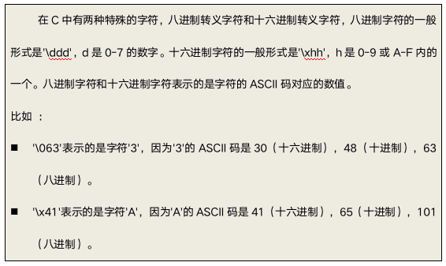


2. 字符串拷贝功能实现


```c

//拷贝方法1
void copy_string01(char* dest, char* source ){

	for (int i = 0; source[i] != '\0';i++){
		dest[i] = source[i];
	}

}

//拷贝方法2
void copy_string02(char* dest, char* source){
	while (*source != '\0' /* *source != 0 */){
		*dest = *source;
		source++;
		dest++;
	}
}

//拷贝方法3
void copy_string03(char* dest, char* source){
	//判断*dest是否为0，0则退出循环
	while (*dest++ = *source++){}
}


```


3. 字符串反转模型

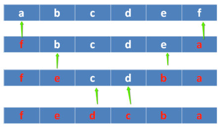


```c

void reverse_string(char* str){

	if (str == NULL){
		return;
	}

	int begin = 0;
	int end = strlen(str) - 1;
	
	while (begin < end){
		
		//交换两个字符元素
		char temp = str[begin];
		str[begin] = str[end];
		str[end] = temp;

		begin++;
		end--;
	}

}

void test(){
	char str[] = "abcdefghijklmn";
	printf("str:%s\n", str);
	reverse_string(str);
	printf("str:%s\n", str);
}

```


### chighdata004d2
## 4.4.2 字符串的格式化


1. sprintf


```c

void test(){
	
	//1. 格式化字符串
	char buf[1024] = { 0 };
	sprintf(buf, "你好,%s,欢迎加入我们!", "John");
	printf("buf:%s\n",buf);

	memset(buf, 0, 1024);
	sprintf(buf, "我今年%d岁了!", 20);
	printf("buf:%s\n", buf);

	//2. 拼接字符串
	memset(buf, 0, 1024);
	char str1[] = "hello";
	char str2[] = "world";
	int len = sprintf(buf,"%s %s",str1,str2);
	printf("buf:%s len:%d\n", buf,len);

	//3. 数字转字符串
	memset(buf, 0, 1024);
	int num = 100;
	sprintf(buf, "%d", num);
	printf("buf:%s\n", buf);
	//设置宽度 右对齐
	memset(buf, 0, 1024);
	sprintf(buf, "%8d", num);
	printf("buf:%s\n", buf);
	//设置宽度 左对齐
	memset(buf, 0, 1024);
	sprintf(buf, "%-8d", num);
	printf("buf:%s\n", buf);
	//转成16进制字符串 小写
	memset(buf, 0, 1024);
	sprintf(buf, "0x%x", num);
	printf("buf:%s\n", buf);

	//转成8进制字符串
	memset(buf, 0, 1024);
	sprintf(buf, "0%o", num);
	printf("buf:%s\n", buf);
}

```

2. sscanf


```c

//1. 跳过数据
void test01(){
	char buf[1024] = { 0 };
	//跳过前面的数字
	//匹配第一个字符是否是数字，如果是，则跳过
	//如果不是则停止匹配
	sscanf("123456aaaa", "%*d%s", buf); 
	printf("buf:%s\n",buf);
}

//2. 读取指定宽度数据
void test02(){
	char buf[1024] = { 0 };
	//跳过前面的数字
	sscanf("123456aaaa", "%7s", buf);
	printf("buf:%s\n", buf);
}

//3. 匹配a-z中任意字符
void test03(){
	char buf[1024] = { 0 };
	//跳过前面的数字
	//先匹配第一个字符，判断字符是否是a-z中的字符，如果是匹配
	//如果不是停止匹配
	sscanf("abcdefg123456", "%[a-z]", buf);
	printf("buf:%s\n", buf);
}

//4. 匹配aBc中的任何一个
void test04(){
	char buf[1024] = { 0 };
	//跳过前面的数字
	//先匹配第一个字符是否是aBc中的一个，如果是，则匹配，如果不是则停止匹配
	sscanf("abcdefg123456", "%[aBc]", buf);
	printf("buf:%s\n", buf);
}

//5. 匹配非a的任意字符
void test05(){
	char buf[1024] = { 0 };
	sscanf("bcdefag123456", "%[^a]", buf);
	printf("buf:%s\n", buf);
}

//6. 匹配非a-z中的任意字符
void test06(){
	char buf[1024] = { 0 };
	sscanf("123456ABCDbcdefag", "%[^a-z]", buf);
	printf("buf:%s\n", buf);
}

```


### chighdata004e
## 4.5 一级指针易错点


### chighdata004e1
## 4.5.1 越界

```c

void test(){
	char buf[3] = "abc";
	printf("buf:%s\n",buf);
}

```


### chighdata004e2
## 4.5.2 指针叠加会不断改变指针指向

```c

void test(){
	char *p = (char *)malloc(50);
	char buf[] = "abcdef";
	int n = strlen(buf);
	int i = 0;

	for (i = 0; i < n; i++)
	{
		*p = buf[i];
		p++; //修改原指针指向
	}

	free(p);
}

```


### chighdata004e3
## 4.5.3 返回局部变量地址

```c

char *get_str()
{
	char str[] = "abcdedsgads"; //栈区，
	printf("[get_str]str = %s\n", str);
	return str;
}

```


### chighdata004e4
## 4.5.4 同一块内存释放多次（不可以释放野指针）

```c

void test(){	
	char *p = NULL;

	p = (char *)malloc(50);
	strcpy(p, "abcdef");

	if (p != NULL)
	{
		//free()函数的功能只是告诉系统 p 指向的内存可以回收了
		// 就是说，p 指向的内存使用权交还给系统
		//但是，p的值还是原来的值(野指针)，p还是指向原来的内存
		free(p); 
	}

	if (p != NULL)
	{
		free(p);
	}
}

```


### chighdata004f
## 4.6 const使用

```c

//const修饰变量
void test01(){
	//1. const基本概念
	const int i = 0;
	//i = 100; //错误，只读变量初始化之后不能修改

	//2. 定义const变量最好初始化
	const int j;
	//j = 100; //错误，不能再次赋值

	//3. c语言的const是一个只读变量，并不是一个常量，可通过指针间接修改
	const int k = 10;
	//k = 100; //错误，不可直接修改，我们可通过指针间接修改
	printf("k:%d\n", k);
	int* p = &k;
	*p = 100;
	printf("k:%d\n", k);
}

//const 修饰指针
void test02(){

	int a = 10;
	int b = 20;
	//const放在*号左侧 修饰p_a指针指向的内存空间不能修改,但可修改指针的指向
	const int* p_a = &a;
	//*p_a = 100; //不可修改指针指向的内存空间
	p_a = &b; //可修改指针的指向

	//const放在*号的右侧， 修饰指针的指向不能修改，但是可修改指针指向的内存空间
	int* const p_b = &a;
	//p_b = &b; //不可修改指针的指向
	*p_b = 100; //可修改指针指向的内存空间

	//指针的指向和指针指向的内存空间都不能修改
	const int* const p_c = &a;
}
//const指针用法
struct Person{
	char name[64];
	int id;
	int age;
	int score;
};

//每次都对对象进行拷贝，效率低，应该用指针
void printPersonByValue(struct Person person){
	printf("Name:%s\n", person.name);
	printf("Name:%d\n", person.id);
	printf("Name:%d\n", person.age);
	printf("Name:%d\n", person.score);
}

//但是用指针会有副作用，可能会不小心修改原数据
void printPersonByPointer(const struct Person *person){
	printf("Name:%s\n", person->name);
	printf("Name:%d\n", person->id);
	printf("Name:%d\n", person->age);
	printf("Name:%d\n", person->score);
}
void test03(){
	struct Person p = { "Obama", 1101, 23, 87 };
	//printPersonByValue(p);
	printPersonByPointer(&p);
}

```


### chighdata005
# 5. 指针的指针(二级指针)

### chighdata005a
## 5.1 二级指针基本概念

这里让我们花点时间来看一个例子，揭开这个即将开始的序幕。考虑下面这些声明：


```c

int a = 12;
int *b = &a;

```

它们如下图进行内存分配：

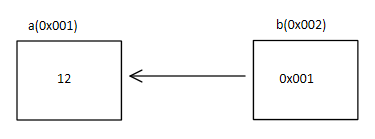


假定我们又有了第3个变量，名叫c,并用下面这条语句对它进行初始化：


```c

c = &b;

```

它在内存中的大概模样大致如下：

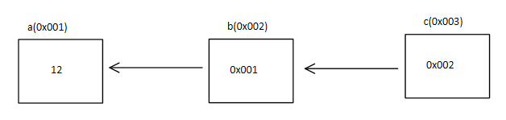


问题是：c的类型是什么？显然它是一个指针，但它所指向的是什么？变量b是一个“指向整型的指针”，所以任何指向b的类型必须是指向“指向整型的指针”的指针，更通俗地说，是一个指针的指针。

它合法吗？是的！指针变量和其他变量一样，占据内存中某个特定的位置，所以用&操作符取得它的地址是合法的。

那么这个变量的声明是怎样的声明的呢？


```c

int **c = &b;

```

那么这个`**`c如何理解呢？`*`操作符具有从右想做的结合性，所以这个表达式相当于`*(*c),`我们从里向外逐层求职。`*c`访问c所指向的位置，我们知道这是变量b.第二个间接访问操作符访问这个位置所指向的地址，也就是变量a.指针的指针并不难懂，只需要留心所有的箭头，如果表达式中出现了间接访问操作符，你就要随箭头访问它所指向的位置。


### chighdata005b
## 5.2 二级指针做形参输出特性

二级指针做参数的输出特性是指由被调函数分配内存。


```c

//被调函数,由参数n确定分配多少个元素内存
void allocate_space(int **arr,int n){
	//堆上分配n个int类型元素内存
	int *temp = (int *)malloc(sizeof(int)* n);
	if (NULL == temp){
		return;
	}
	//给内存初始化值
	int *pTemp = temp;
	for (int i = 0; i < n;i ++){
		//temp[i] = i + 100;
		*pTemp = i + 100;
		pTemp++;
	}
	//指针间接赋值
	*arr = temp;
}
//打印数组
void print_array(int *arr,int n){
	for (int i = 0; i < n;i ++){
		printf("%d ",arr[i]);
	}
	printf("\n");
}
//二级指针输出特性(由被调函数分配内存)
void test(){
	int *arr = NULL;
	int n = 10;
	//给arr指针间接赋值
	allocate_space(&arr,n);
	//输出arr指向数组的内存
	print_array(arr, n);
	//释放arr所指向内存空间的值
	if (arr != NULL){
		free(arr);
		arr = NULL;
	}
}

```

### chighdata005c
## 5.3 二级指针做形参输入特性

二级指针做形参输入特性是指由主调函数分配内存。


```c

//打印数组
void print_array(int **arr,int n){
	for (int i = 0; i < n;i ++){
		printf("%d ",*(arr[i]));
	}
	printf("\n");
}
//二级指针输入特性(由主调函数分配内存)
void test(){
	
	int a1 = 10;
	int a2 = 20;
	int a3 = 30;
	int a4 = 40;
	int a5 = 50;

	int n = 5;

	int** arr = (int **)malloc(sizeof(int *) * n);
	arr[0] = &a1;
	arr[1] = &a2;
	arr[2] = &a3;
	arr[3] = &a4;
	arr[4] = &a5;

	print_array(arr,n);

	free(arr);
	arr = NULL;
}

```

### chighdata005d
## 5.4 强化训练_画出内存模型图


```c


void mian()
{
	//栈区指针数组
	char *p1[] = { "aaaaa", "bbbbb", "ccccc" };

	//堆区指针数组
	char **p3 = (char **)malloc(3 * sizeof(char *)); //char *array[3];

	int i = 0;
	for (i = 0; i < 3; i++)
	{
		p3[i] = (char *)malloc(10 * sizeof(char)); //char buf[10]
		sprintf(p3[i], "%d%d%d", i, i, i);
	}
}

```

### chighdata005e
## 5.5 多级指针

将堆区数组指针案例改为三级指针案例：


```c

//分配内存
void allocate_memory(char*** p, int n){

	if (n < 0){
		return;
	}

	char** temp = (char**)malloc(sizeof(char*)* n);
	if (temp == NULL){
		return;
	}

	//分别给每一个指针malloc分配内存
	for (int i = 0; i < n; i++){
		temp[i] = malloc(sizeof(char)* 30);
		sprintf(temp[i], "%2d_hello world!", i + 1);
	}

	*p = temp;
}

//打印数组
void array_print(char** arr, int len){
	for (int i = 0; i < len; i++){
		printf("%s\n", arr[i]);
	}
	printf("----------------------\n");
}

//释放内存
void free_memory(char*** buf, int len){
	if (buf == NULL){
		return;
	}

	char** temp = *buf;

	for (int i = 0; i < len; i++){
		free(temp[i]);
		temp[i] = NULL;
	}

	free(temp);
}

void test(){

	int n = 10;
	char** p = NULL;
	allocate_memory(&p, n);
	//打印数组
	array_print(p, n);
	//释放内存
	free_memory(&p, n);
}

```


### chighdata006
# 6. 多维数组

### chighdata006a
# 6.1 一维数组


- 元素类型角度：数组是相同类型的变量的有序集合

- 内存角度：连续的一大片内存空间

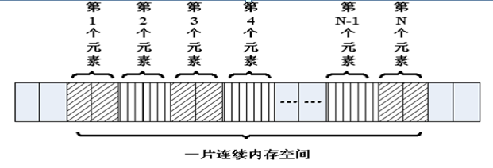

在讨论多维数组之前，我们还需要学习很多关于一维数组的知识。首先让我们学习一个概念。


### chighdata006a1
## 6.1.1 数组名


考虑下面这些声明：

```c


int a;
int b[10];

```

我们把a称作标量，因为它是个单一的值，这个变量是的类型是一个整数。我们把b称作数组，因为它是一些值的集合。下标和数名一起使用，用于标识该集合中某个特定的值。例如，b[0]表示数组b的第1个值，b[4]表示第5个值。每个值都是一个特定的标量。

那么问题是b的类型是什么？它所表示的又是什么？一个合乎逻辑的答案是它表示整个数组，但事实并非如此。在C中，在几乎所有数组名的表达式中，数组名的值是一个**指针常量**，也就是数组第一个元素的地址。它的类型取决于数组元素的类型：如果他们是int类型，那么数组名的类型就是“指向int的常量指针”；如果它们是其他类型，那么数组名的类型也就是“指向**其他类型**的常量指针”。


**请问：指针和数组是等价的吗？**

答案是**否定**的。数组名在表达式中使用的时候，编译器才会产生一个指针常量。那么数组在什么情况下不能作为指针常量呢？在以下两种场景下：

- 当数组名作为sizeof操作符的操作数的时候，此时sizeof返回的是整个数组的长度，而不是指针数组指针的长度。

- 当数组名作为&操作符的操作数的时候，此时返回的是一个指向数组的指针，而不是指向某个数组元素的指针常量。

```c

int arr[10];
//arr = NULL; //arr作为指针常量，不可修改
int *p = arr; //此时arr作为指针常量来使用
printf("sizeof(arr):%d\n", sizeof(arr)); //此时sizeof结果为整个数组的长度
printf("&arr type is %s\n", typeid(&arr).name()); //int(*)[10]而不是int*

```


### chighdata006a2
## 6.1.2 下标引用


```c

int arr[] = { 1, 2, 3, 4, 5, 6 };

```

`*`**(arr + 3)** ,这个表达式是什么意思呢？

首先，我们说数组在表达式中是一个指向整型的指针，所以此表达式表示arr指针向后移动了3个元素的长度。然后通过间接访问操作符从这个新地址开始获取这个位置的值。这个和下标的引用的执行过程完全相同。所以如下表达式是等同的：

```c

*(arr + 3)
arr[3]

```

**问题** **1**数组下标可否为负值？

**问题2**请阅读如下代码，说出结果：

```c

int arr[] = { 5, 3, 6, 8, 2, 9 };
int *p = arr + 2;
printf("*p = %d\n", *p);
printf("*p = %d\n", p[-1]);

```


那么是用下标还是指针来操作数组呢？对于大部分人而言，下标的可读性会强一些。

### chighdata006a3
## 6.1.3 数组和指针

指针和数组并不是相等的。为了说明这个概念，请考虑下面两个声明：

```c

int a[10];
int *b;

```

声明一个数组时，编译器根据声明所指定的元素数量为数组分配内存空间，然后再创建数组名，指向这段空间的起始位置。声明一个指针变量的时候，编译器只为指针本身分配内存空间，并不为任何整型值分配内存空间，指针并未初始化指向任何现有的内存空间。

因此，表达式`*`a是完全合法的，但是表达式`*`b却是非法的。*b将访问内存中一个不确定的位置，将会导致程序终止。另一方面b`++`可以通过编译，a`++`却不行，因为a是一个常量值。


### chighdata006a4
## 6.1.4 作为函数参数的数组名

当一个数组名作为一个参数传递给一个函数的时候发生什么情况呢？我们现在知道数组名其实就是一个指向数组第1个元素的指针，所以很明白此时传递给函数的是一份指针的拷贝。所以函数的形参实际上是一个指针。但是为了使程序员新手容易上手一些，编译器也接受数组形式的函数形参。因此下面两种函数原型是相等的：


```c

int print_array(int *arr);
int print_array(int arr[]);

```

我们可以使用任何一种声明，但哪一个更准确一些呢？答案是指针。因为实参实际上是个指针，而不是数组。同样sizeof arr值是指针的长度，而不是数组的长度。

现在我们清楚了，为什么一维数组中无须写明它的元素数目了，因为形参只是一个指针，并不需要为数组参数分配内存。另一方面，这种方式使得函数无法知道数组的长度。如果函数需要知道数组的长度，它必须显式传递一个长度参数给函数。

### chighdata006b
# 6.2 多维数组

如果某个数组的维数不止1个，它就被称为多维数组。接下来的案例讲解以二维数组

举例。

```c

void test01(){
	//二维数组初始化
	int arr1[3][3] = {
		{ 1, 2, 3 },
		{ 4, 5, 6 },
		{ 7, 8, 9 }
	};
	int arr2[3][3] = { 1, 2, 3, 4, 5, 6, 7, 8, 9 };
	int arr3[][3] = { 1, 2, 3, 4, 5, 6, 7, 8, 9 };

	//打印二维数组
	for (int i = 0; i < 3; i++){
		for (int j = 0; j < 3; j ++){
			printf("%d ",arr1[i][j]);
		}
		printf("\n");
	}
}

```


### chighdata006b1
## 6.2.1 数组名

一维数组名的值是一个指针常量，它的类型是“指向元素类型的指针”，它指向数组的第1个元素。多维数组也是同理，多维数组的数组名也是指向第一个元素，只不过第一个元素是一个数组。例如：


```c

int arr[3][10]

```


可以理解为这是一个一维数组，包含了3个元素，只是每个元素恰好是包含了10个元素的数组。arr就表示指向它的第1个元素的指针，所以arr是一个指向了包含了10个整型元素的数组的指针。


### chighdata006b2
## 6.2.2 指向数组的指针(数组指针)

数组指针，它是指针，指向数组的指针。

数组的类型由**元素类型**和**数组大小**共同决定：int array[5]  的类型为  int[5]；C语言可通过typedef定义一个数组类型：

定义数组指针有一下三种方式：

```c

//方式一
void test01(){

	//先定义数组类型，再用数组类型定义数组指针
	int arr[10] = {1,2,3,4,5,6,7,8,9,10};
	//有typedef是定义类型，没有则是定义变量,下面代码定义了一个数组类型ArrayType
	typedef int(ArrayType)[10];
	//int ArrayType[10]; //定义一个数组，数组名为ArrayType

	ArrayType myarr; //等价于 int myarr[10];
	ArrayType* pArr = &arr; //定义了一个数组指针pArr，并且指针指向数组arr
	for (int i = 0; i < 10;i++){
		printf("%d ",(*pArr)[i]);
	}
	printf("\n");
}

//方式二
void test02(){

	int arr[10];
	//定义数组指针类型
	typedef int(*ArrayType)[10];
	ArrayType pArr = &arr; //定义了一个数组指针pArr，并且指针指向数组arr
	for (int i = 0; i < 10; i++){
		(*pArr)[i] = i + 1;
	}
	for (int i = 0; i < 10; i++){
		printf("%d ", (*pArr)[i]);
	}
	printf("\n");

}

//方式三
void test03(){
	
	int arr[10];
	int(*pArr)[10] = &arr;

	for (int i = 0; i < 10; i++){
		(*pArr)[i] = i + 1;

	}
	for (int i = 0; i < 10; i++){
		printf("%d ", (*pArr)[i]);
	}
	printf("\n");
}

```


### chighdata006b3
## 6.2.3 指针数组(元素为指针)

1. 栈区指针数组

```c

//数组做函数函数，退化为指针
void array_sort(char** arr,int len){

	for (int i = 0; i < len; i++){
		for (int j = len - 1; j > i; j --){
			//比较两个字符串
			if (strcmp(arr[j-1],arr[j]) > 0){
				char* temp = arr[j - 1];
				arr[j - 1] = arr[j];
				arr[j] = temp;
			}
		}
	}

}

//打印数组
void array_print(char** arr,int len){
	for (int i = 0; i < len;i++){
		printf("%s\n",arr[i]);
	}
	printf("----------------------\n");
}

void test(){
	
	//主调函数分配内存
	//指针数组
	char* p[] = { "bbb", "aaa", "ccc", "eee", "ddd"};
	//char** p = { "aaa", "bbb", "ccc", "ddd", "eee" }; //错误
	int len = sizeof(p) / sizeof(char*);
	//打印数组
	array_print(p, len);
	//对字符串进行排序
	array_sort(p, len);
	//打印数组
	array_print(p, len);
}

```


2. 堆区指针数组

```c

//分配内存
char** allocate_memory(int n){
	
	if (n < 0 ){
		return NULL;
	}

	char** temp = (char**)malloc(sizeof(char*) * n);
	if (temp == NULL){
		return NULL;
	}

	//分别给每一个指针malloc分配内存
	for (int i = 0; i < n; i ++){
		temp[i] = malloc(sizeof(char)* 30);
		sprintf(temp[i], "%2d_hello world!", i + 1);
	}

	return temp;
}

//打印数组
void array_print(char** arr,int len){
	for (int i = 0; i < len;i++){
		printf("%s\n",arr[i]);
	}
	printf("----------------------\n");
}

//释放内存
void free_memory(char** buf,int len){
	if (buf == NULL){
		return;
	}
	for (int i = 0; i < len; i ++){
		free(buf[i]);
		buf[i] = NULL;
	}

	free(buf);
}

void test(){
	
	int n = 10;
	char** p = allocate_memory(n);
	//打印数组
	array_print(p, n);
	//释放内存
	free_memory(p, n);
}

```


### chighdata006b4
## 6.2.4 二维数组三种参数形式

1. 二维数组的线性存储特性

```c

void PrintArray(int* arr, int len){
	for (int i = 0; i < len; i++){
		printf("%d ", arr[i]);
	}
	printf("\n");
}

//二维数组的线性存储
void test(){
	int arr[][3] = {
		{ 1, 2, 3 },
		{ 4, 5, 6 },
		{ 7, 8, 9 }
	};

	int arr2[][3] = { 1, 2, 3, 4, 5, 6, 7, 8, 9 };
	int len = sizeof(arr2) / sizeof(int);

	//如何证明二维数组是线性的？
	//通过将数组首地址指针转成Int*类型，那么步长就变成了4，就可以遍历整个数组
	int* p = (int*)arr;
	for (int i = 0; i < len; i++){
		printf("%d ", p[i]);
	}
	printf("\n");

	PrintArray((int*)arr, len);
	PrintArray((int*)arr2, len);
}

```

2. 二维数组的3种形式参数

```c

//二维数组的第一种形式
void PrintArray01(int arr[3][3]){
	for (int i = 0; i < 3; i++){
		for (int j = 0; j < 3; j++){
			printf("arr[%d][%d]:%d\n", i, j, arr[i][j]);
		}
	}
}

//二维数组的第二种形式
void PrintArray02(int arr[][3]){
	for (int i = 0; i < 3; i++){
		for (int j = 0; j < 3; j++){
			printf("arr[%d][%d]:%d\n", i, j, arr[i][j]);
		}
	}
}

//二维数组的第二种形式
void PrintArray03(int(*arr)[3]){
	for (int i = 0; i < 3; i++){
		for (int j = 0; j < 3; j++){
			printf("arr[%d][%d]:%d\n", i, j, arr[i][j]);
		}
	}
}

void test(){
	
	int arr[][3] = { 
		{ 1, 2, 3 },
		{ 4, 5, 6 },
		{ 7, 8, 9 }
	};
	
	PrintArray01(arr);
	PrintArray02(arr);
	PrintArray03(arr);
}


```


### chighdata006c
# 6.3 总结


### **6.3.1 编程提示**

- 源代码的可读性几乎总是比程序的运行时效率更为重要

- 只要有可能，函数的指针形参都应该声明为const

- 在多维数组的初始值列表中使用完整的多层花括号提高可读性

### **6.3.2 内容总结**

在绝大多数表达式中，数组名的值是指向数组第1个元素的指针。这个规则只有两个例外，sizeof和对数组名&。

指针和数组并不相等。当我们声明一个数组的时候，同时也分配了内存。但是声明指针的时候，只分配容纳指针本身的空间。

当数组名作为函数参数时，实际传递给函数的是一个指向数组第1个元素的指针。

我们不单可以创建指向普通变量的指针，也可创建指向数组的指针。

### chighdata007
# 7. 结构体

### chighdata007a
## 7.1 结构体基础知识


#### chighdata007a1
### 7.1.1 结构体类型的定义

```c

struct Person{
	char name[64];
	int age;
};

typedef struct _PERSON{
	char name[64];
	int age;
}Person;

```

**注意：**定义结构体类型时不要直接给成员赋值，结构体只是一个类型，编译器还没有为其分配空间，只有根据其类型定义变量时，才分配空间，有空间后才能赋值。


#### chighdata007a2
### 7.1.2 结构体变量的定义


```c

struct Person{
	char name[64];
	int age;
}p1; //定义类型同时定义变量


struct{
	char name[64];
	int age;
}p2; //定义类型同时定义变量


struct Person p3; //通过类型直接定义

```


#### chighdata007a3
### 7.1.3 结构体变量的初始化

```c

struct Person{
	char name[64];
	int age;
}p1 = {"john",10}; //定义类型同时初始化变量

struct{
	char name[64];
	int age;
}p2 = {"Obama",30}; //定义类型同时初始化变量

struct Person p3 = {"Edward",33}; //通过类型直接定义

```


#### chighdata007a4
### 7.1.4 结构体成员的使用


```c

struct Person{
	char name[64];
	int age;
};
void test(){
	//在栈上分配空间
	struct Person p1;
	strcpy(p1.name, "John");
	p1.age = 30;
	//如果是普通变量，通过点运算符操作结构体成员
	printf("Name:%s Age:%d\n", p1.name, p1.age);

	//在堆上分配空间
	struct Person* p2 = (struct Person*)malloc(sizeof(struct Person));
	strcpy(p2->name, "Obama");
	p2->age = 33;
	//如果是指针变量，通过->操作结构体成员
	printf("Name:%s Age:%d\n", p2->name, p2->age);
}

```

#### chighdata007a5
### 7.1.5 结构体赋值

1. 赋值基本概念

相同的两个结构体变量可以相互赋值，把一个结构体变量的值拷贝给另一个结构体，这两个变量还是两个独立的变量。

```c


struct Person{
	char name[64];
	int age;
};

void test(){
	//在栈上分配空间
	struct Person p1 = { "John" , 30};
	struct Person p2 = { "Obama", 33 };
	printf("Name:%s Age:%d\n", p1.name, p1.age);
	printf("Name:%s Age:%d\n", p2.name, p2.age);
	//将p2的值赋值给p1
	p1 = p2;
	printf("Name:%s Age:%d\n", p1.name, p1.age);
	printf("Name:%s Age:%d\n", p2.name, p2.age);
}

```

2. 深拷贝和浅拷贝

```c

//一个老师有N个学生
typedef struct _TEACHER{
	char* name;
}Teacher;


void test(){
	
	Teacher t1;
	t1.name = malloc(64);
	strcpy(t1.name , "John");

	Teacher t2;
	t2 = t1;

	//对手动开辟的内存，需要手动拷贝
	t2.name = malloc(64);
	strcpy(t2.name, t1.name);

	if (t1.name != NULL){
		free(t1.name);
		t1.name = NULL;
	}
	if (t2.name != NULL){
		free(t2.name);
		t1.name = NULL;
	}
}

```


#### chighdata007a6
### 7.1.6 结构体数组

```c


struct Person{
	char name[64];
	int age;
};

void test(){
	//在栈上分配空间
	struct Person p1[3] = {
		{ "John", 30 },
		{ "Obama", 33 },
		{ "Edward", 25}
	};

	struct Person p2[3] = { "John", 30, "Obama", 33, "Edward", 25 };
	for (int i = 0; i < 3;i ++){
		printf("Name:%s Age:%d\n",p1[i].name,p1[i].age);
	}
	printf("-----------------\n");
	for (int i = 0; i < 3; i++){
		printf("Name:%s Age:%d\n", p2[i].name, p2[i].age);
	}
	printf("-----------------\n");
	//在堆上分配结构体数组
	struct Person* p3 = (struct Person*)malloc(sizeof(struct Person) * 3);
	for (int i = 0; i < 3;i++){
		sprintf(p3[i].name, "Name_%d", i + 1);
		p3[i].age = 20 + i;
	}
	for (int i = 0; i < 3; i++){
		printf("Name:%s Age:%d\n", p3[i].name, p3[i].age);
	}
}

```


### chighdata007b
## 7.2 结构体嵌套指针


1. 结构体嵌套一级指针

```c

struct Person{
	char* name;
	int age;
};

void allocate_memory(struct Person** person){
	if (person == NULL){
		return;
	}
	struct Person* temp = (struct Person*)malloc(sizeof(struct Person));
	if (temp == NULL){
		return;
	}
	//给name指针分配内存
	temp->name = (char*)malloc(sizeof(char)* 64);
	strcpy(temp->name, "John");
	temp->age = 100;

	*person = temp;
}

void print_person(struct Person* person){
	printf("Name:%s Age:%d\n",person->name,person->age);
}

void free_memory(struct Person** person){
	if (person == NULL){
		return;
	}
	struct Person* temp = *person;
	if (temp->name != NULL){
		free(temp->name);
		temp->name = NULL;
	}

	free(temp);
}

void test(){
	
	struct Person* p = NULL;
	allocate_memory(&p);
	print_person(p);
	free_memory(&p);
}

```

2. 结构体嵌套二级指针

```c

//一个老师有N个学生
typedef struct _TEACHER{
	char name[64];
	char** students;
}Teacher;

void create_teacher(Teacher** teacher,int n,int m){

	if (teacher == NULL){
		return;
	}

	//创建老师数组
	Teacher* teachers = (Teacher*)malloc(sizeof(Teacher)* n);
	if (teachers == NULL){
		return;
	}

	//给每一个老师分配学生
	int num = 0;
	for (int i = 0; i < n; i ++){
		sprintf(teachers[i].name, "老师_%d", i + 1);
		teachers[i].students = (char**)malloc(sizeof(char*) * m);
		for (int j = 0; j < m;j++){
			teachers[i].students[j] = malloc(64);
			sprintf(teachers[i].students[j], "学生_%d", num + 1);
			num++;
		}
	}

	*teacher = teachers;	
}

void print_teacher(Teacher* teacher,int n,int m){
	for (int i = 0; i < n; i ++){
		printf("%s:\n", teacher[i].name);
		for (int j = 0; j < m;j++){
			printf("  %s",teacher[i].students[j]);
		}
		printf("\n");
	}
}

void free_memory(Teacher** teacher,int n,int m){
	if (teacher == NULL){
		return;
	}

	Teacher* temp = *teacher;

	for (int i = 0; i < n; i ++){
		
		for (int j = 0; j < m;j ++){
			free(temp[i].students[j]);
			temp[i].students[j] = NULL;
		}

		free(temp[i].students);
		temp[i].students = NULL;
	}

	free(temp);

}

void test(){
	
	Teacher* p = NULL;
	create_teacher(&p,2,3);
	print_teacher(p, 2, 3);
	free_memory(&p,2,3);
}

```


### chighdata007c
## 7.3 结构体成员偏移量

```c

//一旦结构体定义下来，则结构体中的成员内存布局就定下了
#include <stddef.h>
struct Teacher
{
	char a;
	int b;
};

void test01(){

	struct Teacher  t1;
	struct Teacher*p = &t1;


	int offsize1 = (int)&(p->b) - (int)p;  //成员b 相对于结构体 Teacher的偏移量
	int offsize2 = offsetof(struct Teacher, b);

	printf("offsize1:%d \n", offsize1); //打印b属性对于首地址的偏移量
	printf("offsize2:%d \n", offsize2);
}

```


### chighdata007d
## 7.4 结构体字节对齐

在用sizeof运算符求算某结构体所占空间时，并不是简单地将结构体中所有元素各自占的空间相加，这里涉及到内存字节对齐的问题。

从理论上讲，对于任何变量的访问都可以从任何地址开始访问，但是事实上不是如此，实际上访问特定类型的变量只能在特定的地址访问，这就需要各个变量在空间上按一定的规则排列， 而不是简单地顺序排列，这就是内存对齐。

### chighdata007d1
### 7.4.1 内存对齐

1. 内存对齐原因
我们知道内存的最小单元是一个字节，当cpu从内存中读取数据的时候，是一个一个字节读取，所以内存对我们应该是入下图这样：

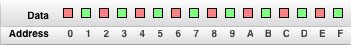

但是实际上cpu将内存当成多个块，每次从内存中读取一个块，这个块的大小可能是2、4、8、16等，

那么下面，我们来分析下非内存对齐和内存对齐的优缺点在哪？

内存对齐是操作系统为了提高访问内存的策略。操作系统在访问内存的时候，每次读取一定长度(这个长度是操作系统默认的对齐数，或者默认对齐数的整数倍)。如果没有对齐，为了访问一个变量可能产生二次访问。

**至此大家应该能够简单明白，为什么要简单内存对齐？**

- 提高存取数据的速度。比如有的平台每次都是从偶地址处读取数据，对于一个int型的变量，若从偶地址单元处存放，则只需一个读取周期即可读取该变量；但是若从奇地址单元处存放，则需要2个读取周期读取该变量。

- 某些平台只能在特定的地址处访问特定类型的数据，否则抛出硬件异常给操作系统。

2. 如何内存对齐

- 对于标准数据类型，它的地址只要是它的长度的整数倍。

- 对于非标准数据类型，比如结构体，要遵循一下对齐原则：

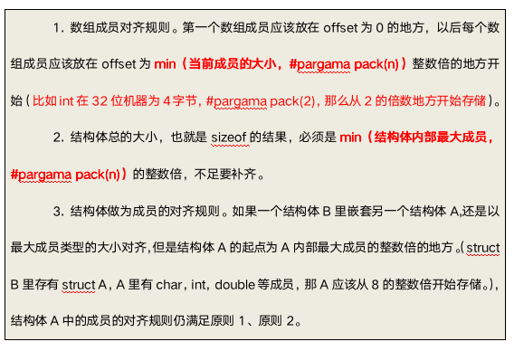


手动设置对齐模数:


### chighdata007d2
### 7.4.2 内存对齐案例


```c


#pragma pack(4)

typedef struct _STUDENT{
	int a;
	char b;
	double c;
	float d;
}Student;

typedef struct _STUDENT2{
	char a;
	Student b; 
	double c;
}Student2;

void test01(){

	//Student
	//a从偏移量0位置开始存储
	//b从4位置开始存储
	//c从8位置开始存储
	//d从12位置开存储
	//所以Student内部对齐之后的大小为20 ，整体对齐，整体为最大类型的整数倍 也就是8的整数倍 为24

	printf("sizeof Student:%d\n",sizeof(Student));

	//Student2 
	//a从偏移量为0位置开始 
	//b从偏移量为Student内部最大成员整数倍开始，也就是8开始
	//c从8的整数倍地方开始,也就是32开始
	//所以结构体Sutdnet2内部对齐之后的大小为：40 ， 由于结构体中最大成员为8，必须为8的整数倍 所以大小为40
	printf("sizeof Student2:%d\n", sizeof(Student2));
}


```


### chighdata008
# 8.文件操作

文件在今天的计算机系统中作用是很重要的。文件用来存放程序、文档、数据、表格、图片和其他很多种类的信息。作为一名程序员，您必须编程来创建、写入和读取文件。编写程序从文件读取信息或者将结果写入文件是一种经常性的需求。C提供了强大的和文件进行通信的方法。使用这种方法我们可以在程序中打开文件，然后使用专门的I/O函数读取文件或者写入文件。

### chighdata008a
## 8.1 文件相关概念

### chighdata008a1
### 8.1.1 文件的概念

一个文件通常就是磁盘上一段命名的存储区。但是对于操作系统来说，文件就会更复杂一些。例如，一个大文件可以存储在一些分散的区段中，或者还会包含一些操作系统可以确定其文件类型的附加数据，但是这些是操作系统，而不是我们程序员所要关心的事情。我们应该考虑如何在C程序中处理文件。

### chighdata008a2
### 8.1.2 流的概念

流是一个动态的概念，可以将一个字节形象地比喻成一滴水，字节在设备、文件和程序之间的传输就是流，类似于水在管道中的传输，可以看出，流是对输入输出源的一种抽象，也是对传输信息的一种抽象。

C语言中，I/O操作可以简单地看作是从程序移进或移出字节，这种搬运的过程便称为流(stream)。程序只需要关心是否正确地输出了字节数据，以及是否正确地输入了要读取字节数据，特定I/O设备的细节对程序员是隐藏的。


**1.文本流**

文本流，也就是我们常说的以文本模式读取文件。文本流的有些特性在不同的系统中可能不同。其中之一就是文本行的最大长度。标准规定至少允许254个字符。另一个可能不同的特性是文本行的结束方式。例如在Windows系统中，文本文件约定以一个回车符和一个换行符结尾。但是在Linux下只使用一个换行符结尾。

标准C把文本定义为零个或者多个字符，后面跟一个表示结束的换行符(\n).对于那些文本行的外在表现形式与这个定义不同的系统上，库函数负责外部形式和内部形式之间的翻译。例如，在Windows系统中，在输出时，文本的换行符被写成一对回车/换行符。在输入时，文本中的回车符被丢弃。这种不必考虑文本的外部形势而操纵文本的能力简化了可移植程序的创建。


**2.二进制流**

二进制流中的字节将完全根据程序编写它们的形式写入到文件中，而且完全根据它们从文件或设备读取的形式读入到程序中。它们并未做任何改变。这种类型的流适用于非文本数据，但是如果你不希望I/O函数修改文本文件的行末字符，也可以把它们用于文本文件。

c语言在处理这两种文件的时候并不区分，都看成是字符流，按字节进行处理。

**我们程序中，经常看到的文本方式打开文件和二进制方式打开文件仅仅体现在换行符的处理上。**

比如说，在widows下，文件的换行符是\r\n，而在Linux下换行符则是\n.

当对文件使用文本方式打开的时候，读写的windows文件中的换行符\r\n会被替换成\n读到内存中，当在windows下写入文件的时候，\n被替换成\r\n再写入文件。如果使用二进制方式打开文件，则不进行\r\n和\n之间的转换。 那么由于Linux下的换行符就是\n,所以文本文件方式和二进制方式无区别


### chighdata008b
## 8.2 文件的操作

### chighdata008b1
### 8.2.1 文件流总览

标准库函数是的我们在C程序中执行与文件相关的I/O任务非常方便。下面是关于文件I/O的一般概况。

1.  程序为同时处于活动状态的每个文件声明一个指针变量，其类型为FILE*。这个指针指向这个FILE结构，当它处于活动状态时由流使用。

2. 流通过fopen函数打开。为了打开一个流，我们必须指定需要访问的文件或设备以及他们的访问方式(读、写、或者读写)。Fopen和操作系统验证文件或者设备是否存在并初始化FILE。

3. 根据需要对文件进行读写操作。

4. 最后调用fclose函数关闭流。关闭一个流可以防止与它相关的文件被再次访问，保证任何存储于缓冲区中的数据被正确写入到文件中，并且释放FILE结构。


标准I/O更为简单，因为它们并不需要打开或者关闭。

I/O函数以三种基本的形式处理数据：**单个字符**、**文本行**和**二进制数据**。对于每种形式都有一组特定的函数对它们进行处理。

**输入/输出函数家族**


### chighdata008b2
### 8.2.2 文件指针

我们知道，文件是由操作系统管理的单元。当我们想操作一个文件的时候，让操作系统帮我们打开文件，操作系统把我们指定要打开文件的信息保存起来，并且返回给我们一个指针指向文件的信息。文件指针也可以理解为代指打开的文件。这个指针的类型为FILE类型。该类型定义在stdio.h头文件中。通过文件指针，我们就可以对文件进行各种操作。

对于每一个ANSI C程序，运行时系统必须提供至少三个流-标准输入(stdin)、标准输出(stdout)、标准错误(stderr)，它们都是一个指向FILE结构的指针。标准输入是缺省情况下的输入来源，标准输出时缺省情况下的输出设置。具体缺省值因编译器而异，通常标准输入为键盘设备、标准输出为终端或者屏幕。

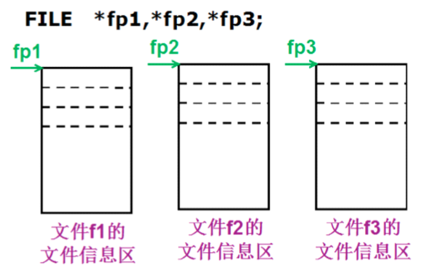

ANSI C并未规定FILE的成员，不同编译器可能有不同的定义。VS下FILE信息如下：

```c

struct _iobuf { 
        char  *_ptr;         //文件输入的下一个位置 
        int   _cnt;          //剩余多少字符未被读取
        char  *_base;        //指基础位置(应该是文件的其始位置) 
        int   _flag;         //文件标志 
        int   _file;         //文件的有效性验证 
        int   _charbuf;      //检查缓冲区状况,如果无缓冲区则不读取 
        int   _bufsiz;       //文件的大小 
        char  *_tmpfname;    //临时文件名 
}; 
typedef struct _iobuf FILE;


```


### chighdata008b3
### 8.2.3 文件缓冲区


**文件缓冲区**

ANSI C标准采用“缓冲文件系统”处理数据文件 所谓缓冲文件系统是指系统自动地在内存区为程序中每一个正在使用的文件开辟一个文件缓冲区从内存向磁盘输出数据必须先送到内存中的缓冲区，装满缓冲区后才一起送到磁盘去 如果从磁盘向计算机读入数据，则一次从磁盘文件将一批数据输入到内存缓冲区(充满缓冲 区)，然后再从缓冲区逐个地将数据送到程序数据区(给程序变量) 。


**那么文件缓冲区有什么作用呢？**

>如我们从磁盘里取信息，我们先把读出的数据放在缓冲区，计算机再直接从缓冲区中取数据，等缓冲区的数据取完后再去磁盘中读取，这样就可以减少磁盘的读写次数，再加上计算机对缓冲区的操作大大快于对磁盘的操作，故应用缓冲区可大大提高计算机的运行速度。

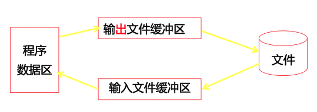


### chighdata008b4
### 8.2.4 文件打开关闭

**1.文件打开(fopen)**

文件的打开操作表示将给用户指定的文件在内存分配一个FILE结构区，并将该结构的指针返回给用户程序，以后用户程序就可用此FILE指针来实现对指定文件的存取操作了。当使用打开函数时，必须给出文件名、文件操作方式(读、写或读写)。

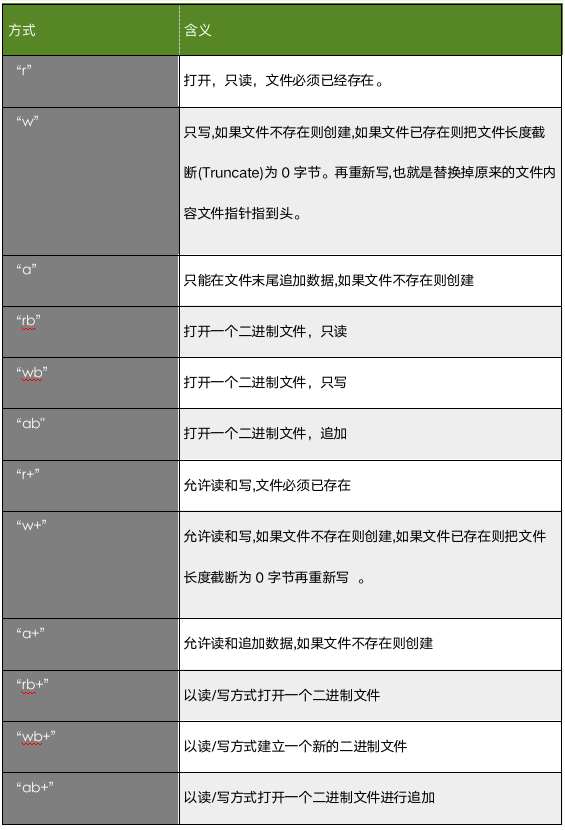

**示例代码：**

```c

void test(){
	
	FILE *fp = NULL;

	// "\\"这样的路径形式，只能在windows使用
	// "/"这样的路径形式，windows和linux平台下都可用，建议使用这种
	// 路径可以是相对路径，也可是绝对路径
	fp = fopen("../test", "w");
	//fp = fopen("..\\test", "w");

	if (fp == NULL) //返回空，说明打开失败
	{
		//perror()是标准出错打印函数，能打印调用库函数出错原因
		perror("open");
		return -1;
	}
}

```


应该检查fopen的返回值!如何函数失败，它会返回一个NULL值。如果程序不检查错误，这个NULL指针就会传给后续的I/O函数。它们将对这个指针执行间接访问，并将失败.


**2.文件关闭(fclose)**

文件操作完成后，如果程序没有结束，必须要用fclose()函数进行关闭，这是因为对打开的文件进行写入时，若文件缓冲区的空间未被写入的内容填满，这些内容不会写到打开的文件中。只有对打开的文件进行关闭操作时，停留在文件缓冲区的内容才能写到该文件中去，从而使文件完整。再者一旦关闭了文件，该文件对应的FILE结构将被释放，从而使关闭的文件得到保护，因为这时对该文件的存取操作将不会进行。文件的关闭也意味着释放了该文件的缓冲区。

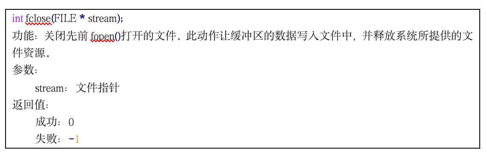

它表示该函数将关闭FILE指针对应的文件，并返回一个整数值。若成功地关闭了文件，则返回一个0值，否则返回一个非0值.


### chighdata008b5
### 8.2.5 文件读写函数回顾

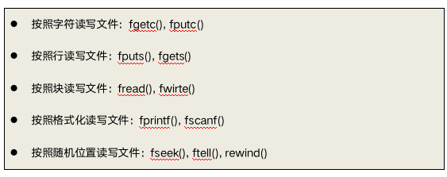

**1.字符读写函数回顾**

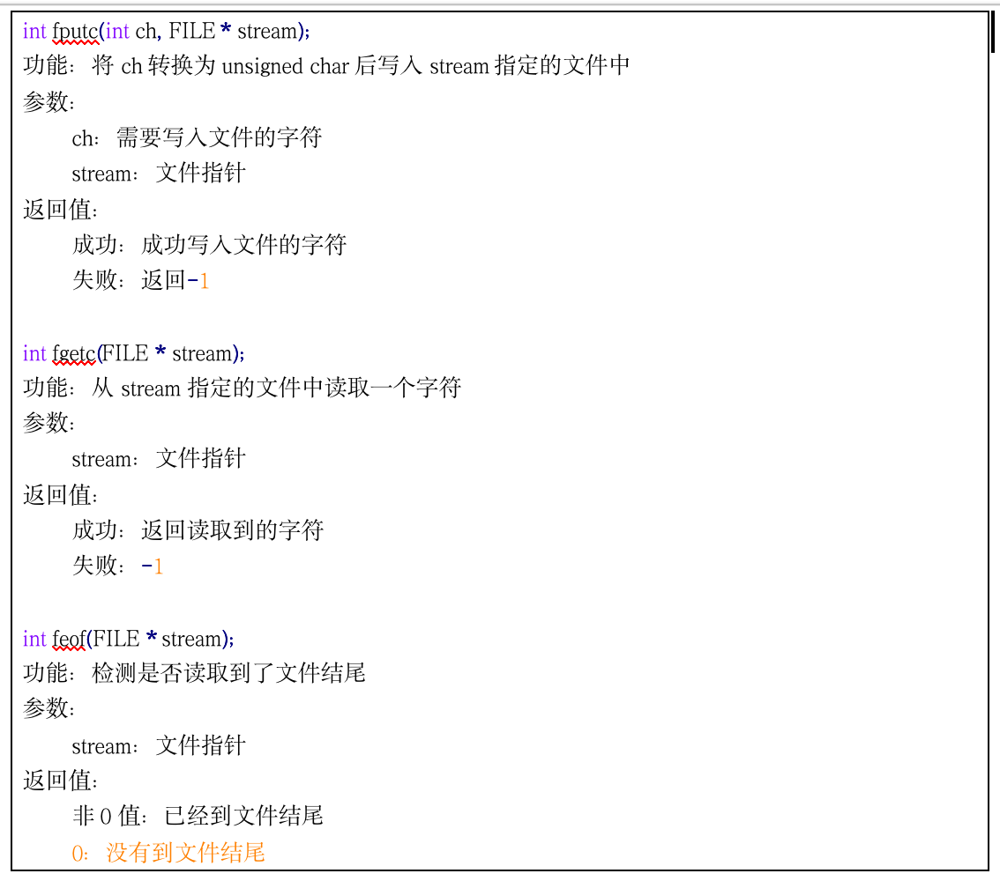

```c

void test(){

	//写文件
	FILE* fp_write= NULL;
	//写方式打开文件
	fp_write = fopen("./mydata.txt", "w+");
	if (fp_write == NULL){
		return;
	}

	char buf[] = "this is a test for pfutc!";
	for (int i = 0; i < strlen(buf);i++){
		fputc(buf[i], fp_write);
	}
	
	fclose(fp_write);

	//读文件
	FILE* fp_read = NULL;
	fp_read = fopen("./mydata.txt", "r");
	if (fp_read == NULL){
		return;
	}

#if 0
	//判断文件结尾 注意：多输出一个空格
	while (!feof(fp_read)){
		printf("%c",fgetc(fp_read));
	}
#else
	char ch;
	while ((ch = fgetc(fp_read)) != EOF){
		printf("%c", ch);
	}
#endif
}

```


将把流指针fp指向的文件中的一个字符读出，并赋给ch，当执行fgetc()函数时，若当时文件指针指到文件尾，即遇到文件结束标志EOF(其对应值为-1)，该函数返回一个 -1 给ch，在程序中常用检查该函数返回值是否为 -1 来判断是否已读到文件尾，从而决定是否继续。


2. 行读写函数回顾

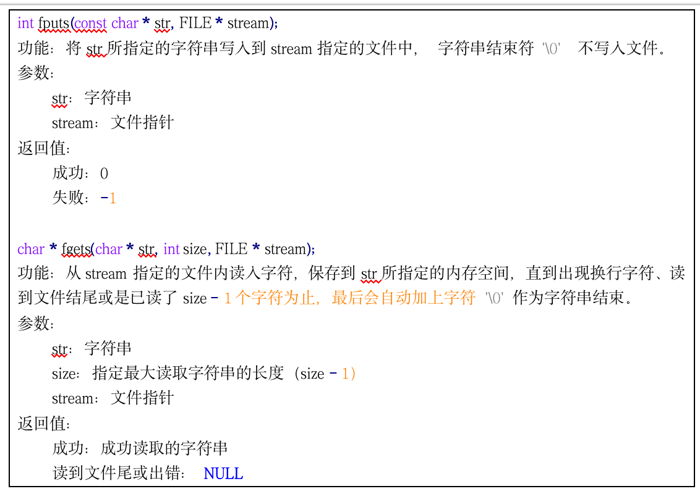

```c

void test(){

	//写文件
	FILE* fp_write= NULL;
	//写方式打开文件
	fp_write = fopen("./mydata.txt", "w+");
	if (fp_write == NULL){
		perror("fopen:");
		return;
	}

	char* buf[] = {
		"01 this is a test for pfutc!\n",
		"02 this is a test for pfutc!\n",
		"03 this is a test for pfutc!\n",
		"04 this is a test for pfutc!\n",
	};
	for (int i = 0; i < 4; i ++){
		fputs(buf[i], fp_write);
	}
	
	fclose(fp_write);

	//读文件
	FILE* fp_read = NULL;
	fp_read = fopen("./mydata.txt", "r");
	if (fp_read == NULL){
		perror("fopen:");
		return;
	}

	//判断文件结尾
	while (!feof(fp_read)){
		char temp[1024] = { 0 };
		fgets(temp, 1024, fp_read);
		printf("%s",temp);
	}

	fclose(fp_read);
}

```


3. 块读写函数回顾

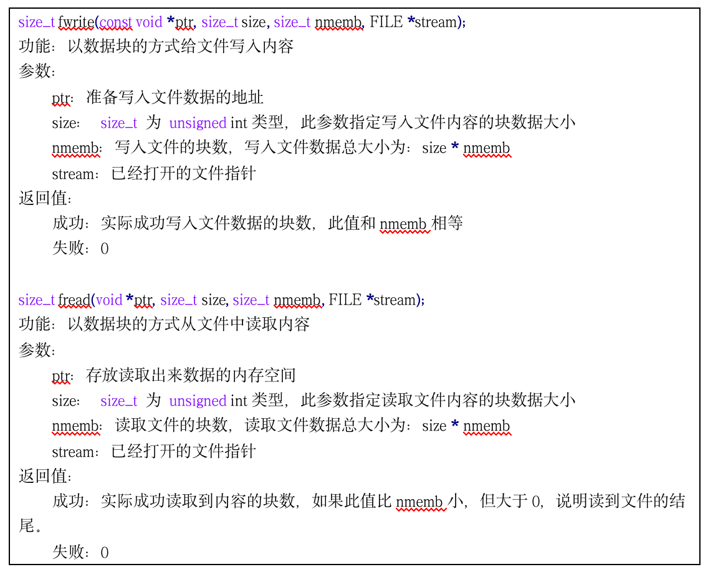

```c


typedef struct _TEACHER{
	char name[64];
	int age;
}Teacher;

void test(){

	//写文件
	FILE* fp_write= NULL;
	//写方式打开文件
	fp_write = fopen("./mydata.txt", "wb");
	if (fp_write == NULL){
		perror("fopen:");
		return;
	}

	Teacher teachers[4] = {
		{ "Obama", 33 },
		{ "John", 28 },
		{ "Edward", 45},
		{ "Smith", 35}
	};
	
	for (int i = 0; i < 4; i ++){
		fwrite(&teachers[i],sizeof(Teacher),1, fp_write);
	}
	//关闭文件
	fclose(fp_write);

	//读文件
	FILE* fp_read = NULL;
	fp_read = fopen("./mydata.txt", "rb");
	if (fp_read == NULL){
		perror("fopen:");
		return;
	}

	Teacher temps[4];
	fread(&temps, sizeof(Teacher), 4, fp_read);
	for (int i = 0; i < 4;i++){
		printf("Name:%s Age:%d\n",temps[i].name,temps[i].age);
	}

	fclose(fp_read);
}


```

4. 格式化读写函数回顾

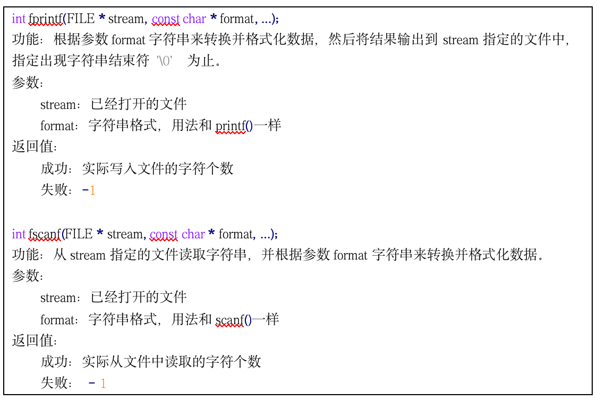

**注意**：**fscanf遇到空格和换行时结束。**

```c

void test(){

	//写文件
	FILE* fp_write= NULL;
	//写方式打开文件
	fp_write = fopen("./mydata.txt", "w");
	if (fp_write == NULL){
		perror("fopen:");
		return;
	}

	fprintf(fp_write,"hello world:%d!",10);

	//关闭文件
	fclose(fp_write);

	//读文件
	FILE* fp_read = NULL;
	fp_read = fopen("./mydata.txt", "rb");
	if (fp_read == NULL){
		perror("fopen:");
		return;
	}
	
	char temps[1024] = { 0 };
	while (!feof(fp_read)){
		fscanf(fp_read, "%s", temps);
		printf("%s", temps);
	}

	fclose(fp_read);
}

```


5. 随机读写函数回顾

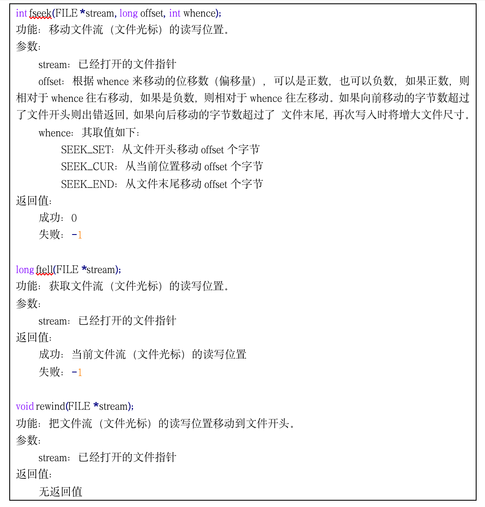

```c

typedef struct _TEACHER{
	char name[64];
	int age;
}Teacher;

void test(){
	//写文件
	FILE* fp_write = NULL;
	//写方式打开文件
	fp_write = fopen("./mydata.txt", "wb");
	if (fp_write == NULL){
		perror("fopen:");
		return;
	}

	Teacher teachers[4] = {
		{ "Obama", 33 },
		{ "John", 28 },
		{ "Edward", 45 },
		{ "Smith", 35 }
	};

	for (int i = 0; i < 4; i++){
		fwrite(&teachers[i], sizeof(Teacher), 1, fp_write);
	}
	//关闭文件
	fclose(fp_write);

	//读文件
	FILE* fp_read = NULL;
	fp_read = fopen("./mydata.txt", "rb");
	if (fp_read == NULL){
		perror("fopen:");
		return;
	}

	Teacher temp;
	//读取第三个数组
	fseek(fp_read , sizeof(Teacher) * 2 , SEEK_SET);
	fread(&temp, sizeof(Teacher), 1, fp_read);
	printf("Name:%s Age:%d\n",temp.name,temp.age);

	memset(&temp,0,sizeof(Teacher));

	fseek(fp_read, -(int)sizeof(Teacher), SEEK_END);
	fread(&temp, sizeof(Teacher), 1, fp_read);
	printf("Name:%s Age:%d\n", temp.name, temp.age);

	rewind(fp_read);
	fread(&temp, sizeof(Teacher), 1, fp_read);
	printf("Name:%s Age:%d\n", temp.name, temp.age);

	fclose(fp_read);
}


```


### chighdata008c
## 8.3 文件读写案例

读写配置文件

配置文件格式如下：

正式的数据以 ‘:’冒号进行分割，冒号前为key起到索引作用，冒号后为value是实值。#开头的为注释，而不是正式数据

```c

#英雄的Id

heroId:1

#英雄的姓名

heroName:德玛西亚

#英雄的攻击力

heroAtk:1000

#英雄的防御力

heroDef:500

#英雄的简介

heroInfo:前排坦克

```

```c

struct ConfigInfo
{
	char key[64];
	char value[64];
};

//获取文件有效行数
int getFileLine(const char  * filePath)
{
	FILE * file = fopen(filePath, "r");
	char buf[1024] = {0};
	int lines = 0;
	while (fgets(buf,1024,file) != NULL)
	{
		if (isValidLine(buf))
		{
			lines++;
		}
		memset(buf, 0, 1024);
	}
	 
	fclose(file);
	
	return lines;

}
//解析文件
void parseFile(const char  * filePath, int lines, struct ConfigInfo** configInfo)
{

	struct ConfigInfo * pConfig =  malloc(sizeof(struct ConfigInfo) * lines);

	if (pConfig == NULL)
	{
		return;
	}


	FILE * file = fopen(filePath, "r");
	char buf[1024] = { 0 };
	
	int index = 0;
	while (fgets(buf, 1024, file) != NULL)
	{
		if (isValidLine(buf))
		{
			//解析数据到struct ConfigInfo中
			memset(pConfig[index].key, 0, 64);
			memset(pConfig[index].value, 0, 64);
			char * pos = strchr(buf, ':');
			strncpy(pConfig[index].key, buf, pos - buf);
			strncpy(pConfig[index].value, pos + 1, strlen(pos + 1) - 1); // 从第二个单词开始截取字符串，并且不截取换行符
			//printf("key = %s\n", pConfig[index].key);
			//printf("value = %s\n", pConfig[index].value);
			index++;
		}
		memset(buf, 0, 1024);
	}


	*configInfo = pConfig;

}

//获取指定的配置信息
char * getInfoByKey(char * key, struct ConfigInfo*configInfo ,int lines)
{
	for (int i = 0; i < lines;i++)
	{
		if (strcmp(key, configInfo[i].key) == 0)
		{
			return configInfo[i].value;
		}
	}
	return NULL;
}

//释放配置文件信息
void freeConfigInfo(struct ConfigInfo*configInfo)
{
	free(configInfo);
	configInfo = NULL;
}

//判断当前行是否为有效行
int isValidLine(char * buf)
{
	if (buf[0] == '0' || buf[0] == '\0' || strchr(buf,':') == NULL)
	{
		return 0;// 如果行无限 返回假
	}
	return 1;
}

int main(){

	char * filePath = "./config.txt";
	int lines = getFileLine(filePath);
	printf("文件有效行数为：%d\n", lines);

	struct ConfigInfo * config = NULL;
	parseFile(filePath, lines, &config);

	printf("heroId = %s\n", getInfoByKey("heroId", config, lines));
	printf("heroName: = %s\n", getInfoByKey("heroName", config, lines));
	printf("heroAtk = %s\n", getInfoByKey("heroAtk", config, lines));
	printf("heroDef: = %s\n", getInfoByKey("heroDef", config, lines));
	printf("heroInfo: = %s\n", getInfoByKey("heroInfo", config, lines));


	freeConfigInfo(config);
	config = NULL;

	system("pause");
	return EXIT_SUCCESS;
}

```


### chighdata009
# 9. 链表


### chighdata009a
## 9.1 链表基本概念


### chighdata009a1
### 9.1.1 什么是链表
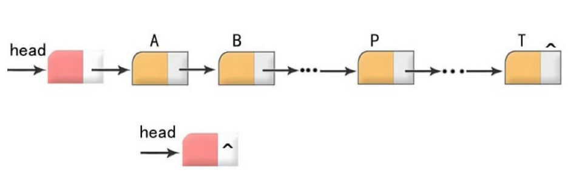

- 链表是一种常用的数据结构，它通过指针将一些列数据结点，连接成一个数据链。相对于数组，链表具有更好的动态性（非顺序存储）。

- 数据域用来存储数据，指针域用于建立与下一个结点的联系。

- 建立链表时无需预先知道数据总量的，可以随机的分配空间，可以高效的在链表中的任意位置实时插入或删除数据。

- 链表的开销，主要是访问顺序性和组织链的空间损失。

**数组和链表的区别：**
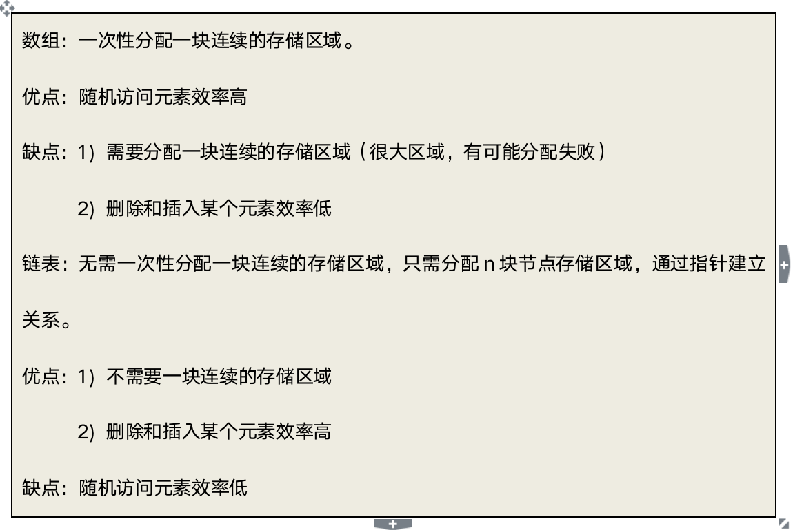


### chighdata009a2
### 9.1.2 有关结构体的自身引用
问题1：请问结构体可以嵌套本类型的结构体变量吗？

问题2：请问结构体可以嵌套本类型的结构体指针变量吗？


```c

typedef struct _STUDENT{
	char name[64];
	int age;
}Student;

typedef struct _TEACHER{
	char name[64];
	Student stu; //结构体可以嵌套其他类型的结构体
	//Teacher stu;
	//struct _TEACHER teacher; //此时Teacher类型的成员还没有确定，编译器无法分配内存
	struct _TEACHER* teacher; //不论什么类型的指针，都只占4个字节，编译器可确定内存分配
}Teacher;

```

- 结构体可以嵌套另外一个结构体的任何类型变量;

- 结构体嵌套本结构体普通变量（不可以）。本结构体的类型大小无法确定，类型本质：固定大小内存块别名;

- 结构体嵌套本结构体指针变量（可以）, 指针变量的空间能确定，32位， 4字节， 64位， 8字节;
### chighdata009a3
### 9.1.3 链表节点

大家思考一下，我们说链表是由一系列的节点组成，那么如何表示一个包含了数据域和指针域的节点呢？

链表的节点类型实际上是结构体变量，此结构体包含数据域和指针域：

- 数据域用来存储数据；

- 指针域用于建立与下一个结点的联系，`当此节点为尾节点时，指针域的值为NULL`；

```c

typedef struct Node 
{
	//数据域
	int id;
	char name[50];

	//指针域
	struct Node *next;       
}Node;

```
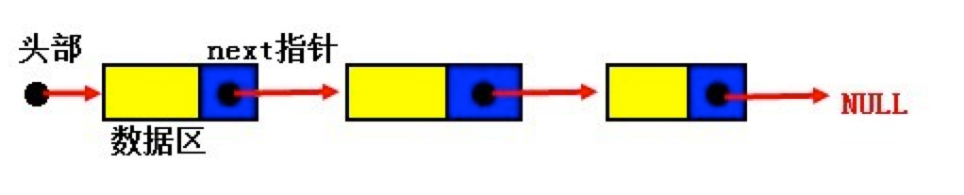

### chighdata009a4
### 9.1.4 链表的分类

链表分为：静态链表和动态链表

静态链表和动态链表是线性表链式存储结构的两种不同的表示方式：

- 所有结点都是在程序中定义的，不是临时开辟的，也不能用完后释放，这种链表称为“静态链表”。

- 所谓动态链表，是指在程序执行过程中从无到有地建立起一个链表，即一个一个地开辟结点和输入各结点数据，并建立起前后相链的关系。

### chighdata009a4a
#### **9.1.4.1 静态链表**


```c

typedef struct Stu
{
	int id;	//数据域
	char name[100];

	struct Stu *next; //指针域
}Stu;

void test()
{
	//初始化三个结构体变量
	Stu s1 = { 1, "yuri", NULL };
	Stu s2 = { 2, "lily", NULL };
	Stu s3 = { 3, "lilei", NULL };

	s1.next = &s2; //s1的next指针指向s2
	s2.next = &s3;
	s3.next = NULL; //尾结点

	Stu *p = &s1;
	while (p != NULL)
	{
		printf("id = %d, name = %s\n", p->id, p->name);

		//结点往后移动一位
		p = p->next; 
	}
}

```

### chighdata009a4b
#### 9.1.4.2 动态链表

```c

typedef struct Stu{
	int id;	//数据域
	char name[100];

	struct Stu *next; //指针域
}Stu;

void test(){
	//动态分配3个节点
	Stu *s1 = (Stu *)malloc(sizeof(Stu));
	s1->id = 1;
	strcpy(s1->name, "yuri");

	Stu *s2 = (Stu *)malloc(sizeof(Stu));
	s2->id = 2;
	strcpy(s2->name, "lily");

	Stu *s3 = (Stu *)malloc(sizeof(Stu));
	s3->id = 3;
	strcpy(s3->name, "lilei");

	//建立节点的关系
	s1->next = s2; //s1的next指针指向s2
	s2->next = s3;
	s3->next = NULL; //尾结点

	//遍历节点
	Stu *p = s1;
	while (p != NULL)
	{
		printf("id = %d, name = %s\n", p->id, p->name);

		//结点往后移动一位
		p = p->next; 
	}

	//释放节点空间
	p = s1;
	Stu *tmp = NULL;
	while (p != NULL)
	{
		tmp = p;
		p = p->next;

		free(tmp);
		tmp = NULL;
	}
}

```


### chighdata009a4c
#### **9.1.4.3** **带头和不带头链表**

- 带头链表：固定一个节点作为头结点(数据域不保存有效数据)，起一个标志位的作用，以后不管链表节点如果改变，此头结点固定不变。

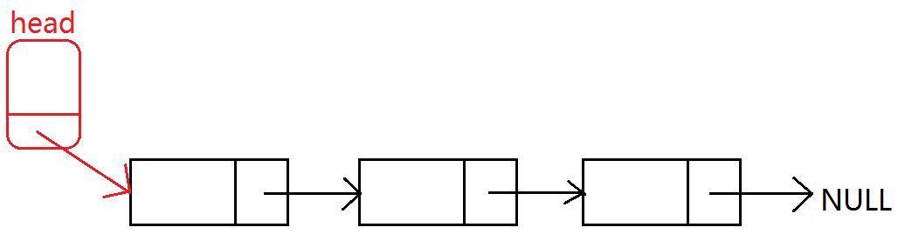

- 不带头链表：头结点不固定，根据实际需要变换头结点(如在原来头结点前插入新节点，然后，新节点重新作为链表的头结点)。

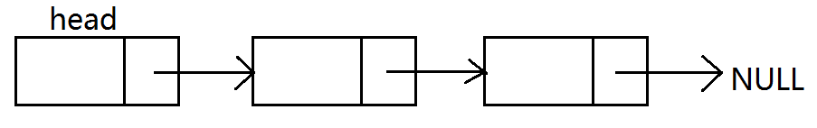

### chighdata009a4d
#### **9.1.4.4 单向链表、双向链表、循环链表**

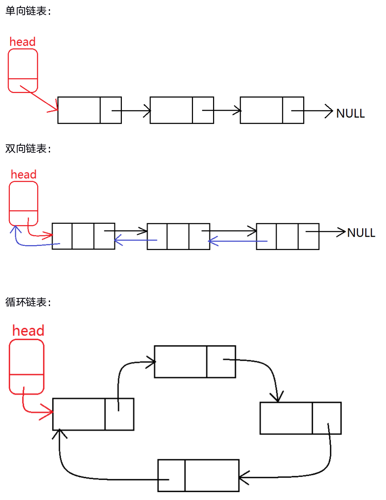

### chighdata009b
## 9.2 链表基本操作

### chighdata009b1
### 9.2.1 创建链表

使用结构体定义节点类型：

```c

typedef struct _LINKNODE
{
	int id; //数据域
	struct _LINKNODE* next; //指针域
}link_node;

```

编写函数：`link_node* init_linklist()`

建立带有头结点的单向链表，循环创建结点，结点数据域中的数值从键盘输入，以 -1 作为输入结束标志，链表的头结点地址由函数值返回.

```c

typedef struct _LINKNODE{
	int data;
	struct _LINKNODE* next;
}link_node;

link_node* init_linklist(){
	
	//创建头结点指针
	link_node* head = NULL;
	//给头结点分配内存
	head = (link_node*)malloc(sizeof(link_node));
	if (head == NULL){
		return NULL;
	}
	head->data = -1;
	head->next = NULL;

	//保存当前节点
	link_node* p_current = head;
	int data = -1;
	//循环向链表中插入节点
	while (1){
	
		printf("please input data:\n");
		scanf("%d",&data);

		//如果输入-1，则退出循环
		if (data == -1){
			break;
		}

		//给新节点分配内存
		link_node* newnode = (link_node*)malloc(sizeof(link_node));
		if (newnode == NULL){
			break;
		}

		//给节点赋值
		newnode->data = data;
		newnode->next = NULL;

		//新节点入链表，也就是将节点插入到最后一个节点的下一个位置
		p_current->next = newnode;
		//更新辅助指针p_current
		p_current = newnode;
	}

	return head;
}

```


### chighdata009b2
### 9.2.2 遍历链表

编写函数：`void foreach_linklist(link_node* head)`

顺序输出单向链表各项结点数据域中的内容：

```c


//遍历链表
void foreach_linklist(link_node* head){
	if (head == NULL){
		return;
	}

	//赋值指针变量
	link_node* p_current = head->next;
	while (p_current != NULL){
		printf("%d ",p_current->data);
		p_current = p_current->next;
	}
	printf("\n");
}


```


### chighdata009b3
### 9.2.3 插入节点

编写函数: `void insert_linklist(link_node* head,int val,int data).`

在指定值后面插入数据data,如果值val不存在，则在尾部插入。

```c

//在值val前插入节点
void insert_linklist(link_node* head, int val, int data){
	
	if (head == NULL){
		return;
	}

	//两个辅助指针
	link_node* p_prev = head;
	link_node* p_current = p_prev->next;
	while (p_current != NULL){
		if (p_current->data == val){
			break;
		}
		p_prev = p_current;
		p_current = p_prev->next;
	}

	//如果p_current为NULL，说明不存在值为val的节点
	if (p_current == NULL){
		printf("不存在值为%d的节点!\n",val);
		return;
	}

	//创建新的节点
	link_node* newnode = (link_node*)malloc(sizeof(link_node));
	newnode->data = data;
	newnode->next = NULL;

	//新节点入链表
	newnode->next = p_current;
	p_prev->next = newnode;
}

```


### chighdata009b4
### 9.2.4 删除节点

编写函数: `void remove_linklist(link_node* head,int val)`

删除第一个值为val的结点.


```c


//删除值为val的节点
void remove_linklist(link_node* head,int val){
	if (head == NULL){
		return;
	}

	//辅助指针
	link_node* p_prev = head;
	link_node* p_current = p_prev->next;

	//查找值为val的节点
	while (p_current != NULL){
		if (p_current->data == val){
			break;
		}
		p_prev = p_current;
		p_current = p_prev->next;
	}
	//如果p_current为NULL，表示没有找到
	if (p_current == NULL){
		return;
	}
	
	//删除当前节点： 重新建立待删除节点(p_current)的前驱后继节点关系
	p_prev->next = p_current->next;
	//释放待删除节点的内存
	free(p_current);
}

```


### chighdata009b5
### 9.2.5 销毁链表

编写函数: `void destroy_linklist(link_node* head)`

销毁链表，释放所有节点的空间.

```c

//销毁链表
void destroy_linklist(link_node* head){
	if (head == NULL){
		return;
	}
	//赋值指针
	link_node* p_current = head;
	while (p_current != NULL){
		//缓存当前节点下一个节点
		link_node* p_next = p_current->next;
		free(p_current);
		p_current = p_next;
	}
}

```


### chighdata010
# 10.  函数指针和回调函数

### chighdata010a
## 10.1 函数指针


### chighdata010a1
## 10.1.1 函数类型

通过什么来区分两个不同的函数？

一个函数在编译时被分配一个入口地址，这个地址就称为函数的指针，函数名代表函数的入口地址。

函数三要素： 名称、参数、返回值。C语言中的函数有自己特定的类型。

c语言中通过typedef为函数类型重命名：

```c

typedef int f(int, int);		// f 为函数类型
typedef void p(int);		// p 为函数类型

```

这一点和数组一样，因此我们可以用一个指针变量来存放这个入口地址，然后通过该指针变量调用函数。

**注意：**通过函数类型定义的变量是不能够直接执行，因为没有函数体。只能通过类型定义一个函数指针指向某一个具体函数，才能调用。


```c

typedef int(p)(int, int);

void my_func(int a,int b){
	printf("%d %d\n",a,b);
}

void test(){

	p p1;
	//p1(10,20); //错误，不能直接调用，只描述了函数类型，但是并没有定义函数体，没有函数体无法调用
	p* p2 = my_func;
	p2(10,20); //正确，指向有函数体的函数入口地址
}

```


### chighdata010a2
## 10.1.2 函数指针(指向函数的指针)

- 函数指针定义方式(先定义函数类型，根据类型定义指针变量);

-  先定义函数指针类型，根据类型定义指针变量;

-  直接定义函数指针变量;

```c

int my_func(int a,int b){
	printf("ret:%d\n", a + b);
	return 0;
}

//1. 先定义函数类型，通过类型定义指针
void test01(){
	typedef int(FUNC_TYPE)(int, int);
	FUNC_TYPE* f = my_func;
	//如何调用？
	(*f)(10, 20);
	f(10, 20);
}

//2. 定义函数指针类型
void test02(){
	typedef int(*FUNC_POINTER)(int, int);
	FUNC_POINTER f = my_func;
	//如何调用？
	(*f)(10, 20);
	f(10, 20);
}

//3. 直接定义函数指针变量
void test03(){
	
	int(*f)(int, int) = my_func;
	//如何调用？
	(*f)(10, 20);
	f(10, 20);
}


```


### chighdata010a3
## 10.1.3 函数指针数组

函数指针数组，每个元素都是函数指针。

```c

void func01(int a){
	printf("func01:%d\n",a);
}
void func02(int a){
	printf("func02:%d\n", a);
}
void func03(int a){
	printf("func03:%d\n", a);
}

void test(){

#if 0
	//定义函数指针
	void(*func_array[])(int) = { func01, func02, func03 };
#else
	void(*func_array[3])(int);
	func_array[0] = func01;
	func_array[1] = func02;
	func_array[2] = func03;
#endif

	for (int i = 0; i < 3; i ++){
		func_array[i](10 + i);
		(*func_array[i])(10 + i);
	}
}

```


### chighdata010a4
## 10.1.4 函数指针做函数参数(回调函数)

函数参数除了是普通变量，还可以是函数指针变量。

```c

//形参为普通变量
void fun( int x ){}
//形参为函数指针变量
void fun( int(*p)(int a) ){}

```

函数指针变量常见的用途之一是把指针作为参数传递到其他函数，指向函数的指针也可以作为参数，以实现函数地址的传递。

```c

int plus(int a, int b)
{
	return a + b;
}
int sub(int a, int b)
{
	return a - b;
}
int mul(int a, int b)
{
	return a * b;
}
int division(int a, int b)
{
	return a / b;
}

//函数指针 做函数的参数 --- 回调函数
void Calculator(int(*myCalculate)(int, int), int a, int b)
{
	int ret = myCalculate(a, b); //dowork中不确定用户选择的内容，由后期来指定运算规则
	printf("ret = %d\n", ret);
}

void test01()
{
	printf("请输入操作符\n");
	printf("1、+ \n");
	printf("2、- \n");
	printf("3、* \n");
	printf("4、/ \n");

	int select = -1;
	scanf("%d", &select);

	int num1 = 0;
	printf("请输入第一个操作数：\n");
	scanf("%d", &num1);

	int num2 = 0;
	printf("请输入第二个操作数：\n");
	scanf("%d", &num2);

	switch (select)
	{
	case  1:
		Calculator(plus, num1, num2);
		break;
	case  2:
		Calculator(sub, num1, num2);
		break;
	case 3:
		Calculator(mul, num1, num2);
		break;
	case 4:
		Calculator(division, num1, num2);
		break;
	default:
		break;
	}

}

```

**注意：**函数指针和指针函数的区别：

- 函数指针是指向函数的指针；

- 指针函数是返回类型为指针的函数

### chighdata011
# 11.  预处理

### chighdata011a
## 11.1 预处理的基本概念

C语言对源程序处理的四个步骤：预处理、编译、汇编、链接。

预处理是在程序源代码被编译之前，由预处理器（Preprocessor）对程序源代码进行的处理。这个过程并不对程序的源代码语法进行解析，但它会把源代码分割或处理成为特定的符号为下一步的编译做准备工作。

### chighdata011b
## 11.2 文件包含指令(#include)

### chighdata011b1
### **11.2.1 文件包含处理**

“文件包含处理”是指一个源文件可以将另外一个文件的全部内容包含进来。Ｃ语言提供了#include命令用来实现“文件包含”的操作。

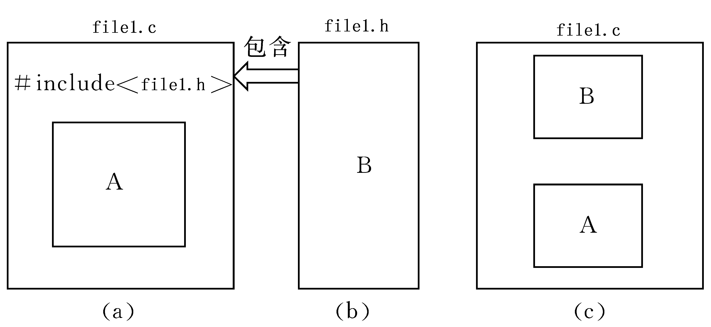

### chighdata011b2
### **11.2.2 #incude<>和#include****""****区别**

- "" 表示系统先在file1.c所在的当前目录找file1.h，如果找不到，再按系统指定的目录检索。

- < > 表示系统直接按系统指定的目录检索。

注意：

1\. #include <>常用于包含库函数的头文件；

2\. #include ""常用于包含自定义的头文件；

3\. 理论上#include可以包含任意格式的文件(.c .h等) ，但一般用于头文件的包含；

### chighdata011c
## 11.3 宏定义

### chighdata011c1
### 11.3.1 无参数的宏定义(宏常量)

如果在程序中大量使用到了100这个值，那么为了方便管理，我们可以将其定义为：

`const int num = 100;` 但是如果我们使用num定义一个数组，在不支持c99标准的编译器上是不支持的，因为num不是一个编译器常量，如果想得到了一个编译器常量，那么可以使用：

`#define num 100`

在编译预处理时，将程序中在该语句以后出现的所有的num都用100代替。这种方法使用户能以一个简单的名字代替一个长的字符串，在预编译时将宏名替换成字符串的过程称为“**宏展开**”。宏定义，只在宏定义的文件中起作用。

```c

#define PI 3.1415
void test(){
	double r = 10.0;
	double s = PI * r * r;
	printf("s = %lf\n", s);
}

```

说明：

1) 宏名一般用大写，以便于与变量区别；

2) 宏定义可以是常数、表达式等；

3) 宏定义不作语法检查，只有在编译被宏展开后的源程序才会报错；

4) 宏定义不是C语言，不在行末加分号；

5) 宏名有效范围为从定义到本源文件结束；

6) 可以用#undef命令终止宏定义的作用域；

7) 在宏定义中，可以引用已定义的宏名；

### chighdata011c2
### 11.3.2 带参数的宏定义(宏函数)

在项目中，经常把一些短小而又频繁使用的函数写成宏函数，这是由于宏函数没有普通函数参数压栈、跳转、返回等的开销，可以调高程序的效率。

宏通过使用参数，可以创建外形和作用都与函数类似地类函数宏(function-like macro). 宏的参数也用圆括号括起来。

```c

#define SUM(x,y) (( x )+( y ))
void test(){
	
	//仅仅只是做文本替换 下例替换为 int ret = ((10)+(20));
	//不进行计算
	int ret = SUM(10, 20);
	printf("ret:%d\n",ret);
}

```


**注意:**

1) 宏的名字中不能有空格，但是在替换的字符串中可以有空格。ANSI C允许在参数列表中使用空格；

2) 用括号括住每一个参数，并括住宏的整体定义。

3) 用大写字母表示宏的函数名。

4) 如果打算宏代替函数来加快程序运行速度。假如在程序中只使用一次宏对程序的运行时间没有太大提高。


### chighdata011d
## 11.4 条件编译

### chighdata011d
### 11.4.1 基本概念

一般情况下，源程序中所有的行都参加编译。但有时希望对部分源程序行只在满足一定条件时才编译，即对这部分源程序行指定编译条件。
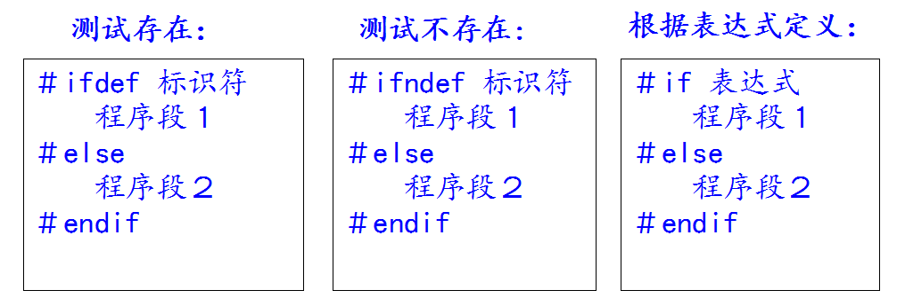


### chighdata011d
### 11.4.2 条件编译

- 防止头文件被重复包含引用；

```c

#ifndef _SOMEFILE_H
#define _SOMEFILE_H

//需要声明的变量、函数
//宏定义
//结构体

#endif

```


### chighdata011e
## 11.5  一些特殊的预定宏

C编译器，提供了几个特殊形式的预定义宏，在实际编程中可以直接使用，很方便。


```c

//	__FILE__			宏所在文件的源文件名 
//	__LINE__			宏所在行的行号
//	__DATE__			代码编译的日期
//	__TIME__			代码编译的时间

void test()
{
	printf("%s\n", __FILE__);
	printf("%d\n", __LINE__);
	printf("%s\n", __DATE__);
	printf("%s\n", __TIME__);
}

```


### chighdata012
# 12. 动态库的封装和使用

### chighdata012a
## 12.1 库的基本概念

库是已经写好的、成熟的、可复用的代码。每个程序都需要依赖很多底层库，不可能每个人的代码从零开始编写代码，因此库的存在具有非常重要的意义。

在我们的开发的应用中经常有一些公共代码是需要反复使用的，就把这些代码编译为库文件。

库可以简单看成一组目标文件的集合，将这些目标文件经过压缩打包之后形成的一个文件。像在Windows这样的平台上，最常用的c语言库是由集成按开发环境所附带的运行库，这些库一般由编译厂商提供。

### chighdata012b
## 12.2 windows下静态库创建和使用


### chighdata012b1
### **12.2.1 静态库的创建**

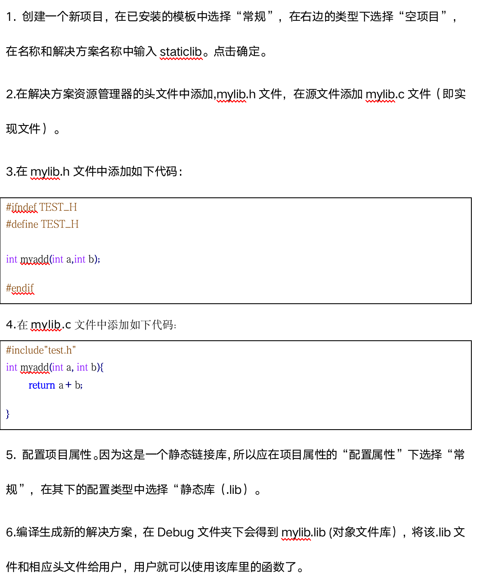

### chighdata012b2
### **12.2.2 静态库的使用**

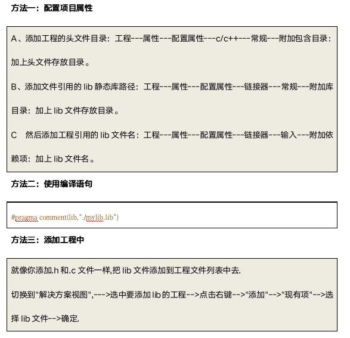

### chighdata012b3
### **12.2.3 静态库优缺点**

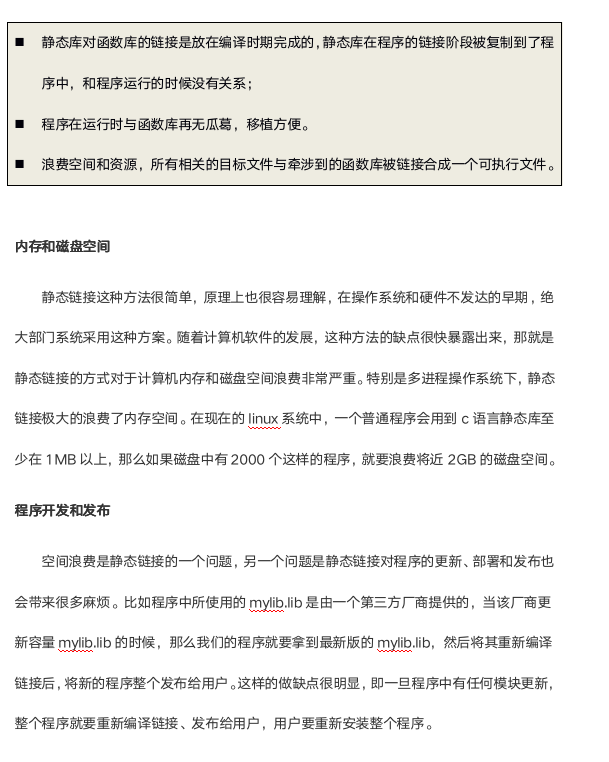


### chighdata012c
## 12.3 windows下动态库创建和使用


要解决空间浪费和更新困难这两个问题，最简单的办法就是把程序的模块相互分割开来，形成独立的文件，而不是将他们静态的链接在一起。简单地讲，就是不对哪些组成程序的目标程序进行链接，等程序运行的时候才进行链接。也就是说，把整个链接过程推迟到了运行时再进行，这就是动态链接的基本思想。


### **12.3.1 动态库的创建**

1\. 创建一个新项目，在已安装的模板中选择“常规”，在右边的类型下选择“空项目”，在名称和解决方案名称中输入mydll。点击确定。

2.在解决方案资源管理器的头文件中添加,mydll.h文件，在源文件添加mydll.c文件（即实现文件）。

3.在test.h文件中添加如下代码：

```c

#ifndef TEST_H
#define TEST_H

__declspec(dllexport) int myminus(int a, int b);

#endif

```

4.在test.c文件中添加如下代码：

```c

#include"test.h"
__declspec(dllexport) int myminus(int a, int b){
	return a - b;
}

```

5. 配置项目属性。因为这是一个动态链接库，所以应在项目属性的“配置属性”下选择“常规”，在其下的配置类型中选择“动态库（.dll）。

6. 编译生成新的解决方案，在Debug文件夹下会得到mydll.dll (对象文件库），将该.dll文件、.lib文件和相应头文件给用户，用户就可以使用该库里的函数了。

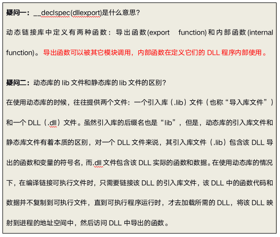


### **12.3.2 动态库的使用**


**方法一：隐式调用**
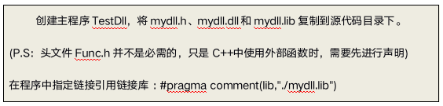


**方法二：显式调用**

	HANDLE hDll; //声明一个dll实例文件句柄
	hDll = LoadLibrary("mydll.dll"); //导入动态链接库
	MYFUNC minus_test; //创建函数指针
	//获取导入函数的函数指针
	minus_test = (MYFUNC)GetProcAddress(hDll, "myminus");


### chighdata013
# 13. 递归函数

### chighdata013a
## 13.1 递归函数基本概念
C通过运行时堆栈来支持递归函数的实现。递归函数就是直接或间接调用自身的函数。

### chighdata013b
## 13.2 普通函数调用

```c


void funB(int b){
	printf("b = %d\n", b);
}

void funA(int a){
	funB(a - 1);
	printf("a = %d\n", a);
}

int main(void){
	funA(2);
    printf("main\n");
	return 0;
}

```
函数的调用流程如下：
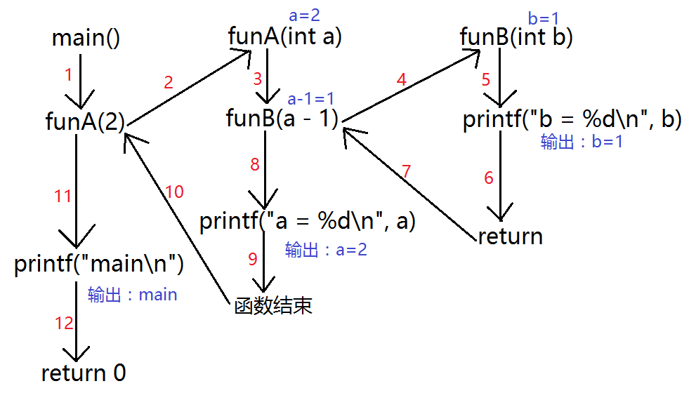


### chighdata013c
## 13.3 递归函数调用


```c

void fun(int a){
	
	if (a == 1){
		printf("a = %d\n", a);
		return; //中断函数很重要
	}

	fun(a - 1);
	printf("a = %d\n", a);
}

int main(void){
	
	fun(2);
	printf("main\n");

	return 0;
}

```


函数的调用流程如下：

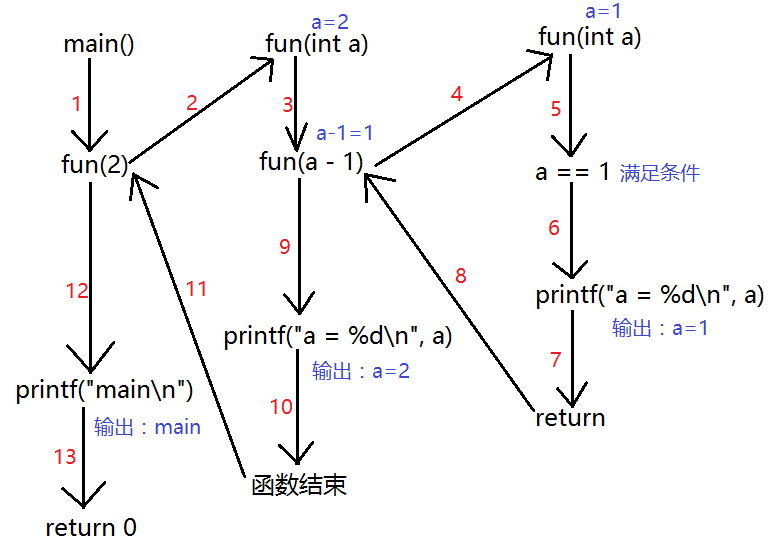

**作业：**

递归实现给出一个数8793，依次打印千位数字8、百位数字7、十位数字9、个位数字3。


```c

void recursion(int val){
	if (val == 0){
		return;
	}
	int ret = val / 10;
	recursion(ret);
	printf("%d ",val % 10);
}

```

### chighdata013d
## 13.4 递归实现字符串反转 


```c

int reverse1(char *str){
	if (str == NULL)
	{
		return -1;
	}

	if (*str == '\0') // 函数递归调用结束条件
	{
		return 0;
	}
	
	reverse1(str + 1);
	printf("%c", *str);

	return 0;
}

char buf[1024] = { 0 };  //全局变量

int reverse2(char *str){
	if (str == NULL) 
	{
		return -1;
	}

	if ( *str == '\0' ) // 函数递归调用结束条件
	{
		return 0;
	}

	reverse2(str + 1);
	strncat(buf, str, 1);

	return 0;
}

int reverse3(char *str, char *dst){
	if (str == NULL || dst == NULL) 
	{
		return -1;
	}

	if (*str == '\0') // 函数递归调用结束条件
	{
		return 0;
	}

	reverse3(str + 1);

	strncat(dst, str, 1);

	return 0;
}


```


### chighdata014
# 14. 面向接口编程

## **14.1****案例背景**

一般的企业信息系统都有成熟的框架。软件框架一般不发生变化，能自由的集成第三方厂商的产品。

## **14.2** **案例需求**

要求在企业信息系统框架中集成第三方厂商的游戏功能产品。软件设计要求：能够满足用户需求，完成的产品可以与用户完美对接。

## **14.3 案例要求**

1）能支持多个厂商的游戏功能产品入围

2）能够实现第三方产品和用户产品的对接

3）系统整体框架不轻易发生改变

## **14.4 编程提示**

1）抽象游戏中玩家结构体设计（struct Player）

2）框架接口设计（playGame）

 a) 初始化游戏

 b) 核心功能战斗

 c) 查看玩家信息

      d) 结束游戏

3）   a) 游戏厂商1入围（GameCompany1）

       b) 游戏厂商2入围（GameCompany2）

4）框架接口分文件编写


### chighdata015
# 15. 位运算

可以使用C对变量中的个别位进行操作。您可能对人们想这样做的原因感到奇怪。这种能力有时确实是必须的，或者至少是有用的。C提供位的逻辑运算符和移位运算符。在以下例子中，我们将使用二进制计数法写出值，以便您可以了解对位发生的操作。在一个实际程序中，您可以使用一般的形式的整数变量或常量。例如不适用00011001的形式，而写为25或者031或者0x19.在我们的例子中，我们将使用8位数字，从左到右，每位的编号是7到0。

### chighdata015a
## 15.1 位逻辑运算符

### 15.1.1 按位取反`~`

一元运算符~将每个1变为0，将每个0变为1，如下面的例子：

```c

~(10011010)
01100101

```

假设a是一个unsigned char，已赋值为2.在二进制中，2是00000010.于是-a的值为11111101或者253。请注意该运算符不会改变a的值，a仍为2。

```c

unsigned char a = 2;   //00000010
unsigned char b = ~a;  //11111101
printf("ret = %d\n", a); //ret = 2
printf("ret = %d\n", b); //ret = 253

```


### 15.1.2 位与（`AND`）: `&`

二进制运算符&通过对两个操作数逐位进行比较产生一个新值。对于每个位，只有两个操作数的对应位都是1时结果才为1。

```c

   (10010011) 
 & (00111101) 
 = (00010001)

```


C也有一个组合的位与-赋值运算符：&=。下面两个将产生相同的结果：

```c

val &= 0377
val = val & 0377

```


### 15.1.3 位或（`OR`）:`|`

二进制运算符|通过对两个操作数逐位进行比较产生一个新值。对于每个位，如果其中任意操作数中对应的位为1，那么结果位就为1.

```c

	(10010011)
  | (00111101)
  = (10111111)

```

C也有组合位或-赋值运算符： |=

```c

val |= 0377
val = val | 0377

```


### 15.1.4 位异或: 

二进制运算符^对两个操作数逐位进行比较。对于每个位，如果操作数中的对应位有一个是1(但不是都是1)，那么结果是1.如果都是0或者都是1，则结果位0.


```c

	(10010011)
  ^ (00111101)
  = (10101110)

```


C也有一个组合的位异或-赋值运算符： ^=

```c

val ^= 0377
val = val ^ 0377

```


### 15.1.5 用法

### 15.1.5.1 打开位

已知：10011010：

1. 将位2打开

flag |  10011010

```c

(10011010)
|(00000100)
=(10011110)

```

2. 将所有位打开。

flag | ~flag

```c

(10011010)
|(01100101)
=(11111111)

```

### 15.1.5.2 关闭位

flag & ~flag

```c

(10011010)
&(01100101)
=(00000000)

```

### 15.1.5.3 转置位

转置(toggling)一个位表示如果该位打开，则关闭该位；如果该位关闭，则打开。您可以使用位异或运算符来转置。其思想是如果b是一个位(1或0)，那么如果b为1则b^1为0，如果b为0，则1^b为1。无论b的值是0还是1,0^b为b.

flag ^ 0xff

```c

(10010011)
^(11111111)
=(01101100)

```


### 15.1.5.4 交换两个数不需要临时变量

```c

//a ^ b = temp;
//a ^ temp = b;
//b ^ temp = a
 (10010011)
^(00100110)
=(10110101)

 (10110101)
^(00100110)
  10010011
  
  int a = 10;
  int b = 30;

```


### chighdata015b
## 15.2 移位运算符


现在让我们了解一下C的移位运算符。移位运算符将位向左或向右移动。同样，我们仍将明确地使用二进制形式来说明该机制的工作原理。

## 15.2.1 左移 <<

左移运算符<<将其左侧操作数的值的每位向左移动，移动的位数由其右侧操作数指定。空出来的位用0填充，并且丢弃移出左侧操作数末端的位。在下面例子中，每位向左移动两个位置。

```c

(10001010) << 2
(00101000)

```

该操作将产生一个新位置，但是不改变其操作数。

```c

1 << 1 = 2;
2 << 1 = 4;
4 << 1 = 8;
8 << 2 = 32

```

左移一位相当于原值*2.

## 15.2.2 右移 >>

右移运算符>>将其左侧的操作数的值每位向右移动，移动的位数由其右侧的操作数指定。丢弃移出左侧操作数有段的位。对于unsigned类型，使用0填充左端空出的位。**对于有符号类型，结果依赖于机器。空出的位可能用0填充，或者使用符号(最左端)位的副本填充。**


```c

//有符号值
(10001010) >> 2
(00100010)     //在某些系统上的结果值

(10001010) >> 2
(11100010)     //在另一些系统上的结果

//无符号值
(10001010) >> 2
(00100010)    //所有系统上的结果值

```


## 15.2.3 用法：移位运算符

移位运算符能够提供快捷、高效（依赖于硬件）对2的幂的乘法和除法。


