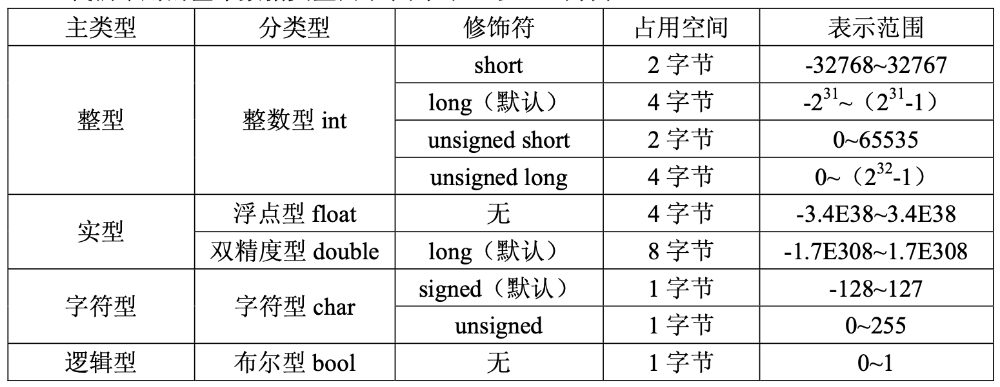

# 字符串是以0或者'\0'结尾的字符数组，(数字0和字符'\0'等价)

# sizeof

# 预处理 ,编译 ,汇编 ,链接

1. `预处理`：宏定义展开、头文件展开、条件编译，这里并不会检查语法
2. `编译`：检查语法，将预处理后文件编译生成汇编文件 
3. `汇编`：将汇编文件生成目标文件(二进制文件) 
4. `链接`：将目标文件链接为可执行程序

# 没有加载进内存分好3段信息

- `text`: 代码区
- `data`: 数据区
- `bss`: 未初始化数据区

有人把`data`和`bss`合起来叫`静态区`或者`全局区`

总的来说, 程序源码被编译之后主要分成两种段: `程序指令(代码区)`和`程序数据(数据区)`

# 程序运行之后5个

- `text`: 代码区
- `data`: 数据区
- `bss`: 未初始化数据区
- `stack`: 栈区
- `heap`: 堆区

# 栈区 放函数的参数以及局部变量

# 堆区 编程人员手动申请，手动释放，若不手动释放，程序结束后由系统回收，生命周期是整个程序运行期间

# 全局/静态区

全局静态区内的变量在`编译阶段`已经分配好内存空间并初始化. 这块内存在程序运行期间一直存在, 它主要存储`全局变量`, `静态变量`

# 空指针  等于NULL

# 指针的步长为 1

# 数组名是一个指针常量 数组第一个元素的地址

# **#incude<>和#include****""****区别**
*   "" 表示系统先在file1.c所在的当前目录找file1.h，如果找不到，再按系统指定的目录检索。

*   < > 表示系统直接按系统指定的目录检索。

注意：

1. #include <>常用于包含库函数的头文件；

2. #include ""常用于包含自定义的头文件；

3. 理论上#include可以包含任意格式的文件(.c .h等) ，但一般用于头文件的包含；