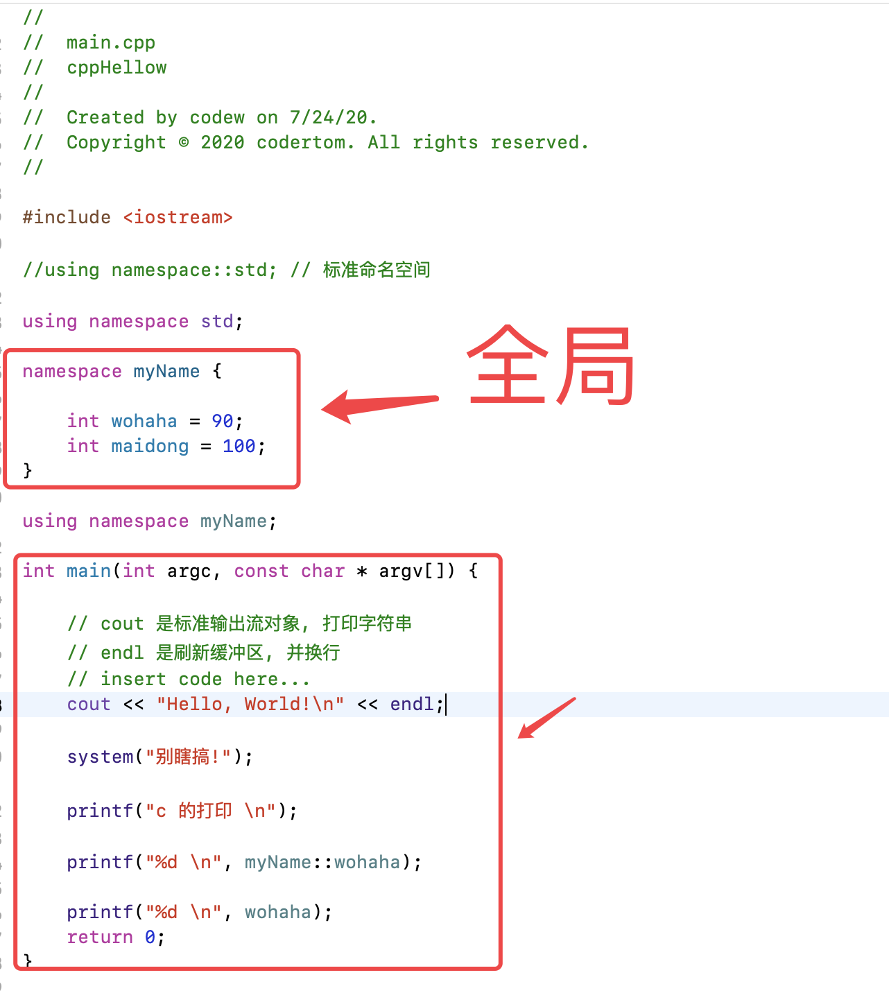

cout 不用加“%d” 这种...

# 1. 命名空间

对名字的控制

多人合作中取名字重复的问题 ....

## 1.1 命名空间 样子

myName 是一个
```c

namespace  myName {

 int wohaha = 90;

 int maidong = 100;

}

namespace  myName {

 float opengles = 2.0;

}

```

## 1.2 注意

1. 命名空间只能写在全局




2. 命名空间可以嵌套

```cpp

// 可以嵌套
namespace myNameSuper {

    int zhoujielun = 45;

    namespace zhouzhou{

       int nibaba;
       int wocao;

    }

}

```

3. 命名空间是开放的 ，随时可以加入新成员，但是新成员只能在加入后使用

Maker是一个
```cpp

namespace Maker
{
	int a;
	namespace B
	{
		int b;
	}
}
namespace Maker
{
	int c;
}

```


4. 匿名命名空间

访问匿名空间里的变量用::
```cpp

//类似于static int d=50;
namespace
{
	int d = 50;
}


// 匿名命名空间

namespace {

double  pi = 0.001;

}

cout << "匿名命名空间 pi" << ::pi << endl;
 
```


5. 命名空间可以取别名

```cpp

void test01()
{
	//			新名字    旧名字
	namespace nameMaker = Maker;
	cout << nameMaker::a << endl;
}

```

6. 分文件编写代码时. 如果.h中有两个命名空间，但是里面的成员函数或成员变量同名时，在.cpp中实现函数时，需要加上命名空间

```cpp

test.h文件
#pragma once
#include<iostream>
using namespace std;

namespace myMaker1
{
	void func();
}

namespace myMaker2
{
	void func();
}

test.cpp文件
#include "test.h"
void myMaker1::func()//需要在函数名前面加入确定命名空间名字
{
	cout << "func" << endl;
}

```


# 2. using声明和编译指令（重点）

## 2.1 
`using`  声明是让命名空间中某个标识符可以直接使用

```cpp

//
//  main.cpp
//  cppHellow02
//
//  Created by codew on 7/24/20.
//  Copyright © 2020 codertom. All rights reserved.
//

#include <iostream>

void test01();

using namespace std;

namespace NameS01 {

int valueA = 500;
int valueB = 600;

}

int main(int argc, const char * argv[]) {
    // insert code here...
    std::cout << "Hello, World!\n";
    
    test01();
    
    
    return 0;
}


void test01()
{
    cout << "你瞅啥!!!" << endl;
    
    cout << "你瞅啥!!!--没有using之前--valueA:" << NameS01::valueA << endl;
    cout << "你瞅啥!!!--没有using之前--valueB:" << NameS01::valueB << endl;
    
//    using 声明是让命名空间中某个标识符可以直接使用
//    using NameS01::valueA;
//    using NameS01::valueB;
    
//    cout << "你瞅啥!!!--using之后--valueA:" << valueA << endl;
//    cout << "你瞅啥!!!--using之后--valueB:" << valueB << endl;
    
    
    using namespace NameS01;
    
    
    cout << "你瞅啥!!!--using namespace NameS01--valueA:" << valueA << endl;
    cout << "你瞅啥!!!--using namespace NameS01--valueB:" << valueB << endl;
    
    
}


```


## 2.2 

`using` 编译指令, 让某个命名空间中的标识符都可以直接使用


```cpp

    using namespace NameS01;
    
    // 就近原则
    int valueA = 9000;
    
    cout << "你瞅啥!!!--using namespace NameS01--valueA:" << valueA << endl;
    cout << "你瞅啥!!!--using namespace NameS01--valueB:" << valueB << endl;

```
