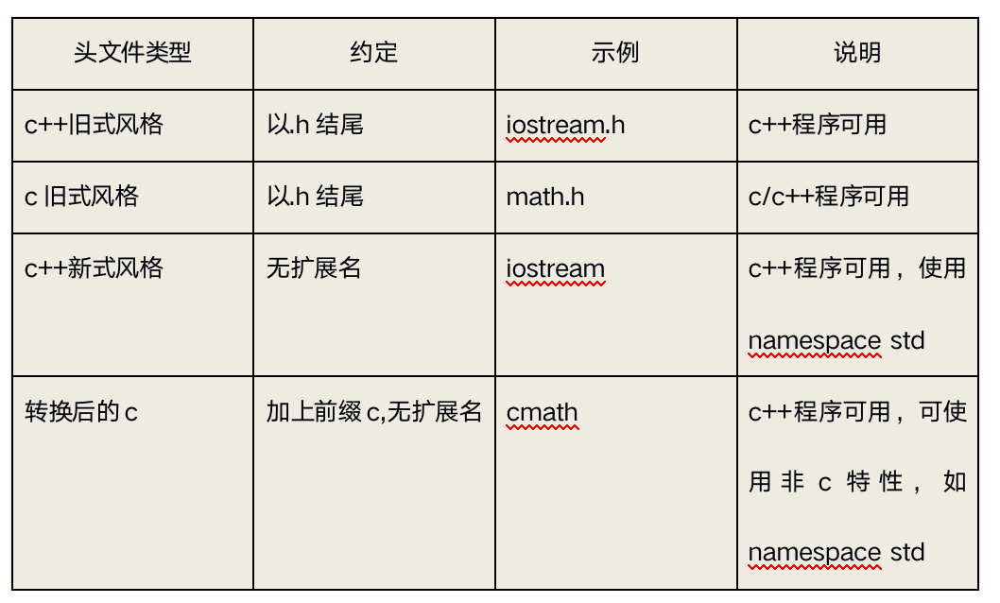

# cpp初识

# 目录


2. [C++初识](#cpp1data002)
    1. [c++ hello world](#cpp1data002a)
    2. [面向对象三大特性](#cpp1data002b)


### cpp1data002
# 2. C++初识

### cpp1data002a
# 2.1 c++ hello world

- 请打开一下示例代码：

```cpp

#include<iostream>
//using namespace std;

int main(){
	cout << "hello world" << endl;
	return EXIT_SUCCESS;
}

```


**分析**:
- #include<iostream>; 预编译指令，引入头文件iostream.
- using namespace std; 使用标准命名空间
- cout << “hello world”<< endl; 和printf功能一样，输出字符串”hello wrold”

**问题1**：c++头文件为什么没有.h？

在c语言中头文件使用扩展名.h,将其作为一种通过名称标识文件类型的简单方式。但是`C++`得用法改变了，`C++`头文件没有扩展名。但是有些c语言的头文件被转换为`C++`的头文件，这些文件被重新命名，丢掉了扩展名.h(使之成为`C++`风格头文件)，并在文件名称前面加上前缀c(表明来自c语言)。例如`C++`版本的math.h为cmath.

由于C使用不同的扩展名来表示不同文件类型，因此用一些特殊的扩展名(如hpp或hxx)表示`C++`的头文件也是可以的，ANSI/IOS标准委员会也认为是可以的，但是关键问题是用哪个比较好，最后一致同意不适用任何扩展名。





**问题2**：using namespace std 是什么?

namespace是指标识符的各种可见范围。命名空间用关键字namespace 来定义。命名空间是`C++`的一种机制，用来把单个标识符下的大量有逻辑联系的程序实体组合到一起。此标识符作为此组群的名字。

**问题3**：cout 、endl 是什么？

cout是`c++`中的标准输出流，endl是输出换行并刷新缓冲区。

### cpp1data002b
# 2.2 面向对象三大特性


1. 封装

- 把客观事物封装成抽象的类，并且类可以把自己的数据和方法只让可信的类或者对象操作，对不可信的进行信息隐藏。

- 类将成员变量和成员函数封装在类的内部，根据需要设置访问权限，通过成员函数管理内部状态。

2. 继承

- 继承所表达的是类之间相关的关系，这种关系使得对象可以继承另外一类对象的特征和能力。

- 继承的作用：避免公用代码的重复开发，减少代码和数据冗余。

3. 多态

- 多态性可以简单地概括为“一个接口，多种方法”，字面意思为多种形态。程序在运行时才决定调用的函数，它是面向对象编程领域的核心概念。


