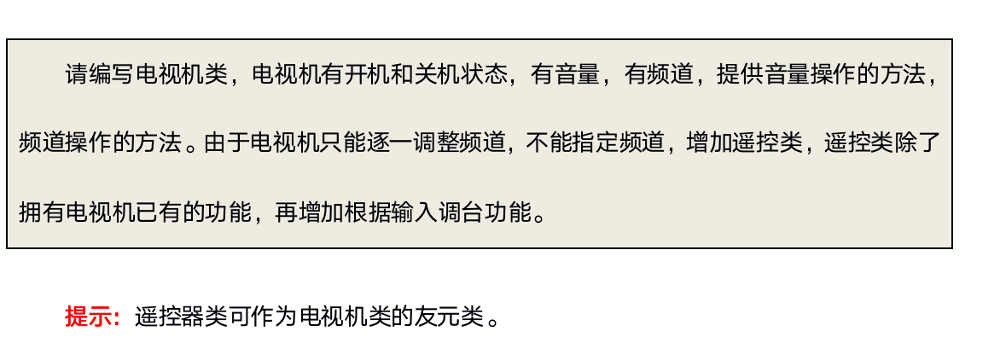

# 类和对象

# 目录
1. [类和对象的基本概念](#cpp1data004a)
    1. [C和C++中struct区别](#cpp1data004a1)
    2. [类的封装](#cpp1data004a2)
    3. [将成员变量设置为private](#cpp1data004a3)
    4. [课堂练习](#cpp1data004a4)
2. [面向对象程序设计案例](#cpp1data004b)
    1. [设计立方体类](#cpp1data004b1)
    2. [点和圆的关系](#cpp1data004b2)
    3. [分文件实现](#cpp1data004b3)
3. [对象的构造和析构](#cpp1data004c)
    1. [初始化和清理](#cpp1data004c1)
    2. [构造函数和析构函数](#cpp1data004c2)
    3. [构造函数的分类及调用](#cpp1data004c3)
    4. [拷贝构造函数的调用时机](#cpp1data004c4)
    5. [构造函数调用规则](#cpp1data004c5)
    6. [深拷贝和浅拷贝](#cpp1data004c6)
        1. [浅拷贝](#cpp1data004c6a)
        2. [深拷贝](#cpp1data004c6b)
    7. [多个对象构造和析构](#cpp1data004c7)
        1. [初始化列表](#cpp1data004c7a)
        2. [类对象作为成员](#cpp1data004c7b)
    8. [explicit关键字](#cpp1data004c8)
    9. [动态对象创建](#cpp1data004c9)
        1. [对象创建](#cpp1data004c9a)
        2. [动态分配内存方法](#cpp1data004c9b)
        3. [new operator](#cpp1data004c9c)
        4. [delete operator](#cpp1data004c9d)
        5. [用于数组的new和delete](#cpp1data004c9e)
        6. [delete void*可能会出错](#cpp1data004c9f)
        7. [使用new和delete采用相同形式](#cpp1data004c9g)
    10. [静态成员](#cpp1data004c10)
        1. [静态成员变量](#cpp1data004c10a)
        2. [静态成员函数](#cpp1data004c10b)
        3. [const静态成员属性](#cpp1data004c10c)
        4. [单例模式](#cpp1data004c10d)
4. [C++面向对象模型初探](#cpp1data004d)
    1. [成员变量和函数的存储](#cpp1data004d1)
    2. [this指针](#cpp1data004d2)
        1. [this指针工作原理](#cpp1data004d2a)
        2. [this指针的使用](#cpp1data004d2b)
        3. [const修饰成员函数](#cpp1data004d2c)
        4. [const修饰对象(常对象)](#cpp1data004d2d)
5. [友元](#cpp1data004e)
    1. [友元语法](#cpp1data004e1)
    2. [课堂练习](#cpp1data004e2)
6. [强化训练(数组类封装)](#cpp1data004f)
7. [运算符重载](#cpp1data004g)
    1. [运算符重载基本概念](#cpp1data004g1)
    2. [运算符重载碰上友元函数](#cpp1data004g2)
    3. [可重载的运算符](#cpp1data004g3)
    4. [前置和后置(++/--)运算符重载](#cpp1data004g4)
    5. [赋值(=)运算符重载](#cpp1data004g5)
    6. [指针运算符(*、->)重载](#cpp1data004g6)
    7. [不要重载&&、||](#cpp1data004g7)
    8. [强化训练_字符串类封装](#cpp1data004g8)
    9. [附录：运算符和结合性](#cpp1data004g9)
8. [继承和派生](#cpp1data004h)
    1. [继承概述](#cpp1data004h1)
        1. [为什么需要继承](#cpp1data004h1a)
        2. [继承基本概念](#cpp1data004h1b)
        3. [派生类定义](#cpp1data004h1c)
    2. [派生类访问控制](#cpp1data004h2)
    3. [继承中的构造和析构](#cpp1data004h3)
        1. [继承中的对象模型](#cpp1data004h3a)
        2. [对象构造和析构的调用原则](#cpp1data004h3b)
    4. [继承中同名成员的处理方法](#cpp1data004h4)
    5. [非自动继承的函数](#cpp1data004h5)
    6. [继承中的静态成员特性](#cpp1data004h6)
    7. [多继承](#cpp1data004h7)
        1. [多继承概念](#cpp1data004h7a)
        2. [菱形继承和虚继承](#cpp1data004h7b)
        3. [虚继承实现原理](#cpp1data004h7c)
9. [多态](#cpp1data004i)
    1. [多态基本概念](#cpp1data004i1)
    2. [向上类型转换及问题](#cpp1data004i2)
        1. [问题抛出](#cpp1data004i2a)
        2. [问题解决思路](#cpp1data004i2b)
        3. [问题解决方案(虚函数,vitual function)](#cpp1data004i2c)
    3. [C++如何实现动态绑定](#cpp1data004i3)
    4. [抽象基类和纯虚函数](#cpp1data004i4)
    5. [纯虚函数和多继承](#cpp1data004i5)
    6. [虚析构函数](#cpp1data004i6)
        1. [虚析构函数作用](#cpp1data004i6a)
        2. [纯虚析构函数](#cpp1data004i6b)
    7. [重写 重载 重定义](#cpp1data004i7)


### cpp1data004a
# 4.1 类和对象的基本概念

### cpp1data004a1
## 4.1.1 C和C++中struct区别

- c语言struct只有变量

- c++语言struct 既有变量，也有函数

### cpp1data004a2
## 4.1.2 类的封装

我们编写程序的目的是为了解决现实中的问题，而这些问题的构成都是由各种事物组成，我们在计算机中要解决这种问题，首先要做就是要将这个问题的参与者：事和物抽象到计算机程序中，也就是用程序语言表示现实的事物。

那么现在问题是如何用程序语言来表示现实事物？现实世界的事物所具有的共性就是每个事物都具有自身的属性，一些自身具有的行为，所以如果我们能把事物的属性和行为表示出来，那么就可以抽象出来这个事物。

比如我们要表示人这个对象，在c语言中，我们可以这么表示:


```c


typedef  struct _Person{

 char name[64];

 int age;

}Person;

typedef  struct _Aninal{

 char name[64];

 int age;

 int type; //动物种类

}Ainmal;

void PersonEat(Person* person){

 printf("%s在吃人吃的饭!\n",person->name);

}

void AnimalEat(Ainmal* animal){

 printf("%s在吃动物吃的饭!\n", animal->name);

}

int main(){

 Person person;

 strcpy(person.name, "小明");

 person.age = 30;

 AnimalEat(&person);

 return EXIT_SUCCESS;

}

```


定义一个结构体用来表示一个对象所包含的属性，函数用来表示一个对象所具有的行为，这样我们就表示出来一个事物，在c语言中，行为和属性是分开的，也就是说吃饭这个属性不属于某类对象，而属于所有的共同的数据，所以不单单是PeopleEat可以调用Person数据，AnimalEat也可以调用Person数据，那么万一调用错误，将会导致问题发生。

从这个案例我们应该可以体会到，属性和行为应该放在一起，一起表示一个具有属性和行为的对象。

假如某对象的某项属性不想被外界获知，比如说漂亮女孩的年龄不想被其他人知道，那么年龄这条属性应该作为女孩自己知道的属性；或者女孩的某些行为不想让外界知道，只需要自己知道就可以。那么这种情况下，封装应该再提供一种机制能够给属性和行为的访问权限控制住。

所以说封装特性包含两个方面，一个是属性和变量合成一个整体，一个是给属性和函数增加访问权限。


1. 封装

> 1.  把变量（属性）和函数（操作）合成一个整体，封装在一个类中

> 2.  对变量和函数进行访问控制


2. 访问权限

> 1. 在类的内部(作用域范围内)，没有访问权限之分，所有成员可以相互访问

> 2. 在类的外部(作用域范围外)，访问权限才有意义：public，private，protected

> 3.在类的外部，只有public修饰的成员才能被访问，在没有涉及继承与派生时，  private和protected是同等级的，外部不允许访问


```cpp

//封装两层含义

//1\. 属性和行为合成一个整体

//2\. 访问控制，现实事物本身有些属性和行为是不对外开放

class  Person{

//人具有的行为(函数)

public:

 void Dese(){ cout << "我有钱，年轻，个子又高，就爱嘚瑟!" << endl;}

//人的属性(变量)

public:

  int  mTall; //多高，可以让外人知道

protected:

  int  mMoney; // 有多少钱,只能儿子孙子知道

private:

  int  mAge; //年龄，不想让外人知道

};

int main(){

 Person p;

 p.mTall = 220;

  //p.mMoney 保护成员外部无法访问

  //p.mAge 私有成员外部无法访问

 p.Dese();

 return EXIT_SUCCESS;

}

```


```cpp

class  A{

 int mAge;

};

struct B{

 int mAge;

};

void test(){

 A a;

 B b;

  //a.mAge; //无法访问私有成员

 b.mAge; //可正常外部访问

}

```


### cpp1data004a3
## 4.1.3 将成员变量设置为private

1. 可赋予客户端访问数据的一致性。

- 如果成员变量不是public，客户端唯一能够访问对象的方法就是通过成员函数。如果类中所有public权限的成员都是函数，客户在访问类成员时只会默认访问函数，不需要考虑访问的成员需不需要添加(),这就省下了许多搔首弄耳的时间。

2. 可细微划分访问控制。

- 使用成员函数可使得我们对变量的控制处理更加精细。如果我们让所有的成员变量为public，每个人都可以读写它。如果我们设置为private，我们可以实现“不准访问”、“只读访问”、“读写访问”，甚至你可以写出“只写访问”。


```cpp

class  AccessLevels{

public:

  //对只读属性进行只读访问

 int getReadOnly(){ return readOnly; }

  //对读写属性进行读写访问

 void setReadWrite(int val){ readWrite = val; }

 int getReadWrite(){ return readWrite; }

  //对只写属性进行只写访问

 void setWriteOnly(int val){ writeOnly = val; }

private:

  int  readOnly; //对外只读访问

  int  noAccess; //外部不可访问

  int  readWrite; //读写访问

  int  writeOnly; //只写访问

};

```


### cpp1data004a4
## 4.1.4 课堂练习

### cpp1data004b
# 4.2 面向对象程序设计案例


### cpp1data004b1
## 4.2.1 设计立方体类

设计立方体类(`Cube`)，求出立方体的面积`( 2*a*b + 2*a*c + 2*b*c )`和体积`( a * b * c)`，分别用**全局函数**和**成员函数**判断两个立方体是否相等。


```cpp

//立方体类

class  Cub{

public:

 void setL(int l){ mL = l; }

 void setW(int w){ mW = w; }

 void setH(int h){ mH = h; }

 int getL(){ return mL; }

 int getW(){ return mW; }

 int getH(){ return mH; }

  //立方体面积

 int caculateS(){ return (mL*mW + mL*mH + mW*mH) * 2; }

  //立方体体积

 int caculateV(){ return mL * mW * mH; }

  //成员方法

 bool CubCompare(Cub& c){

 if (getL() == c.getL() && getW() == c.getW() && getH() == c.getH()){

 return true;

 }

  return  false;

 }

private:

 int mL; //长

 int mW; //宽

 int mH; //高

};

//比较两个立方体是否相等

bool CubCompare(Cub& c1, Cub& c2){

 if (c1.getL() == c2.getL() && c1.getW() == c2.getW() && c1.getH() == c2.getH()){

 return true;

 }

  return  false;

}

void test(){

 Cub c1, c2;

 c1.setL(10);

 c1.setW(20);

 c1.setH(30);

 c2.setL(20);

 c2.setW(20);

 c2.setH(30);

 cout << "c1面积:" << c1.caculateS() << " 体积:" << c1.caculateV() << endl;

 cout << "c2面积:" << c2.caculateS() << " 体积:" << c2.caculateV() << endl;

  //比较两个立方体是否相等

 if (CubCompare(c1, c2)){

 cout << "c1和c2相等!" << endl;

 }

 else{

 cout << "c1和c2不相等!" << endl;

 }

 if (c1.CubCompare(c2)){

 cout << "c1和c2相等!" << endl;

 }

 else{

 cout << "c1和c2不相等!" << endl;

 }

}

```

### cpp1data004b2
## 4.2.2 点和圆的关系

设计一个圆形类（AdvCircle），和一个点类（Point），计算点和圆的关系。

假如圆心坐标为x0, y0, 半径为r，点的坐标为x1, y1：

1）点在圆上：`(x1-x0)*(x1-x0) + (y1-y0)*(y1-y0) == r*r`

2）点在圆内：`(x1-x0)*(x1-x0) + (y1-y0)*(y1-y0) < r*r`

3）点在圆外：`(x1-x0)*(x1-x0) + (y1-y0)*(y1-y0) > r*r`


```cpp

//点类

class  Point{

public:

 void setX(int x){ mX = x; }

 void setY(int y){ mY = y; }

 int getX(){ return mX; }

 int getY(){ return mY; }

private:

 int mX;

 int mY;

};

//圆类

class  Circle{

public:

 void setP(int x,int y){

 mP.setX(x);

 mP.setY(y);

 }

 void setR(int r){ mR = r; }

 Point& getP(){ return mP; }

 int getR(){ return mR; }

  //判断点和圆的关系

 void IsPointInCircle(Point& point){

 int distance = (point.getX() - mP.getX()) * (point.getX() - mP.getX()) + (point.getY() - mP.getY()) * (point.getY() - mP.getY());

 int radius = mR * mR;

 if (distance < radius){

 cout << "Point(" << point.getX() << "," << point.getY() << ")在圆内!" << endl;

 }

 else if (distance > radius){

 cout << "Point(" << point.getX() << "," << point.getY() << ")在圆外!" << endl;

 }

 else{

 cout << "Point(" << point.getX() << "," << point.getY() << ")在圆上!" << endl;

 }

 }

private:

 Point mP; //圆心

 int mR; //半径

};

void test(){

  //实例化圆对象

 Circle circle;

 circle.setP(20, 20);

 circle.setR(5);

  //实例化点对象

 Point point;

 point.setX(25);

 point.setY(20);

 circle.IsPointInCircle(point);

}

```


### cpp1data004b3
## 4.2.3 分文件实现

### cpp1data004c
# 4.3 对象的构造和析构


### cpp1data004c1
## 4.3.1 初始化和清理

我们大家在购买一台电脑或者手机，或者其他的产品，这些产品都有一个初始设置，也就是这些产品对被创建的时候会有一个基础属性值。那么随着我们使用手机和电脑的时间越来越久，那么电脑和手机会慢慢被我们手动创建很多文件数据，某一天我们不用手机或电脑了，那么我们应该将电脑或手机中我们增加的数据删除掉，保护自己的信息数据。

从这样的过程中，我们体会一下，所有的事物在起初的时候都应该有个初始状态，当这个事物完成其使命时，应该及时清除外界作用于上面的一些信息数据。

那么我们c++中OO思想也是来源于现实，是对现实事物的抽象模拟，具体来说，当我们创建对象的时候,这个对象应该有一个初始状态，当对象销毁之前应该销毁自己创建的一些数据。

对象的初始化和清理也是两个非常重要的安全问题，一个对象或者变量没有初始时，对其使用后果是未知，同样的使用完一个变量，没有及时清理，也会造成一定的安全问题。c++为了给我们提供这种问题的解决方案，**构造函数**和**析构函数**，这两个函数将会被编译器自动调用，完成对象初始化和对象清理工作。

**无论你是否喜欢，对象的初始化和清理工作是编译器强制我们要做的事情，即使你不提供初始化操作和清理操作，编译器也会给你增加默认的操作，只是这个默认初始化操作不会做任何事，所以编写类就应该顺便提供初始化函数。**

为什么初始化操作是自动调用而不是手动调用？既然是必须操作，那么自动调用会更好，如果靠程序员自觉，那么就会存在遗漏初始化的情况出现。

### cpp1data004c2
## 4.3.2 构造函数和析构函数

构造函数主要作用在于创建对象时为对象的成员属性赋值，构造函数由编译器自动调用，无须手动调用。

析构函数主要用于对象**销毁前**系统自动调用，执行一些清理工作。

**构造函数语法：**


```c

构造函数函数名和类名相同，没有返回值，不能有void，但可以有参数。

ClassName(){}

```

**析构函数语法：**

```c

析构函数函数名是在类名前面加”~”组成,没有返回值，不能有void,不能有参数，不能重载。

~ClassName(){}

```

```cpp

class  Person{

public:

 Person(){

 cout << "构造函数调用!" << endl;

 pName = (char*)malloc(sizeof("John"));

 strcpy(pName, "John");

 mTall = 150;

 mMoney = 100;

 }

 ~Person(){

 cout << "析构函数调用!" << endl;

 if (pName != NULL){

 free(pName);

 pName = NULL;

 }

 }

public:

 char* pName;

 int mTall;

 int mMoney;

};

void test(){

 Person person;

 cout << person.pName << person.mTall << person.mMoney << endl;

}

```

### cpp1data004c3
## 4.3.3 构造函数的分类及调用

- 按参数类型：分为无参构造函数和有参构造函数

- 按类型分类：普通构造函数和拷贝构造函数(复制构造函数)


```cpp

class  Person{

public:

 Person(){

 cout << "no param constructor!" << endl;

 mAge = 0;

 }

  //有参构造函数

 Person(int age){

 cout << "1 param constructor!" << endl;

 mAge = age;

 }

  //拷贝构造函数(复制构造函数) 使用另一个对象初始化本对象

 Person(const Person& person){

 cout << "copy constructor!" << endl;

 mAge = person.mAge;

 }

  //打印年龄

  void  PrintPerson(){

 cout << "Age:" << mAge << endl;

 }

private:

 int mAge;

};

//1\. 无参构造调用方式

void  test01(){

  //调用无参构造函数

 Person person1;

 person1.PrintPerson();

  //无参构造函数错误调用方式

  //Person person2();

  //person2.PrintPerson();

}

//2\. 调用有参构造函数

void  test02(){

  //第一种 括号法，最常用

 Person person01(100);

 person01.PrintPerson();

  //调用拷贝构造函数

 Person person02(person01);

 person02.PrintPerson();

  //第二种 匿名对象(显示调用构造函数)

 Person(200); //匿名对象，没有名字的对象

 Person person03 = Person(300);

 person03.PrintPerson();

  //注意: 使用匿名对象初始化判断调用哪一个构造函数，要看匿名对象的参数类型

 Person person06(Person(400)); //等价于 Person person06 = Person(400);

 person06.PrintPerson();

  //第三种 =号法 隐式转换

 Person person04 = 100; //Person person04 = Person(100)

 person04.PrintPerson();

  //调用拷贝构造

 Person person05 = person04; //Person person05 = Person(person04)

 person05.PrintPerson();

}

```


**注意:**不能调用拷贝构造函数去初始化匿名对象,也就是说以下代码不正确:

```cpp

class  Teacher{

public:

 Teacher(){

 cout << "默认构造函数!" << endl;

 }

 Teacher(const Teacher& teacher){

 cout << "拷贝构造函数!" << endl;

 }

public:

 int mAge;

};

void test(){

 Teacher t1;

  //error C2086:“Teacher t1”: 重定义

 Teacher(t1); //此时等价于 Teacher t1;

}

```


### cpp1data004c4
## 4.3.4 拷贝构造函数的调用时机


- 对象以值传递的方式传给函数参数

- 函数局部对象以值传递的方式从函数返回(vs debug模式下调用一次拷贝构造，qt不调用任何构造)

- 用一个对象初始化另一个对象

```cpp

class  Person{

public:

 Person(){

 cout << "no param contructor!" << endl;

 mAge = 10;

 }

 Person(int age){

 cout << "param constructor!" << endl;

 mAge = age;

 }

 Person(const Person& person){

 cout << "copy constructor!" << endl;

 mAge = person.mAge;

 }

 ~Person(){

 cout << "destructor!" << endl;

 }

public:

 int mAge;

};

//1\. 旧对象初始化新对象

void  test01(){

 Person p(10);

 Person p1(p);

 Person p2 = Person(p);

 Person p3 = p; // 相当于Person p2 = Person(p);

}

//2\. 传递的参数是普通对象，函数参数也是普通对象，传递将会调用拷贝构造

void doBussiness(Person p){}

void  test02(){

 Person p(10);

 doBussiness(p);

}

//3\. 函数返回局部对象

Person  MyBusiness(){

 Person p(10);

 cout << "局部p:" << (int*)&p << endl;

 return p;

}

void  test03(){

  //vs release、qt下没有调用拷贝构造函数

  //vs debug下调用一次拷贝构造函数

 Person p = MyBusiness();

 cout << "局部p:" << (int*)&p << endl;

}

```


```cpp

void MyBussiness(Person& _result){

 _result.X:X(); //调用Person默认拷贝构造函数

  //.....对_result进行处理

 return;

 }

int main(){

 Person p; //这里只分配空间，不初始化

 MyBussiness(p);

}

```


### cpp1data004c5
## 4.3.5 构造函数调用规则

1. 默认情况下，c++编译器至少为我们写的类增加3个函数

    - 1．默认构造函数(无参，函数体为空)

    - 2．默认析构函数(无参，函数体为空)

    - 3．默认拷贝构造函数，对类中非静态成员属性简单值拷贝

2. 如果用户定义拷贝构造函数，c++不会再提供任何默认构造函数

3. 如果用户定义了普通构造(非拷贝)，c++不在提供默认无参构造，但是会提供默认拷贝构造

### cpp1data004c6
## 4.3.6 深拷贝和浅拷贝

### cpp1data004c6a
### 4.3.6.1 浅拷贝

同一类型的对象之间可以赋值，使得两个对象的成员变量的值相同，两个对象仍然是独立的两个对象，这种情况被称为**浅拷贝.**

一般情况下，浅拷贝没有任何副作用，但是当类中有指针，并且指针指向动态分配的内存空间，析构函数做了动态内存释放的处理，会导致内存问题。


### cpp1data004c6b
### 4.3.6.2 深拷贝

当类中有指针，并且此指针有动态分配空间，析构函数做了释放处理，往往需要自定义拷贝构造函数，自行给指针动态分配空间，深拷贝。


```cpp

class  Person{

public:

 Person(char* name,int age){

 pName = (char*)malloc(strlen(name) + 1);

 strcpy(pName,name);

 mAge = age;

 }

  //增加拷贝构造函数

 Person(const Person& person){

 pName = (char*)malloc(strlen(person.pName) + 1);

 strcpy(pName, person.pName);

 mAge = person.mAge;

 }

 ~Person(){

 if (pName != NULL){

 free(pName);

 }

 }

private:

 char* pName;

 int mAge;

};

void test(){

 Person p1("Edward",30);

  //用对象p1初始化对象p2,调用c++提供的默认拷贝构造函数

 Person p2 = p1;

}

```

### cpp1data004c7
## 4.3.7 多个对象构造和析构

### cpp1data004c7a
### 4.3.7.1 初始化列表

构造函数和其他函数不同，除了有名字，参数列表，函数体之外还有初始化列表。

初始化列表简单使用:

```cpp

class  Person{

public:

#if 0

  //传统方式初始化

 Person(int a,int b,int c){

 mA = a;

 mB = b;

 mC = c;

 }

#endif

  //初始化列表方式初始化

 Person(int a, int b, int c):mA(a),mB(b),mC(c){}

  void  PrintPerson(){

 cout << "mA:" << mA << endl;

 cout << "mB:" << mB << endl;

 cout << "mC:" << mC << endl;

 }

private:

 int mA;

 int mB;

 int mC;

};

```

**注意：**初始化成员列表(参数列表)只能在构造函数使用。

### cpp1data004c7b
### 4.3.7.2 类对象作为成员

在类中定义的数据成员一般都是基本的数据类型。但是类中的成员也可以是对象，叫做对象成员。

`C++`中对对象的初始化是非常重要的操作，当创建一个对象的时候，`C++`编译器必须确保调用了所有子对象的构造函数。如果所有的子对象有默认构造函数，编译器可以自动调用他们。但是如果子对象没有默认的构造函数，或者想指定调用某个构造函数怎么办？

那么是否可以在类的构造函数直接调用子类的属性完成初始化呢？但是如果子类的成员属性是私有的，我们是没有办法访问并完成初始化的。

解决办法非常简单：对于子类调用构造函数，`C++`为此提供了专门的语法，即构造函数初始化列表。

当调用构造函数时，首先按各对象成员在类定义中的顺序（和参数列表的顺序无关）依次调用它们的构造函数，对这些对象初始化，最后再调用本身的函数体。也就是说，先调用对象成员的构造函数，再调用本身的构造函数。

析构函数和构造函数调用顺序相反，先构造，后析构。


```cpp

//汽车类

class  Car{

public:

 Car(){

 cout << "Car 默认构造函数!" << endl;

 mName = "大众汽车";

 }

 Car(string name){

 cout << "Car 带参数构造函数!" << endl;

 mName = name;

 }

 ~Car(){

 cout << "Car 析构函数!" << endl;

 }

public:

  string  mName;

};

//拖拉机

class  Tractor{

public:

 Tractor(){

 cout << "Tractor 默认构造函数!" << endl;

 mName = "爬土坡专用拖拉机";

 }

 Tractor(string name){

 cout << "Tractor 带参数构造函数!" << endl;

 mName = name;

 }

 ~Tractor(){

 cout << "Tractor 析构函数!" << endl;

 }

public:

  string  mName;

};

//人类

class  Person{

public:

#if 1

  //类mCar不存在合适的构造函数

 Person(string name){

 mName = name;

 }

#else

  //初始化列表可以指定调用构造函数

 Person(string carName, string tracName, string name) : mTractor(tracName), mCar(carName), mName(name){

 cout << "Person 构造函数!" << endl;

 }

#endif

  void  GoWorkByCar(){

 cout << mName << "开着" << mCar.mName << "去上班!" << endl;

 }

  void  GoWorkByTractor(){

 cout << mName << "开着" << mTractor.mName << "去上班!" << endl;

 }

 ~Person(){

 cout << "Person 析构函数!" << endl;

 }

private:

  string  mName;

  Car  mCar; //编译只能调用无参的构造

  Tractor  mTractor;

};

void test(){

  //Person person("宝马", "东风拖拉机", "赵四");

 Person person("刘能");

 person.GoWorkByCar();

 person.GoWorkByTractor();

}

```


### cpp1data004c8
## 4.3.8 explicit关键字

`C++`提供了关键字`explicit`，禁止通过构造函数进行的隐式转换。声明为`explicit`的构造函数不能在隐式转换中使用。


```cpp

class  MyString{

public:

  explicit  MyString(int n){

 cout << "MyString(int n)!" << endl;

 }

 MyString(const char* str){

 cout << "MyString(const char* str)" << endl;

 }

};

int main(){

  //给字符串赋值？还是初始化？

  //MyString str1 = 1;

 MyString str2(10);

  //寓意非常明确，给字符串赋值

 MyString str3 = "abcd";

 MyString str4("abcd");

 return EXIT_SUCCESS;

}

```


### cpp1data004c9
## 4.3.9 动态对象创建

当我们创建数组的时候，总是需要提前预定数组的长度，然后编译器分配预定长度的数组空间，在使用数组的时，会有这样的问题，数组也许空间太大了，浪费空间，也许空间不足，所以对于数组来讲，如果能根据需要来分配空间大小再好不过。

所以动态的意思意味着不确定性。

为了解决这个普遍的编程问题，在运行中可以创建和销毁对象是最基本的要求。当然c早就提供了动态内存分配（`dynamic  memory  allocation`）,函数`malloc`和`free`可以在运行时从堆中分配存储单元。

然而这些函数在`C++`中不能很好的运行，因为它不能帮我们完成对象的初始化工作。

### cpp1data004c9a
### 4.3.9.1 对象创建

当创建一个`c++`对象时会发生两件事:

1. 为对象分配内存

2. 调用构造函数来初始化那块内存

第一步我们能保证实现，需要我们确保第二步一定能发生。`c++`强迫我们这么做是因为使用未初始化的对象是程序出错的一个重要原因。

### cpp1data004c9b
### 4.3.9.2 动态分配内存方法

为了在运行时动态分配内存，c在他的标准库中提供了一些函数,`malloc`以及它的变种`calloc`和`realloc`,释放内存的`free`,这些函数是有效的、但是原始的，需要程序员理解和小心使用。为了使用c的动态内存分配函数在堆上创建一个类的实例，我们必须这样做:

```cpp

class  Person{

public:

 Person(){

 mAge = 20;

 pName = (char*)malloc(strlen("john")+1);

 strcpy(pName, "john");

 }

 void Init(){

 mAge = 20;

 pName = (char*)malloc(strlen("john")+1);

 strcpy(pName, "john");

 }

 void Clean(){

 if (pName != NULL){

 free(pName);

 }

 }

public:

 int mAge;

 char* pName;

};

int main(){

  //分配内存

 Person* person = (Person*)malloc(sizeof(Person));

 if(person == NULL){

 return 0;

 }

  //调用初始化函数

 person->Init();

  //清理对象

 person->Clean();

  //释放person对象

 free(person);

 return EXIT_SUCCESS;

}

```


c的动态内存分配函数太复杂，容易令人混淆，是不可接受的，`c++`中我们推荐使用运算符`new` 和 `delete`.

### cpp1data004c9c
### 4.3.9.3 new operator

`C++`中解决动态内存分配的方案是把创建一个对象所需要的操作都结合在一个称为`new`的运算符里。当用`new`创建一个对象时，它就在堆里为对象分配内存并调用构造函数完成初始化。

```c

Person* person = new Person;

相当于:

Person* person = (Person*)malloc(sizeof(Person));

 if(person == NULL){

 return 0;

 }

person->Init();

```

New操作符能确定在调用构造函数初始化之前内存分配是成功的，所有不用显式确定调用是否成功。

现在我们发现在堆里创建对象的过程变得简单了，只需要一个简单的表达式，它带有内置的长度计算、类型转换和安全检查。这样在堆创建一个对象和在栈里创建对象一样简单。


### cpp1data004c9d
### 4.3.9.4 delete operator

`new`表达式的反面是`delete`表达式。`delete`表达式先调用析构函数，然后释放内存。正如`new`表达式返回一个指向对象的指针一样，`delete`需要一个对象的地址。

delete只适用于由`new`创建的对象。

如果使用一个由`malloc`或者`calloc`或者`realloc`创建的对象使用`delete`,这个行为是未定义的。因为大多数`new`和`delete`的实现机制都使用了`malloc`和`free`,所以很可能没有调用析构函数就释放了内存。

如果正在删除的对象的指针是`NULL`,将不发生任何事，因此建议在删除指针后，立即把指针赋值为`NULL`，以免对它删除两次，对一些对象删除两次可能会产生某些问题。

```cpp

class  Person{

public:

 Person(){

 cout << "无参构造函数!" << endl;

 pName = (char*)malloc(strlen("undefined") + 1);

 strcpy(pName, "undefined");

 mAge = 0;

 }

 Person(char* name, int age){

 cout << "有参构造函数!" << endl;

 pName = (char*)malloc(strlen(name) + 1);

 strcpy(pName, name);

 mAge = age;

 }

  void  ShowPerson(){

 cout << "Name:" << pName << " Age:" << mAge << endl;

 }

 ~Person(){

 cout << "析构函数!" << endl;

 if (pName != NULL){

 delete pName;

 pName = NULL;

 }

 }

public:

 char* pName;

 int mAge;

};

void test(){

 Person* person1 = new Person;

 Person* person2 = new Person("John",33);

 person1->ShowPerson();

 person2->ShowPerson();

 delete person1;

 delete person2;

}

```


### cpp1data004c9e
### 4.3.9.5 用于数组的new和delete

使用`new`和`delete`在堆上创建数组非常容易。

```cpp

//创建字符数组

char* pStr = new char[100];

//创建整型数组

int* pArr1 = new int[100];

//创建整型数组并初始化

int* pArr2 = new int[10]{ 1, 2, 3, 4, 5, 6, 7, 8, 9, 10 };

//释放数组内存

delete[] pStr;

delete[] pArr1;

delete[] pArr2;

```

`当创建一个对象数组的时候，必须对数组中的每一个对象调用构造函数，`除了在栈上可以聚合初始化，必须提供一个默认的构造函数。

```cpp

class  Person{

public:

 Person(){

 pName = (char*)malloc(strlen("undefined") + 1);

 strcpy(pName, "undefined");

 mAge = 0;

 }

 Person(char* name, int age){

 pName = (char*)malloc(sizeof(name));

 strcpy(pName, name);

 mAge = age;

 }

 ~Person(){

 if (pName != NULL){

 delete pName;

 }

 }

public:

 char* pName;

 int mAge;

};

void test(){

  //栈聚合初始化

 Person person[] = { Person("john", 20), Person("Smith", 22) };

 cout << person[1].pName << endl;

  //创建堆上对象数组必须提供构造函数

 Person* workers = new Person[20]; //自动调用20次无参构造函数

}

```


### cpp1data004c9f
### 4.3.9.6 delete void*可能会出错

如果对一个void*指针执行delete操作，这将可能成为一个程序错误，除非指针指向的内容是非常简单的，因为它将不执行析构函数.以下代码未调用析构函数，导致可用内存减少。

```cpp

class  Person{

public:

 Person(char* name, int age){

 pName = (char*)malloc(sizeof(name));

 strcpy(pName,name);

 mAge = age;

 }

 ~Person(){

 if (pName != NULL){

 delete pName;

 }

 }

public:

 char* pName;

 int mAge;

};

void test(){

 void* person = new Person("john",20);

 delete person;

}

```


### cpp1data004c9g
### 4.3.9.7 使用new和delete采用相同形式

```cpp

Person* person = new Person[10];

delete  person;

```

以上代码有什么问题吗？(vs下直接中断、qt下析构函数调用一次)

使用了`new`也搭配使用了`delete`，问题在于`Person`有10个对象，那么其他9个对象可能没有调用析构函数，也就是说其他9个对象可能删除不完全，因为它们的析构函数没有被调用。

我们现在清楚使用`new`的时候发生了两件事: 一、分配内存；二、调用构造函数，那么调用`delete`的时候也有两件事：一、析构函数；二、释放内存。

那么刚才我们那段代码最大的问题在于：`person`指针指向的内存中到底有多少个对象，因为这个决定应该有多少个析构函数应该被调用。换句话说，`person`指针指向的是一个单一的对象还是一个数组对象，由于单一对象和数组对象的内存布局是不同的。更明确的说，数组所用的内存通常还包括“数组大小记录”，使得`delete`的时候知道应该调用几次析构函数。单一对象的话就没有这个记录。单一对象和数组对象的内存布局可理解为下图:


本图只是为了说明，编译器不一定如此实现，但是很多编译器是这样做的。

当我们使用一个delete的时候，我们必须让delete知道指针指向的内存空间中是否存在一个“数组大小记录”的办法就是我们告诉它。当我们使用delete[]，那么delete就知道是一个对象数组，从而清楚应该调用几次析构函数。

**结论:**

> 如果在new表达式中使用[]，必须在相应的delete表达式中也使用[].如果在new表达式中不使用[], 一定不要在相应的delete[]表达式中使用[].


### cpp1data004c10
## 4.3.10 静态成员

在类定义中，它的成员（包括成员变量和成员函数），这些成员可以用关键字static声明为静态的，称为静态成员。

不管这个类创建了多少个对象，静态成员只有一个拷贝，这个拷贝被所有属于这个类的对象共享。

### cpp1data004c10a
### 4.3.10.1 静态成员变量

在一个类中，若将一个成员变量声明为static，这种成员称为静态成员变量。与一般的数据成员不同，无论建立了多少个对象，都只有一个静态数据的拷贝。静态成员变量，属于某个类，所有对象共享。

静态变量，是在编译阶段就分配空间，对象还没有创建时，就已经分配空间。


```cpp

class  Person{

public:

  //类的静态成员属性

  static  int  sNum;

private:

  static  int  sOther;

};

//类外初始化，初始化时不加static

int  Person::sNum = 0;

int  Person::sOther = 0;

int main(){

  //1\. 通过类名直接访问

 Person::sNum = 100;

 cout << "Person::sNum:" << Person::sNum << endl;

  //2\. 通过对象访问

 Person p1, p2;

 p1.sNum = 200;

 cout << "p1.sNum:" << p1.sNum << endl;

 cout << "p2.sNum:" << p2.sNum << endl;

  //3\. 静态成员也有访问权限，类外不能访问私有成员

  //cout << "Person::sOther:" << Person::sOther << endl;

 Person p3;

  //cout << "p3.sOther:" << p3.sOther << endl;

 system("pause");

 return EXIT_SUCCESS;

}

```


### cpp1data004c10b
### 4.3.10.2 静态成员函数

在类定义中，前面有static说明的成员函数称为静态成员函数。静态成员函数使用方式和静态变量一样，同样在对象没有创建前，即可通过类名调用。静态成员函数主要为了访问静态变量，但是，不能访问普通成员变量。

静态成员函数的意义，不在于信息共享，数据沟通，而在于管理静态数据成员，完成对静态数据成员的封装。

- 静态成员函数只能访问静态变量，不能访问普通成员变量

- 静态成员函数的使用和静态成员变量一样

- 静态成员函数也有访问权限

- 普通成员函数可访问静态成员变量、也可以访问非静态成员变量

```cpp

class  Person{

public:

  //普通成员函数可以访问static和non-static成员属性

 void changeParam1(int param){

 mParam = param;

 sNum = param;

 }

  //静态成员函数只能访问static成员属性

 static void changeParam2(int param){

  //mParam = param; //无法访问

 sNum = param;

 }

private:

 static void changeParam3(int param){

  //mParam = param; //无法访问

 sNum = param;

 }

public:

 int mParam;

  static  int  sNum;

};

//静态成员属性类外初始化

int  Person::sNum = 0;

int main(){

  //1\. 类名直接调用

 Person::changeParam2(100);

  //2\. 通过对象调用

 Person p;

 p.changeParam2(200);

  //3\. 静态成员函数也有访问权限

  //Person::changeParam3(100); //类外无法访问私有静态成员函数

  //Person p1;

  //p1.changeParam3(200);

 return EXIT_SUCCESS;

}

```


### cpp1data004c10c
### 4.3.10.3 const静态成员属性

如果一个类的成员，既要实现共享，又要实现不可改变，那就用 static const 修饰。**定义静态const数据成员时，最好在类内部初始化**。


```cpp


class  Person{

public:

  //static const int mShare = 10;

  const  static  int  mShare = 10; //只读区

};

int main(){

 cout << Person::mShare << endl;

  //Person::mShare = 20;

 return EXIT_SUCCESS;

}

```


### cpp1data004c10d
### 4.3.10.4 单例模式

单例模式是一种常用的软件设计模式。在它的核心结构中只包含一个被称为单例的特殊类。通过单例模式可以保证系统中一个类只有一个实例而且该实例易于外界访问，从而方便对实例个数的控制并节约系统资源。如果希望在系统中某个类的对象只能存在一个，单例模式是最好的解决方案。


**Singleton（单例）**：在单例类的内部实现只生成一个实例，同时它提供一个静态的`getInstance()`工厂方法，让客户可以访问它的唯一实例；为了防止在外部对其实例化，将其默认构造函数和拷贝构造函数设计为私有；在单例类内部定义了一个`Singleton`类型的静态对象，作为外部共享的唯一实例。

> 用单例模式，模拟公司员工使用打印机场景，打印机可以打印员工要输出的内容，并且可以累积打印机使用次数。

```cpp

class  Printer{

public:

 static Printer* getInstance(){ return pPrinter;}

 void PrintText(string text){

 cout << "打印内容:" << text << endl;

 cout << "已打印次数:" << mTimes << endl;

 cout << "--------------" << endl;

 mTimes++;

 }

private:

 Printer(){ mTimes = 0; }

 Printer(const Printer&){}

private:

  static  Printer* pPrinter;

 int mTimes;

};

Printer* Printer::pPrinter = new Printer;

void test(){

 Printer* printer = Printer::getInstance();

 printer->PrintText("离职报告!");

 printer->PrintText("入职合同!");

 printer->PrintText("提交代码!");

}


```


### cpp1data004d
# 4.4 C++面向对象模型初探

### cpp1data004d1
## 4.4.1 成员变量和函数的存储

在c语言中， 变量和函数“分开来声明的，也就是说，语言本身并没有支持“数据”和“函数”之间的关联性我们把这种程序方法称为“程序性的”，由一组“分布在各个以功能为导航的函数中”的算法驱动，它们处理的是共同的外部数据。

c++实现了“封装”，那么数据(成员属性)和操作(成员函数)是什么样的呢？

“数据”和“处理数据的操作(函数)”是分开存储的。

- c++中的**非静态数据成员**直接内含在类对象中，就像c struct一样。

- 成员函数(member function)虽然内含在class声明之内，却不出现在对象中。

- 每一个非内联成员函数(non-inline member function)只会诞生一份函数实例.

```cpp


class  MyClass01{

public:

 int mA;

};

class  MyClass02{

public:

 int mA;

  static  int  sB;

};

class  MyClass03{

public:

  void  printMyClass(){

 cout << "hello world!" << endl;

 }

public:

 int mA;

  static  int  sB;

};

class  MyClass04{

public:

  void  printMyClass(){

 cout << "hello world!" << endl;

 }

  static  void  ShowMyClass(){

 cout << "hello world！" << endl;

 }

public:

 int mA;

  static  int  sB;

};

int main(){

 MyClass01 mclass01;

 MyClass02 mclass02;

 MyClass03 mclass03;

 MyClass04 mclass04;

 cout << "MyClass01:" << sizeof(mclass01) << endl; //4

  //静态数据成员并不保存在类对象中

 cout << "MyClass02:" << sizeof(mclass02) << endl; //4

  //非静态成员函数不保存在类对象中

 cout << "MyClass03:" << sizeof(mclass03) << endl; //4

  //静态成员函数也不保存在类对象中

 cout << "MyClass04:" << sizeof(mclass04) << endl; //4

 return EXIT_SUCCESS;

}

```

> **通过上面的案例，我们可以的得出：C++类对象中的变量和函数是分开存储。**

### cpp1data004d2
## 4.4.2 this指针


### cpp1data004d2a
### 4.4.2.1 this指针工作原理

通过上例我们知道，`c++`的数据和操作也是分开存储，并且每一个非内联成员函数(`non-inline member function`)只会诞生一份函数实例，也就是说多个同类型的对象会共用一块代码

那么问题是：这一块代码是如何区分那个对象调用自己的呢？


`C++`通过提供特殊的对象指针，this指针，解决上述问题。This指针指向被调用的成员函数所属的对象。

　 `C++`规定，this指针是隐含在对象成员函数内的一种指针。当一个对象被创建后，它的每一个成员函数都含有一个系统自动生成的隐含指针this，用以保存这个对象的地址，也就是说虽然我们没有写上this指针，编译器在编译的时候也是会加上的。因此this也称为“指向本对象的指针”，this指针并不是对象的一部分，不会影响sizeof(对象)的结果。

 　　this指针是`C++`实现封装的一种机制，它将对象和该对象调用的成员函数连接在一起，在外部看来，每一个对象都拥有自己的函数成员。一般情况下，并不写this，而是让系统进行默认设置。

> this指针永远指向当前对象。

成员函数通过this指针即可知道操作的是那个对象的数据。This指针是一种隐含指针，它隐含于每个类的非静态成员函数中。This指针无需定义，直接使用即可。


> **注意**：静态成员函数内部没有this指针，静态成员函数不能操作非静态成员变量。


### cpp1data004d2b
### 4.4.2.2 this指针的使用

- 当形参和成员变量同名时，可用this指针来区分

- 在类的非静态成员函数中返回对象本身，可使用`return *this.`

```cpp

class  Person{

public:

  //1\. 当形参名和成员变量名一样时，this指针可用来区分

 Person(string name,int age){

  //name = name;

  //age = age; //输出错误

 this->name = name;

 this->age = age;

 }

  //2\. 返回对象本身的引用

  //重载赋值操作符

  //其实也是两个参数，其中隐藏了一个this指针

 Person PersonPlusPerson(Person& person){

 string newname = this->name + person.name;

 int newage = this->age + person.age;

 Person newperson(newname, newage);

 return newperson;

 }

  void  ShowPerson(){

 cout << "Name:" << name << " Age:" << age << endl;

 }

public:

  string  name;

 int age;

};

//3\. 成员函数和全局函数(Perosn对象相加)

Person PersonPlusPerson(Person& p1,Person& p2){

 string newname = p1.name + p2.name;

 int newage = p1.age + p2.age;

 Person newperson(newname,newage);

 return newperson;

}

int main(){

 Person person("John",100);

 person.ShowPerson();

 cout << "---------" << endl;

 Person person1("John",20);

 Person person2("001", 10);

  //1.全局函数实现两个对象相加

 Person person3 = PersonPlusPerson(person1, person2);

 person1.ShowPerson();

 person2.ShowPerson();

 person3.ShowPerson();

  //2\. 成员函数实现两个对象相加

 Person person4 = person1.PersonPlusPerson(person2);

 person4.ShowPerson();

 system("pause");

 return EXIT_SUCCESS;

}


```


### cpp1data004d2c
### 4.4.2.3 const修饰成员函数

- 用const修饰的成员函数时，const修饰this指针指向的内存区域，成员函数体内不可以修改本类中的任何普通成员变量，

- 当成员变量类型符前用mutable修饰时例外。


```cpp

//const修饰成员函数

class  Person{

public:

 Person(){

 this->mAge = 0;

 this->mID = 0;

 }

  //在函数括号后面加上const,修饰成员变量不可修改,除了mutable变量

  void  sonmeOperate() const{

  //this->mAge = 200; //mAge不可修改

 this->mID = 10; //const Person* const tihs;

 }

  void  ShowPerson(){

 cout << "ID:" << mID << " mAge:" << mAge << endl;

 }

private:

 int mAge;

  mutable  int  mID;

};

int main(){

 Person person;

 person.sonmeOperate();

 person.ShowPerson();

 system("pause");

 return EXIT_SUCCESS;

}

```


### cpp1data004d2d
### 4.4.2.4 const修饰对象(常对象)

- 常对象只能调用`const`的成员函数

- 常对象可访问 `const` 或非 `const` 数据成员，不能修改，除非成员用`mutable`修饰

```cpp

class  Person{

public:

 Person(){

 this->mAge = 0;

 this->mID = 0;

 }

  void  ChangePerson() const{

 mAge = 100;

 mID = 100;

 }

  void  ShowPerson(){

 cout << "ID:" << this->mID << " Age:" << this->mAge << endl;

 }

public:

 int mAge;

  mutable  int  mID;

};

void test(){

 const Person person;

  //1\. 可访问数据成员

 cout << "Age:" << person.mAge << endl;

  //person.mAge = 300; //不可修改

 person.mID = 1001; //但是可以修改mutable修饰的成员变量

  //2\. 只能访问const修饰的函数

  //person.ShowPerson();

 person.ChangePerson();

}

```


### cpp1data004e
# 4.5 友元

类的主要特点之一是数据隐藏，即类的私有成员无法在类的外部(作用域之外)访问。但是，有时候需要在类的外部访问类的私有成员，怎么办？

解决方法是使用友元函数，友元函数是一种特权函数，c++允许这个特权函数访问私有成员。这一点从现实生活中也可以很好的理解：

比如你的家，有客厅，有你的卧室，那么你的客厅是Public的，所有来的客人都可以进去，但是你的卧室是私有的，也就是说只有你能进去，但是呢，你也可以允许你的闺蜜好基友进去。

程序员可以把一个全局函数、某个类中的成员函数、甚至整个类声明为友元。

### cpp1data004e1
## 4.5.1 友元语法

- friend关键字只出现在声明处

- 其他类、类成员函数、全局函数都可声明为友元

- 友元函数不是类的成员，不带this指针

- 友元函数可访问对象任意成员属性，包括私有属性


```cpp

class  Building;

//友元类

class  MyFriend{

public:

  //友元成员函数

 void LookAtBedRoom(Building& building);

 void PlayInBedRoom(Building& building);

};

class  Building{

  //全局函数做友元函数

 friend void CleanBedRoom(Building& building);

#if 0

  //成员函数做友元函数

 friend void MyFriend::LookAtBedRoom(Building& building);

 friend void MyFriend::PlayInBedRoom(Building& building);

#else

  //友元类

  friend  class  MyFriend;

#endif

public:

  Building();

public:

  string  mSittingRoom;

private:

  string  mBedroom;

};

void MyFriend::LookAtBedRoom(Building& building){

 cout << "我的朋友参观" << building.mBedroom << endl;

}

void MyFriend::PlayInBedRoom(Building& building){

 cout << "我的朋友玩耍在" << building.mBedroom << endl;

}

//友元全局函数

void CleanBedRoom(Building& building){

 cout << "友元全局函数访问" << building.mBedroom << endl;

}

Building::Building(){

 this->mSittingRoom = "客厅";

 this->mBedroom = "卧室";

}

int main(){

 Building building;

 MyFriend myfriend;

 CleanBedRoom(building);

 myfriend.LookAtBedRoom(building);

 myfriend.PlayInBedRoom(building);

 system("pause");

 return EXIT_SUCCESS;

}

```


### cpp1data004e2
## 4.5.2 课堂练习



```cpp

class  Remote;

class  Television{

  friend  class  Remote;

public:

 enum{ On,Off }; //电视状态

 enum{ minVol,maxVol = 100 }; //音量从0到100

 enum{ minChannel = 1,maxChannel = 255 }; //频道从1到255

  Television(){

 mState = Off;

 mVolume = minVol;

 mChannel = minChannel;

 }

  //打开电视机

 void OnOrOff(){

 this->mState = (this->mState == On ? Off : On);

 }

  //调高音量

 void VolumeUp(){

 if (this->mVolume >= maxVol){

 return;

 }

 this->mVolume++;

 }

  //调低音量

  void  VolumeDown(){

 if (this->mVolume <= minVol){

 return;

 }

 this->mVolume--;

 }

  //更换电视频道

  void  ChannelUp(){

 if (this->mChannel >= maxChannel){

 return;

 }

 this->mChannel++;

 }

  void  ChannelDown(){

 if (this->mChannel <= minChannel){

 return;

 }

 this->mChannel--;

 }

  //展示当前电视状态信息

  void  ShowTeleState(){

 cout << "开机状态:" << (mState == On ? "已开机" : "已关机") << endl;

 if (mState == On){

 cout << "当前音量:" << mVolume << endl;

 cout << "当前频道:" << mChannel << endl;

 }

 cout << "-------------" << endl;

 }

private:

  int  mState; //电视状态，开机，还是关机

 int mVolume; //电视机音量

  int  mChannel; //电视频道

};

//电视机调台只能一个一个的调，遥控可以指定频道

//电视遥控器

class  Remote{

public:

 Remote(Television* television){

 pTelevision = television;

 }

public:

 void OnOrOff(){

 pTelevision->OnOrOff();

 }

  //调高音量

 void VolumeUp(){

 pTelevision->VolumeUp();

 }

  //调低音量

  void  VolumeDown(){

 pTelevision->VolumeDown();

 }

  //更换电视频道

  void  ChannelUp(){

 pTelevision->ChannelUp();

 }

  void  ChannelDown(){

 pTelevision->ChannelDown();

 }

  //设置频道 遥控新增功能

 void SetChannel(int channel){

 if (channel < Television::minChannel || channel > Television::maxChannel){

 return;

 }

 pTelevision->mChannel = channel;

 }

  //显示电视当前信息

  void  ShowTeleState(){

 pTelevision->ShowTeleState();

 }

private:

  Television* pTelevision;

};

//直接操作电视

void  test01(){

 Television television;

 television.ShowTeleState();

 television.OnOrOff(); //开机

 television.VolumeUp(); //增加音量+1

 television.VolumeUp(); //增加音量+1

 television.VolumeUp(); //增加音量+1

 television.VolumeUp(); //增加音量+1

 television.ChannelUp(); //频道+1

 television.ChannelUp(); //频道+1

 television.ShowTeleState();

}

//通过遥控操作电视

void  test02(){

  //创建电视

 Television television;

  //创建遥控

 Remote remote(&television);

 remote.OnOrOff();

 remote.ChannelUp();//频道+1

 remote.ChannelUp();//频道+1

 remote.ChannelUp();//频道+1

 remote.VolumeUp();//音量+1

 remote.VolumeUp();//音量+1

 remote.VolumeUp();//音量+1

 remote.VolumeUp();//音量+1

 remote.ShowTeleState();

}

```


### cpp1data004f
# 4.6 强化训练(数组类封装)

**MyArray.h**

```cpp

#ifndef MYARRAY_H

#define MYARRAY_H

class  MyArray{

public:

  //无参构造函数，用户没有指定容量，则初始化为100

 MyArray();

  //有参构造函数，用户指定容量初始化

 explicit MyArray(int capacity);

  //用户操作接口

  //根据位置添加元素

 void SetData(int pos, int val);

  //获得指定位置数据

 int GetData(int pos);

  //尾插法

 void PushBack(int val);

  //获得长度

  int  GetLength();

  //析构函数，释放数组空间

 ~MyArray();

private:

  int  mCapacity; //数组一共可容纳多少个元素

  int  mSize; //当前有多少个元素

  int* pAdress; //指向存储数据的空间

};

#endif

```


**MyArray.cpp**

```cpp

#include"MyArray.h"

MyArray::MyArray(){

 this->mCapacity = 100;

 this->mSize = 0;

  //在堆开辟空间

 this->pAdress = new int[this->mCapacity];

}

//有参构造函数，用户指定容量初始化

MyArray::MyArray(int capacity){

 this->mCapacity = capacity;

 this->mSize = 0;

  //在堆开辟空间

 this->pAdress = new int[capacity];

}

//根据位置添加元素

void MyArray::SetData(int pos, int val){

 if (pos < 0 || pos > mCapacity - 1){

 return;

 }

 pAdress[pos] = val;

}

//获得指定位置数据

int  MyArray::GetData(int pos){

 return pAdress[pos];

}

//尾插法

void  MyArray::PushBack(int val){

 if (mSize >= mCapacity){

 return;

 }

 this->pAdress[mSize] = val;

 this->mSize++;

}

//获得长度

int  MyArray::GetLength(){

 return this->mSize;

}

//析构函数，释放数组空间

MyArray::~MyArray(){

 if (this->pAdress != nullptr){

 delete[] this->pAdress;

 }

}

```

**TestMyArray.cpp**

```cpp

#include"MyArray.h"

void test(){

  //创建数组

 MyArray myarray(50);

  //数组中插入元素

 for (int i = 0; i < 50; i++){

 //尾插法

 myarray.PushBack(i);

  //myarray.SetData(i, i);

 }

  //打印数组中元素

 for (int i = 0; i < myarray.GetLength(); i++){

 cout << myarray.GetData(i) << " ";

 }

 cout << endl;

}

```


### cpp1data004g
# 4.7 运算符重载

### cpp1data004g1
## 4.7.1 运算符重载基本概念

运算符重载，就是对已有的运算符重新进行定义，[赋予](http://baike.baidu.com/view/483609.htm)其另一种功能，以适应不同的数据类型。(**_运算符重载不能改变本来寓意，不能改变基础类型寓意)_**

> **运算符重载(operator overloading)只是一种****”****语法上的方便****”****,也就是它只是另一种函数调用的方式。**


在c++中，可以定义一个处理类的新运算符。这种定义很像一个普通的函数定义，只是函数的名字由关键字operator及其紧跟的运算符组成。差别仅此而已。它像任何其他函数一样也是一个函数，当编译器遇到适当的模式时，就会调用这个函数。

**语法：**


### cpp1data004g2
## 4.7.2 运算符重载碰上友元函数

友元函数是一个全局函数，和我们上例写的全局函数类似，只是友元函数可以访问某个类私有数据。

**案例: 重载左移操作符(<<),使得cout可以输出对象。**

```cpp

class  Person{

 friend ostream& operator<<(ostream& os, Person& person);

public:

 Person(int id,int age){

 mID = id;

 mAge = age;

 }

private:

 int mID;

 int mAge;

};

ostream& operator<<(ostream& os, Person& person){

 os << "ID:" << person.mID << " Age:" << person.mAge;

 return os;

}

int main(){

 Person person(1001, 30);

  //cout << person; //cout.operator+(person)

 cout << person << " | " << endl;

 return EXIT_SUCCESS;

}

```


### cpp1data004g3
## 4.7.3 可重载的运算符

几乎C中所有的运算符都可以重载，但运算符重载的使用时相当受限制的。特别是不能使用C中当前没有意义的运算符(例如用**求幂)不能改变运算符优先级，不能改变运算符的参数个数。这样的限制有意义，否则，所有这些行为产生的运算符只会混淆而不是澄清寓语意。


> 除了赋值号(=)外，基类中被重载的操作符都将被派生类继承。

特殊运算符

- **=**, **[]**, **()**和 **->** 操作符只能通过成员函数进行重载

- **<<**和 **>>** 操作符最好通过友元函数进行重载

- 不要重载 **&&**和 **||** 操作符，因为无法实现短路规则

**常规建议**


### cpp1data004g4
## 4.7.4 前置和后置(++/--)运算符重载

重载的`++`和`--`运算符有点让人不知所措，因为我们总是希望能根据它们出现在所作用对象的前面还是后面来调用不同的函数。解决办法很简单，例如当编译器看到`++`a(前置`++`)，它就调用operator`++`(a),当编译器看到a`++`（后置`++`），它就会去调用operator`++`(int).


```cpp

class  Complex{

 friend ostream& operator<<(ostream& os,Complex& complex){

 os << "A:" << complex.mA << " B:" << complex.mB << endl;

 return os;

 }

public:

 Complex(){

 mA = 0;

 mB = 0;

 }

  //重载前置++

  Complex& operator++(){

 mA++;

 mB++;

 return *this;

 }

  //重载后置++

  Complex  operator++(int){

 Complex temp;

 temp.mA = this->mA;

 temp.mB = this->mB;

 mA++;

 mB++;

 return temp;

 }

  //前置--

  Complex& operator--(){

 mA--;

 mB--;

 return *this;

 }

  //后置--

  Complex  operator--(int){

 Complex temp;

 temp.mA = mA;

 temp.mB = mB;

 mA--;

 mB--;

 return temp;

 }

  void  ShowComplex(){

 cout << "A:" << mA << " B:" << mB << endl;

 }

private:

 int mA;

 int mB;

};

void test(){

 Complex complex;

 complex++;

 cout << complex;

 ++complex;

 cout << complex;

 Complex ret = complex++;

 cout << ret;

 cout << complex;

 cout << "------" << endl;

 ret--;

 --ret;

 cout << "ret:" << ret;

 complex--;

 --complex;

 cout << "complex:" << complex;

}

```


### cpp1data004g5
## 4.7.5 赋值(=)运算符重载

赋值符常常初学者的混淆。这是毫无疑问的，因为`’=’`在编程中是最基本的运算符，可以进行赋值操作，也能引起拷贝构造函数的调用。


```cpp

class  Person{

 friend ostream& operator<<(ostream& os,const Person& person){

 os << "ID:" << person.mID << " Age:" << person.mAge << endl;

 return os;

 }

public:

 Person(int id,int age){

 this->mID = id;

 this->mAge = age;

 }

  //重载赋值运算符

 Person& operator=(const Person& person){

 this->mID = person.mID;

 this->mAge = person.mAge;

 return *this;

 }

private:

 int mID;

 int mAge;

};

//1\. =号混淆的地方

void  test01(){

 Person person1(10, 20);

 Person person2 = person1; //调用拷贝构造

  //如果一个对象还没有被创建，则必须初始化，也就是调用构造函数

  //上述例子由于person2还没有初始化，所以会调用构造函数

  //由于person2是从已有的person1来创建的，所以只有一个选择

  //就是调用拷贝构造函数

 person2 = person1; //调用operator=函数

  //由于person2已经创建，不需要再调用构造函数，这时候调用的是重载的赋值运算符

}

//2\. 赋值重载案例

void  test02(){

 Person person1(20, 20);

 Person person2(30, 30);

 cout << "person1:" << person1;

 cout << "person2:" << person2;

 person2 = person1;

 cout << "person2:" << person2;

}

//常见错误，当准备给两个相同对象赋值时，应该首先检查一下这个对象是否对自身赋值了

//对于本例来讲，无论如何执行这些赋值运算都是无害的，但如果对类的实现进行修改，那么将会出现差异；

//3\. 类中指针

class  Person2{

 friend ostream& operator<<(ostream& os, const Person2& person){

 os << "Name:" << person.pName << " ID:" << person.mID << " Age:" << person.mAge << endl;

 return os;

 }

public:

 Person2(char* name,int id, int age){

 this->pName = new char[strlen(name) + 1];

 strcpy(this->pName, name);

 this->mID = id;

 this->mAge = age;

 }

#if 1

  //重载赋值运算符

 Person2& operator=(const Person2& person){

  //注意:由于当前对象已经创建完毕，那么就有可能pName指向堆内存

  //这个时候如果直接赋值，会导致内存没有及时释放

 if (this->pName != NULL){

 delete[] this->pName;

 }

 this->pName = new char[strlen(person.pName) + 1];

 strcpy(this->pName,person.pName);

 this->mID = person.mID;

 this->mAge = person.mAge;

 return *this;

 }

#endif

  //析构函数

 ~Person2(){

 if (this->pName != NULL){

 delete[] this->pName;

 }

 }

private:

 char* pName;

 int mID;

 int mAge;

};

void  test03(){

 Person2 person1("John",20, 20);

 Person2 person2("Edward",30, 30);

 cout << "person1:" << person1;

 cout << "person2:" << person2;

 person2 = person1;

 cout << "person2:" << person2;

}

```


```cpp

class  Person{

 friend ostream& operator<<(ostream& os, const Person& person){

 os << "ID:" << person.mID << " Age:" << person.mAge << endl;

 return os;

 }

public:

 Person(int id, int age){

 this->mID = id;

 this->mAge = age;

 }

  //重载赋值运算符

 Person operator=(const Person& person){

 this->mID = person.mID;

 this->mAge = person.mAge;

 return *this;

 }

  //重载赋值运算符

 Person operator=(int x){

 this->mID = x;

 this->mAge = x;

 return *this;

 }

private:

 int mID;

 int mAge;

};

void test(){

 Person person1(20, 20);

 Person person2(30, 30);

 cout << "person1:" << person1;

 cout << "person2:" << person2;

//由于person2 = person1返回的是临时对象，所以赋值为10并没有改变person2对象

 (person2 = person1) = 10;

 cout << "person2:" << person2;

}

```

> 如果没有重载赋值运算符，编译器会自动创建默认的赋值运算符重载函数。行为类似默认拷贝构造，进行简单值拷贝。

### cpp1data004g6
## 4.7.6 指针运算符(*、->)重载

```cpp

class  Person{

public:

 Person(int param){

 this->mParam = param;

 }

  void  PrintPerson(){

 cout << "Param:" << mParam << endl;

 }

private:

 int mParam;

};

class  SmartPointer{

public:

 SmartPointer(Person* person){

 this->pPerson = person;

 }

  //重载指针的->、*操作符

  Person* operator->(){

 return pPerson;

 }

  Person& operator*(){

 return *pPerson;

 }

 ~SmartPointer(){

 if (pPerson != NULL){

 delete pPerson;

 }

 }

public:

  Person* pPerson;

};

void  test01(){

  //Person* person = new Person(100);

  //如果忘记释放，那么就会造成内存泄漏

 SmartPointer pointer(new Person(100));

 pointer->PrintPerson();

}


```


### cpp1data004g7
## 4.7.7 不要重载&&、||

不能重载`operator&&` 和 `operator||` 的原因是，无法在这两种情况下实现内置操作符的完整语义。说得更具体一些，内置版本版本特殊之处在于：内置版本的&&和||首先计算左边的表达式，如果这完全能够决定结果，就无需计算右边的表达式了--而且能够保证不需要。我们都已经习惯这种方便的特性了。

我们说操作符重载其实是另一种形式的函数调用而已，对于函数调用总是在函数执行之前对所有参数进行求值。

```cpp

class  Complex{

public:

 Complex(int flag){

 this->flag = flag;

 }

 Complex& operator+=(Complex& complex){

 this->flag = this->flag + complex.flag;

 return *this;

 }

 bool operator&&(Complex& complex){

 return this->flag && complex.flag;

 }

public:

 int flag;

};

int main(){

 Complex complex1(0);

 Complex complex2(1);

  //原来情况，应该从左往右运算，左边为假，则退出运算，结果为假

  //这边却是，先运算（complex1+complex2），导致，complex1的flag变为complex1+complex2的值， complex1.a = 1

  // 1 && 1

  //complex1.operator&&(complex1.operator+=(complex2))

 if (complex1 && (complex1 += complex2)){

 cout << "真!" << endl;

 }

 else{

 cout << "假!" << endl;

 }

 return EXIT_SUCCESS;

}

```


根据内置`&&`的执行顺序，我们发现这个案例中执行顺序并不是从左向右，而是先右猴左，这就是不满足我们习惯的特性了。由于`complex1 **+=** complex2`先执行，导致`complex1` 本身发生了变化，初始值是`0`，现在经过`+=`运算变成`1,1 && 1`输出了真。

### cpp1data004g8
## 4.7.8 强化训练_字符串类封装

**MyString.h**


```cpp

#ifndef MYSTRING_H

#define MYSTRING_H

#include<iostream>

class  MyString{

public:

  //构造和析构

  MyString();

 MyString(const char* p);

 MyString(const MyString& obj);

 ~MyString();

  //普通成员函数

  const  char* c_str() const;

 int length(); //获取字符串长度

  //运算符重载<< 重载，友元函数

 friend ostream& operator<<(ostream& cout, MyString& obj);

 friend void operator>>(const char* str, MyString& obj);

  // =, [] 重载

 MyString& operator=(const MyString& obj);

  MyString& operator=(const  char* p);

 char& operator[](int index);

  //重载+=、+

 MyString& operator+=(MyString& str);

  MyString& operator+=(const  char* s);

 MyString operator+(MyString& str);

  MyString  operator+(const  char* str);

  // ==, != 重载

 bool operator==(const char* p);

 bool operator!=(const char* p);

 bool operator==(MyString& obj);

 bool operator!=(MyString& obj);

private:

  char* pAddress;

  int  mLength;

};

#endif

```


**MyString.cpp**


```cpp

#include "MyString.h"

//构造和析构

MyString::MyString(){

 this->mLength = 0;

 this->pAddress = new char[1];

 this->pAddress[0] = '\0';

}

MyString::MyString(const  char* p){

 this->mLength = strlen(p);

 this->pAddress = new char[this->mLength + 1];

 strcpy(this->pAddress,p);

}

MyString::MyString(const MyString& obj){

 this->mLength = obj.mLength;

 this->pAddress = new char[this->mLength + 1];

 strcpy(this->pAddress, obj.pAddress);

}

MyString::~MyString(){

 if (this->pAddress != NULL){

 delete[] this->pAddress;

 }

}

const  char* MyString::c_str() const{

  return  this->pAddress;

}

int  MyString::length(){

 return this->mLength;

}

//运算符重载<< 重载，友元函数

ostream& operator<<(ostream& out, MyString& obj){

  out << obj.pAddress;

  return  out;

}

void operator>>(const char* str, MyString& obj){

 if (obj.pAddress != NULL){

 delete[] obj.pAddress;

 }

 obj.pAddress = new char[strlen(str) + 1];

 for (int i = 0; i < strlen(str) + 1;i ++){

 obj.pAddress[i] = '\0';

 }

 strcpy(obj.pAddress,str);

}

// =,[] 重载

MyString& MyString::operator=(const MyString& obj){

 if (this->pAddress != NULL){

 delete[] this->pAddress;

 this->pAddress = NULL;

 }

 this->mLength = obj.mLength;

 this->pAddress = new char[this->mLength + 1];

 strcpy(this->pAddress,obj.pAddress);

 return *this;

}

MyString& MyString::operator=(const char* p){

 if (this->pAddress != NULL){

 delete[] this->pAddress;

 this->pAddress = NULL;

 }

 this->mLength = strlen(p);

 this->pAddress = new char[this->mLength + 1];

 strcpy(this->pAddress, p);

 return *this;

}

char& MyString::operator[](int index){

 return this->pAddress[index];

}

//重载+=、+

MyString& MyString::operator+=(MyString& str){

  //判断追加的字符串是否为空

 if (str.mLength == 0){

 return *this;

 }

  //计算两个字符串总长

 this->mLength = this->mLength + str.mLength;

  //申请两个字符串长度的空间

 char* pTemp = new char[this->mLength + 1];

  //初始化数组

 for (int i = 0; i < this->mLength + 1;i++){

 pTemp[i] = '\0';

 }

  //拷贝两个字符串到新空间中

 char* p = pTemp;

 strcat(p, this->pAddress);

 strcat(p, str.pAddress);

  //释放旧空间

 if (this->pAddress != NULL){

 delete[] this->pAddress;

 this->pAddress = NULL;

 }

  //更新pAddress指针

 this->pAddress = pTemp;

 return *this;

}

MyString& MyString::operator+=(const char* s){

  //判断追加的字符串是否为空

 if (s == NULL || strlen(s) == 0){

 return *this;

 }

  //计算两个字符串总长

 this->mLength = this->mLength + strlen(s);

  //申请两个字符串长度的空间

 char* pTemp = new char[this->mLength + 1];

  //初始化数组

 for (int i = 0; i < this->mLength + 1;i++){

 pTemp[0] = '\0';

 }

  //拷贝两个字符串到新空间中

 strcat(pTemp, this->pAddress);

 strcat(pTemp, s);

  //释放旧空间

 if (this->pAddress != NULL){

 delete[] this->pAddress;

 this->pAddress = NULL;

 }

  //更新指针

 this->pAddress = pTemp;

 return *this;

}

MyString MyString::operator+(MyString& str){

 if (str.mLength == 0){

 return *this;

 }

 MyString tempString;

 tempString.mLength = this->mLength + str.mLength;

 tempString.pAddress = new char[tempString.mLength + 1];

  //初始化数组

 for (int i = 0; i < tempString.mLength + 1;i++){

 tempString.pAddress[i] = '\0';

 }

 strcat(tempString.pAddress,this->pAddress);

 strcat(tempString.pAddress, str.pAddress);

 return tempString;

}

MyString MyString::operator+(const char* str){

 if (str == NULL || strlen(str) == 0){

 return *this;

 }

 MyString tempString;

 tempString.mLength = this->mLength + strlen(str);

 tempString.pAddress = new char[tempString.mLength + 1];

 for (int i = 0; i < tempString.mLength + 1;i ++){

 tempString.pAddress[i] = '\0';

 }

 strcat(tempString.pAddress, this->pAddress);

 strcat(tempString.pAddress, str);

 return tempString;

}

// ==, != 重载

bool MyString::operator==(const char* p){

 if (p == NULL){

  return  false;

 }

 if (strcmp(this->pAddress,p) == 0){

 return true;

 }

  return  false;

}

bool MyString::operator!=(const char* p){

 if (p == NULL){

  return  false;

 }

 if (strcmp(this->pAddress, p) != 0){

 return true;

 }

  return  false;

}

bool MyString::operator==(MyString& obj){

 if (strcmp(this->pAddress, obj.pAddress) == 0){

 return true;

 }

  return  false;

}

bool MyString::operator!=(MyString& obj){

 if (strcmp(this->pAddress, obj.pAddress) != 0){

 return true;

 }

  return  false;

}


```

**TestMyString.cpp**


```cpp

//1\. 测试+=

void  test01(){

 MyString str1("bbb");

 MyString str2("aaa");

 str1 += str2;

 cout << "str1:" << str1 << endl;

 str1 += "hello world!";

 cout << "str1:" << str1 << endl;

}

//2\. 测试+

void  test02(){

 MyString str1("bbb");

 MyString str2("aaa");

 MyString str3 = str1 + str2; //有问题

 cout << "str1:" << str1 << endl;

 cout << "str2:" << str2 << endl;

 cout << "str3:" << str3 << endl;

 cout << "-----------------" << endl;

 MyString str4 = str1 + "hello world!";

 cout << "str1:" << str1 << endl;

 cout << "str4:" << str4 << endl;

}

//3\. 测试=、[]

void  test03(){

 MyString str1("bbb");

 MyString str2("aaa");

 cout << "str1:" << str1 << endl;

 cout << "str2:" << str2 << endl;

 cout << "---------------" << endl;

 str1 = str2;

 cout << "str1:" << str1 << endl;

 cout << "str2:" << str2 << endl;

 cout << "---------------" << endl;

 cout << "[]:";

 for (int i = 0; i < str1.length(); i++){

 cout << str1[i];

 }

 cout << endl;

}

//4\. 测试==、!=

void  test04(){

 MyString str1("bbb");

 MyString str2("aaa");

 if (str1 != str2){

 cout << "不相等!" << endl;

 }

 if (str1 != "ccc"){

 cout << "不相等!" << endl;

 }

 str2 = str1;

 if (str1 == str2){

 cout << "相等!" << endl;

 }

 if (str1 == "bbb"){

 cout << "相等!" << endl;

 }

}

//5\. 拷贝构造、=

void  test05(){

 MyString str1("bbb");

 MyString str2 = str1;

 MyString str3(str1);

 cout << "str1:" << str1 << endl;

 cout << "str2:" << str2 << endl;

 cout << "str3:" << str3 << endl;

}

//6\. 右移运算符

void  test06(){

 MyString str;

  "hello world" >> str;

 cout << "str:" << str << endl;

}

```


### cpp1data004g9
## 4.7.9 附录：运算符和结合性


### cpp1data004h
# 4.8 继承和派生


### cpp1data004h1
## 4.8.1 继承概述

### cpp1data004h1a
### 4.8.1.1 为什么需要继承


```cpp

网页类

class  IndexPage{

public:

  //网页头部

 void Header(){

 cout << "网页头部!" << endl;

 }

  //网页左侧菜单

  void  LeftNavigation(){

 cout << "左侧导航菜单!" << endl;

 }

  //网页主体部分

 void MainBody(){

 cout << "首页网页主题内容!" << endl;

 }

  //网页底部

 void Footer(){

 cout << "网页底部!" << endl;

 }

private:

  string  mTitle; //网页标题

};

#if 0

//如果不使用继承，那么定义新闻页类，需要重新写一遍已经有的代码

class  NewsPage{

public:

  //网页头部

 void Header(){

 cout << "网页头部!" << endl;

 }

  //网页左侧菜单

  void  LeftNavigation(){

 cout << "左侧导航菜单!" << endl;

 }

  //网页主体部分

 void MainBody(){

 cout << "新闻网页主体内容!" << endl;

 }

  //网页底部

 void Footer(){

 cout << "网页底部!" << endl;

 }

private:

  string  mTitle; //网页标题

};

void test(){

 NewsPage* newspage = new NewsPage;

 newspage->Header();

 newspage->MainBody();

 newspage->LeftNavigation();

 newspage->Footer();

}

#else

//使用继承，可以复用已有的代码，新闻业除了主体部分不一样，其他都是一样的

class  NewsPage : public  IndexPage{

public:

  //网页主体部分

 void MainBody(){

 cout << "新闻网页主主体内容!" << endl;

 }

};

void test(){

 NewsPage* newspage = new NewsPage;

 newspage->Header();

 newspage->MainBody();

 newspage->LeftNavigation();

 newspage->Footer();

}

#endif

int main(){

 test();

 return EXIT_SUCCESS;

}


```


### cpp1data004h1b
### 4.8.1.2 继承基本概念


`c++`最重要的特征是代码重用，通过继承机制可以利用已有的数据类型来定义新的数据类型，新的类不仅拥有旧类的成员，还拥有新定义的成员。

一个B类继承于A类，或称从类A派生类B。这样的话，类A成为基类（父类）， 类B成为派生类（子类）。

派生类中的成员，包含两大部分：

1. 一类是从基类继承过来的，一类是自己增加的成员。

2. 从基类继承过过来的表现其共性，而新增的成员体现了其个性。


### cpp1data004h1c
### 4.8.1.3 派生类定义


### cpp1data004h2
## 4.8.2 派生类访问控制


派生类继承基类，派生类拥有基类中全部成员变量和成员方法（除了构造和析构之外的成员方法），但是在派生类中，继承的成员并不一定能直接访问，不同的继承方式会导致不同的访问权限。

派生类的访问权限规则如下：


```cpp

//基类

class  A{

public:

 int mA;

protected:

 int mB;

private:

 int mC;

};

//1\. 公有(public)继承

class  B : public  A{

public:

 void PrintB(){

 cout << mA << endl; //可访问基类public属性

 cout << mB << endl; //可访问基类protected属性

  //cout << mC << endl; //不可访问基类private属性

 }

};

class  SubB : public  B{

  void  PrintSubB(){

 cout << mA << endl; //可访问基类public属性

 cout << mB << endl; //可访问基类protected属性

  //cout << mC << endl; //不可访问基类private属性

 }

};

void  test01(){

 B b;

 cout << b.mA << endl; //可访问基类public属性

  //cout << b.mB << endl; //不可访问基类protected属性

  //cout << b.mC << endl; //不可访问基类private属性

}

//2\. 私有(private)继承

class  C : private  A{

public:

 void PrintC(){

 cout << mA << endl; //可访问基类public属性

 cout << mB << endl; //可访问基类protected属性

  //cout << mC << endl; //不可访问基类private属性

 }

};

class  SubC : public  C{

  void  PrintSubC(){

  //cout << mA << endl; //不可访问基类public属性

  //cout << mB << endl; //不可访问基类protected属性

  //cout << mC << endl; //不可访问基类private属性

 }

};

void  test02(){

 C c;

  //cout << c.mA << endl; //不可访问基类public属性

  //cout << c.mB << endl; //不可访问基类protected属性

  //cout << c.mC << endl; //不可访问基类private属性

}

//3\. 保护(protected)继承

class  D : protected  A{

public:

 void PrintD(){

 cout << mA << endl; //可访问基类public属性

 cout << mB << endl; //可访问基类protected属性

  //cout << mC << endl; //不可访问基类private属性

 }

};

class  SubD : public  D{

 void PrintD(){

 cout << mA << endl; //可访问基类public属性

 cout << mB << endl; //可访问基类protected属性

  //cout << mC << endl; //不可访问基类private属性

 }

};

void  test03(){

 D d;

  //cout << d.mA << endl; //不可访问基类public属性

  //cout << d.mB << endl; //不可访问基类protected属性

  //cout << d.mC << endl; //不可访问基类private属性

}

```


### cpp1data004h3
## 4.8.3 继承中的构造和析构

### cpp1data004h3a
### 4.8.3.1 继承中的对象模型

在`C++`编译器的内部可以理解为结构体，子类是由父类成员叠加子类新成员而成：


```cpp

class  Aclass{

public:

 int mA;

 int mB;

};

class  Bclass : public  Aclass{

public:

 int mC;

};

class  Cclass : public  Bclass{

public:

 int mD;

};

void test(){

 cout << "A size:" << sizeof(Aclass) << endl;

 cout << "B size:" << sizeof(Bclass) << endl;

 cout << "C size:" << sizeof(Cclass) << endl;

}


```

**查看类继承的内部模型**：

找到`VS2013`开发人员命令提示程序(一般在：`C:\Program Files (x86)\Microsoft Visual Studio 12.0\Common7\Tools\Shortcuts`)，打开，然后复制你工程路径，命令：`cd` 路径，进入你工程文件夹中(如果工程不在C盘在E盘的话，要再E:下)，然后命令：`cl /d1 reportSingleClassLayout`类名 文件名全称

如：`cl /d1 reportSingleClassLayoutSon test.cpp`

### cpp1data004h3b
### 4.8.3.2 对象构造和析构的调用原则

**继承中的构造和析构**

- 子类对象在创建时会首先调用父类的构造函数

- 父类构造函数执行完毕后，才会调用子类的构造函数

- 当父类构造函数有参数时，需要在子类初始化列表(参数列表)中显示调用父类构造函数

- 析构函数调用顺序和构造函数相反


```cpp

class  A{

public:

 A(){

 cout << "A类构造函数!" << endl;

 }

 ~A(){

 cout << "A类析构函数!" << endl;

 }

};

class  B : public  A{

public:

 B(){

 cout << "B类构造函数!" << endl;

 }

 ~B(){

 cout << "B类析构函数!" << endl;

 }

};

class  C : public  B{

public:

 C(){

 cout << "C类构造函数!" << endl;

 }

 ~C(){

 cout << "C类析构函数!" << endl;

 }

};

void test(){

 C c;

}

```


**继承与组合混搭的构造和析构**


```cpp

public:

 D(){

 cout << "D类构造函数!" << endl;

 }

 ~D(){

 cout << "D类析构函数!" << endl;

 }

};

class  A{

public:

 A(){

 cout << "A类构造函数!" << endl;

 }

 ~A(){

 cout << "A类析构函数!" << endl;

 }

};

class  B : public  A{

public:

 B(){

 cout << "B类构造函数!" << endl;

 }

 ~B(){

 cout << "B类析构函数!" << endl;

 }

};

class  C : public  B{

public:

 C(){

 cout << "C类构造函数!" << endl;

 }

 ~C(){

 cout << "C类析构函数!" << endl;

 }

public:

 D c;

};

void test(){

 C c;

}

```


### cpp1data004h4
## 4.8.4 继承中同名成员的处理方法

- 当子类成员和父类成员同名时，子类依然从父类继承同名成员

- 如果子类有成员和父类同名，子类访问其成员默认访问子类的成员(本作用域，就近原则)

- 在子类通过作用域::进行同名成员区分(在派生类中使用基类的同名成员，显示使用类名限定符)

```cpp

class  Base{

public:

 Base():mParam(0){}

 void Print(){ cout << mParam << endl; }

public:

 int mParam;

};

class  Derived : public  Base{

public:

  Derived():mParam(10){}

 void Print(){

  //在派生类中使用和基类的同名成员,显示使用类名限定符

 cout << Base::mParam << endl;

 cout << mParam << endl;

 }

  //返回基类重名成员

 int& getBaseParam(){ return Base::mParam; }

public:

 int mParam;

};

int main(){

 Derived derived;

  //派生类和基类成员属性重名，子类访问成员默认是子类成员

 cout << derived.mParam << endl; //10

 derived.Print();

  //类外如何获得基类重名成员属性

 derived.getBaseParam() = 100;

 cout << "Base:mParam:" << derived.getBaseParam() << endl;

 return EXIT_SUCCESS;

}

```

**注意: 如果重新定义了基类中的重载函数，将会发生什么？**

```cpp

class  Base{

public:

  //重载函数

 void func1(){

 cout << "Base::void func1()" << endl;

 };

 void func1(int param){

 cout << "Base::void func1(int param)" << endl;

 }

  //非重载函数

 void myfunc(){

 cout << "Base::void myfunc()" << endl;

 }

};

class  Derived1 : public  Base{};

class  Derived2 : public  Base{

public:

 void myfunc(){

  //基类myfunc被隐藏，可通过类作用域运算符指定调用基类myfunc函数

  //Base::myfunc();

 cout << "Derived2::void myfunc()" << endl;

 }

};

class  Derived3 : public  Base{

public:

  //改变成员函数的参数列表

 void func1(int param1, int param2){

  //Base::func1(10); //类的内部可通过类作用域运算符访问基类重载版本的函数

 cout << "Derived3::void func1(int param1,int param2)" << endl;

 };

};

class  Derived4 : public  Base{

public:

  //改变成员函数的返回值

 int func1(int param){

 Base::func1(10);

 cout << "Derived4::int func1(int param)" << endl;

 return 0;

 }

};

//和基类非重载函数重名

void  test01(){

 Derived1 derived1;

 derived1.myfunc();

  //和基类函数重名

 Derived2 derived2;

 derived2.myfunc();

}

//和基类重载函数重名

void  test02(){

 Derived3 derived3;

  //derived3.func1(); //基类重载版本的函数fun1被全部隐藏，子类外部不可访问

  //derived3.func1(10);

 derived3.func1(10,20);

 Derived4 derived4;

  //derived4.func1(); //基类重载版本的函数fun1被全部隐藏，子类外部不可访问

 derived4.func1(10);

}

//结论：任何时候重新定义基类中的任何一个函数，子类中这种函数的任何版本都会被隐藏(非覆盖，可通过类作用域运算符调用)

```

> **任何时候重新定义基类中的一个重载函数，在新类中所有的其他版本将被自动隐藏.**

### cpp1data004h5
## 4.8.5 非自动继承的函数

不是所有的函数都能自动从基类继承到派生类中。构造函数和析构函数用来处理对象的创建和析构操作，构造和析构函数只知道对它们的特定层次的对象做什么，也就是说构造函数和析构函数不能被继承，必须为每一个特定的派生类分别创建。

另外operator=也不能被继承，因为它完成类似构造函数的行为。也就是说尽管我们知道如何由=右边的对象如何初始化=左边的对象的所有成员，但是这个并不意味着对其派生类依然有效。

在继承的过程中，如果没有创建这些函数，编译器会自动生成它们。


### cpp1data004h6
## 4.8.6 继承中的静态成员特性

静态成员函数和非静态成员函数的共同点:

1. 他们都可以被继承到派生类中。

2. 如果重新定义一个静态成员函数，所有在基类中的其他重载函数会被隐藏。

3. 如果我们改变基类中一个函数的特征，所有使用该函数名的基类版本都会被隐藏。

静态成员函数不能是虚函数（virtual function）.

```cpp

class  Base{

public:

 static int getNum(){ return sNum; }

 static int getNum(int param){

 return sNum + param;

 }

public:

  static  int  sNum;

};

int  Base::sNum = 10;

class  Derived : public  Base{

public:

  static  int  sNum; //基类静态成员属性将被隐藏

#if 0

  //重定义一个函数，基类中重载的函数被隐藏

 static int getNum(int param1, int param2){

 return sNum + param1 + param2;

 }

#else

  //改变基类函数的某个特征，返回值或者参数个数，将会隐藏基类重载的函数

 static void getNum(int param1, int param2){

 cout << sNum + param1 + param2 << endl;

 }

#endif

};

int  Derived::sNum = 20;

```


### cpp1data004h7
## 4.8.7 多继承

### cpp1data004h7a
### 4.8.7.1 多继承概念

我们可以从一个类继承，我们也可以能同时从多个类继承，这就是多继承。但是由于多继承是非常受争议的，从多个类继承可能会导致函数、变量等同名导致较多的歧义。


```cpp

class  Base1{

public:

 void func1(){ cout << "Base1::func1" << endl; }

};

class  Base2{

public:

 void func1(){ cout << "Base2::func1" << endl; }

 void func2(){ cout << "Base2::func2" << endl; }

};

//派生类继承Base1、Base2

class  Derived : public  Base1, public  Base2{};

int main(){

 Derived derived;

  //func1是从Base1继承来的还是从Base2继承来的？

  //derived.func1();

 derived.func2();

  //解决歧义:显示指定调用那个基类的func1

 derived.Base1::func1();

 derived.Base2::func1();

 return EXIT_SUCCESS;

}

```

多继承会带来一些二义性的问题， 如果两个基类中有同名的函数或者变量，那么通过派生类对象去访问这个函数或变量时就不能明确到底调用从基类1继承的版本还是从基类2继承的版本？

解决方法就是显示指定调用那个基类的版本。


### cpp1data004h7b
### 4.8.7.2 菱形继承和虚继承

两个派生类继承同一个基类而又有某个类同时继承者两个派生类，这种继承被称为菱形继承，或者钻石型继承。


这种继承所带来的问题：

1. 羊继承了动物的数据和函数，鸵同样继承了动物的数据和函数，当草泥马调用函数或者数据时，就会产生二义性。

2. 草泥马继承自动物的函数和数据继承了两份，其实我们应该清楚，这份数据我们只需要一份就可以。


```cpp

class  BigBase{

public:

 BigBase(){ mParam = 0; }

 void func(){ cout << "BigBase::func" << endl; }

public:

 int mParam;

};

class  Base1 : public  BigBase{};

class  Base2 : public  BigBase{};

class  Derived : public  Base1, public  Base2{};

int main(){

 Derived derived;

  //1\. 对“func”的访问不明确

  //derived.func();

  //cout << derived.mParam << endl;

 cout << "derived.Base1::mParam:" << derived.Base1::mParam << endl;

 cout << "derived.Base2::mParam:" << derived.Base2::mParam << endl;

  //2\. 重复继承

 cout << "Derived size:" << sizeof(Derived) << endl; //8

 return EXIT_SUCCESS;

}


```

上述问题如何解决？对于调用二义性，那么可通过指定调用那个基类的方式来解决，那么重复继承怎么解决？

对于这种菱形继承所带来的两个问题，c++为我们提供了一种方式，采用虚基类。那么我们采用虚基类方式将代码修改如下：

```cpp

class  BigBase{

public:

 BigBase(){ mParam = 0; }

 void func(){ cout << "BigBase::func" << endl; }

public:

 int mParam;

};

class  Base1 : virtual  public  BigBase{};

class  Base2 : virtual  public  BigBase{};

class  Derived : public  Base1, public  Base2{};

int main(){

 Derived derived;

  //二义性问题解决

 derived.func();

 cout << derived.mParam << endl;

  //输出结果:12

 cout << "Derived size:" << sizeof(Derived) << endl;

 return EXIT_SUCCESS;

}


```

以上程序Base1 ，Base2采用虚继承方式继承BigBase,那么BigBase被称为虚基类。

通过虚继承解决了菱形继承所带来的二义性问题。

**但是虚基类是如何解决二义性的呢？并且derived大小为12字节，这是怎么回事？**

### cpp1data004h7c
### 4.8.7.3 虚继承实现原理

```cpp


class  BigBase{

public:

 BigBase(){ mParam = 0; }

 void func(){ cout << "BigBase::func" << endl; }

public: int  mParam;

};

#if 0 //虚继承

class  Base1 : virtual  public  BigBase{};

class  Base2 : virtual  public  BigBase{};

#else //普通继承

class  Base1 : public  BigBase{};

class  Base2 : public  BigBase{};

#endif

class  Derived : public  Base1, public  Base2{};

```


通过对象布局图，我们发现普通继承和虚继承的对象内存图是不一样的。我们也可以猜测到编译器肯定对我们编写的程序做了一些手脚。


- `BigBase` 菱形最顶层的类，内存布局图没有发生改变。

- `Base1`和`Base2`通过虚继承的方式派生自`BigBase`,这两个对象的布局图中可以看出编译器为我们的对象中增加了一个`vbptr (virtual base pointer)`,`vbptr`指向了一张表，这张表保存了当前的虚指针相对于虚基类的首地址的偏移量。

- `Derived`派生于`Base1`和`Base2`,继承了两个基类的`vbptr`指针，并调整了`vbptr`与虚基类的首地址的偏移量。

由此可知编译器帮我们做了一些幕后工作，使得这种菱形问题在继承时候能只继承一份数据，并且也解决了二义性的问题。现在模型就变成了`Base1`和 `Base2` 、`Derived`三个类对象共享了一份`BigBase`数据。

当使用虚继承时，虚基类是被共享的，也就是在继承体系中无论被继承多少次，对象内存模型中均只会出现一个虚基类的子对象（这和多继承是完全不同的）。即使共享虚基类，但是必须要有一个类来完成基类的初始化（因为所有的对象都必须被初始化，哪怕是默认的），同时还不能够重复进行初始化，那到底谁应该负责完成初始化呢？C++标准中选择在**每一次继承子类**中都必须书写初始化语句（因为每一次继承子类可能都会用来定义对象），但是虚基类的初始化是由最后的子类完成，其他的初始化语句都不会调用。

```cpp

class  BigBase{

public:

 BigBase(int x){mParam = x;}

 void func(){cout << "BigBase::func" << endl;}

public:

 int mParam;

};

class  Base1 : virtual  public  BigBase{

public:

  Base1() :BigBase(10){} //不调用BigBase构造

};

class  Base2 : virtual  public  BigBase{

public:

  Base2() :BigBase(10){} //不调用BigBase构造

};

class  Derived : public  Base1, public  Base2{

public:

  Derived() :BigBase(10){} //调用BigBase构造

};

//每一次继承子类中都必须书写初始化语句

int main(){

 Derived derived;

 return EXIT_SUCCESS;

}

```


### cpp1data004i
# 4.9 多态


### cpp1data004i1
## 4.9.1 多态基本概念

多态是面向对象程序设计语言中数据抽象和继承之外的第三个基本特征。

多态性(`polymorphism`)提供接口与具体实现之间的另一层隔离，从而将”`what`”和”`how`”分离开来。多态性**改善了代码的可读性和组织性**，同时也使创建的程序具有**可扩展性**，项目**不仅**在最初**创建时期可以扩展**，**而且当项目在需要有新的功能时也能扩展**。

`c++`支持编译时多态(静态多态)和运行时多态(动态多态)，运算符重载和函数重载就是编译时多态，而派生类和虚函数实现运行时多态。

静态多态和动态多态的区别就是函数地址是早绑定(静态联编)还是晚绑定(动态联编)。如果函数的调用，在编译阶段就可以确定函数的调用地址，并产生代码，就是静态多态(编译时多态)，就是说地址是早绑定的。而如果函数的调用地址不能编译不能在编译期间确定，而需要在运行时才能决定，这这就属于晚绑定(动态多态,运行时多态)。

```cpp


//计算器

class  Caculator{

public:

 void setA(int a){

 this->mA = a;

 }

 void setB(int b){

 this->mB = b;

 }

 void setOperator(string oper){

 this->mOperator = oper;

 }

  int  getResult(){

 if (this->mOperator == "+"){

 return mA + mB;

 }

 else if (this->mOperator == "-"){

 return mA - mB;

 }

 else if (this->mOperator == "*"){

 return mA * mB;

 }

 else if (this->mOperator == "/"){

 return mA / mB;

 }

 }

private:

 int mA;

 int mB;

  string  mOperator;

};

//这种程序不利于扩展，维护困难，如果修改功能或者扩展功能需要在源代码基础上修改

//面向对象程序设计一个基本原则:开闭原则(对修改关闭，对扩展开放)

//抽象基类

class  AbstractCaculator{

public:

 void setA(int a){

 this->mA = a;

 }

 virtual void setB(int b){

 this->mB = b;

 }

  virtual  int  getResult() = 0;

protected:

 int mA;

 int mB;

};

//加法计算器

class  PlusCaculator : public  AbstractCaculator{

public:

  virtual  int  getResult(){

 return mA + mB;

 }

};

//减法计算器

class  MinusCaculator : public  AbstractCaculator{

public:

  virtual  int  getResult(){

 return mA - mB;

 }

};

//乘法计算器

class  MultipliesCaculator : public  AbstractCaculator{

public:

  virtual  int  getResult(){

 return mA * mB;

 }

};

void DoBussiness(AbstractCaculator* caculator){

 int a = 10;

 int b = 20;

 caculator->setA(a);

 caculator->setB(b);

 cout << "计算结果：" << caculator->getResult() << endl;

 delete caculator;

}


```


### cpp1data004i2
## 4.9.2 向上类型转换及问题

### cpp1data004i2a
### 4.9.2.1 问题抛出

对象可以作为自己的类或者作为它的基类的对象来使用。还能通过基类的地址来操作它。取一个对象的地址(指针或引用)，并将其作为基类的地址来处理，这种称为向上类型转换。

也就是说：父类引用或指针可以指向子类对象，通过父类指针或引用来操作子类对象。

```cpp

class  Animal{

public:

 void speak(){

 cout << "动物在唱歌..." << endl;

 }

};

class  Dog : public  Animal{

public:

 void speak(){

 cout << "小狗在唱歌..." << endl;

 }

};

void DoBussiness(Animal& animal){

 animal.speak();

}

void test(){

 Dog dog;

 DoBussiness(dog);

}

```


### cpp1data004i2b
### 4.9.2.2 问题解决思路

解决这个问题，我们需要了解下绑定(捆绑,binding)概念。

> **把函数体与函数调用相联系称为绑定(捆绑，binding)**

当绑定在程序运行之前(由编译器和连接器)完成时，称为早绑定(`early binding`).C语言中只有一种函数调用方式，就是早绑定。

上面的问题就是由于早绑定引起的，因为编译器在只有`Animal`地址时并不知道要调用的正确函数。编译**是根据指向对象的指针**或**引用的类型**来选择函数调用。这个时候由于`DoBussiness`的参数类型是`Animal&`,编译器确定了应该调用的`speak`是`Animal::speak`的，而不是真正传入的对象`Dog::speak`。

解决方法就是迟绑定(迟捆绑,动态绑定,运行时绑定，`late binding`),意味着绑定要根据对象的实际类型，发生在运行。

`C++`语言要实现这种动态绑定，必须有某种机制来确定运行时对象的类型并调用合适的成员函数。


### cpp1data004i2c
### 4.9.2.3 问题解决方案(虚函数,vitual function)

`C++`动态多态性是通过虚函数来实现的，虚函数允许子类（派生类）重新定义父类（基类）成员函数，而子类（派生类）重新定义父类（基类）虚函数的做法称为覆盖(`override`)，或者称为重写。

对于特定的函数进行动态绑定，`c++`要求在基类中声明这个函数的时候使用`virtual`关键字,动态绑定也就对`virtual`函数起作用.

- 为创建一个需要动态绑定的虚成员函数，可以简单在这个函数声明前面加上`virtual`关键字，定义时候不需要.

- 如果一个函数在基类中被声明为`virtual`，那么在所有派生类中它都是`virtual`的.

- 在派生类中`virtual`函数的重定义称为重写(`override`).

- `Virtual`关键字只能修饰成员函数.

- 构造函数不能为虚函数


```cpp


class  Animal{

public:

  virtual  void  speak(){

 cout << "动物在唱歌..." << endl;

 }

};

class  Dog : public  Animal{

public:

  virtual  void  speak(){

 cout << "小狗在唱歌..." << endl;

 }

};

void DoBussiness(Animal& animal){

 animal.speak();

}

void test(){

 Dog dog;

 DoBussiness(dog);

}

```


### cpp1data004i3
## 4.9.3 C++如何实现动态绑定

动态绑定什么时候发生？所有的工作都是由编译器在幕后完成。当我们告诉通过创建一个`virtual`函数来告诉编译器要进行动态绑定，那么编译器就会根据动态绑定机制来实现我们的要求， 不会再执行早绑定。

**问题:`C++`的动态捆绑机制是怎么样的？**

首先，我们看看编译器如何处理虚函数。当编译器发现我们的类中有虚函数的时候，编译器会创建一张虚函数表，把虚函数的函数入口地址放到虚函数表中，并且在类中秘密增加一个指针，这个指针就是`vpointer`(缩写`vptr`)，这个指针是指向对象的虚函数表。在多态调用的时候，根据`vptr`指针，找到虚函数表来实现动态绑定。

> 验证对象中的虚指针：

```cpp

class  A{

public:

  virtual  void  func1(){}

  virtual  void  func2(){}

};

//B类为空，那么大小应该是1字节，实际情况是这样吗？

class  B : public  A{};

void test(){

 cout << "A size:" << sizeof(A) << endl;

 cout << "B size:" << sizeof(B) << endl;

}

```


在编译阶段，编译器秘密增加了一个`vptr`指针，但是此时`vptr`指针并没有初始化指向虚函数表(`vtable`),什么时候`vptr`才会指向虚函数表？在对象构建的时候，也就是在对象初始化调用构造函数的时候。编译器首先默认会在我们所编写的每一个构造函数中，增加一些vptr指针初始化的代码。如果没有提供构造函数，编译器会提供默认的构造函数，那么就会在默认构造函数里做此项工作，初始化vptr指针，使之指向本对象的虚函数表。

起初，子类继承基类，子类继承了基类的vptr指针，这个vptr指针是指向基类虚函数表，当子类调用构造函数，使得子类的`vptr`指针指向了子类的虚函数表。

- **当子类无重写基类虚函数时:**


- **当子类重写基类虚函数时:**


### cpp1data004i4
## 4.9.4 抽象基类和纯虚函数

在设计时，常常希望基类仅仅作为其派生类的一个接口。这就是说，仅想对基类进行向上类型转换，使用它的接口，而不希望用户实际的创建一个基类的对象。同时创建一个纯虚函数允许接口中放置成员原函数，而不一定要提供一段可能对这个函数毫无意义的代码。

做到这点，可以在基类中加入至少一个纯虚函数(`pure virtual function`),使得基类称为抽象类(`abstract class`).

- 纯虚函数使用关键字`virtual`，并在其后面加上=0。如果试图去实例化一个抽象类，编译器则会阻止这种操作。

- 当继承一个抽象类的时候，必须实现所有的纯虚函数，否则由抽象类派生的类也是一个抽象类。

- `Virtual void fun() = 0;`告诉编译器在`vtable`中为函数保留一个位置，但在这个特定位置不放地址。

> **建立公共接口目的**是为了将子类公共的操作抽象出来，可以通过一个公共接口来操纵一组类，且这个公共接口不需要事先(或者不需要完全实现)。可以创建一个公共类.

**案例: 模板方法模式**


```cpp

//抽象制作饮品

class  AbstractDrinking{

public:

 //烧水

 virtual void Boil() = 0;

 //冲泡

 virtual void Brew() = 0;

  //倒入杯中

  virtual  void  PourInCup() = 0;

  //加入辅料

  virtual  void  PutSomething() = 0;

  //规定流程

  void  MakeDrink(){

 Boil();

 Brew();

 PourInCup();

 PutSomething();

 }

};

//制作咖啡

class  Coffee : public  AbstractDrinking{

public:

 //烧水

  virtual  void  Boil(){

 cout << "煮农夫山泉!" << endl;

 }

 //冲泡

  virtual  void  Brew(){

 cout << "冲泡咖啡!" << endl;

 }

  //倒入杯中

  virtual  void  PourInCup(){

 cout << "将咖啡倒入杯中!" << endl;

 }

  //加入辅料

  virtual  void  PutSomething(){

 cout << "加入牛奶!" << endl;

 }

};

//制作茶水

class  Tea : public  AbstractDrinking{

public:

 //烧水

  virtual  void  Boil(){

 cout << "煮自来水!" << endl;

 }

 //冲泡

  virtual  void  Brew(){

 cout << "冲泡茶叶!" << endl;

 }

  //倒入杯中

  virtual  void  PourInCup(){

 cout << "将茶水倒入杯中!" << endl;

 }

  //加入辅料

  virtual  void  PutSomething(){

 cout << "加入食盐!" << endl;

 }

};

//业务函数

void DoBussiness(AbstractDrinking* drink){

 drink->MakeDrink();

 delete drink;

}

void test(){

 DoBussiness(new Coffee);

 cout << "--------------" << endl;

 DoBussiness(new Tea);

}

```


### cpp1data004i5
## 4.9.5 纯虚函数和多继承

多继承带来了一些争议，但是接口继承可以说一种毫无争议的运用了。

绝大数面向对象语言都不支持多继承，但是绝大数面向对象对象语言都支持接口的概念，`c++`中没有接口的概念，但是可以通过纯虚函数实现接口。

> 接口类中只有函数原型定义，没有任何数据定义。

多重继承接口不会带来二义性和复杂性问题。接口类只是一个功能声明，并不是功能实现，子类需要根据功能说明定义功能实现。

**注意:除了析构函数外，其他声明都是纯虚函数。**

### cpp1data004i6
## 4.9.6 虚析构函数


### cpp1data004i6a
### 4.9.6.1 虚析构函数作用

虚析构函数是为了解决[基类](http://baike.baidu.com/view/535539.htm)的[指针](http://baike.baidu.com/view/159417.htm)指向派生类对象，并用基类的指针删除派生类对象。


```cpp

class  People{

public:

 People(){

 cout << "构造函数 People!" << endl;

 }

  virtual  void  showName() = 0;

  virtual ~People(){

 cout << "析构函数 People!" << endl;

 }

};

class  Worker : public  People{

public:

 Worker(){

 cout << "构造函数 Worker!" << endl;

 pName = new char[10];

 }

  virtual  void  showName(){

 cout << "打印子类的名字!" << endl;

 }

 ~Worker(){

 cout << "析构函数 Worker!" << endl;

 if (pName != NULL){

 delete pName;

 }

 }

private:

 char* pName;

};

void test(){

 People* people = new Worker;

 people->~People();

}


```


### cpp1data004i6b
### 4.9.6.2 纯虚析构函数

纯虚析构函数在`c++`中是合法的，但是在使用的时候有一个额外的限制：必须为纯虚析构函数提供一个函数体。

那么问题是：如果给虚析构函数提供函数体了，那怎么还能称作纯虚析构函数呢？

纯虚析构函数和非纯析构函数之间唯一的不同之处在于纯虚析构函数使得基类是抽象类，不能创建基类的对象。


```cpp


//非纯虚析构函数

class  A{

public:

 virtual ~A();

};

A::~A(){}

//纯析构函数

class  B{

public:

 virtual ~B() = 0;

};

B::~B(){}

void test(){

 A a; //A类不是抽象类，可以实例化对象

 B b; //B类是抽象类，不可以实例化对象

}

```


> 如果类的目的不是为了实现多态，作为基类来使用，就不要声明虚析构函数，反之，则应该为类声明虚析构函数。

### cpp1data004i7
## 4.9.7 重写 重载 重定义


**重载，同一作用域的同名函数**

1. 同一个作用域

2. 参数个数，参数顺序，参数类型不同

3. 和函数返回值，没有关系

4. `const`也可以作为重载条件  `//do(const Teacher& t){}  do(Teacher& t)`

**重定义（隐藏）**

1. 有继承

2. 子类（派生类）重新定义父类（基类）的同名成员（非`virtual`函数）

**重写（覆盖）**

1. 有继承

2. 子类（派生类）重写父类（基类）的`virtual`函数

3. 函数返回值，函数名字，函数参数，必须和基类中的虚函数一致


```cpp

class  A{

public:

  //同一作用域下，func1函数重载

 void func1(){}

 void func1(int a){}

 void func1(int a,int b){}

 void func2(){}

  virtual  void  func3(){}

};

class  B : public  A{

public:

  //重定义基类的func2,隐藏了基类的func2方法

 void func2(){}

  //重写基类的func3函数，也可以覆盖基类func3

  virtual  void  func3(){}

};


```
