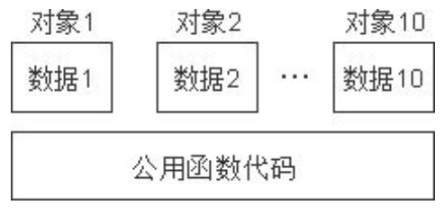

# C++面向对象模型初探


## 成员变量和函数的储存

- “数据”和“处理数据的操作(函数)”是分开存储的
- c++中的**非静态数据成员**直接内含在类对象中
- 成员函数(member function)不出现在对象中
- 每一个非内联成员函数(non-inline member function)只会诞生一份函数实例.


# 说到内联函数就要想到 宏


# `c++`的数据和操作也是分开存储
# 关于函数 多个同类型的对象会共用一块代码



# this 指针

- `This`指针指向被调用的成员函数所属的对象

# this指针永远指向当前对象。

# const 修饰成员函数

- 在函数括号后面加上const,修饰成员变量不可修改,除了mutable变量
- 函数`()`屁股后面, `{}`的前面, 加个`const`, 就只能改`mutable`修饰的成员变量


# const 修饰对象

- 只能访问const修饰的函数
```cpp

const Person person;

  //1\. 可访问数据成员

 cout << "Age:" << person.mAge << endl;

  //person.mAge = 300; //不可修改

 person.mID = 1001; //但是可以修改mutable修饰的成员变量

  //2\. 只能访问const修饰的函数

//  person.showPerson();

 person.changeTest1();

```
