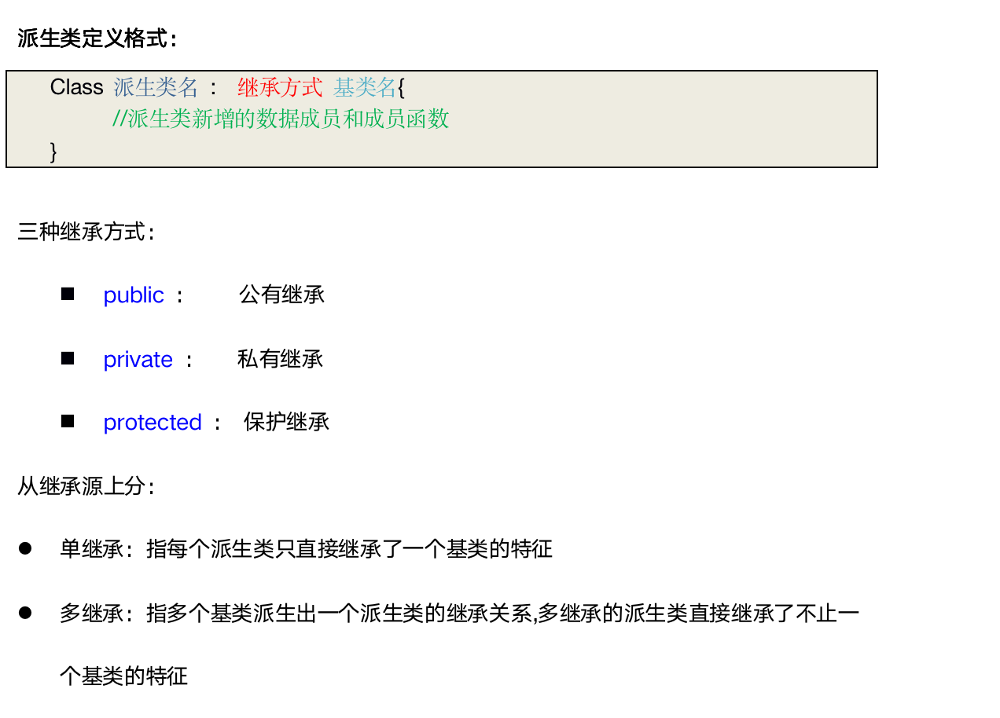
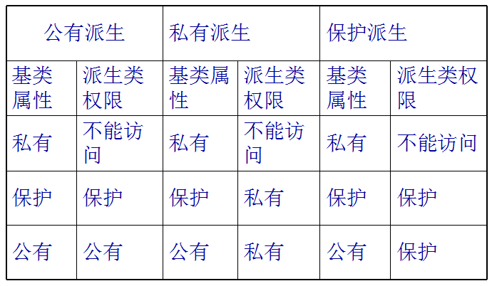

# 继承基本概念
没什么好说的, 和其他语言一样


# 派生类定义


```cpp

Class 派生类名: 继承方式 基类名
{
  // 派生类 新增的 数据成员 和 成员函数
}

```

三种继承方式:

- `public`:  公有继承
- `private`: 私有继承
- `protected`: 保护继承


从继承源上分:

- **单继承**: 值每个派生类, **只** 直接继承 了一个基类的特征
- **多继承**:  指`多个` 基类 派生出 一个派生类的 继承关系, 多继承的派生类 直接继承了不止一个基类的特征




# 派生类约等于子类
# 派生类访问控制

除了构造和析构之外的成员方法,其他的都拿过来




# 具体见代码

[代码](https://github.com/coderTong/cppStudy/blob/master/cppHellow/49%E7%BB%A7%E6%89%BF1/main.cpp)


