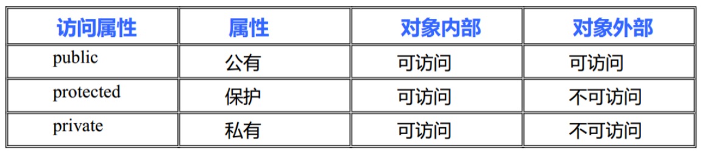

# 1. 基本概念

## c++语言struct 既有变量，也有函数

## struct 默认访问权限是public, 类默认是private

# 2. 构造函数

**构造函数函数名**`和类名相同`，没有`返回值`，不能有`void`，但可以`有参数`。

# 3 析构函数
析构函数函数名是在类名前面加”~”组成,没有返回值，不能有void,不能有参数，不能重载。

# //注意: 使用匿名对象初始化判断调用哪一个构造函数，要看匿名对象的参数类型 Person person06(Person(400)); //等价于 Person person06 = Person(400);

# qt不调用任何构造

# vs release、qt下没有调用拷贝构造函数
# vs debug下调用一次拷贝构造函数

#  构造函数调用规则

1. 默认: 无参构造和析构, 拷贝构造函数
2. 自己写拷贝, 产品`c++`毛都不给
3. 自己写普通构造函数, `c++`就不给无参, 但是会给拷贝

# explicit关键字 禁止构造函数隐式转换

# 动态对象创建

## 未初始化的对象是程序出错

# new operator

