# 数据类型

# 目录

1. [常量与变量](#cdata001)
2. [常量](#cdata002)
3. [变量](#cdata003)
4. [整型: int](#cdata004)
    1. [整型变量的定义和输出](#cdata004a) 
    2. [short、int、long、long long](#cdata004b) 
    3. [有符号数和无符号数区别](#cdata004c) 
5. [sizeof关键字](#cdata005)
6. [字符型：char](#cdata006)
    1. [字符变量的定义和输出](#cdata006a)
    2. [字符变量的输入](#cdata006b)
    3. [ASCII对照表](#cdata006c)
    4. [转义字符](#cdata006d)
     
7. [实型(浮点型)：float、double](#cdata007)
8. [进制](#cdata008)
    1. [二进制](#cdata008a) 
    2. [八进制](#cdata008b)
    3. [十六进制](#cdata008c)
    4. [C语言如何表示相应进制数](#cdata008d) 
     
     
9. [计算机内存数值存储方式](#cdata009)
    1. [原码](#cdata009a) 
    2. [反码](#cdata009b)
    3. [补码](#cdata009c) 
    4. [补码的意义](#cdata009d) 
    5. [数值溢出](#cdata009e) 
     
10. [类型限定符](#cdata010)
11. [字符串格式化输出和输入](#cdata011)
    1. [字符串常量](#cdata011a) 
    2. [printf函数和putchar函数](#cdata011b) 
    3. [scanf函数与getchar函数](#cdata011c) 


### cdata001
# 1. 常量与变量

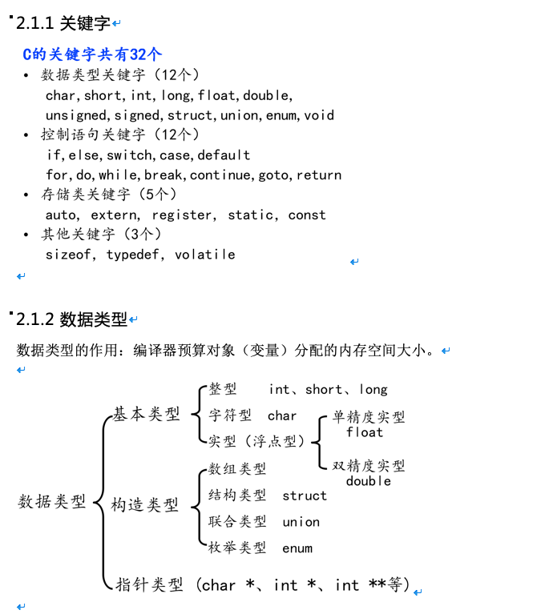


### cdata002
# 2. 常量

常量：
- 在程序运行过程中，其值不能被改变的量
- 常量一般出现在表达式或赋值语句中

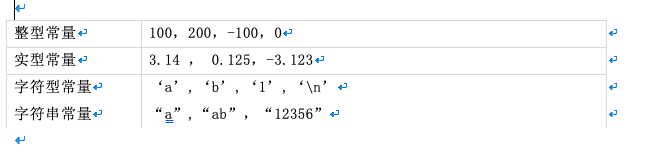


### cdata003
# 3. 变量

## 3.1 变量

变量
- 在程序运行过程中，其值可以改变
- `变量在使用前必须先定义，定义变量前必须有相应的数据类型`

标识符命名规则：

- 标识符不能是关键字
-  标识符只能由字母、数字、下划线组成
- 第一个字符必须为字母或下划线
- 标识符中字母区分大小写

变量特点：

- 变量在编译时为其分配相应的内存空间
- 可以通过其`名字`和`地址`访问相应内存


## 3.2 声明和定义区别

- 声明变量不需要建立存储空间，如：extern int a;
- 定义变量需要建立存储空间，如：int b;


```c

#include  <stdio.h>

int  main_()

{

  //extern 关键字只做声明，不能做任何定义，后面还会学习，这里先了解

  //声明一个变量a，a在这里没有建立存储空间

  extern  int  a;

  a = 10; //err, 没有空间，就不可以赋值

  int  b = 10; //定义一个变量b，b的类型为int，b赋值为10

  return 0;

}

```


从广义的角度来讲声明中包含着定义，即`定义是声明的一个特例`，所以并非所有的声明都是定义：

- `int b`  它既是声明，同时又是定义
- 对于 `extern b`来讲它只是声明不是定义

一般的情况下，把建立存储空间的声明称之为“`定义`”，而把不需要建立存储空间的声明称之为“`声明`”。


### cdata004
# 4. 整型: int

### cdata004a
## 4.1 整型变量的定义和输出

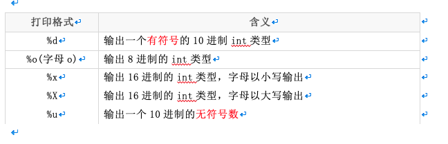


```c


#include <stdio.h>

int main()
{
	int a = 123;	//定义变量a，以10进制方式赋值为123
	int b = 0567;	//定义变量b，以8进制方式赋值为0567
	int c = 0xabc;	//定义变量c，以16进制方式赋值为0xabc

	printf("a = %d\n", a);
	printf("8进制：b = %o\n", b);
	printf("10进制：b = %d\n", b);
	printf("16进制：c = %x\n", c);
	printf("16进制：c = %X\n", c);
	printf("10进制：c = %d\n", c);

	unsigned int d = 0xffffffff; //定义无符号int变量d，以16进制方式赋值
	printf("有符号方式打印：d = %d\n", d);
	printf("无符号方式打印：d = %u\n", d);
	return 0;
}


```


### cdata004b
## 4.2 short、int、long、long long


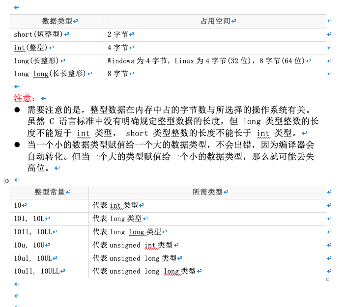

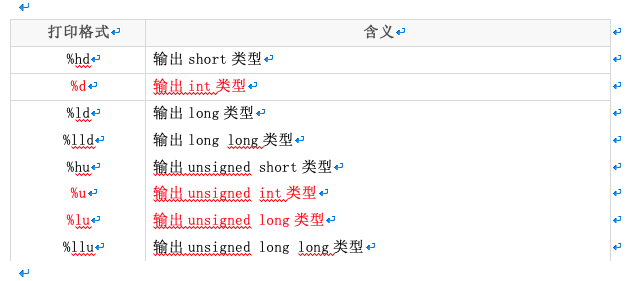

```c

#include <stdio.h>

int main()
{
	short a = 10;
	int b = 10;
	long c = 10l; //或者10L
	long long d = 10ll; //或者10LL

	printf("sizeof(a) = %u\n", sizeof(a));
	printf("sizeof(b) = %u\n", sizeof(b));
	printf("sizeof(c) = %u\n", sizeof(c));
	printf("sizeof(c) = %u\n", sizeof(d));

	printf("short a = %hd\n", a);
	printf("int b = %d\n", b);
	printf("long c = %ld\n", c);
	printf("long long d = %lld\n", d);

	unsigned short a2 = 20u;
	unsigned int b2 = 20u;
	unsigned long c2= 20ul; 
	unsigned long long d2 = 20ull; 

	printf("unsigned short a = %hu\n", a2);
	printf("unsigned int b = %u\n", b2);
	printf("unsigned long c = %lu\n", c2);
	printf("unsigned long long d = %llu\n", d2);

	return 0;
}


```


### cdata004c
## 4.3 有符号数和无符号数区别

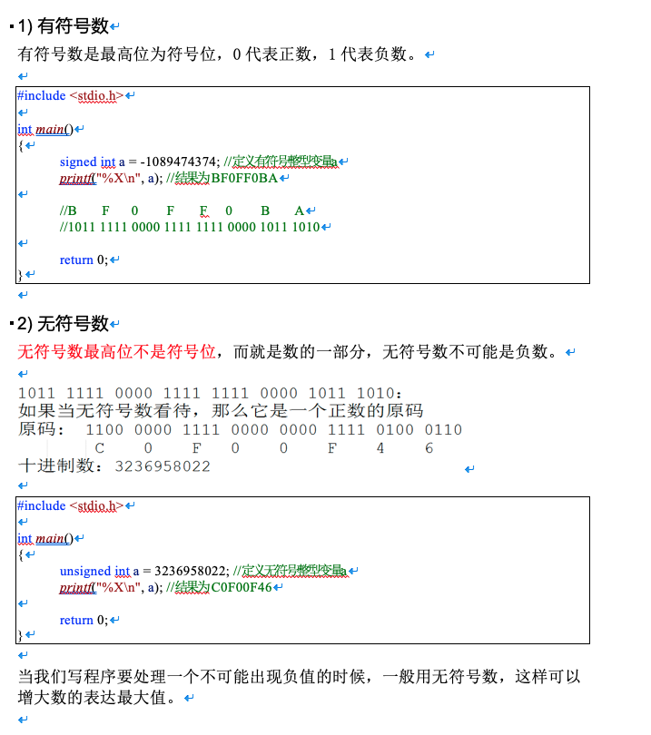
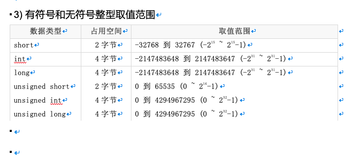


### cdata005
# 5. sizeof关键字

- sizeof`不是函数`，所以不需要包含任何头文件，它的功能是计算一个数据类型的大小，单位为字节
- sizeof的返回值为size_t
- size_t类型在32位操作系统下是unsigned int，是一个无符号的整数

```c

#include <stdio.h>

int main()
{
	int a;
	int b = sizeof(a);//sizeof得到指定值占用内存的大小，单位：字节
	printf("b = %d\n", b);

	size_t c = sizeof(a);
	printf("c = %u\n", c);//用无符号数的方式输出c的值

	return 0;
}


```


### cdata006
# 6. 字符型：char

### cdata006a
## 6.1 字符变量的定义和输出

- `字符型变量`用于存储一个单一字符，在 C 语言中用 char 表示，其中每个字符变量都会占用 `1 个字节`。在给字符型变量赋值时，需要用一对英文半角格式的单引号(' ')把字符括起来。

- `字符变量`实际上并不是把该字符本身放到变量的内存单元中去，而是将该字符对应的 ASCII 编码放到变量的存储单元中。`char的本质就是一个1字节大小的整型`。

```c

#include <stdio.h>

int main()
{
	char ch = 'a';
	printf("sizeof(ch) = %u\n", sizeof(ch));

	printf("ch[%%c] = %c\n", ch); //打印字符
	printf("ch[%%d] = %d\n", ch); //打印‘a’ ASCII的值

	char A = 'A';
	char a = 'a';
	printf("a = %d\n", a);		//97
	printf("A = %d\n", A);	//65

	printf("A = %c\n", 'a' - 32); //小写a转大写A
	printf("a = %c\n", 'A' + 32); //大写A转小写a

	ch = ' ';
	printf("空字符：%d\n", ch); //空字符ASCII的值为32
	printf("A = %c\n", 'a' - ' '); //小写a转大写A
	printf("a = %c\n", 'A' + ' '); //大写A转小写a

	return 0;
}


```


### cdata006b
## 6.2 字符变量的输入

```c

#include <stdio.h>

int main()
{
	char ch;
	printf("请输入ch的值：");

	//不要加“\n”
	scanf("%c", &ch);
	printf("ch = %c\n", ch); //打印ch的字符

	return 0;
}


```


### cdata006c
## 6.3 ASCII对照表

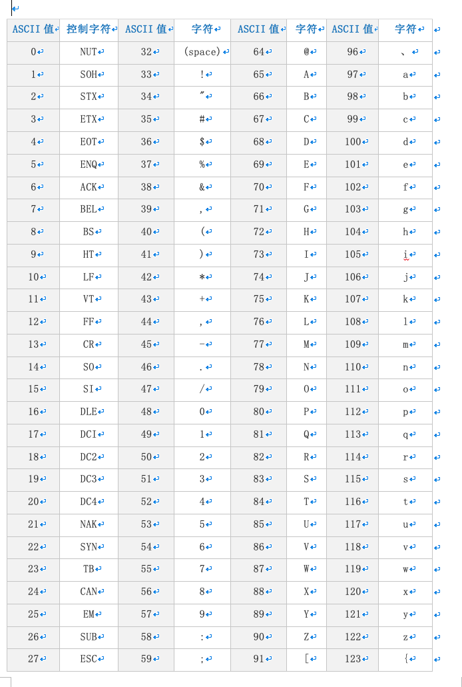

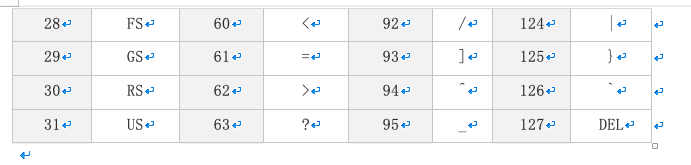


ASCII 码大致由以下两部分组成：

- ASCII 非打印控制字符： ASCII 表上的数字 0-31 分配给了控制字符，用于控制像打印机等一些外围设备。
- ASCII 打印字符：数字 32-126 分配给了能在键盘上找到的字符，当查看或打印文档时就会出现。数字 127 代表 Del 命令。


### cdata006d
## 6.4 转义字符

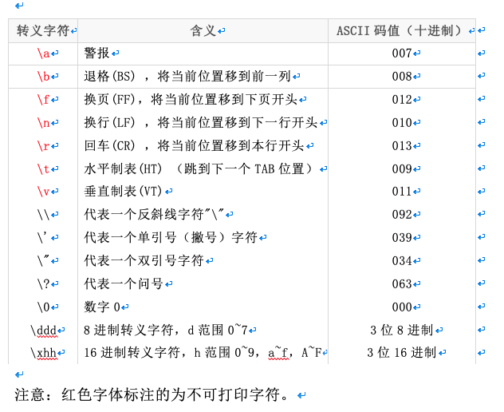

**注意：红色字体标注的为不可打印字符。**

```c

#include <stdio.h>

int main()
{
	printf("abc");
	printf("\refg\n"); //\r切换到句首， \n为换行键

	printf("abc");
	printf("\befg\n");//\b为退格键， \n为换行键

	printf("%d\n", '\123');// '\123'为8进制转义字符，0123对应10进制数为83
	printf("%d\n", '\x23');// '\x23'为16进制转义字符，0x23对应10进制数为35

	return 0;
}


```


### cdata007
# 7. 实型(浮点型)：float、double

- `实型变量`也可以称为`浮点型变量`，`浮点型变量`是用来存储`小数数值`的。在C语言中， 浮点型变量分为两种： `单精度浮点数(float)`、 `双精度浮点数(double)`， 但是double型变量所表示的浮点数比 float 型变量更精确。

- 由于浮点型变量是由有限的存储单元组成的，因此只能提供有限的有效数字。在有效位以外的数字将被舍去，这样可能会产生一些误差。

- 不以f结尾的常量是double类型，以f结尾的常量(如3.14f)是float类型。

```c

#include <stdio.h>

int main()
{
	//传统方式赋值
	float a = 3.14f; //或3.14F
	double b = 3.14;

	printf("a = %f\n", a);
	printf("b = %lf\n", b);

	//科学法赋值
	a = 3.2e3f; //3.2*1000 = 3200，e可以写E
	printf("a1 = %f\n", a);

	a = 100e-3f; //100*0.001 = 0.1
	printf("a2 = %f\n", a);

	a = 3.1415926f;
	printf("a3 = %f\n", a); //结果为3.141593

	return 0;
}


```


### cdata008
# 8. 进制

`进制`也就是`进位制`，是人们规定的一种进位方法。 对于任何一种进制—X进制，就表示某一位置上的数运算时是逢X进一位。 十进制是逢十进一，十六进制是逢十六进一，二进制就是逢二进一，以此类推，x进制就是逢x进位。

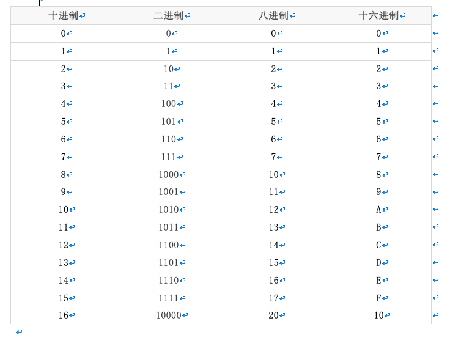


### cdata008a
## 8.1 二进制

二进制是计算技术中广泛采用的一种数制。二进制数据是用0和1两个数码来表示的数。它的基数为2，进位规则是“逢二进一”，借位规则是“借一当二”。

当前的计算机系统使用的基本上是二进制系统，`数据在计算机中主要是以补码的形式存储的`。

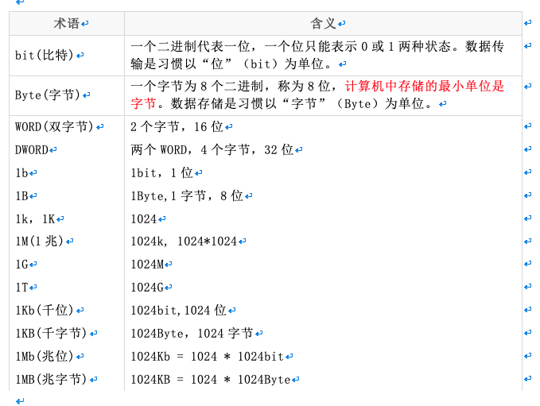

十进制转化二进制的方法：用十进制数除以2，分别取余数和商数，商数为0的时候，将余数倒着数就是转化后的结果。

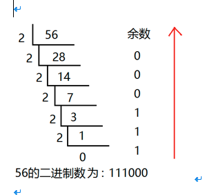

十进制的小数转换成二进制：小数部分和2相乘，取整数，不足1取0，`每次相乘都是小数部分`，顺序看取整后的数就是转化后的结果。

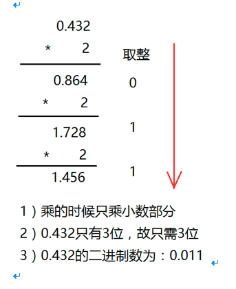

### cdata008b
## 8.2 八进制

八进制，Octal，缩写OCT或O，一种以8为基数的计数法，采用0，1，2，3，4，5，6，7八个数字，逢八进1。一些编程语言中常常以数字0开始表明该数字是八进制。

八进制的数和二进制数可以按位对应（**八进制一位对应二进制三位**），因此常应用在计算机语言中。

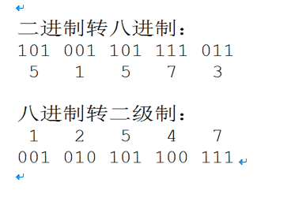

十进制转化八进制的方法：

用十进制数除以8，分别取余数和商数，商数为0的时候，将余数倒着数就是转化后的结果。


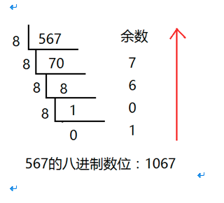


### cdata008c
## 8.3 十六进制

十六进制（英文名称：Hexadecimal），同我们日常生活中的表示法不一样，它由0-9，A-F组成，**字母不区分大小写**。与10进制的对应关系是：0-9对应0-9，A-F对应10-15。

十六进制的数和二进制数可以按位对应（**十六进制一位对应二进制四位**），因此常应用在计算机语言中。

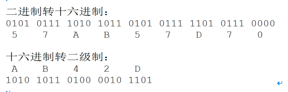

十进制转化十六进制的方法：

用十进制数除以16，分别取余数和商数，商数为0的时候，将余数倒着数就是转化后的结果。

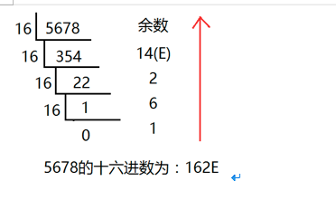


### cdata008d
## 8.4 C语言如何表示相应进制数

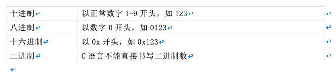

```c

#include <stdio.h>

int main()
{
	int a = 123;		//十进制方式赋值
	int b = 0123;		//八进制方式赋值， 以数字0开头
	int c = 0xABC;	//十六进制方式赋值

	//如果在printf中输出一个十进制数那么用%d，八进制用%o，十六进制是%x
	printf("十进制：%d\n",a );
	printf("八进制：%o\n", b);	//%o,为字母o,不是数字
	printf("十六进制：%x\n", c);

	return 0;
}


```


### cdata009
# 9. 计算机内存数值存储方式

### cdata009a
## 9.1 原码

一个数的原码(原始的二进制码)有如下特点：
- 最高位做为符号位，0表示正,为1表示负
- 其它数值部分就是数值本身绝对值的二进制数
- 负数的原码是在其绝对值的基础上，最高位变为1

下面数值以1字节的大小描述：

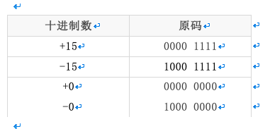

原码表示法简单易懂，与带符号数本身转换方便，只要符号还原即可，但当两个正数相减或不同符号数相加时，必须比较两个数哪个绝对值大，才能决定谁减谁，才能确定结果是正还是负，所以原码不便于加减运算。

### cdata009b
## 9.2 反码

- 对于正数，反码与原码相同
- 对于负数，符号位不变，其它部分取反(1变0,0变1)

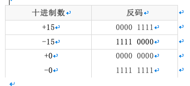

反码运算也不方便，通常用来作为求补码的中间过渡。

### cdata009c
## 9.3 补码

**在计算机系统中，数值一律用补码来存储。**

补码特点：
- 对于正数，原码、反码、补码相同
- 对于负数，其补码为它的反码加1
- 补码符号位不动，其他位求反，最后整个数加1，得到原码

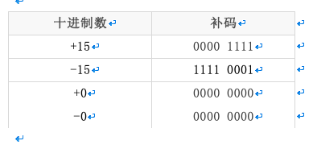

```c

#include <stdio.h>

int main()
{
	int  a = -15;

	printf("%x\n", a);
	//结果为 fffffff1
	//fffffff1对应的二进制：1111 1111 1111 1111 1111 1111 1111 0001
	//符号位不变，其它取反：1000 0000 0000 0000 0000 0000 0000 1110
	//上面加1：1000 0000 0000 0000 0000 0000 0000 1111  最高位1代表负数，就是-15

	return 0;
}


```


### cdata009d
## 9.4 补码的意义

示例1：用8位二进制数分别表示+0和-0

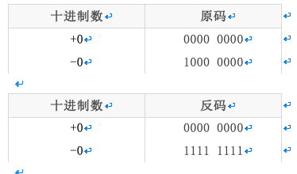

不管以原码方式存储，还是以反码方式存储，0也有两种表示形式。为什么同样一个0有两种不同的表示方法呢？

但是如果以补码方式存储，补码统一了零的编码：

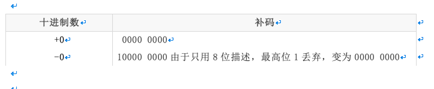

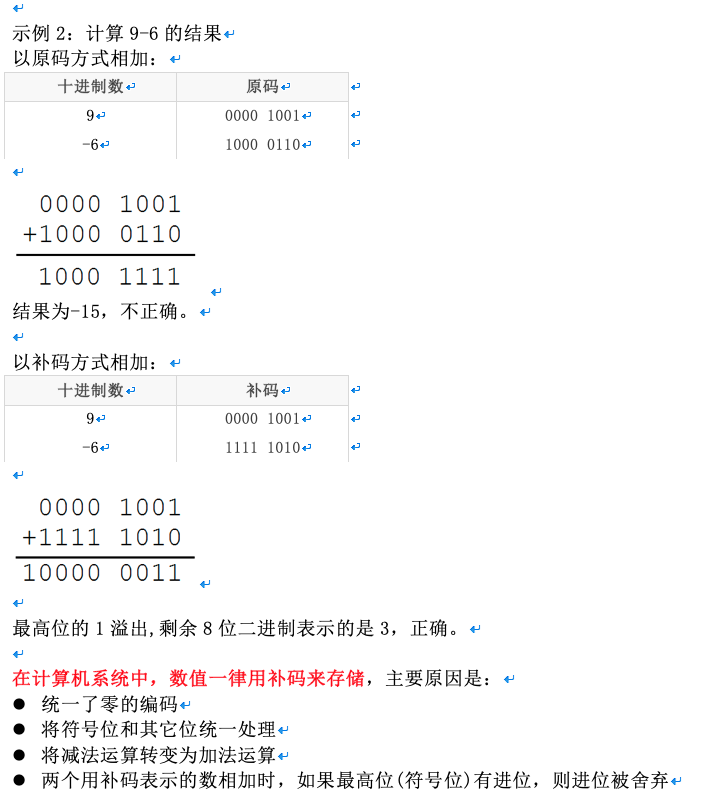

### cdata009e
## 9.5 数值溢出

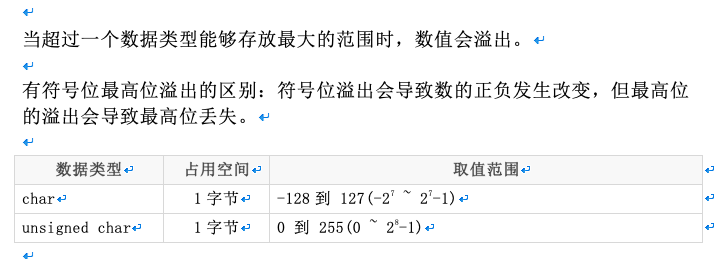

```c

#include <stdio.h>

int main()
{
	char ch;

	//符号位溢出会导致数的正负发生改变
	ch = 0x7f + 2; //127+2
	printf("%d\n", ch);
	//	0111 1111
	//+2后 1000 0001，这是负数补码，其原码为 1111 1111，结果为-127

	//最高位的溢出会导致最高位丢失
	unsigned char ch2;
	ch2 = 0xff+1; //255+1
	printf("%u\n", ch2);
	//	  1111 1111
	//+1后 10000 0000， char只有8位最高位的溢出，结果为0000 0000，十进制为0

	ch2 = 0xff + 2; //255+1
	printf("%u\n", ch2);
	//	  1111 1111
	//+1后 10000 0001， char只有8位最高位的溢出，结果为0000 0001，十进制为1

	return 0;
}


```


### cdata010
# 10. 类型限定符

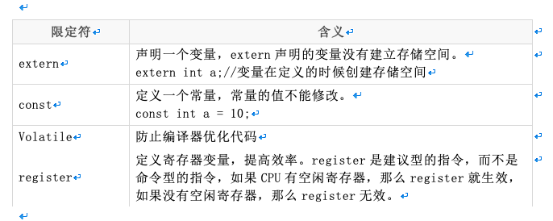


### cdata011
# 11. 字符串格式化输出和输入


### cdata011a
## 11.1 字符串常量

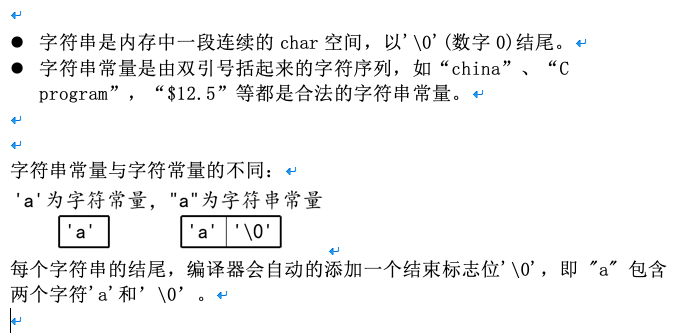


### cdata011b
## 11.2 printf函数和putchar函数

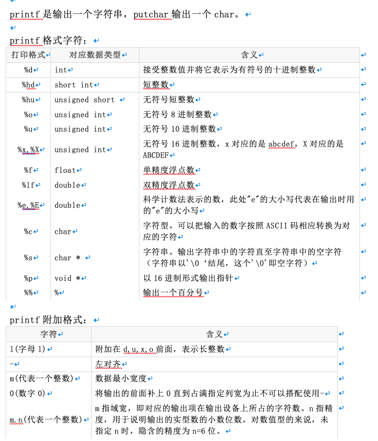

```c

#include <stdio.h>
int main()
{
	int a = 100;
	printf("a = %d\n", a);//格式化输出一个字符串
	printf("%p\n", &a);//输出变量a在内存中的地址编号
	printf("%%d\n");

	char c = 'a';
	putchar(c);//putchar只有一个参数，就是要输出的char
	long a2 = 100;
	printf("%ld, %lx, %lo\n", a2, a2, a2);

	long long a3 = 1000;
	printf("%lld, %llx, %llo\n", a3, a3, a3);

	int abc = 10;
	printf("abc = '%6d'\n", abc);
	printf("abc = '%-6d'\n", abc);
	printf("abc = '%06d'\n", abc);
	printf("abc = '%-06d'\n", abc);

	double d = 12.3;
	printf("d = \' %-10.3lf \'\n", d);

	return 0;
}


```


### cdata011c
## 11.3 scanf函数与getchar函数


- getchar是从标准输入设备读取一个char。

- scanf通过%转义的方式可以得到用户通过标准输入设备输入的数据。


```c

#include <stdio.h>

int main()
{
	char ch1;
	char ch2;
	char ch3;
	int a;
	int b;

	printf("请输入ch1的字符：");
	ch1 = getchar();
	printf("ch1 = %c\n", ch1);

	getchar(); //测试此处getchar()的作用

	printf("请输入ch2的字符：");
	ch2 = getchar();
	printf("\'ch2 = %ctest\'\n", ch2);

	getchar(); //测试此处getchar()的作用
	printf("请输入ch3的字符：");
	scanf("%c", &ch3);//这里第二个参数一定是变量的地址，而不是变量名
	printf("ch3 = %c\n", ch3);

	printf("请输入a的值：");
	scanf("%d", &a);
	printf("a = %d\n", a);

	printf("请输入b的值：");
	scanf("%d", &b);
	printf("b = %d\n", b);

	return 0;
}


```
