# c6指针

# 目录

1. [概述](#c6data01)
    1. [内存](#c6data01a)
    2. [物理存储器和存储地址空间](#c6data01b)
    3. [内存地址](#c6data01c)
    4. [指针和指针变量](#c6data01d)
2. [指针基础知识](#c6data02)
    1. [指针变量的定义和使用](#c6data02a)
    2. [通过指针间接修改变量的值](#c6data02b)
    3. [指针大小](#c6data02c)
    4. [野指针和空指针](#c6data02d)
    5. [万能指针void *](#c6data02e)
    6. [const修饰的指针变量](#c6data02f)
3. [指针和数组](#c6data03)
    1. [数组名](#c6data03a)
    2. [指针操作数组元素](#c6data03b)
    3. [指针加减运算](#c6data03c)
    4. [指针数组](#c6data03d)
     
4. [多级指针](#c6data04)
5. [指针和函数](#c6data05)
    1. [函数形参改变实参的值](#c6data05a) 
    2. [数组名做函数参数](#c6data05b) 
    3. [指针做为函数的返回值](#c6data05c) 
6. [指针和字符串](#c6data06)
    1. [字符指针](#c6data06a) 
    2. [字符指针做函数参数](#c6data06b)
    3. [const修饰的指针变量](#c6data06c) 
    4. [指针数组做为main函数的形参](#c6data06d) 
    5. [项目开发常用字符串应用模型](#c6data06e) 
    6. [字符串处理函数](#c6data06f) 
     
7. [指针小结](#c6data07)


### c6data01
# 1. 概述


### c6data01a
## 1.1 内存
内存含义：

- 存储器：计算机的组成中，用来存储程序和数据，辅助CPU进行运算处理的重要部分。

- 内存：内部存贮器，暂存程序/数据——掉电丢失 SRAM、DRAM、DDR、DDR2、DDR3。

- 外存：外部存储器，长时间保存程序/数据—掉电不丢ROM、ERRROM、FLASH（NAND、NOR）、硬盘、光盘。

内存是沟通CPU与硬盘的桥梁：

- 暂存放CPU中的运算数据

- 暂存与硬盘等外部存储器交换的数据


### c6data01b
## 1.2 物理存储器和存储地址空间


有关内存的两个概念：物理存储器和存储地址空间。

物理存储器：实际存在的具体存储器芯片。

- 主板上装插的内存条
- 显示卡上的显示RAM芯片
- 各种适配卡上的RAM芯片和ROM芯片

存储地址空间：对存储器编码的范围。我们在软件上常说的内存是指这一层含义。

- 编码：对每个物理存储单元（一个字节）分配一个号码
- 寻址：可以根据分配的号码找到相应的存储单元，完成数据的读写


### c6data01c
## 1.3 内存地址

- 将内存抽象成一个很大的一维字符数组。

- 编码就是对内存的每一个字节分配一个32位或64位的编号（与32位或者64位处理器相关）。

- 这个内存编号我们称之为内存地址。

- 内存中的每一个数据都会分配相应的地址：

- char:占一个字节分配一个地址

- int: 占四个字节分配四个地址

- float、struct、函数、数组等

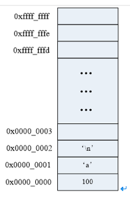


### c6data01d
## 1.4 指针和指针变量

- `内存区的每一个字节都有一个编号，这就是“地址”`。

- 如果在程序中定义了一个变量，在对程序进行编译或运行时，系统就会给这个变量分配内存单元，并确定它的内存地址(编号)

- 指针的实质就是内存“地址”。指针就是地址，地址就是指针。

- `指针是内存单元的编号，指针变量是存放地址的变量。`

- 通常我们叙述时会把指针变量简称为指针，实际他们含义并不一样。


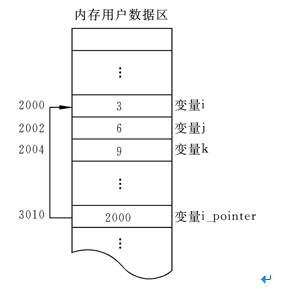


### c6data02
# 2. 指针基础知识


### c6data02a
## 2.1 指针变量的定义和使用


- 指针也是一种数据类型，指针变量也是一种变量

- 指针变量指向谁，就把谁的地址赋值给指针变量

- `“*”`操作符操作的是指针变量指向的内存空间


```c

#include <stdio.h>

int main()
{
	int a = 0;
	char b = 100;
	printf("%p, %p\n", &a, &b); //打印a, b的地址

	//int *代表是一种数据类型，int*指针类型，p才是变量名
	//定义了一个指针类型的变量，可以指向一个int类型变量的地址
	int *p;
	p = &a;//将a的地址赋值给变量p，p也是一个变量，值是一个内存地址编号
	printf("%d\n", *p);//p指向了a的地址，*p就是a的值

	char *p1 = &b;
	printf("%c\n", *p1);//*p1指向了b的地址，*p1就是b的值

	return 0;
}


```

注意：&可以取得一个变量在内存中的地址。但是，**不能取寄存器变量**，因为寄存器变量不在内存里，而在CPU里面，所以是没有地址的。


### c6data02b
## 2.2 通过指针间接修改变量的值

```c

	int a = 0;
	int b = 11;
	int *p = &a;

	*p = 100;
	printf("a = %d, *p = %d\n", a, *p);

	p = &b;
	*p = 22;
	printf("b = %d, *p = %d\n", b, *p);


```


### c6data02c
## 2.3 指针大小

- **使用sizeof()测量指针的大小，得到的总是：4或8**

- sizeof()测的是指针变量指向存储地址的大小

- 在32位平台，所有的指针（地址）都是32位(4字节)

- 在64位平台，所有的指针（地址）都是64位(8字节)


```c

	int *p1;
	int **p2;
	char *p3;
	char **p4;
	printf("sizeof(p1) = %d\n", sizeof(p1));
	printf("sizeof(p2) = %d\n", sizeof(p2));
	printf("sizeof(p3) = %d\n", sizeof(p3));
	printf("sizeof(p4) = %d\n", sizeof(p4));
	printf("sizeof(double *) = %d\n", sizeof(double *));


```

### c6data02d
## 2.4 野指针和空指针

指针变量也是变量，是变量就可以任意赋值，不要越界即可（32位为4字节，64位为8字节），但是，`任意数值赋值给指针变量没有意义，因为这样的指针就成了野指针`，此指针指向的区域是未知(操作系统不允许操作此指针指向的内存区域)。所以，`野指针不会直接引发错误，操作野指针指向的内存区域才会出问题。`


```c

	int a = 100;
	int *p;
	p = a; //把a的值赋值给指针变量p，p为野指针， ok，不会有问题，但没有意义

	p = 0x12345678; //给指针变量p赋值，p为野指针， ok，不会有问题，但没有意义

	*p = 1000;  //操作野指针指向未知区域，内存出问题，err


```


但是，野指针和有效指针变量保存的都是数值，为了标志此指针变量没有指向任何变量(空闲可用)，C语言中，可以把NULL赋值给此指针，这样就标志此指针为空指针，没有任何指针。

```c

int *p = NULL;

```

NULL是一个值为0的宏常量：


```c

#define NULL    ((void *)0)

```


### c6data02e
## 2.5 万能指针void *


void *指针可以指向任意变量的内存空间：


```c

	void *p = NULL;

	int a = 10;
	p = (void *)&a; //指向变量时，最好转换为void *

	//使用指针变量指向的内存时，转换为int *
	*( (int *)p ) = 11;
	printf("a = %d\n", a);


```


### c6data02f
## 2.6 const修饰的指针变量

```c

	int a = 100;
	int b = 200;

//指向常量的指针
	//修饰*，指针指向内存区域不能修改，指针指向可以变
	const int * p1 = &a; //等价于int const *p1 = &a;
	//*p1 = 111; //err
	p1 = &b; //ok

//指针常量
	//修饰p1，指针指向不能变，指针指向的内存可以修改
	int * const p2 = &a;
	//p2 = &b; //err
	*p2 = 222; //ok


```

`在编辑程序时，指针作为函数参数，如果不想修改指针对应内存空间的值，需要使用const修饰指针数据类型。`

### c6data03
# 3. 指针和数组

### c6data03a
## 3.1 数组名

数组名字是数组的首元素地址，但它是一个常量：


```c

	int a[] = { 1, 2, 3, 4, 5, 6, 7, 8, 9 };
	printf("a = %p\n", a);
	printf("&a[0] = %p\n", &a[0]);

	//a = 10; //err, 数组名只是常量，不能修改


```


### c6data03b
## 3.2 指针操作数组元素


```c

#include <stdio.h>

int  main()
{
	int a[] = { 1, 2, 3, 4, 5, 6, 7, 8, 9 };
	int i = 0;
	int n = sizeof(a) / sizeof(a[0]);
	
	for (i = 0; i < n; i++)
	{
		//printf("%d, ", a[i]);
		printf("%d, ", *(a+i));
	}
	printf("\n");

	int *p = a; //定义一个指针变量保存a的地址
	for (i = 0; i < n; i++)
	{
		p[i] = 2 * i;
	}

	for (i = 0; i < n; i++)
	{
		printf("%d, ", *(p + i));
	}
	printf("\n");


	return 0;
}


```


### c6data03c
## 3.3 指针加减运算

1. 加法运算
- 指针计算不是简单的整数相加
- 如果是一个int *，+1的结果是增加一个int的大小
- 如果是一个char *，+1的结果是增加一个char大小


```c

#include <stdio.h>

int main()
{
	int a;
	int *p = &a;
	printf("%d\n", p);
	p += 2;//移动了2个int
	printf("%d\n", p);

	char b = 0;
	char *p1 = &b;
	printf("%d\n", p1);
	p1 += 2;//移动了2个char
	printf("%d\n", p1);

	return 0;
}


```


通过改变指针指向操作数组元素：

```c

#include <stdio.h>

int main()
{
	int a[] = { 1, 2, 3, 4, 5, 6, 7, 8, 9 };
	int i = 0;
	int n = sizeof(a) / sizeof(a[0]);

	int *p = a;
	for (i = 0; i < n; i++)
	{
		printf("%d, ", *p);
		p++;
	}
	printf("\n");
	
	return 0;
}


```


2. 减法运算
示例1：

```c

#include <stdio.h>

int main()
{
	int a[] = { 1, 2, 3, 4, 5, 6, 7, 8, 9 };
	int i = 0;
	int n = sizeof(a) / sizeof(a[0]);

	int *p = a+n-1;
	for (i = 0; i < n; i++)
	{
		printf("%d, ", *p);
		p--;
	}
	printf("\n");

	return 0;
}


```


示例2：

```c

#include <stdio.h>

int main()
{
	int a[] = { 1, 2, 3, 4, 5, 6, 7, 8, 9 };
	int *p2 = &a[2]; //第2个元素地址
	int *p1 = &a[1]; //第1个元素地址
	printf("p1 = %p, p2 = %p\n", p1, p2);

	int n1 = p2 - p1; //n1 = 1
	int n2 = (int)p2 - (int)p1; //n2 = 4
	printf("n1 = %d, n2 = %d\n", n1, n2);
	
	return 0;
}


```


### c6data03d
## 3.4 指针数组

指针数组，它是数组，数组的每个元素都是指针类型。

```c

#include <stdio.h>

int main()
{
	//指针数组
	int *p[3];
	int a = 1;
	int b = 2;
	int c = 3;
	int i = 0;

	p[0] = &a;
	p[1] = &b;
	p[2] = &c;

	for (i = 0; i < sizeof(p) / sizeof(p[0]); i++ )
	{
		printf("%d, ", *(p[i]));
	}
	printf("\n");
	
	return 0;
}


```


### c6data04
# 4. 多级指针

- C语言允许有多级指针存在，在实际的程序中一级指针最常用，其次是二级指针。

- 二级指针就是指向一个一级指针变量地址的指针。

- 三级指针基本用不着，但考试会考。

```c

	int a = 10;
	int *p = &a; //一级指针
	*p = 100; //*p就是a

	int **q = &p;
	//*q就是p
	//**q就是a

	int ***t = &q;
	//*t就是q
	//**t就是p
	//***t就是a


```


### c6data05
# 5. 指针和函数

### c6data05a
## 5.1 函数形参改变实参的值

```c

#include <stdio.h>

void swap1(int x, int y)
{
	int tmp;
	tmp = x;
	x = y;
	y = tmp;
	printf("x = %d, y = %d\n", x, y);
}

void swap2(int *x, int *y)
{
	int tmp;
	tmp = *x;
	*x = *y;
	*y = tmp;
}

int main()
{
	int a = 3;
	int b = 5;
	swap1(a, b); //值传递
	printf("a = %d, b = %d\n", a, b);

	a = 3;
	b = 5;
	swap2(&a, &b); //地址传递
	printf("a2 = %d, b2 = %d\n", a, b);

	return 0;
}


```


### c6data05b
## 5.2 数组名做函数参数


数组名做函数参数，函数的形参会退化为指针：

```c


#include <stdio.h>

void printArrary(int *a, int n)
{
	int i = 0;
	for (i = 0; i < n; i++)
	{
		printf("%d, ", a[i]);
	}
	printf("\n");
}

int main()
{
	int a[] = { 1, 2, 3, 4, 5, 6, 7, 8, 9 };
	int n = sizeof(a) / sizeof(a[0]);

	//数组名做函数参数
	printArrary(a, n); 
	return 0;
}


```


### c6data05c
## 5.3 指针做为函数的返回值


```c

#include <stdio.h>

int a = 10;

int *getA()
{
	return &a;
}


int main()
{
	*( getA() ) = 111;
	printf("a = %d\n", a);

	return 0;
}


```


### c6data06
# 6. 指针和字符串

### c6data06a
## 6.1 字符指针


```c

#include <stdio.h>

int main()
{
	char str[] = "hello world";
	char *p = str;
	*p = 'm';
	p++;
	*p = 'i';
	printf("%s\n", str);

	p = "mike jiang";
	printf("%s\n", p);

	char *q = "test";
	printf("%s\n", q);

	return 0;
}


```


### c6data06b
## 6.2 字符指针做函数参数


```c

#include <stdio.h>

void mystrcat(char *dest, const char *src)
{
	int len1 = 0;
	int len2 = 0;
	while (dest[len1])
	{
		len1++;
	}
	while (src[len2])
	{
		len2++;
	}

	int i;
	for (i = 0; i < len2; i++)
	{
		dest[len1 + i] = src[i];
	}
}

int main()
{
	char dst[100] = "hello mike";
	char src[] = "123456";
	
	mystrcat(dst, src);
	printf("dst = %s\n", dst);

	return 0;
}


```


### c6data06c
## 6.3 const修饰的指针变量

```c

#include <stdio.h>
#include <stdlib.h>
#include <string.h>

int main(void)
{
	//const修饰一个变量为只读
	const int a = 10;
	//a = 100; //err

	//指针变量， 指针指向的内存， 2个不同概念
	char buf[] = "aklgjdlsgjlkds";

	//从左往右看，跳过类型，看修饰哪个字符
	//如果是*， 说明指针指向的内存不能改变
	//如果是指针变量，说明指针的指向不能改变，指针的值不能修改
	const char *p = buf;
	// 等价于上面 char const *p1 = buf;
	//p[1] = '2'; //err
	p = "agdlsjaglkdsajgl"; //ok

	char * const p2 = buf;
	p2[1] = '3';
	//p2 = "salkjgldsjaglk"; //err

	//p3为只读，指向不能变，指向的内存也不能变
	const char * const p3 = buf;

	return 0;
}


```


### c6data06d
## 6.4 指针数组做为main函数的形参

```c

int main(int argc, char *argv[]);


```

- main函数是操作系统调用的，第一个参数标明argc数组的成员数量，argv数组的每个成员都是char *类型
- argv是命令行参数的字符串数组
- argc代表命令行参数的数量，程序名字本身算一个参数

```c

#include <stdio.h>

//argc: 传参数的个数（包含可执行程序）
//argv：指针数组，指向输入的参数
int main(int argc, char *argv[])
{

	//指针数组，它是数组，每个元素都是指针
	char *a[] = { "aaaaaaa", "bbbbbbbbbb", "ccccccc" };
	int i = 0;

	printf("argc = %d\n", argc);
	for (i = 0; i < argc; i++)
	{
		printf("%s\n", argv[i]);
	}
	return 0;
}


```


### c6data06e
## 6.5 项目开发常用字符串应用模型

1. strstr中的while和do-while模型

利用strstr标准库函数找出一个字符串中substr出现的个数。

- a) while模型

```c

#include <stdio.h>
#include <stdlib.h>
#include <string.h>

int main(void)
{
	char *p = "11abcd111122abcd333abcd3322abcd3333322qqq";
	int n = 0;

	while ((p = strstr(p, "abcd")) != NULL)
	{
		//能进来，肯定有匹配的子串
		//重新设置起点位置
		p = p + strlen("abcd");
		n++;

		if (*p == 0) //如果到结束符
		{
			break;
		}

	}

	printf("n = %d\n", n);

	return 0;
}


```

- b) do-while模型

```c

#include <stdio.h>
#include <stdlib.h>
#include <string.h>

int main(void)
{
	char *p = "11abcd111122abcd333abcd3322abcd3333322qqq";
	int n = 0;

	do
	{
		p = strstr(p, "abcd");
		if (p != NULL)
		{
			n++; //累计个数

			//重新设置查找的起点
			p = p + strlen("abcd");

		}
		else //如果没有匹配的字符串，跳出循环
		{
			break;
		}
	} while (*p != 0); //如果没有到结尾

	printf("n = %d\n", n);
	return 0;
}


```


2. 两头堵模型

求非空字符串元素的个数


```c

#include <stdio.h>
#include <stdlib.h>
#include <string.h>
#include <ctype.h>

int fun(char *p, int *n)
{
	if (p == NULL || n == NULL)
	{
		return -1;
	}

	int begin = 0;
	int end = strlen(p) - 1;

	//从左边开始
	//如果当前字符为空，而且没有结束
	while (p[begin] == ' ' && p[begin] != 0)
	{
		begin++; //位置从右移动一位
	}

	//从右往左移动
	while (p[end] == ' ' && end > 0)
	{
		end--; //往左移动
	}

	if (end == 0)
	{
		return -2;
	}

	//非空元素个数
	*n = end - begin + 1;

	return 0;
}

int main(void)
{
	char *p = "      abcddsgadsgefg      ";
	int ret = 0;
	int n = 0;

	ret = fun(p, &n);
	if (ret != 0)
	{
		return ret;
	}
	printf("非空字符串元素个数：%d\n", n);

	return 0;
}


```


3. 字符串反转模型(逆置)

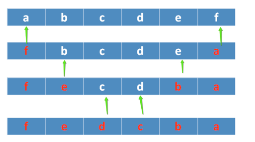

```c

#include <stdio.h>
#include <stdlib.h>
#include <string.h>

int inverse(char *p)
{
	if (p == NULL)
	{
		return -1;
	}
	char *str = p;
	int begin = 0;
	int end = strlen(str) - 1;
	char tmp;

	while (begin < end)
	{
		//交换元素
		tmp = str[begin];
		str[begin] = str[end];
		str[end] = tmp;

		begin++;  //往右移动位置
		end--;	    //往左移动位置
	}

	return 0;
}

int main(void)
{
	//char *str = "abcdefg"; //文件常量区，内容不允许修改
	char str[] = "abcdef";

	int ret = inverse(str);
	if (ret != 0)
	{
		return ret;
	}

	printf("str ========== %s\n", str);
	return 0;
}


```


### c6data06f
## 6.6 字符串处理函数

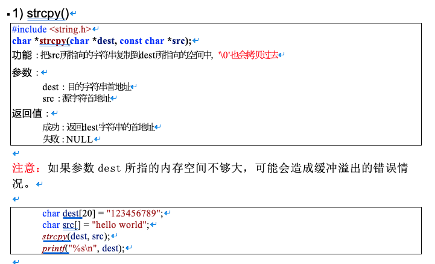
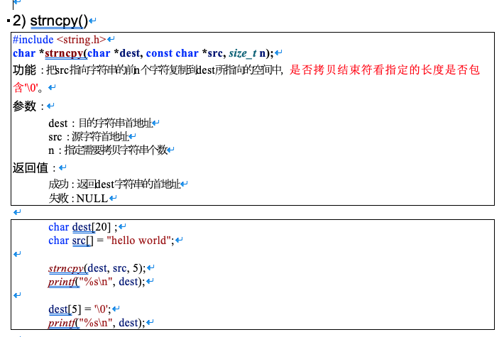
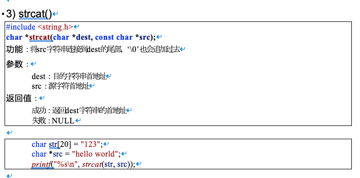
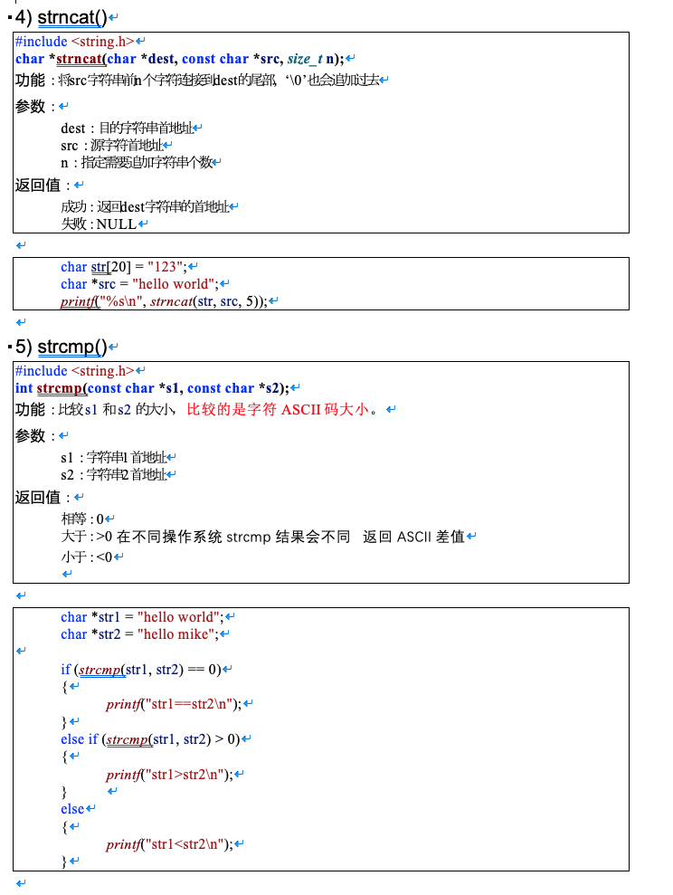
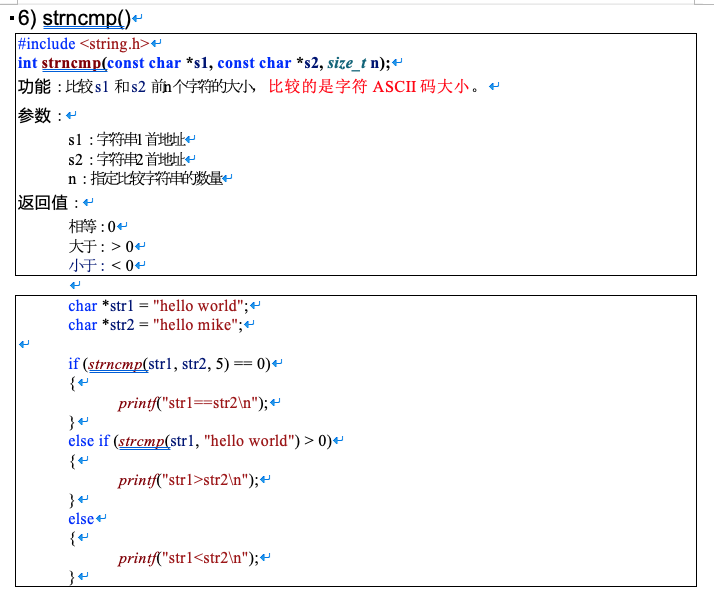
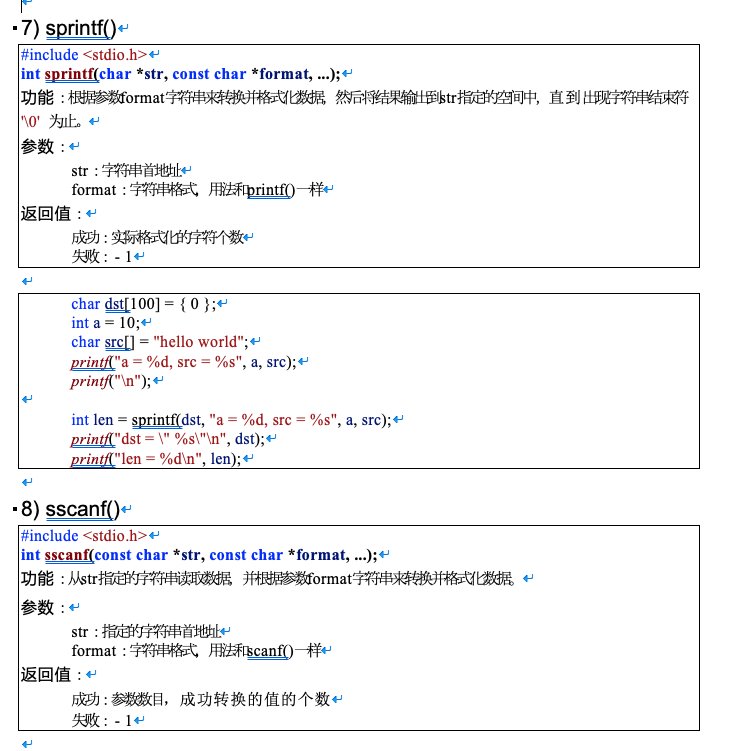
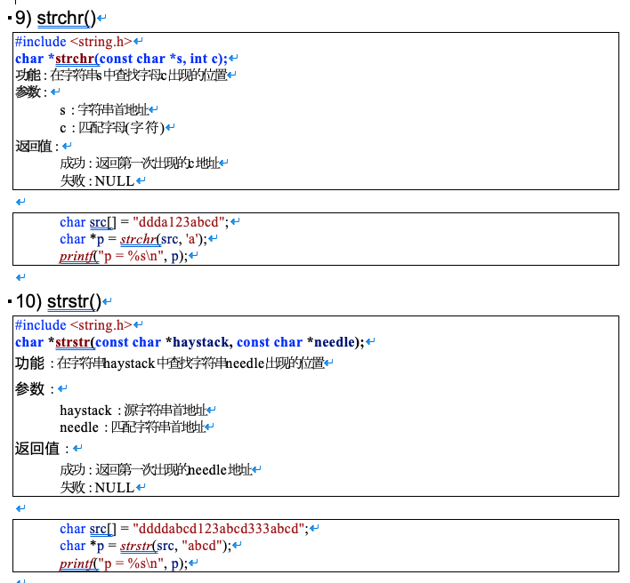

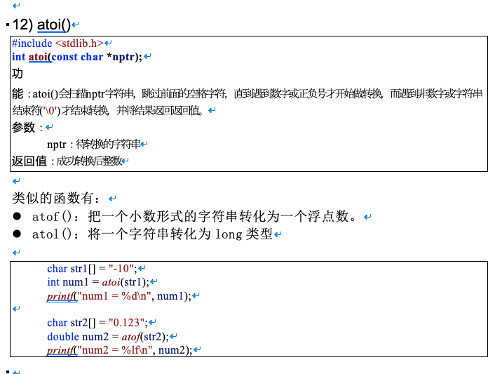


### c6data07
# 7. 指针小结


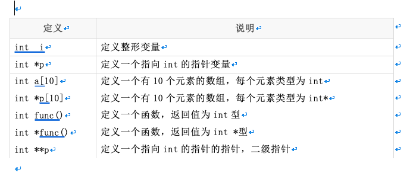

