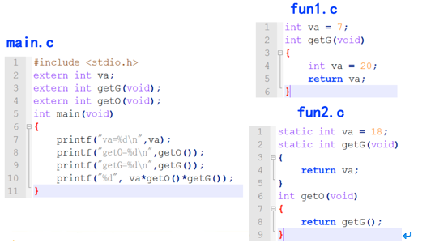
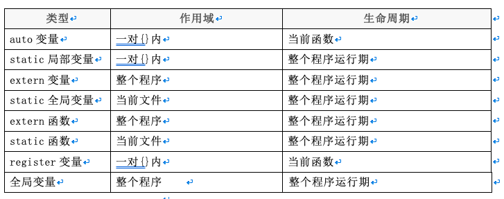
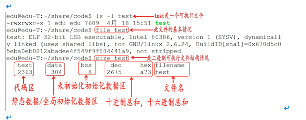
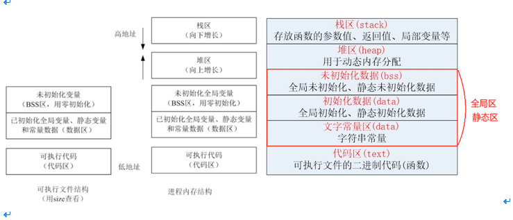
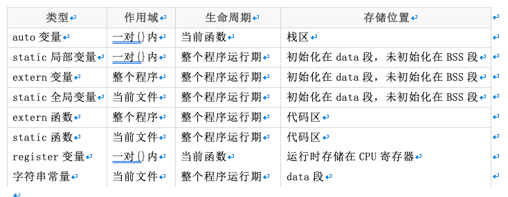
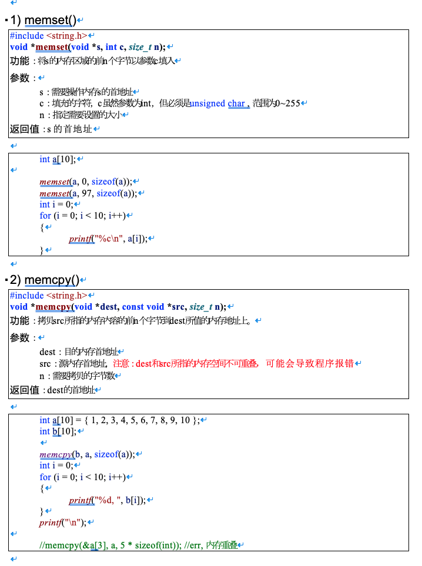
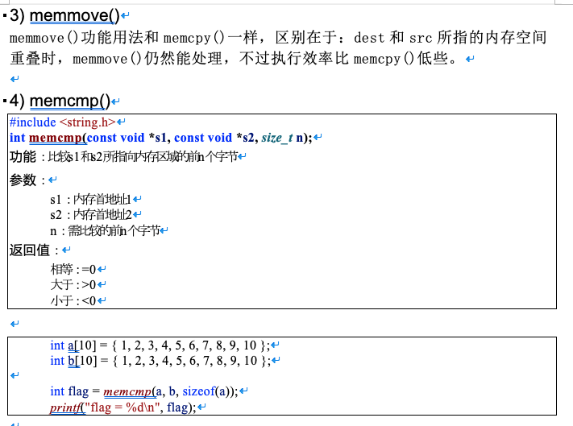
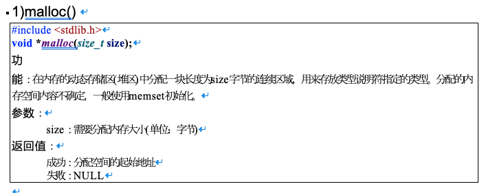
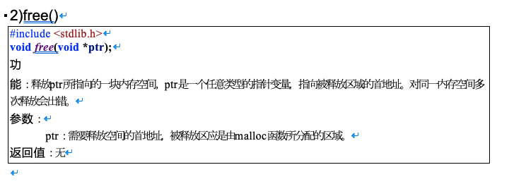

# 内存管理

# 目录

1. [作用域](#c7data01)
    1. [局部变量](#c7data01a)
    2. [静态(static)局部变量](#c7data01b)
    3. [全局变量](#c7data01c)
    4. [静态(static)全局变量](#c7data01d)
    5. [extern全局变量声明](#c7data01e)
    6. [全局函数和静态函数](#c7data01f)
    7. [总结](#c7data01g)
2. [内存布局](#c7data02)
    1. [内存分区](#c7data02a)
    2. [存储类型总结](#c7data02b)
    3. [内存操作函数](#c7data02c)
        1. [memset](#c7data02c1)
        2. [memcpy](#c7data02c2)
        3. [memmove()](#c7data02c3)
        4. [memcmp](#c7data02c4)
    4. [堆区内存分配和释放](#c7data02d)
        1. [malloc](#c7data02d1)
        2. [free](#c7data02d2)
3. [内存分区代码分析](#c7data03)
    1. [返回栈区地址](#c7data03a) 
    2. [返回data区地址](#c7data03b) 
    3. [值传递1](#c7data03c) 
    4. [值传递2](#c7data03d) 
    5. [返回堆区地址](#c7data03e) 


### c7data01
# 1. 作用域

### c7data01a
## 1.1 局部变量

局部变量也叫auto自动变量(auto可写可不写)，一般情况下代码块{}内部定义的变量都是自动变量，它有如下特点：

- 在一个函数内定义，只在函数范围内有效

- 在复合语句中定义，只在复合语句中有效

- `随着函数调用的结束或复合语句的结束局部变量的声明声明周期也结束`

- 如果没有赋初值，内容为随机


```c

#include <stdio.h>

void test()
{
	//auto写不写是一样的
	//auto只能出现在{}内部
	auto int b = 10; 
}

int main(void)
{
	//b = 100; //err， 在main作用域中没有b

	if (1)
	{
		//在复合语句中定义，只在复合语句中有效
		int a = 10;
		printf("a = %d\n", a);
	}

	//a = 10; //err离开if()的复合语句，a已经不存在
	
	return 0;
}


```

### c7data01b
## 1.2 静态(static)局部变量

- static局部变量的作用域也是在定义的函数内有效

- static局部变量的生命周期和程序运行周期一样，同时staitc局部变量的值`只初始化一次，但可以赋值多次`

- static局部变量若未赋以初值，则由系统自动赋值：数值型变量自动赋初值0，字符型变量赋空字符


```c

#include <stdio.h>

void fun1()
{
	int i = 0;
	i++;
	printf("i = %d\n", i);
}

void fun2()
{
	//静态局部变量，没有赋值，系统赋值为0，而且只会初始化一次
	static int a;
	a++;
	printf("a = %d\n", a);
}

int main(void)
{
	fun1();
	fun1();
	fun2();
	fun2();
	
	return 0;
}


```

### c7data01c
## 1.3 全局变量

- 在函数外定义，可被本文件及其它文件中的函数所共用，若其它文件中的函数调用此变量,须用extern声明

- 全局变量的生命周期和程序运行周期一样

- 不同文件的全局变量不可重名

### c7data01d
## 1.4 静态(static)全局变量

- 在函数外定义,作用范围被限制在所定义的文件中

- 不同文件静态全局变量可以重名,但作用域不冲突

- static全局变量的生命周期和程序运行周期一样，同时staitc全局变量的值只初始化一次

### c7data01e
## 1.5 extern全局变量声明

`extern int a;`声明一个变量，这个全局变量在别的文件中已经定义了，这里只是声明，而不是定义。


### c7data01f
## 1.6 全局函数和静态函数

- 在C语言中函数默认都是全局的，使用关键字`static`可以将函数声明为静态，函数定义为`static`就意味着这个函数只能在定义这个函数的文件中使用，在其他文件中不能调用，即使在其他文件中声明这个函数都没用。

- 对于不同文件中的`staitc`函数名字可以相同。



**注意：**

- 允许在不同的函数中使用相同的变量名，它们代表不同的对象，分配不同的单元，互不干扰。

- 同一源文件中,允许全局变量和局部变量同名，在局部变量的作用域内，全局变量不起作用。

- 所有的函数默认都是全局的，意味着所有的函数都不能重名，但如果是staitc函数，那么作用域是文件级的，所以不同的文件static函数名是可以相同的。

### c7data01g
## 1.7 总结



### c7data02
# 2. 内存布局


### c7data02a
## 2.1 内存分区

C代码经过`预处理`、`编译`、`汇编`、`链接`4步后生成一个可执行程序。

在 Windows 下，程序是一个普通的可执行文件，以下列出一个二进制可执行文件的基本情况：



通过上图可以得知，在没有运行程序前，也就是说`程序没有加载到内存前`，可执行程序内部已经分好3段信息，分别为`代码区（text）`、`数据区（data）`和`未初始化数据区（bss）`3 个部分（有些人直接把data和bss合起来叫做静态区或全局区）。

1. 代码区

- 存放 CPU 执行的机器指令。通常代码区是可共享的（即另外的执行程序可以调用它），使其可共享的目的是对于频繁被执行的程序，只需要在内存中有一份代码即可。`代码区通常是只读的`，使其只读的原因是防止程序意外地修改了它的指令。另外，代码区还规划了局部变量的相关信息。

2. 全局初始化数据区/静态数据区（data段）

- 该区包含了在程序中明确被初始化的全局变量、已经初始化的静态变量（包括全局静态变量和局部静态变量）和常量数据（如字符串常量）。

3. 未初始化数据区（又叫 bss  区）

- 存入的是全局未初始化变量和未初始化静态变量。未初始化数据区的数据在程序开始执行之前被内核初始化为 0 或者空（NULL）。

程序在加载到内存前，`代码区和全局区(data和bss)的大小就是固定的`，程序运行期间不能改变。然后，运行可执行程序，系统把程序加载到内存，`除了根据可执行程序的信息分出代码区（text）、数据区（data）和未初始化数据区（bss）之外，还额外增加了栈区、堆区。`




1. 代码区（text segment）

- 加载的是可执行文件代码段，所有的可执行代码都加载到代码区，这块内存是不可以在运行期间修改的。

2. 未初始化数据区（BSS）

- 加载的是可执行文件BSS段，位置可以分开亦可以紧靠数据段，存储于数据段的数据（全局未初始化，静态未初始化数据）的生存周期为整个程序运行过程。

3. 全局初始化数据区/静态数据区（data segment）

- 加载的是可执行文件数据段，存储于数据段（全局初始化，静态初始化数据，文字常量(只读)）的数据的生存周期为整个程序运行过程。

4. 栈区（stack）

- 栈是一种先进后出的内存结构，由编译器自动分配释放，存放函数的参数值、返回值、局部变量等。在程序运行过程中实时加载和释放，因此，局部变量的生存周期为申请到释放该段栈空间。

5. 堆区（heap）

- 堆是一个大容器，它的容量要远远大于栈，但没有栈那样先进后出的顺序。用于动态内存分配。堆在内存中位于BSS区和栈区之间。一般由程序员分配和释放，若程序员不释放，程序结束时由操作系统回收。

### c7data02b
## 2.2 存储类型总结



```c

#include <stdio.h>
#include <stdlib.h>

int e;
static int f;
int g = 10;
static int h = 10;
int main()
{
	int a;
	int b = 10;
	static int c;
	static int d = 10;
	char *i = "test";
	char *k = NULL;

	printf("&a\t %p\t //局部未初始化变量\n", &a);
	printf("&b\t %p\t //局部初始化变量\n", &b);

	printf("&c\t %p\t //静态局部未初始化变量\n", &c);
	printf("&d\t %p\t //静态局部初始化变量\n", &d);

	printf("&e\t %p\t //全局未初始化变量\n", &e);
	printf("&f\t %p\t //全局静态未初始化变量\n", &f);

	printf("&g\t %p\t //全局初始化变量\n", &g);
	printf("&h\t %p\t //全局静态初始化变量\n", &h);

	printf("i\t %p\t //只读数据(文字常量区)\n", i);

	k = (char *)malloc(10);
	printf("k\t %p\t //动态分配的内存\n", k);

	return 0;
}


```


### c7data02c
## 2.3 内存操作函数



### c7data02c1
### 2.3.1 memset

**你给具体的内容**

```c

#include <string.h>
void *memset(void *s, int c, size_t n);
功能：将s的内存区域的前n个字节以参数c填入
参数：
	s：需要操作内存s的首地址
	c：填充的字符，c虽然参数为int，但必须是unsigned char , 范围为0~255
	n：指定需要设置的大小
返回值：s的首地址


```

```c

	int a[10];

	memset(a, 0, sizeof(a));
	memset(a, 97, sizeof(a));
	int i = 0;
	for (i = 0; i < 10; i++)
	{
		printf("%c\n", a[i]);
	}


```
### c7data02c2
### 2.3.2 memcpy


**把第二的东西复制到第一个, 具体复制多少, 是第三参数 , 第三个参数说的是复制第二的前多少个字节**

**从哪里个那里拿, 拿多少**

```c

#include <string.h>

void *memcpy(void *dest, const void *src, size_t n);

功能：拷贝src所指的内存内容的前n个字节到dest所值的内存地址上。

参数：

  dest：目的内存首地址

  src：源内存首地址，注意：dest和src所指的内存空间不可重叠，可能会导致程序报错

  n：需要拷贝的字节数

返回值：dest的首地址

```

```c

int a[10] = { 1, 2, 3, 4, 5, 6, 7, 8, 9, 10 };

int b[10];

memcpy(b, a, sizeof(a));

int i = 0;

for (i = 0; i < 10; i++)

{

 printf("%d, ", b[i]);

}

printf("\n");

//memcpy(&a[3], a, 5 * sizeof(int)); //err, 内存重叠

```


### c7data02c3
### 2.3.3 memmove()

`memmove()`功能用法和`memcpy()`一样，区别在于：`dest`和`src`所指的内存空间重叠时，`memmove()`仍然能处理，不过执行效率比`memcpy()`低些。


### c7data02c4
### 2.3.4 memcmp

```c

#include <string.h>

int memcmp(const void *s1, const void *s2, size_t n);

功能：比较s1和s2所指向内存区域的前n个字节

参数：

  s1：内存首地址1

  s2：内存首地址2

  n：需比较的前n个字节

返回值：

 相等：=0

 大于：>0

 小于：<0

```

```c

int a[10] = { 1, 2, 3, 4, 5, 6, 7, 8, 9, 10 };

int b[10] = { 1, 2, 3, 4, 5, 6, 7, 8, 9, 10 };

int flag = memcmp(a, b, sizeof(a));

printf("flag = %d\n", flag);

```


### c7data02d
## 2.4 堆区内存分配和释放

### c7data02d1
### 2.4.1 malloc

```c

#include <stdlib.h>

void *malloc(size_t size);

功能：在内存的动态存储区(堆区)中分配一块长度为size字节的连续区域，用来存放类型说明符指定的类型。分配的内存空间内容不确定，一般使用memset初始化。

参数：

  size：需要分配内存大小(单位：字节)

返回值：

成功：分配空间的起始地址

失败：NULL

```



```c

#include <stdlib.h> 
#include <stdio.h>
#include <string.h>

int main()
{
	int count, *array, n;
	printf("请输入要申请数组的个数:\n");
	scanf("%d", &n);

	array = (int *)malloc(n * sizeof (int));
	if (array == NULL)
	{
		printf("申请空间失败!\n");
		return -1;
	}
	//将申请到空间清0
	memset(array, 0, sizeof(int)*n);

	for (count = 0; count < n; count++) /*给数组赋值*/
		array[count] = count;

	for (count = 0; count < n; count++) /*打印数组元素*/
		printf("%2d", array[count]);

	free(array);

	return 0;
}


```

### c7data02d2
### 2.4.2 free


```c

#include <stdlib.h>

void free(void *ptr);

功能：释放ptr所指向的一块内存空间，ptr是一个任意类型的指针变量，指向被释放区域的首地址。对同一内存空间多次释放会出错。

参数：

ptr：需要释放空间的首地址，被释放区应是由malloc函数所分配的区域。

返回值：无

```


### c7data03
# 3. 内存分区代码分析


### c7data03a
## 3.1 返回栈区地址

```c

int *fun6()

{

 int a = 10;

  return &a;//函数调用完毕，a释放

}

void  fun6a()

{

 int *p = NULL;

 p = fun6();

 /**

  1\. 操作野指针指向的内存,err,

  2\. 但是xcode中不报错

  2020年08月03日22:59:55

  3\. 我在centos 中测试也是没有报错, 难道只有Windows平台会报错????

     */

 *p = 100;

 printf("%d", *p);

}


```


### c7data03b
## 3.2 返回data区地址

```c

#include <stdio.h>

int *fun()
{
	static int a = 10;
	return &a; //函数调用完毕，a不释放
}

int main(int argc, char *argv[])
{
	int *p = NULL;
	p = fun();
	*p = 100; //ok
	printf("*p = %d\n", *p);

	return 0;
}


```


### c7data03c
## 3.3 值传递1

```c

#include <stdio.h>
#include <stdlib.h>

void fun(int *tmp)
{
	tmp = (int *)malloc(sizeof(int));
	*tmp = 100;
}

int main(int argc, char *argv[])
{
	int *p = NULL;
	fun(p); //值传递，形参修改不会影响实参
	printf("*p = %d\n", *p);//err，操作空指针指向的内存

	return 0;
}


```


### c7data03d
## 3.4 值传递2


```c

#include <stdio.h>
#include <stdlib.h>

void fun(int *tmp)
{
	*tmp = 100;
}

int main(int argc, char *argv[])
{
	int *p = NULL;
	p = (int *)malloc(sizeof(int));

	fun(p); //值传递
	printf("*p = %d\n", *p); //ok，*p为100

	return 0;
}


```


### c7data03e
## 3.5 返回堆区地址


```c

#include  <stdio.h>

#include  <stdlib.h>

int *fun()

{

  int *tmp = NULL;

 tmp = (int *)malloc(sizeof(int));

 *tmp = 100;

  return tmp;//返回堆区地址，函数调用完毕，不释放

}

int main(int  argc, char *argv[])

{

  int *p = NULL;

 p = fun();

 printf("*p = %d\n", *p);//ok

  //堆区空间，使用完毕，手动释放

  if (p != NULL)

 {

 free(p);

  p = NULL;

 }

  return 0;

}

```
