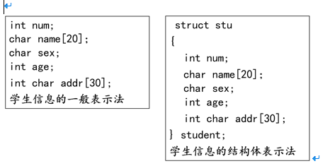
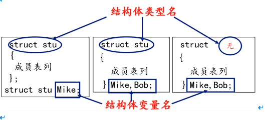

# 复合类型(自定义类型)


# 目录

1. [结构体](#c8data01)
    1. [概述](#c8data01a) 
    2. [结构体变量的定义和初始化](#c8data01b)
    3. [结构体成员的使用](#c8data01c)
    4. [结构体数组](#c8data01d)
    5. [结构体套结构体](#c8data01e)
    6. [结构体赋值](#c8data01f)
    7. [结构体和指针](#c8data01g)
    8. [ 结构体做函数参数](#c8data01h)
2. [共用体(联合体)](#c8data02)
3. [枚举](#c8data03)
4. [typedef](#c8data04)


### c8data01
# 1. 结构体


### c8data01a
## 1.1 概述


- `数组`：描述一组具有相同类型数据的有序集合，用于处理大量相同类型的数据运算。

- 有时我们需要将不同类型的数据组合成一个有机的整体，如：一个学生有学号/姓名/性别/年龄/地址等属性。显然单独定义以上变量比较繁琐，数据不便于管理。

- Ｃ语言中给出了另一种构造数据类型——结构体。



### c8data01b
## 1.2 结构体变量的定义和初始化

定义结构体变量的方式：

- 先声明结构体类型再定义变量名

- 在声明类型的同时定义变量

- 直接定义结构体类型变量（无类型名）




结构体类型和结构体变量关系：

- `结构体类型`：指定了一个结构体类型，它相当于一个模型，但其中并无具体数据，系统对之也不分配实际内存单元。

- `结构体变量`：系统根据结构体类型（内部成员状况）为之分配空间。


```c

//结构体类型的定义
struct stu
{
	char name[50];
	int age;
};

//先定义类型，再定义变量（常用）
struct stu s1 = { "mike", 18 };


//定义类型同时定义变量
struct stu2
{
	char name[50];
	int age;
}s2 = { "lily", 22 };

struct
{
	char name[50];
	int age;
}s3 = { "yuri", 25 };


```


### c8data01c
## 1.3 结构体成员的使用


```c

#include<stdio.h>
#include<string.h>

//结构体类型的定义
struct stu
{
	char name[50];
	int age;
};

int main()
{
	struct stu s1;

	//如果是普通变量，通过点运算符操作结构体成员
	strcpy(s1.name, "abc");
	s1.age = 18;
	printf("s1.name = %s, s1.age = %d\n", s1.name, s1.age);

	//如果是指针变量，通过->操作结构体成员
	strcpy((&s1)->name, "test");
	(&s1)->age = 22;
	printf("(&s1)->name = %s, (&s1)->age = %d\n", (&s1)->name, (&s1)->age);

	return 0;
}


```


### c8data01d
## 1.4 结构体数组


```c

#include <stdio.h>

//统计学生成绩
struct stu
{
	int num;
	char name[20];
	char sex;
	float score;
};

int main()
{
	//定义一个含有5个元素的结构体数组并将其初始化
	struct stu boy[5] = {
		{ 101, "Li ping", 'M', 45 },			
		{ 102, "Zhang ping", 'M', 62.5 },
		{ 103, "He fang", 'F', 92.5 },
		{ 104, "Cheng ling", 'F', 87 },
		{ 105, "Wang ming", 'M', 58 }};

	int i = 0;
	int c = 0;
	float ave, s = 0;
	for (i = 0; i < 5; i++)
	{
		s += boy[i].score;	//计算总分
		if (boy[i].score < 60)
		{
			c += 1;		//统计不及格人的分数
		}
	}

	printf("s=%f\n", s);//打印总分数
	ave = s / 5;					//计算平均分数
	printf("average=%f\ncount=%d\n\n", ave, c); //打印平均分与不及格人数


	for (i = 0; i < 5; i++)
	{
		printf(" name=%s,  score=%f\n", boy[i].name, boy[i].score);
           // printf(" name=%s,  score=%f\n", (boy+i)->name, (boy+i)->score);

	}

	return 0;
}


```


### c8data01e
## 1.5 结构体套结构体


```c

#include <stdio.h>

struct person
{
	char name[20];
	char sex;
};

struct stu
{
	int id;
	struct person info;
};

int main()
{
	struct stu s[2] = { 1, "lily", 'F', 2, "yuri", 'M' };

	int i = 0;
	for (i = 0; i < 2; i++)
	{
		printf("id = %d\tinfo.name=%s\tinfo.sex=%c\n", s[i].id, s[i].info.name, s[i].info.sex);
	}

	return 0;
}


```


### c8data01f
## 1.6 结构体赋值


```c

#include<stdio.h>
#include<string.h>

//结构体类型的定义
struct stu
{
	char name[50];
	int age;
};

int main()
{
	struct stu s1;

	//如果是普通变量，通过点运算符操作结构体成员
	strcpy(s1.name, "abc");
	s1.age = 18;
	printf("s1.name = %s, s1.age = %d\n", s1.name, s1.age);

	//相同类型的两个结构体变量，可以相互赋值
	//把s1成员变量的值拷贝给s2成员变量的内存
	//s1和s2只是成员变量的值一样而已，它们还是没有关系的两个变量
	struct stu s2 = s1;
//memcpy(&s2, &s1, sizeof(s1));
	printf("s2.name = %s, s2.age = %d\n", s2.name, s2.age);

	return 0;
}


```


### c8data01g
## 1.7 结构体和指针


1. 指向普通结构体变量的指针

```c

#include<stdio.h>

//结构体类型的定义
struct stu
{
	char name[50];
	int age;
};

int main()
{
	struct stu s1 = { "lily", 18 };

	//如果是指针变量，通过->操作结构体成员
	struct stu *p = &s1;
	printf("p->name = %s, p->age=%d\n", p->name, p->age);
	printf("(*p).name = %s, (*p).age=%d\n",  (*p).name,  (*p).age);

	return 0;
}


```


2. 堆区结构体变量

```c

#include<stdio.h>
#include <string.h>
#include <stdlib.h>

//结构体类型的定义
struct stu
{
	char name[50];
	int age;
};

int main()
{
	struct stu *p = NULL;

	p = (struct stu *)malloc(sizeof(struct  stu));

	//如果是指针变量，通过->操作结构体成员
	strcpy(p->name, "test");
	p->age = 22;

	printf("p->name = %s, p->age=%d\n", p->name, p->age);
	printf("(*p).name = %s, (*p).age=%d\n", (*p).name,  (*p).age);

	free(p);
	p = NULL;

	return 0;
}


```

3. 结构体套一级指针

```c

#include<stdio.h>
#include <string.h>
#include <stdlib.h>

//结构体类型的定义
struct stu
{
	char *name; //一级指针
	int age;
};

int main()
{
	struct stu *p = NULL;

	p = (struct stu *)malloc(sizeof(struct  stu));

	p->name = malloc(strlen("test") + 1);
	strcpy(p->name, "test");
	p->age = 22;

	printf("p->name = %s, p->age=%d\n", p->name, p->age);
	printf("(*p).name = %s, (*p).age=%d\n", (*p).name, (*p).age);

	if (p->name != NULL)
	{
		free(p->name);
		p->name = NULL;
	}

	if (p != NULL)
	{
		free(p);
		p = NULL;
	}

	return 0;
}


```

### c8data01h
## 1.8  结构体做函数参数

1. 结构体普通变量做函数参数

```c

#include<stdio.h>
#include <string.h>

//结构体类型的定义
struct stu
{
	char name[50];
	int age;
};

//函数参数为结构体普通变量
void set_stu(struct stu tmp)
{
	strcpy(tmp.name, "mike");
	tmp.age = 18;
	printf("tmp.name = %s, tmp.age = %d\n", tmp.name, tmp.age);
}

int main()
{
	struct stu s = { 0 };
	set_stu(s); //值传递
	printf("s.name = %s, s.age = %d\n", s.name, s.age);

	return 0;
}


```


2. 结构体指针变量做函数参数

```c

#include<stdio.h>
#include <string.h>

//结构体类型的定义
struct stu
{
	char name[50];
	int age;
};

//函数参数为结构体指针变量
void set_stu_pro(struct stu *tmp)
{
	strcpy(tmp->name, "mike");
	tmp->age = 18;
}

int main()
{
	struct stu s = { 0 };
	set_stu_pro(&s); //地址传递
	printf("s.name = %s, s.age = %d\n", s.name, s.age);

	return 0;
}


```


3. 结构体数组名做函数参数

```c

#include<stdio.h>

//结构体类型的定义
struct stu
{
	char name[50];
	int age;
};

//void set_stu_pro(struct stu tmp[100], int n)
//void set_stu_pro(struct stu tmp[], int n)
void set_stu_pro(struct stu *tmp, int n)
{
	int i = 0;
	for (i = 0; i < n; i++)
	{
		sprintf(tmp->name, "name%d%d%d", i, i, i);
		tmp->age = 20 + i;
		tmp++;
	}
}

int main()
{
	struct stu s[3] = { 0 };
	int i = 0;
	int n = sizeof(s) / sizeof(s[0]);
	set_stu_pro(s, n); //数组名传递

	for (i = 0; i < n; i++)
	{
		printf("%s, %d\n", s[i].name, s[i].age);
	}

	return 0;
}


```


4. const修饰结构体指针形参变量

```c

//结构体类型的定义
struct stu
{
	char name[50];
	int age;
};

void fun1(struct stu * const p)
{
	//p = NULL; //err
	p->age = 10; //ok
}

//void fun2(struct stu const*  p)
void fun2(const struct stu *  p)
{
	p = NULL; //ok
	//p->age = 10; //err
}

void fun3(const struct stu * const p)
{
	//p = NULL; //err
	//p->age = 10; //err
}


```


### c8data02
# 2. 共用体(联合体)

- 联合union是一个能在同一个存储空间存储不同类型数据的类型；

- 联合体所占的内存长度等于其最长成员的长度倍数，也有叫做共用体；

- 同一内存段可以用来存放几种不同类型的成员，但每一瞬时只有一种起作用；

- 共用体变量中起作用的成员是最后一次存放的成员，在存入一个新的成员后原有的成员的值会被覆盖；

- 共用体变量的地址和它的各成员的地址都是同一地址。


```c

#include <stdio.h>

//共用体也叫联合体 
union Test
{
	unsigned char a;
	unsigned int b;
	unsigned short c;
};

int main()
{
	//定义共用体变量
	union Test tmp;

	//1、所有成员的首地址是一样的
	printf("%p, %p, %p\n", &(tmp.a), &(tmp.b), &(tmp.c));

	//2、共用体大小为最大成员类型的大小
	printf("%lu\n", sizeof(union Test));

	//3、一个成员赋值，会影响另外的成员
	//左边是高位，右边是低位
	//低位放低地址，高位放高地址
	tmp.b = 0x44332211;

	printf("%x\n", tmp.a); //11
	printf("%x\n", tmp.c); //2211

	tmp.a = 0x00;
	printf("short: %x\n", tmp.c); //2200
	printf("int: %x\n", tmp.b); //44332200

	return 0;
}


```

### c8data03
# 3. 枚举


枚举：将变量的值一一列举出来，变量的值只限于列举出来的值的范围内。

枚举类型定义：

```c

enum  枚举名
{
	枚举值表
};


```


- 在枚举值表中应列出所有可用值，也称为枚举元素。

- 枚举值是常量，不能在程序中用赋值语句再对它赋值。

- 举元素本身由系统定义了一个表示序号的数值从0开始顺序定义为0，1，2  …

```c

#include <stdio.h>

enum weekday
{
	sun = 2, mon, tue, wed, thu, fri, sat
} ;

enum bool
{
	flase, true
};

int main()
{
	enum weekday a, b, c;
	a = sun;
	b = mon;
	c = tue;
	printf("%d,%d,%d\n", a, b, c);

	enum bool flag;
	flag = true;

	if (flag == 1)
	{
		printf("flag为真\n");
	}
	return 0;
}


```


### c8data04
# 4. typedef

typedef为C语言的关键字，作用是为一种数据类型(基本类型或自定义数据类型)定义一个新名字，不能创建新类型。

- 与#define不同，typedef仅限于数据类型，而不是能是表达式或具体的值

- #define发生在预处理，typedef发生在编译阶段

```c

#include <stdio.h>

typedef int INT;
typedef char BYTE;
typedef BYTE T_BYTE;
typedef unsigned char UBYTE;

typedef struct type
{
	UBYTE a;
	INT b;
	T_BYTE c;
}TYPE, *PTYPE;

int main()
{
	TYPE t;
	t.a = 254;
	t.b = 10;
	t.c = 'c';

	PTYPE p = &t;
	printf("%u, %d, %c\n", p->a, p->b, p->c);

	return 0;
}


```
