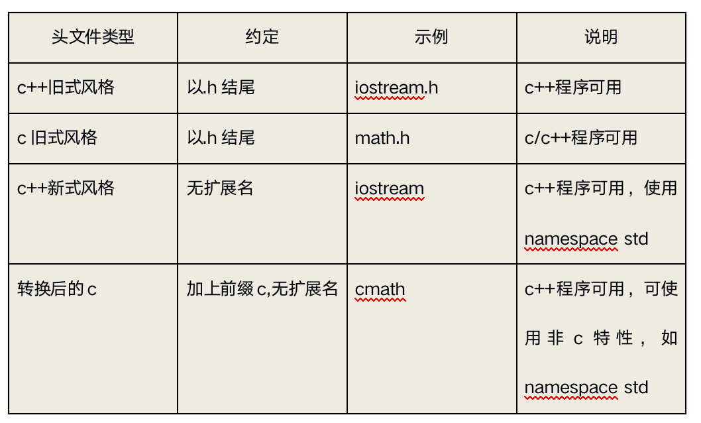

# hello world


```cpp

//

// main.cpp

// 09cpphello

//

// Created by codew on 8/12/20.

// Copyright © 2020 codertom. All rights reserved.

//

#include <iostream>

using  namespace  std; //使用标准命名空间

int  main()

{

  cout << "Hello, world! \n" << endl;

  return  EXIT_SUCCESS;

}

```


# `c++`没有`扩展名`

`C++`版本的`math.h`为`cmath`




# using namespace std 是什么?


`namespace`是指标识符的各种可见范围。命名空间用关键字`namespace` 来定义。命名空间是`C++`的一种机制，用来把单个标识符下的大量有逻辑联系的程序实体组合到一起。此标识符作为此组群的名字。


# cout 、endl 是什么？

cout是`c++`中的标准输出流，endl是输出换行并刷新缓冲区。


# 封装, 继承, 多态