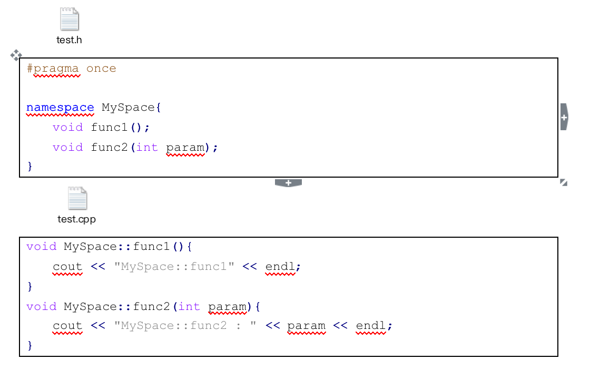
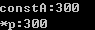
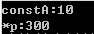
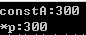
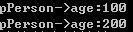
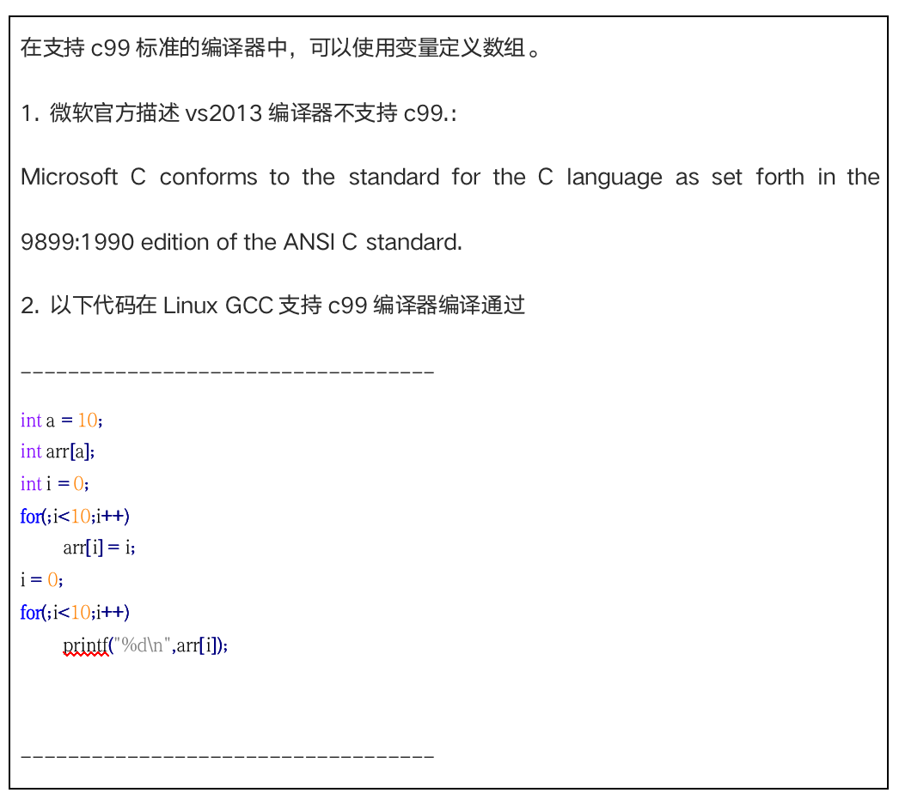
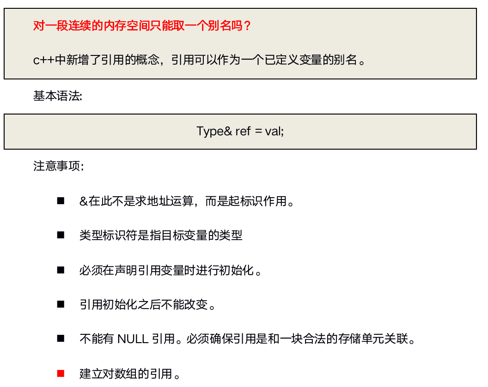
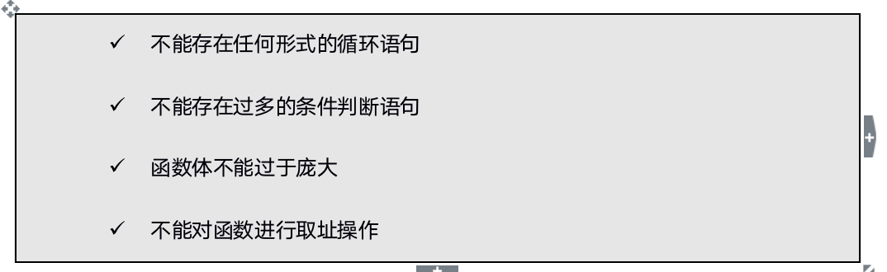
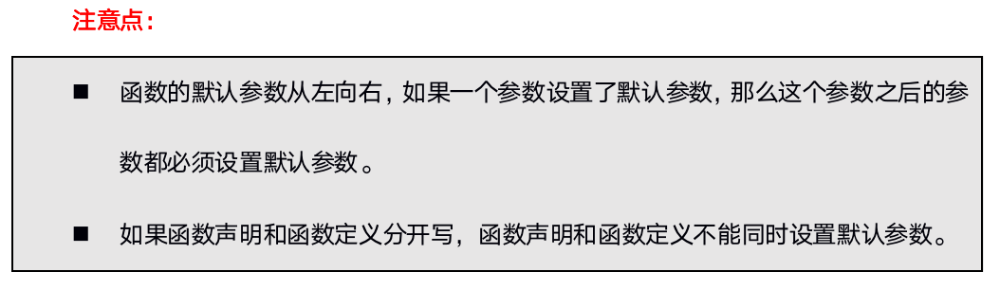
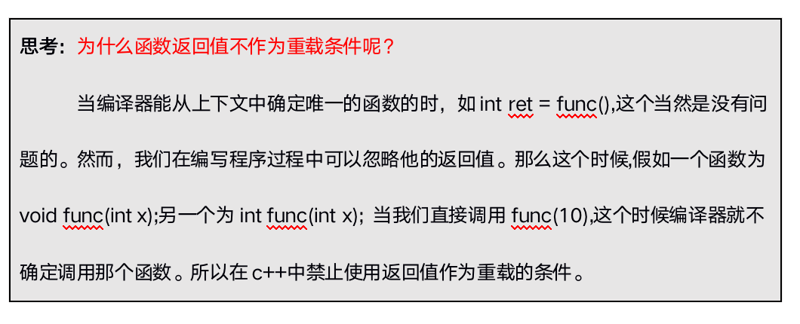

# 3-cpp对c的扩展

# 目录


1. [::作用域运算符](#cpp1data003a)
2. [名字控制](#cpp1data003b)
    1. [C++命名空间(namespace)](#cpp1data003b1)
    2. [命名空间使用语法](#cpp1data003b2)
    3. [using声明](#cpp1data003b3)
    4. [using编译指令](#cpp1data003b4)
    5. [命名空间使用](#cpp1data003b5)
3. [struct类型加强](#cpp1data003c)
4. [更严格的类型转换](#cpp1data003d)
5. [三目运算符功能增强](#cpp1data003e)
6. [C/C++中的const](#cpp1data003f)
    1. [const概述](#cpp1data003f1)
    2. [C/C++中const的区别](#cpp1data003f2)
        1. [C中的const](#cpp1data003f2a)
        2. [C++中的const](#cpp1data003f2b)
        3. [C/C++中const异同总结](#cpp1data003f2c)
    3. [尽量以const替换#define](#cpp1data003f3)
7. [引用(reference)](#cpp1data003g)
    1. [引用基本用法](#cpp1data003g1)
    2. [引用的本质](#cpp1data003g2)
    3. [指针引用](#cpp1data003g3)
    4. [常量引用](#cpp1data003g4)
    5. [引用使用场景](#cpp1data003g5)
8. [练习作业](#cpp1data003h)
9. [内联函数(inline function)](#cpp1data003i)
    1. [内联函数的引出](#cpp1data003i1)
    2. [预处理宏的缺陷](#cpp1data003i2)
    3. [内联函数基本概念](#cpp1data003i3)
    4. [类内部的内联函数](#cpp1data003i4)
    5. [内联函数和编译器](#cpp1data003i5)
10. [函数的默认参数](#cpp1data003j)
11. [函数的占位参数](#cpp1data003k)
12. [函数重载(overload)](#cpp1data003l)
    1. [函数重载概述](#cpp1data003l1)
    2. [函数重载基本语法](#cpp1data003l2)
    3. [函数重载实现原理](#cpp1data003l3)
    4. [extern “C”浅析](#cpp1data003l4)


### cpp1data003a
# 3.1 `::`作用域运算符

通常情况下，如果有两个同名变量，一个是全局变量，另一个是局部变量，那么局部变量在其作用域内具有较高的优先权，它将屏蔽全局变量。

```c

//全局变量

int a = 10;

void test(){

  //局部变量

 int a = 20;

  //全局a被隐藏

 cout << "a:" << a << endl;

}

```

程序的输出结果是a:20。在test函数的输出语句中，使用的变量a是test函数内定义的局部变量，因此输出的结果为局部变量a的值。

作用域运算符可以用来解决局部变量与全局变量的重名问题

```cpp

//全局变量

int a = 10;

//1\. 局部变量和全局变量同名

void test(){

 int a = 20;

  //打印局部变量a

 cout << "局部变量a:" << a << endl;

  //打印全局变量a

 cout << "全局变量a:" << ::a << endl;

}

```


这个例子可以看出，作用域运算符可以用来解决局部变量与全局变量的重名问题，即在局部变量的作用域内，可用`::`对被屏蔽的同名的全局变量进行访问。


### cpp1data003b
# 3.2 名字控制

创建名字是程序设计过程中一项最基本的活动，当一个项目很大时，它会不可避免地包含大量名字。c++允许我们对名字的产生和名字的可见性进行控制。

我们之前在学习c语言可以通过static关键字来使得名字只得在本编译单元内可见，在c++中我们将通过一种通过命名空间来控制对名字的访问。

### cpp1data003b1
## 3.2.1 C++命名空间(namespace)

在`c++`中，名称（name）可以是符号常量、变量、函数、结构、枚举、类和对象等等。工程越大，名称互相冲突性的可能性越大。另外使用多个厂商的类库时，也可能导致名称冲突。为了避免，在大规模程序的设计中，以及在程序员使用各种各样的`C++`库时，这些标识符的命名发生冲突，标准`C++`引入关键字`namespace`（`命名空间`/`名字空间`/`名称空间`），可以更好地控制标识符的作用域。


### cpp1data003b2
## 3.2.2 命名空间使用语法

**创建一个命名空间:**

```cpp

namespace  A{

 int a = 10;

}

namespace  B{

 int a = 20;

}

void test(){

 cout << "A::a : " << A::a << endl;

 cout << "B::a : " << B::a << endl;

}

```

**命名空间只能全局范围内定义（**以下错误写法**）**

```cpp

void test(){

 namespace A{

 int a = 10;

 }

 namespace B{

 int a = 20;

 }

 cout << "A::a : " << A::a << endl;

 cout << "B::a : " << B::a << endl;

}

```

**命名空间可嵌套命名空间**

```cpp

namespace  A{

 int a = 10;

  namespace  B{

 int a = 20;

 }

}

void test(){

 cout << "A::a : " << A::a << endl;

 cout << "A::B::a : " << A::B::a << endl;

}

```

**命名空间是开放的，即可以随时把新的成员加入已有的命名空间中**

```cpp

namespace  A{

 int a = 10;

}

namespace  A{

 void func(){

 cout << "hello namespace!" << endl;

 }

}

void test(){

 cout << "A::a : " << A::a << endl;

 A::func();

}

```

**声明和实现可分离**




**无名命名空间，意味着命名空间中的标识符只能在本文件内访问，相当于给这个标识符加上了static，使得其可以作为内部连接**

```cpp

namespace{

 int a = 10;

 void func(){ cout << "hello namespace" << endl; }

}

void test(){

 cout << "a : " << a << endl;

 func();

}


```


**命名空间别名**

```cpp

namespace  veryLongName{

 int a = 10;

 void func(){ cout << "hello namespace" << endl; }

}

void test(){

 namespace shortName = veryLongName;

 cout << "veryLongName::a : " << shortName::a << endl;

 veryLongName::func();

 shortName::func();

}

```


### cpp1data003b3
## 3.2.3 using声明

**using声明可使得指定的标识符可用。**


```cpp

namespace  A{

 int paramA = 20;

 int paramB = 30;

 void funcA(){ cout << "hello funcA" << endl; }

 void funcB(){ cout << "hello funcA" << endl; }

}

void test(){

  //1\. 通过命名空间域运算符

 cout << A::paramA << endl;

 A::funcA();

  //2\. using声明

 using A::paramA;

 using A::funcA;

 cout << paramA << endl;

  //cout << paramB << endl; //不可直接访问

 funcA();

  //3\. 同名冲突

  //int paramA = 20; //相同作用域注意同名冲突

}

```

**using声明碰到函数重载**

```cpp

namespace  A{

 void func(){}

 void func(int x){}

 int func(int x,int y){}

}

void test(){

 using A::func;

 func();

 func(10);

 func(10, 20);

}

```

如果命名空间包含一组用相同名字重载的函数，using声明就声明了这个重载函数的所有集合。


### cpp1data003b4
## 3.2.4 using编译指令


using编译指令使整个命名空间标识符可用.

```cpp

namespace  A{

 int paramA = 20;

 int paramB = 30;

 void funcA(){ cout << "hello funcA" << endl; }

 void funcB(){ cout << "hello funcB" << endl; }

}

void  test01(){

 using namespace A;

 cout << paramA << endl;

 cout << paramB << endl;

 funcA();

 funcB();

  //不会产生二义性

 int paramA = 30;

 cout << paramA << endl;

}

namespace  B{

 int paramA = 20;

 int paramB = 30;

 void funcA(){ cout << "hello funcA" << endl; }

 void funcB(){ cout << "hello funcB" << endl; }

}

void  test02(){

 using namespace A;

 using namespace B;

  //二义性产生，不知道调用A还是B的paramA

  //cout << paramA << endl;

}

```

**注意：使用using声明或using编译指令会增加命名冲突的可能性。也就是说，如果有名称空间，并在代码中使用作用域解析运算符，则不会出现二义性。**

### cpp1data003b5
## 3.2.5 命名空间使用

我们刚讲的一些东西一开始会觉得难一些，这些东西以后还是挺常用，只要理解了它们的工作机理，使用它们非常简单。

需要记住的关键问题是当引入一个全局的using编译指令时，就为该文件打开了该命名空间，它不会影响任何其他的文件，所以可以在每一个实现文件中调整对命名空间的控制。比如，如果发现某一个实现文件中有太多的using指令而产生的命名冲突，就要对该文件做个简单的改变，通过明确的限定或者using声明来消除名字冲突，这样不需要修改其他的实现文件。

### cpp1data003c
# 3.3 struct类型加强

- c中定义结构体变量需要加上struct关键字，`c++`不需要。

- c中的结构体只能定义成员变量，不能定义成员函数。`c++`即可以定义成员变量，也可以定义成员函数。

```cpp

//1\. 结构体中即可以定义成员变量，也可以定义成员函数

struct Student{

 string mName;

 int mAge;

 void setName(string name){ mName = name; }

 void setAge(int age){ mAge = age; }

 void showStudent(){

 cout << "Name:" << mName << " Age:" << mAge << endl;

 }

};

//2\. c++中定义结构体变量不需要加struct关键字

void  test01(){

 Student student;

 student.setName("John");

 student.setAge(20);

 student.showStudent();

}

```


### cpp1data003d
# 3.4 更严格的类型转换


在`C++`，不同类型的变量一般是不能直接赋值的，需要相应的强转。

`c`语言代码：

```cpp

typedef enum COLOR{ GREEN, RED, YELLOW } color;

int main(){

 color mycolor = GREEN;

 mycolor = 10;

 printf("mycolor:%d\n", mycolor);

 char* p = malloc(10);

 return EXIT_SUCCESS;

}

```

以上c代码c编译器编译可通过，c++编译器无法编译通过。


### cpp1data003e
# 3.5 三目运算符功能增强

**c语言三目运算表达式返回值为数据值，为右值，不能赋值。**

```cpp

int a = 10;

int b = 20;

printf("ret:%d\n", a > b ? a : b);

//思考一个问题，(a > b ? a : b) 三目运算表达式返回的是什么？

//(a > b ? a : b) = 100;

//返回的是右值

```

**c++语言三目运算表达式返回值为变量本身(引用)，为左值，可以赋值。**

```cpp

 int a = 10;

 int b = 20;

 printf("ret:%d\n", a > b ? a : b);

  //思考一个问题，(a > b ? a : b) 三目运算表达式返回的是什么？

 cout << "b:" << b << endl;

  //返回的是左值，变量的引用

 (a > b ? a : b) = 100;//返回的是左值，变量的引用

 cout << "b:" << b << endl;

```


**[左值和右值概念]**

-  在c++中可以放在赋值操作符左边的是左值，可以放到赋值操作符右面的是右值。
- 有些变量即可以当左值，也可以当右值。
- 左值为Lvalue，L代表Location，表示内存可以寻址，可以赋值。
- 右值为Rvalue，R代表Read,就是可以知道它的值。
- 比如:int temp = 10; temp在内存中有地址，10没有，但是可以Read到它的值。

### cpp1data003f
# 3.6 C/C++中的const

### cpp1data003f1
## 3.6.1 const概述

const单词字面意思为常数，不变的。它是c/c++中的一个关键字，是一个限定符，它用来限定一个变量不允许改变，它将一个对象转换成一个常量。

```cpp

const  int  a = 10;

A = 100; //编译错误,const是一个常量，不可修改

```


### cpp1data003f2
## 3.6.2 C/C++中const的区别

### cpp1data003f2a
### 3.6.2.1 C中的const

常量的引进是在c++早期版本中，当时标准C规范正在制定。那时，尽管C委员会决定在C中引入const,但是，他们c中的const理解为”一个不能改变的普通变量”，也就是认为const应该是一个只读变量，既然是变量那么就会给const分配内存，并且在c中const是一个全局只读变量，c语言中const修饰的只读变量是外部连接的。

如果这么写:

```c

const  int  arrSize = 10;

int arr[arrSize];

```

看似是一件合理的编码，但是这将得出一个错误。 因为arrSize占用某块内存，所以C编译器不知道它在编译时的值是多少？

### cpp1data003f2b
### 3.6.2.2 C++中的const


在`C++`中，一个const不必创建内存空间，而在c中，一个const总是需要一块内存空间。在`C++`中，是否为const常量分配内存空间依赖于如何使用。一般说来，如果一个const仅仅用来把一个名字用一个值代替(就像使用#define一样)，那么该存储局空间就不必创建。

如果存储空间没有分配内存的话，在进行完数据类型检查后，为了代码更加有效，值也许会折叠到代码中。

不过，取一个const地址, 或者把它定义为extern,则会为该const创建内存空间。

在`C++`中，出现在所有函数之外的const作用于整个文件(也就是说它在该文件外不可见)，默认为内部连接，`C++`中其他的标识符一般默认为外部连接。


### cpp1data003f2c
### 3.6.2.3 C/C++中const异同总结

**c语言全局const会被存储到只读数据段。c++中全局const当声明extern或者对变量取地址时，编译器会分配存储地址，变量存储在只读数据段。两个都受到了只读数据段的保护，不可修改。**

```cpp

const  int  constA = 10;

 int main(){

 int* p = (int*)&constA;

 *p = 200;

}

```

以上代码在c/c++中编译通过，在运行期，修改constA的值时，发生写入错误。原因是修改只读数据段的数据。

**c语言中局部const存储在堆栈区，只是不能通过变量直接修改const只读变量的值，但是可以跳过编译器的检查，通过指针间接修改const值。**

```cpp

const  int  constA = 10;

int* p = (int*)&constA;

*p = 300;

printf("constA:%d\n",constA);

printf("*p:%d\n", *p);

```

运行结果：



c语言中，通过指针间接赋值修改了constA的值。

c++中对于局部的const变量要区别对待：

1. 对于基础数据类型，也就是const int a = 10这种，编译器会进行优化，将值替换到访问的位置。

```cpp

const  int  constA = 10;

int* p = (int*)&constA;

*p = 300;

cout << "constA:" << constA << endl;

cout << "*p:" << *p << endl;

```


运行结果：




2. 对于基础数据类型，如果用一个变量初始化const变量，如果const int a = b,那么也是会给a分配内存。

```cpp

int b = 10;

const  int  constA = b;

int* p = (int*)&constA;

*p = 300;

cout << "constA:" << constA << endl;

cout << "*p:" << *p << endl;

```

运行结果：




constA 分配了内存，所以我们可以修改constA内存中的值。

3. 对于自定数据类型，比如类对象，那么也会分配内存。

```cpp

const  Person  person; //未初始化age

//person.age = 50; //不可修改

Person* pPerson = (Person*)&person;

//指针间接修改

pPerson->age = 100;

cout << "pPerson->age:" << pPerson->age << endl;

pPerson->age = 200;

cout << "pPerson->age:" << pPerson->age << endl;

```


运行结果：



运行结果：

**c中const默认为外部连接，`C++`中const默认为内部连接.当c语言两个文件中都有const  int  a的时候，编译器会报重定义的错误。而在`C++`中，则不会，因为`C++`中的const默认是内部连接的。如果想让`C++`中的const具有外部连接，必须显示声明为: extern  const  int  a = 10;**

const由`C++`采用，并加进标准c中，尽管他们很不一样。在c中，编译器对待const如同对待变量一样，只不过带有一个特殊的标记，意思是”你不能改变我”。在c中定义const时，编译器为它创建空间，所以如果在两个不同文件定义多个同名的const，链接器将发生链接错误。简而言之,const在`C++`中用的更好。

**了解:** 能否用变量定义数组:




### cpp1data003f3
## 3.6.3 尽量以const替换#define

在旧版本C中，如果想建立一个常量，必须使用预处理器”

#define MAX 1024;// const int max = 1024

我们定义的宏MAX从未被编译器看到过，因为在预处理阶段，所有的MAX已经被替换为了1024，于是MAX并没有将其加入到符号表中。但我们使用这个常量获得一个编译错误信息时，可能会带来一些困惑，因为这个信息可能会提到1024，但是并没有提到MAX.如果MAX被定义在一个不是你写的头文件中，你可能并不知道1024代表什么，也许解决这个问题要花费很长时间。

解决办法就是用一个常量替换上面的宏。

const int max= 1024;

const和#define区别总结:


> 1. const有类型，可进行编译器类型安全检查。#define无类型，不可进行类型检查.

> 2. const有作用域，而#define不重视作用域，默认定义处到文件结尾.如果定义在指定作用域下有效的常量，那么#define就不能用。

1. 宏常量没有类型，所以调用了int类型重载的函数。const有类型，所以调用希望的short类型函数？

```cpp

#define PARAM 128

const  short  param = 128;

void  func(short a){

 cout << "short!" << endl;

}

void  func(int a){

 cout << "int" << endl;

}

```

2. 宏常量不重视作用域.

```cpp

void  func1(){

 const int a = 10;

 #define A 20

  //#undef A //卸载宏常量A

}

void  func2(){

  //cout << "a:" << a << endl; //不可访问，超出了const int a作用域

 cout << "A:" << A << endl; //#define作用域从定义到文件结束或者到#undef，可访问

}

int main(){

 func2();

 return EXIT_SUCCESS;

}

```


**问题:** 宏常量可以有命名空间吗？

```cpp

namespace  MySpace{

 #define num 1024

}

void test(){

  //cout << MySpace::NUM << endl; //错误

  //int num = 100; //命名冲突

 cout << num << endl;

}

```


### cpp1data003g
# 3.7 引用(reference)

### cpp1data003g1
## 3.7.1 引用基本用法

引用是`C++`对c的重要扩充。在c/`C++`中指针的作用基本都是一样的，但是`C++`增加了另外一种给函数传递地址的途径，这就是按引用传递(pass-by-reference)，它也存在于其他一些编程语言中，并不是`C++`的发明。


- 变量名实质上是一段连续内存空间的别名，是一个标号(门牌号)

- 程序中通过变量来申请并命名内存空间

- 通过变量的名字可以使用存储空间



```cpp

//1\. 认识引用

void  test01(){

 int a = 10;

  //给变量a取一个别名b

 int& b = a;

 cout << "a:" << a << endl;

 cout << "b:" << b << endl;

 cout << "------------" << endl;

  //操作b就相当于操作a本身

 b = 100;

 cout << "a:" << a << endl;

 cout << "b:" << b << endl;

 cout << "------------" << endl;

  //一个变量可以有n个别名

 int& c = a;

 c = 200;

 cout << "a:" << a << endl;

 cout << "b:" << b << endl;

 cout << "c:" << c << endl;

 cout << "------------" << endl;

  //a,b,c的地址都是相同的

 cout << "a:" << &a << endl;

 cout << "b:" << &b << endl;

 cout << "c:" << &c << endl;

}

//2\. 使用引用注意事项

void  test02(){

  //1) 引用必须初始化

  //int& ref; //报错:必须初始化引用

  //2) 引用一旦初始化，不能改变引用

 int a = 10;

 int b = 20;

 int& ref = a;

 ref = b; //不能改变引用

}

```


**建立数组引用:**


```cpp


//1\. 建立数组引用方法一

typedef int ArrRef[10];

int arr[10];

ArrRef& aRef = arr;

for (int i = 0; i < 10;i ++){

 aRef[i] = i+1;

}

for (int i = 0; i < 10;i++){

 cout << arr[i] << " ";

}

cout << endl;

//2\. 建立数组引用方法二

int(&f)[10] = arr;

for (int i = 0; i < 10; i++){

 f[i] = i+10;

}

for (int i = 0; i < 10; i++){

 cout << arr[i] << " ";

}

cout << endl;

```


### cpp1data003g2
## 3.7.2 引用的本质

**引用的本质在c++内部实现是一个常指针.**

```cpp

Type& ref = val; // Type* const ref = &val;

```

`c++`编译器在编译过程中使用常指针作为引用的内部实现，因此引用所占用的空间大小与指针相同，只是这个过程是编译器内部实现，用户不可见。

```cpp

//发现是引用，转换为 int* const ref = &a;

void testFunc(int& ref){

 ref = 100; // ref是引用，转换为*ref = 100

}

int main(){

 int a = 10;

  int& aRef = a; //自动转换为int* const aRef = &a;这也能说明引用为什么必须初始化

 aRef = 20; //内部发现aRef是引用，自动帮我们转换为: *aRef = 20;

 cout << "a:" << a << endl;

 cout << "aRef:" << aRef << endl;

 testFunc(a);

 return EXIT_SUCCESS;

}

```


### cpp1data003g3
## 3.7.3 指针引用

在c语言中如果想改变一个指针的指向而不是它所指向的内容，函数声明可能这样:

```cpp

void  fun(int**);

```

给指针变量取一个别名。

```cpp

Type* pointer = NULL;

Type*& = pointer;

```


```cpp

Type* pointer = NULL; Type*& = pointer;

```

```cpp

struct Teacher{

 int mAge;

};

//指针间接修改teacher的年龄

void  AllocateAndInitByPointer(Teacher** teacher){

 *teacher = (Teacher*)malloc(sizeof(Teacher));

 (*teacher)->mAge = 200;

}

//引用修改teacher年龄

void  AllocateAndInitByReference(Teacher*& teacher){

 teacher->mAge = 300;

}

void test(){

  //创建Teacher

 Teacher* teacher = NULL;

  //指针间接赋值

 AllocateAndInitByPointer(&teacher);

 cout << "AllocateAndInitByPointer:" << teacher->mAge << endl;

  //引用赋值,将teacher本身传到ChangeAgeByReference函数中

 AllocateAndInitByReference(teacher);

 cout << "AllocateAndInitByReference:" << teacher->mAge << endl;

 free(teacher);

}

```


对于`c++`中的定义那个，语法清晰多了。函数参数变成指针的引用，用不着取得指针的地址。


### cpp1data003g4
## 3.7.4 常量引用

常量引用的定义格式:

```cpp

const Type& ref = val;

```


**常量引用注意：**

- 字面量不能赋给引用，但是可以赋给const引用

- const修饰的引用，不能修改。

```cpp

void  test01(){

 int a = 100;

 const int& aRef = a; //此时aRef就是a

  //aRef = 200; 不能通过aRef的值

 a = 100; //OK

 cout << "a:" << a << endl;

 cout << "aRef:" << aRef << endl;

}

void  test02(){

  //不能把一个字面量赋给引用

  //int& ref = 100;

  //但是可以把一个字面量赋给常引用

  const  int& ref = 100; //int temp = 200; const int& ret = temp;

}

```


### cpp1data003g5
## 3.7.5 引用使用场景

常量引用主要用在函数的形参，尤其是类的拷贝/复制构造函数。

将函数的形参定义为常量引用的好处:

- 引用不产生新的变量，减少形参与实参传递时的开销。

- 由于引用可能导致实参随形参改变而改变，将其定义为常量引用可以消除这种副作用。

 如果希望实参随着形参的改变而改变，那么使用一般的引用，如果不希望实参随着形参改变，那么使用常引用。


```cpp

//const int& param防止函数中意外修改数据

void ShowVal(const int& param){

 cout << "param:" << param << endl;

}

```

**引用使用中注意点**

最常见看见引用的地方是在**函数参数**和**返回值**中。当引用被用作函数参数的时，在函数内对任何引用的修改，将对还函数外的参数产生改变。当然，可以通过传递一个指针来做相同的事情，但引用具有更清晰的语法。

如果从函数中返回一个引用，必须像从函数中返回一个指针一样对待。当函数返回值时，引用关联的内存一定要存在。


```cpp

//值传递

void  ValueSwap(int m,int n){

 int temp = m;

 m = n;

 n = temp;

}

//地址传递

void PointerSwap(int* m,int* n){

 int temp = *m;

 *m = *n;

 *n = temp;

}

//引用传递

void  ReferenceSwap(int& m,int& n){

 int temp = m;

 m = n;

 n = temp;

}

void test(){

 int a = 10;

 int b = 20;

  //值传递

 ValueSwap(a, b);

 cout << "a:" << a << " b:" << b << endl;

  //地址传递

 PointerSwap(&a, &b);

 cout << "a:" << a << " b:" << b << endl;

  //引用传递

 ReferenceSwap(a, b);

 cout << "a:" << a << " b:" << b << endl;

}

```


通过引用参数产生的效果同按地址传递是一样的。引用的语法更清楚简单：

1) 函数调用时传递的实参不必加“&”符

2) 在被调函数中不必在参数前加“*”符

引用作为其它变量的别名而存在，因此在一些场合可以代替指针。C++主张用引用传递取代地址传递的方式，因为引用语法容易且不易出错。

```cpp

//返回局部变量引用

int& TestFun01(){

 int a = 10; //局部变量

 return a;

}

//返回静态变量引用

int& TestFunc02(){

 static int a = 20;

 cout << "static int a : " << a << endl;

 return a;

}

int main(){

  //不能返回局部变量的引用

 int& ret01 = TestFun01();

  //如果函数做左值，那么必须返回引用

 TestFunc02();

 TestFunc02() = 100;

 TestFunc02();

 return EXIT_SUCCESS;

}

```


- 不能返回局部变量的引用。

- 函数当左值，必须返回引用。

### cpp1data003h
# 3.8 练习作业

1. 设计一个类，求圆的周长。

2. 设计一个学生类，属性有姓名和学号，可以给姓名和学号赋值，可以显示学生的姓   名和学号


### cpp1data003i
# 3.9 内联函数(inline function)

### cpp1data003i1
## 3.9.1 内联函数的引出

`C++`从c中继承的一个重要特征就是效率。假如`C++`的效率明显低于c的效率，那么就会有很大的一批程序员不去使用`C++`了。

在c中我们经常把一些短并且执行频繁的计算写成宏，而不是函数，这样做的理由是为了执行效率，宏可以避免函数调用的开销，这些都由预处理来完成。

但是在`C++`出现之后，使用预处理宏会出现两个问题：

> 第一个在c中也会出现，宏看起来像一个函数调用，但是会有隐藏一些难以发现的错误。

> 第二个问题是`C++`特有的，预处理器不允许访问类的成员，也就是说预处理器宏不能用作类类的成员函数。

为了保持预处理宏的效率又增加安全性，而且还能像一般成员函数那样可以在类里访问自如，`C++`引入了内联函数(inline function).

内联函数为了继承宏函数的效率，没有函数调用时开销，然后又可以像普通函数那样，可以进行参数，返回值类型的安全检查，又可以作为成员函数。

### cpp1data003i2
## 3.9.2 预处理宏的缺陷

预处理器宏存在问题的关键是我们可能认为预处理器的行为和编译器的行为是一样的。当然也是由于宏函数调用和函数调用在外表看起来是一样的，因为也容易被混淆。但是其中也会有一些微妙的问题出现:

**问题一：**

```cpp

#define ADD(x,y) x+y

inline  int  Add(int x,int y){

 return x + y;

}

void test(){

 int ret1 = ADD(10, 20) * 10; //希望的结果是300

 int ret2 = Add(10, 20) * 10; //希望结果也是300

 cout << "ret1:" << ret1 << endl; //210

 cout << "ret2:" << ret2 << endl; //300

}

```

**问题二：**


```cpp

#define COMPARE(x,y) ((x) < (y) ? (x) : (y))

int Compare(int x,int y){

 return x < y ? x : y;

}

void  test02(){

 int a = 1;

 int b = 3;

  //cout << "COMPARE(++a, b):" << COMPARE(++a, b) << endl; // 3

 cout << "Compare(int x,int y):" << Compare(++a, b) << endl; //2

}

```

**问题三:**

预定义宏函数没有作用域概念，无法作为一个类的成员函数，也就是说预定义宏没有办法表示类的范围。

### cpp1data003i3
## 3.9.3 内联函数基本概念


在`c++`中，预定义宏的概念是用内联函数来实现的，而**内联函数本身也是一个真正的函数**。内联函数具有普通函数的所有行为。唯一不同之处在于内联函数会在适当的地方像预定义宏一样展开，所以不需要函数调用的开销。因此应该不使用宏，使用内联函数。

- 在普通函数(非成员函数)函数前面加上inline关键字使之成为内联函数。但是必须注意必须函数体和声明结合在一起，否则编译器将它作为普通函数来对待。

```cpp

inline  void  func(int a);

```

以上写法没有任何效果，仅仅是声明函数，应该如下方式来做:


```cpp

inline  int  func(int a){return ++;}

```

注意: 编译器将会检查函数参数列表使用是否正确，并返回值(进行必要的转换)。这些事预处理器无法完成的。

内联函数的确占用空间，但是内联函数相对于普通函数的优势只是省去了函数调用时候的压栈，跳转，返回的开销。我们可以理解为内联函数是以**空间换时间**。


### cpp1data003i4
## 3.9.4 类内部的内联函数

为了定义内联函数，通常必须在函数定义前面放一个`inline`关键字。但是在类内部定义内联函数时并不是必须的。任何在类内部定义的函数自动成为内联函数。

```cpp

class  Person{

public:

 Person(){ cout << "构造函数!" << endl; }

 void PrintPerson(){ cout << "输出Person!" << endl; }

}

```

构造函数`Person`，成员函数`PrintPerson`在类的内部定义，自动成为内联函数。


### cpp1data003i5
## 3.9.5 内联函数和编译器

内联函数并不是何时何地都有效，为了理解内联函数何时有效，应该要知道编译器碰到内联函数会怎么处理？

对于任何类型的函数，编译器会将函数类型(包括函数名字，参数类型，返回值类型)放入到符号表中。同样，当编译器看到内联函数，并且对内联函数体进行分析没有发现错误时，也会将内联函数放入符号表。

当调用一个内联函数的时候，编译器首先确保传入参数类型是正确匹配的，或者如果类型不正完全匹配，但是可以将其转换为正确类型，并且返回值在目标表达式里匹配正确类型，或者可以转换为目标类型，内联函数就会直接替换函数调用，这就消除了函数调用的开销。假如内联函数是成员函数，对象this指针也会被放入合适位置。

类型检查和类型转换、包括在合适位置放入对象this指针这些都是预处理器不能完成的。

但是`c++`内联编译会有一些限制，以下情况编译器可能考虑不会将函数进行内联编译：



**内联仅仅只是给编译器一个建议，编译器不一定会接受这种建议，如果你没有将函数声明为内联函数，那么编译器也可能将此函数做内联编译。一个好的编译器将会内联小的、简单的函数。**

### cpp1data003j
# 3.10 函数的默认参数

`c++`在声明函数原型的时可为一个或者多个参数指定默认(缺省)的参数值，当函数调用的时候如果没有指定这个值，编译器会自动用默认值代替。

```cpp

void TestFunc01(int a = 10, int b = 20){

 cout << "a + b = " << a + b << endl;

}

//注意点:

//1\. 形参b设置默认参数值，那么后面位置的形参c也需要设置默认参数

void TestFunc02(int a,int b = 10,int c = 10){}

//2\. 如果函数声明和函数定义分开，函数声明设置了默认参数，函数定义不能再设置默认参数

void TestFunc03(int a = 0,int b = 0);

void TestFunc03(int a, int b){}

int main(){

  //1.如果没有传参数，那么使用默认参数

 TestFunc01();

  //2\. 如果传一个参数，那么第二个参数使用默认参数

 TestFunc01(100);

  //3\. 如果传入两个参数，那么两个参数都使用我们传入的参数

 TestFunc01(100, 200);

 return EXIT_SUCCESS;

}

```




### cpp1data003k
# 3.11 函数的占位参数

`c++`在声明函数时，可以设置占位参数。占位参数只有参数类型声明，而没有参数名声明。一般情况下，在函数体内部无法使用占位参数。

```cpp


void  TestFunc01(int a,int b,int){

  //函数内部无法使用占位参数

 cout << "a + b = " << a + b << endl;

}

//占位参数也可以设置默认值

void TestFunc02(int a, int b, int = 20){

  //函数内部依旧无法使用占位参数

 cout << "a + b = " << a + b << endl;

}

int main(){

  //错误调用，占位参数也是参数，必须传参数

  //TestFunc01(10,20);

  //正确调用

 TestFunc01(10,20,30);

  //正确调用

 TestFunc02(10,20);

  //正确调用

 TestFunc02(10, 20, 30);

 return EXIT_SUCCESS;

}

```

**什么时候用，在后面我们要讲的操作符重载的后置++要用到这个.**


### cpp1data003l
# 3.12 函数重载(overload)


### cpp1data003l1
## 3.12.1 函数重载概述


- 我们现实生活中经常会碰到一些字在不同的场景下具有不同的意思，比如汉语中的多音字“重”。

- 当我们说: “他好重啊，我都背不动!”我们根据上下文意思，知道“重”在此时此地表示重量的意思。

- 如果我们说“你怎么写了那么多重复的代码? 维护性太差了!”这个地方我们知道，“重”表示重复的意思。

- 同样一个字在不同的场景下具有不同的含义。那么在c++中也有一种类似的现象出现，同一个函数名在不同场景下可以具有不同的含义。

- 在传统c语言中，函数名必须是唯一的，程序中不允许出现同名的函数。在c++中是允许出现同名的函数，这种现象称为函数重载。

- 函数重载的目的就是为了方便的使用函数名。

- 函数重载并不复杂，等大家学完就会明白什么时候需要用到他们，以及是如何编译，链接的。

### cpp1data003l2
## 3.12.2 函数重载基本语法


```cpp

//1\. 函数重载条件

namespace  A{

 void MyFunc(){ cout << "无参数!" << endl; }

 void MyFunc(int a){ cout << "a: " << a << endl; }

 void MyFunc(string b){ cout << "b: " << b << endl; }

 void MyFunc(int a, string b){ cout << "a: " << a << " b:" << b << endl;}

 void MyFunc(string b, int a){cout << "a: " << a << " b:" << b << endl;}

}

//2.返回值不作为函数重载依据

namespace  B{

 void MyFunc(string b, int a){}

  //int MyFunc(string b, int a){} //无法重载仅按返回值区分的函数

}

```

**注意:** 函数重载和默认参数一起使用，需要额外注意二义性问题的产生。

```cpp

void MyFunc(string b){

 cout << "b: " << b << endl;

}

//函数重载碰上默认参数

void MyFunc(string b, int a = 10){

 cout << "a: " << a << " b:" << b << endl;

}

int main(){

 MyFunc("hello"); //这时，两个函数都能匹配调用，产生二义性

 return 0;

}

```



### cpp1data003l3
## 3.12.3 函数重载实现原理

编译器为了实现函数重载，也是默认为我们做了一些幕后的工作，编译器用不同的参数类型来修饰不同的函数名，比如`void  func();` 编译器可能会将函数名修饰成`_func`，当编译器碰到`void  func(int x)`,编译器可能将函数名修饰为`func_int`,当编译器碰到`void  func(int x,char c)`,编译器可能会将函数名修饰为`_func_int_char`我这里使用”可能”这个字眼是因为编译器如何修饰重载的函数名称并没有一个统一的标准，所以不同的编译器可能会产生不同的内部名。


```cpp

void func(){}

void func(int x){}

void  func(int x,char y){}

```


以上三个函数在linux下生成的编译之后的函数名为:

```cpp

_Z4funcv  //v 代表void,无参数

_Z4funci  //i 代表参数为int类型

_Z4funcic  //i 代表第一个参数为int类型，第二个参数为char类型

```


### cpp1data003l4
## 3.12.4 extern “C”浅析

以下在`Linux`下测试:

```cpp

c函数: void  MyFunc(){} ,被编译成函数: MyFunc

c++函数: void  MyFunc(){},被编译成函数: _Z6Myfuncv

```

通过这个测试，由于`C++`中需要支持函数重载，所以c和`C++`中对同一个函数经过编译后生成的函数名是不相同的，这就导致了一个问题，如果在`C++`中调用一个使用c语言编写模块中的某个函数，那么`C++`是根据`C++`的名称修饰方式来查找并链接这个函数，那么就会发生链接错误，以上例，`C++`中调用`MyFunc`函数，在链接阶段会去找`Z6Myfuncv`，结果是没有找到的，因为这个`MyFunc`函数是c语言编写的，生成的符号是`MyFunc`。

那么如果我想在`C++`调用c的函数怎么办？

`extern  "C"`的主要作用就是为了实现`C++`代码能够调用其他c语言代码。加上`extern  "C"`后，这部分代码编译器按c语言的方式进行编译和链接，而不是按`C++`的方式。

**MyModule.h**

```cpp

#ifndef MYMODULE_H

#define MYMODULE_H

#include<stdio.h>

#ifdef __cplusplus

extern  "C"{

#endif

 void func1();

 int func2(int a,int b);

#ifdef __cplusplus

}

#endif

#endif

```

**MyModule.c**

```c

#include"MyModule.h"

void  func1(){

 printf("hello world!");

}

int func2(int a, int b){

 return a + b;

}

```


**TestExternC.cpp**

```cpp

#define _CRT_SECURE_NO_WARNINGS

#include<iostream>

using  namespace  std;

#if 0

 #ifdef __cplusplus

 extern "C" {

 #if 0

 void func1();

 int func2(int a, int b);

 #else

 #include"MyModule.h"

 #endif

 }

 #endif

#else

 extern "C" void func1();

 extern "C" int func2(int a, int b);

#endif

int main(){

 func1();

 cout << func2(10, 20) << endl;

 return EXIT_SUCCESS;

}

```
