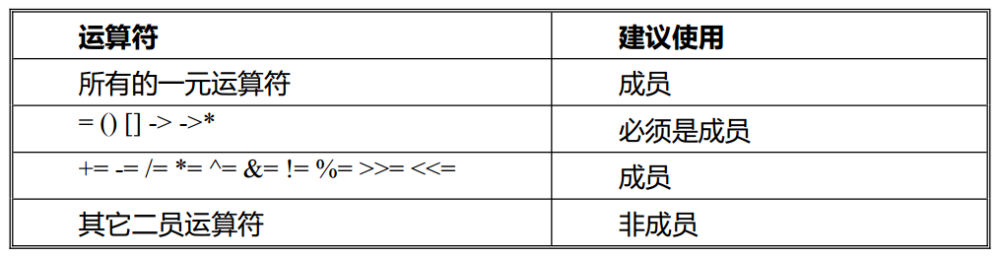
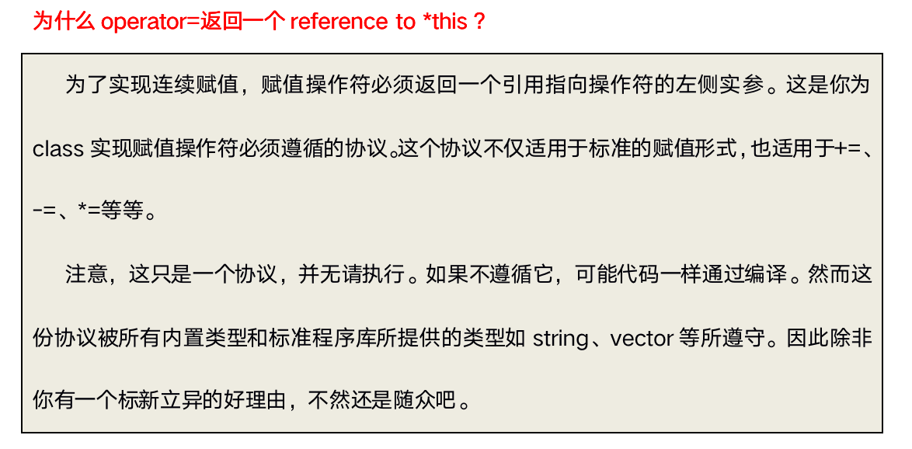

# **operator overloading**
# 运算符重载基本概念

1. 重新定义  运算符
2. 给他 另一种功能
3. 以适应不同的数据类型

# 运算符重载不能改变本来寓意, 不能改变 基础类型 寓意

# 它是语法糖

1. 它只是另一种函数调用的方式
2. 一样的函数定义
3. 只是函数的名字由关键字operator及其紧跟的运算符组成
4. 它像任何其他函数一样也是一个函数

# 定义函数一样

1. 只是该函数的名字是`operator@`, 这里的`@`代表了被重载的运算符

# 函数的参数中 参数个数 取决于 两个因素

- 运算符是一元(一个参数) 的还是二元(两个参数)
- 运算符被定义为**全局函数**(对于一元是一个参数, 对于二元是两个参数)
- 还是**成员函数**(对于一元没有参数, 对于二元是一个参数-此时该类的对象用作左耳参数)

# 可重载的运算符

- 几乎`C`中所有的运算符都可以重载
- 但运算符重载的使用时相当受限制的
- 特别是不能使用C中当前没有意义的运算符(例如用**求幂)不能改变运算符优先级
- 不能改变运算符的参数个数
- 除了赋值号(`=`)外，基类中被重载的操作符都将被派生类继承。

# 特殊运算符

-   **=** , **[]** , **()** 和 **->** 操作符只能通过`成员函数`进行重载

-   **<<** 和 **>>** 操作符最好通过`友元函数`进行重载

-   不要重载 **&&** 和 **||** 操作符，因为无法实现短路规则

# 不要重载 **&&** 和 **||** 操作符

**常规建议**

# 优先使用`++`和`--`的标志形式, 优先调用前置`++`

# 返回引用, 就是 前置`++`/`--`, `Complex& operator++` 或 `Complex& operator--`

# 返回普通 就是后置`++`/`--`, `Complex  operator++(int)` 或`Complex  operator--(int)`

# 优先使用前置的

# 赋值`=`运算符重载

# 为什么 `operator=` 返回一个 reference to *this?

# 如果没有重载赋值运算符，编译器会自动创建默认的赋值运算符重载函数。行为类似默认拷贝构造，进行简单值拷贝。

# 指针运算符(*、->)重载

